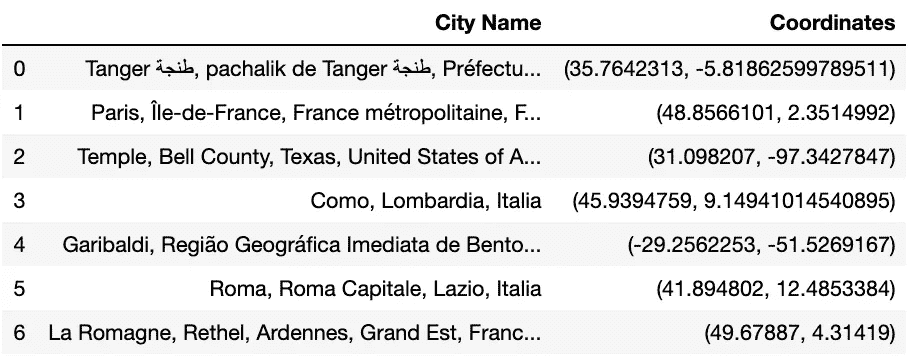
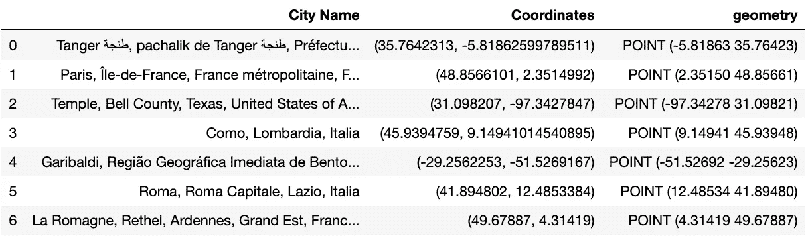
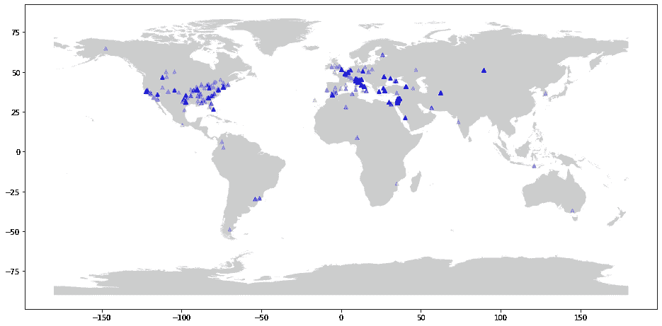

# 使用 Python 进行地理解析

> 原文：<https://towardsdatascience.com/geoparsing-with-python-c8f4c9f78940?source=collection_archive---------6----------------------->

## 挖掘文本中的地理地名并绘制它们


“The Quaker City in a Storm,” frontispiece from Mark Twain’s *The Innocent’s Abroad; Source: Project Gutenberg*

地理解析是指从文本中提取地名，并将这些名称与专有名词和空间坐标明确匹配的过程。然后可以将这些坐标标绘在地图上，以便可视化所讨论文本的空间覆盖区。地理分析是一种在地理学中称为*地名解析*的特殊程序:然而，尽管地理分析和地名解析都处理文本中具体地理实体的识别，但地名解析通常涉及从结构化、明确的引用中简单推导地理；例如，邮局使用地理编码的州缩写进行路由。另一方面，Geoparsing 表示输入文本包含非结构化歧义；例如，一个文本可能引用美国南部的一个国家和一个州——乔治亚州，而解决这种模糊性是地质公园研究者的任务。

在信息科学、文学分析和数字人文领域，[爱丁堡地质公园](http://groups.inf.ed.ac.uk/geoparser/documentation/v1.1/html/intro.html)自 2015 年以来一直作为开源工具使用，严格用于地质公园历史文献和经典作品的任务。爱丁堡地质公园可以在网上免费获得，它让研究人员不仅可以在纸上，还可以在电脑屏幕上追踪约翰·斯坦贝克的《T4 与查理的旅行》或乔治·奥威尔的《通往威根码头之路》。该程序获取输入文本，精确定位位置名称，用地名词典(类似地图集的地理目录)交叉引用这些名称，并在谷歌地图上绘制输出结果。通过这种方式，学者们可以用上帝的视角看到寄信人或小说主角的旅行，每个离散的目的地都在互动的全景中。

借助于几个现成的软件包，我们可以很容易地用 Python 构建我们自己的初级爱丁堡地质公园。以下是这样做的尝试。举个例子，我将解析马克·吐温的*国外的无辜者*。对于这项任务来说，这是一个恰当的文本:这部小说出版于 1859 年，是吐温一生中最著名的作品之一，也是有史以来最畅销的游记之一。从美国到法国，从敖德萨到耶路撒冷，吐温和来自 15 个不同州的 60 位同胞走遍了全球，到处都是地名。

对于这个地质分析器，需要下面的包。我会在下面的脚本中清楚地说明每个人在做什么。

```
>import numpy as np
>import matplotlib.pyplot as plt
>%matplotlib inline
>
>import pandas as pd
>import geopandas as gpd
>
>from urllib import request
>from geotext import GeoText
>
>from geopy.geocoders import Nominatim
>from geopy.exc import GeocoderTimedOut
>
>from shapely.geometry import Point, Polygon
>import descartes
```

首先要做的是抓住*无辜者*。全文可通过古腾堡项目免费在线获得。Python 的自然语言处理库 NLTK 原生提供了 18 个古腾堡文本用于练习。不幸的是，*无辜者*不在其中，所以我将使用来自`urllib`模块的`requests`对象，传递原始数据的 url。txt，然后用 utf-8 解码。

```
>url = "[http://www.gutenberg.org/files/3176/3176-0.txt](http://www.gutenberg.org/files/3176/3176-0.txt)"
>response = request.urlopen(url)
>raw = response.read().decode('utf8')
>print(f'{type(raw)}, \n{len(raw)}, \n{raw[:501]}')<class 'str'>, 
1145397, 
Project Gutenberg's The Innocents Abroad, by Mark Twain (Samuel Clemens)

This eBook is for the use of anyone anywhere at no cost and with
almost no restrictions whatsoever.  You may copy it, give it away or
re-use it under the terms of the Project Gutenberg License included
with this eBook or online at www.gutenberg.net

Title: The Innocents Abroad

Author: Mark Twain (Samuel Clemens)

Release Date: August 18, 2006 [EBook #3176]
Last Updated: February 23, 2018

Language: English
```

印在我的 Jupyter 笔记本控制台上的是这本书的扉页；整个文本只是一个由 1145397 个字符组成的大字符串。该字符串包含我将尝试挖掘的所有地理参考。NLP 包空间的自动处理管道包括名称实体识别，给国家、州和城市分配“地缘政治实体”标签然而，我无法在 SpaCy 中找到一种简单的方法来只提取*城市——除了编写一个交叉引用维基百科摘要的迭代函数——所以我改用 GeoText，它有一个容易提取城市名称的属性。*

```
>places = GeoText(raw)
>cities = list(places.cities)
>cities['Tangier',
 'Paris',
 'Temple',
 'Como',
 'Garibaldi',
 'Rome',
 'Roman',
 'Naples',
 'Naples',
 ...]
```

像 SpaCy 一样，GeoText 可以识别地理命名的实体，但是在 GeoText 中调用`.cities`只会返回城市名称。请注意，我没有删除重复的城市条目；我想保留这些，这样当我绘制它们时，我的地图就包含了参考频率。

现在，我需要一本地名词典，以便用明确的空间坐标具体地标出这些城市的名称。爱丁堡地质公园有专门的历史地名词典，但我没有权限查阅。相反， [OpenStreetMap](https://www.openstreetmap.org/) 是一个受维基百科模式启发的合作地图:它是免费的，任何人都可以编辑。OSM 有一个名为“命名”的搜索工具，给定一个城市或州的名称，它会对该名称进行反向地理编码，并返回其地理坐标。所以我只需要给 nomim 一份城市名的列表。有许多方法可以做到这一点，但一种方法是通过 Python 包 [GeoPy](https://pypi.org/project/geopy/) ，它抽象出了 nomim 的 API，并返回包含在输入搜索的第一个结果中的坐标。

```
>geolocator = Nominatim(timeout=2)
>
>lat_lon = []
>for city in cities: 
>    try:
>        location = geolocator.geocode(city)
>        if location:
>            print(location.latitude, location.longitude)
>            lat_lon.append(location)
>    except GeocoderTimedOut as e:
>        print("Error: geocode failed on input %s with message %s"%>
>             (city, e))
>lat_lon35.7642313 -5.81862599789511
48.8566101 2.3514992
31.098207 -97.3427847
45.9394759 9.14941014540895
-29.2562253 -51.5269167
41.894802 12.4853384
49.67887 4.31419
40.8359336 14.2487826
40.8359336 14.2487826
```

我将 API 的超时设置为 2 秒，并包含一个错误处理语句，如果 API 超时，该语句将跳过当前搜索。我的希望是，如果单个搜索时间超过 2 秒，它就不是一个真正的城市名称，因此脚本会从最终的地图中剔除非名称。我把城市名称和坐标输入熊猫数据框:

```
>df = pd.DataFrame(lat_lon, columns=['City Name', 'Coordinates'])
>df.head(7)
```



目前被格式化为元组的坐标需要被转换成点对象，因为每个城市将由地图上的一个点来表示。Python 包 [Shapely](https://pypi.org/project/Shapely/) 就是这么做的。下面，我正在遍历包含坐标元组的 dataframe 系列，将它们分别转换为点，并切换纬度和经度的顺序，因为这是我下载的地图对象使用的顺序[。](https://hub.arcgis.com/datasets/a21fdb46d23e4ef896f31475217cbb08_1)

```
>geometry = [Point(x[1], x[0]) for x in df['Coordinates']]
>geometry[:7][<shapely.geometry.point.Point at 0x116fe3b10>,
 <shapely.geometry.point.Point at 0x116ff9190>,
 <shapely.geometry.point.Point at 0x116fe0c10>,
 <shapely.geometry.point.Point at 0x116fe0a10>,
 <shapely.geometry.point.Point at 0x116fe0250>,
 <shapely.geometry.point.Point at 0x116fe0850>,
 <shapely.geometry.point.Point at 0x116fe0210>]
```

将这些点对象放回数据帧将使我们能够轻松地绘制它们。现在，我将使用一个[*geo pandas*](http://geopandas.org/)data frame 来代替 pandas dataframe，它可以轻松处理这些类型的对象。

```
>## coordinate system I'm using
>crs = {'init': 'epsg:4326'}
>
>## convert df to geo df
>geo_df = gpd.GeoDataFrame(df, crs=crs, geometry=geometry)
>geo_df.head()
```



最后一步是在地图上标出位置。我没有删除重复的位置条目这一事实意味着，如果我设置了标记的透明度，那么引用频率较高的位置会比只引用一次的位置看起来更不透明。这是通过`plot`对象中的`alpha`参数完成的。不透明的标记应该大致对应于贵格城号实际航行过的城市，透明的标记对应于仅仅提到过的城市。

```
>## world map .shp file I downloaded
>countries_map =gpd.read_file('Countries_WGS84/
>                              Countries_WGS84.shp')
>
>f, ax = plt.subplots(figsize=(16, 16))
>countries_map.plot(ax=ax, alpha=0.4, color='grey')
>geo_df['geometry'].plot(ax=ax, markersize = 30, 
>                        color = 'b', marker = '^', alpha=.2)
```



那是马克·吐温的《国外的无辜者》，地质公园。