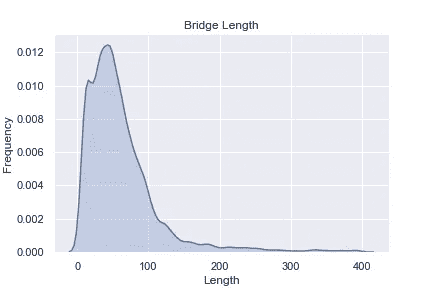
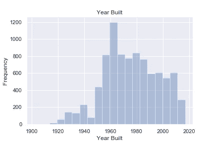
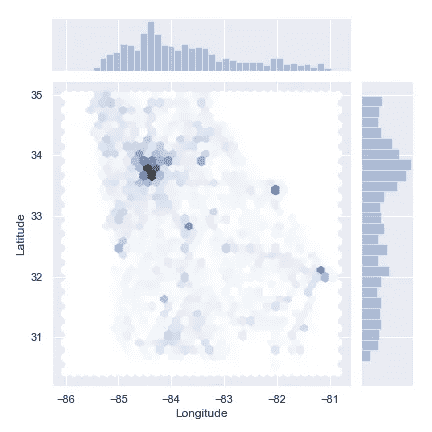
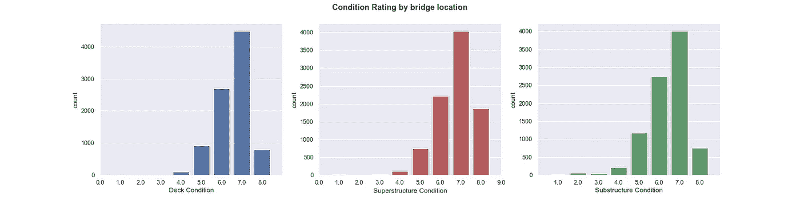
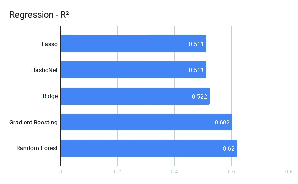
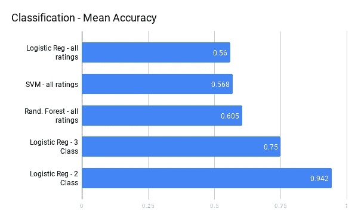
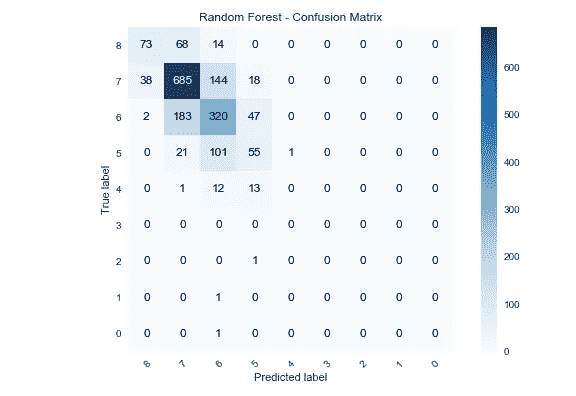

# 我脑海中的乔治亚(和机器学习)

> 原文：<https://towardsdatascience.com/georgia-and-machine-learning-on-my-mind-f32669cc090a?source=collection_archive---------30----------------------->

## 利用数据搭建更好的桥梁

An inspector at work. Photo by [Amogh Manjunath](https://unsplash.com/photos/qVZTU3lTKnU?utm_source=unsplash&utm_medium=referral&utm_content=creditCopyText) on [Unsplash](https://unsplash.com/search/photos/bridge?utm_source=unsplash&utm_medium=referral&utm_content=creditCopyText)

# **问题**

最近，美国土木工程师协会将美国基础设施的整体健康状况评为 D+。我们的基础设施陈旧。桥梁是这一组日渐衰败的资产的一个主要方面。了解和管理这些结构的状况对于佐治亚州交通部(GDOT)的持续目标至关重要。为了帮助实现这些目标，我们的分析将建立预测模型，以了解桥梁何时处于需要维修或更换的危险之中。我们的目标是在检查开始前，利用现有数据预测桥梁状况的两个测量值，即**状况等级**和**充分性等级**。

GDOT(和其他 DOT)将从多方面的分析中受益。

*   预测模型将允许问题的早期检测。
*   这将允许更有效地分配桥梁检查员资源，并可能提高整个桥梁检查管道的成功率。
*   最后，预测模型将提供一个更安全的基础设施网络，因为我们现在正在使用未开发的数据来确保公众的健康和安全。

# **数据集**

我们的大部分数据来自联邦公路管理局国家桥梁库存(NBI)提供的免费桥梁库存[这里](https://www.fhwa.dot.gov/bridge/nbi.cfm)。该数据不包括高程数据，而我们希望将高程数据作为一个要素包括在内，因此我们使用 MapQuest 的[开放式高程 API](https://developer.mapquest.com/documentation/open/elevation-api/) 来访问该数据集，并将其与 NBI 数据相结合。

# **分析**

数据科学不是黑匣子，避免它成为黑匣子的最好方法是非常了解你的数据。所以我们从探索性数据分析开始。首先，我们来看看佐治亚州的桥长分布。

有趣的是，在佐治亚州大多数的桥都不到 100 英尺长，我敢打赌这违背了你的直觉。一个要点是，并不是所有的桥都像你在州际公路上看到的那样。

关于桥梁，我们还想知道什么？我们可以看看这些桥建造的年代分布，从而了解它们的年代分布。

我们可以看到，在 20 世纪 50 年代末，60 年代初出现了一个建设高峰。够酷的是，这对应于一个真实的历史事件，德怀特·艾森豪威尔的联邦援助高速公路法案的通过。这个法案创造了现在美国的州际系统。链接[此处](https://www.fhwa.dot.gov/infrastructure/50interstate.cfm)。这也是我们在美国的基础设施，更确切地说是在格鲁吉亚的基础设施急需修复的另一个原因。他们中的许多人属于婴儿潮一代。

让我们来看看该州桥梁的地理分布。

Atlanta dominates

相当整洁，但是这一个与我们期望的相一致。大多数桥梁位于主要的大都市中心，如亚特兰大、奥古斯塔、萨凡纳和梅肯。哦，底部的空白处呢？那是[诺基沼泽](https://okeswamp.com/)。还要注意顶部和右侧的分布条。

让我们也看看条件评级和充分性评级的分布，我们试图预测的变量。状况等级是一个从 0 到 9 的离散分数，它被赋予桥梁、桥面、上部结构和下部结构的三个位置。把甲板想象成汽车行驶的地方，上部结构主要是支撑甲板的横梁，下部结构是其他东西都位于其上的桥墩/柱子/桥台。另一方面，充分性评级是一个从 0 到 100 的连续分数，主要基于条件评级，但也基于其他几何因素。我们可以看到，三者的分布非常相似，上层建筑的形状似乎相对最好。

Condition Rating

# 机器学习

为了预测桥梁评级，我们必须准备在机器学习模型中使用的数据。这被称为**预处理**。大多数时候，你不会简单地将数据转储到一个黑盒模型中，然后抱最好的希望。在我们的例子中，选择的特性如下

**特征**:纬度、经度、海拔、年龄、结构长度、设计荷载、道路宽度、年日交通量(ADT)、货车百分比、偏斜度、水平净空

这些特征主要是通过领域知识选择的，而不是从数据集中人工生成的。它们都代表了工程师可以访问的关于桥梁的相当容易访问的信息。

所有要素都在不同的比例上，并且许多都有异常值，如我们在上面的桥长图中看到的。这些异常值和要素的相对比例可能会对根据数据生成的模型产生过大的影响。由于这是不可取的，我们使用 sklearn.preprocessing 中的 [QuantileTransformer](https://scikit-learn.org/stable/modules/generated/sklearn.preprocessing.QuantileTransformer.html) 来准备数据。

# 机器学习管道

对于该分析中的大多数模型，管道由转换器和超参数上的**网格搜索**构成。使用嵌套交叉验证将模型拟合到数据，并在保留集上进行评估。以下是岭回归模型的示例代码。

# 模型性能

执行所有步骤后的模型结果如下所示。

**回归模型**

**分类型号**

总的来说，我们可以看到分类模型优于回归模型。这主要是由于设计载荷特性。我们的模型中使用的设计荷载并不是一个真正的连续变量，而是包含了模型的新信息，因此分类器比回归更能利用这些信息。逻辑回归二元分类器比所有其他模型都有优势，这将在后面讨论。

# 模型评估

评估分类器模型的最好方法之一是开发一个**混淆矩阵**。对于预测任意数量的 n 个类别的所有混淆矩阵，开发了一个 n×n 矩阵，其中对角线表示真实预测，并且任何偏离对角线的值都是预测中的误差。在二元分类的情况下(是某物，不是某物)，那么矩阵对角线以外的值代表假阳性和假阴性。随机森林分类器的混淆矩阵是输出的一个很好的例子，如下所示。

Random Forest, non-random results

# 最佳性能模型

我们注意到**逻辑回归**模型-2 类的表现优于所有模型，但是为什么它比其他模型都好呢？有多重原因。一个原因是我们将 10 个不同的条件评级值映射为 2，差/好。如果这三个位置中的任何一个的状况等级为 4 或更低，则该桥被评定为差。一般来说，当你减少类的数量时，模型会表现得更好，我们已经证明了这一点。

然而，结果并不像看起来那么乐观。我们的 2 级模型遭受了高度的阶级不平衡。回头参考上面的条件评级图，我们可以看到，当我们将目标变量重新聚集成两个类别时，它们中的大多数将属于“良好”类别，这意味着条件评级不代表有缺陷的评级。因此，逻辑回归模型的高精度被过分夸大了，仅仅因为大多数值不属于“差”类。在这种情况下，精度和召回率等指标将提供比准确性更准确的模型性能评估。

# 结论

通过这一分析，我们已经表明，我们可以使用从 FHWA 容易获得的数据，有意义地预测佐治亚州桥梁充分性评级和桥梁状况评级的结果。这些模型可用于帮助交通部的资产管理业务，并将为该部和纳税人提供重要价值。

这篇文章只是触及了全部分析的表面。在**Github**T2【这里查看完整的笔记本和支持代码

干杯！