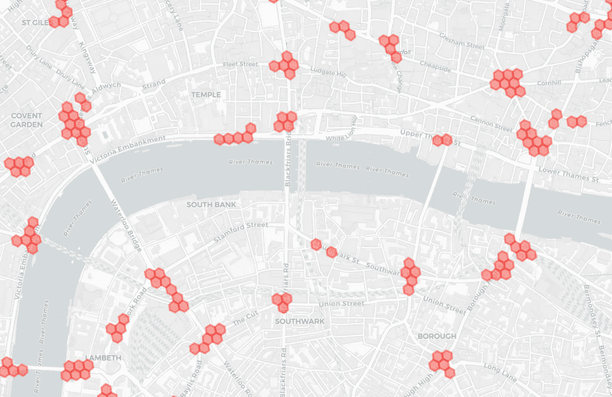

# 优步 H3 的地理空间索引

> 原文：<https://towardsdatascience.com/geospatial-indexing-with-ubers-h3-766399b690c?source=collection_archive---------2----------------------->

## 六边形动力！


Photo by [Jonas Svidras](https://unsplash.com/@jonassvidras?utm_source=medium&utm_medium=referral) on [Unsplash](https://unsplash.com?utm_source=medium&utm_medium=referral)

在本文中，我将介绍优步的 H3 地理空间索引系统。作为该公司众多开源项目中的一个，H3 系统允许你快速有效地索引你的数据，以备日后查询。

地理空间索引对于大规模聚合和查询数据至关重要。这种类型的数据通常很丰富，难以索引或搜索，并且结构可能很复杂。区分特定区域的多边形可能很难处理。想想一个城市的边界。你需要多少个点来有效地确定给定的车辆是否已经进入一个城镇或者甚至一个加油站？你需要的点数越多，你需要的 CPU 计算就越多。硬件负担过重会导致响应时间变慢和资源使用增加。

一个高效的地理空间索引系统可以帮助你克服这些障碍。在 H3 的情况下，解决方案采取散列方案的形式。

# H3 是如何工作的？

H3 算法将地球表面划分为六边形网络。您可以从可用的[十六级](https://uber.github.io/h3/#/documentation/core-library/resolution-table)中选择每个六边形包含的细节数量。你可以认为这些是地图上的“缩放”级别。每深入一步，六边形就会变小，你需要更多的六边形来覆盖相同的区域。

每个六边形都是独一无二的，并且是可以识别的。您可以通过一个唯一的 64 位标识符、一个数据库表的理想关键字或一个内存中的字典来寻址各个六边形。这些标识符在“缩放”级别上是一致的，因此您可以随意混合和匹配它们。

您对 H3 的第一个方法可以是把它想象成一个明亮的地理空间散列方案。有了它，您可以使用简单的值查找快速确定区域包含。您可以轻松地对地理空间观测进行聚类，并将其显示在地图上。

但是还有更多。为了让您更好地理解 H3 的能力，我将用 Python 展示一个简单的用例。

# 回到英国交通事故

我在 Medium 上的第二篇文章是关于[绘制英国交通事故热点](/mapping-the-uks-traffic-accident-hotspots-632b1129057b)。我决定从 H3 的角度重新审视它，作为本文的一个例证。当时，我关心的是找到交通事故报告最多的地区，并绘制地图。绘制重要事件频率的区域是优步每天都需要解决的问题，尽管规模要大得多(当然是为了不同的用例)。

在这里，我决定使用 H3 进行索引、聚合和显示。说明本文的代码可以在 GitHub [库](https://github.com/joaofig/uk-accidents)上找到，我建议您使用它来跟随本文。你只需要打开一本 Jupyter 笔记本:

```
uk-accident-h3.ipynb
```

在这个文件中，我们主要看到的是与第一个版本相同的过程。我们加载数据，清理数据，并使用相同的 DBSCAN 算法对数据进行聚类。我们将利用 H3 的能力对位置进行分组，并以图形方式将它们表示为六边形簇，而不是麻烦地为这些层寻找形状。

# 使用 H3 显示区域

一旦我们得到了 DBSCAN 聚类的结果，我们就为数据集获得了一个额外的列，即聚类数。噪声点的簇号为 *-1* ，并且不相关。从聚集的位置到地图形状是一个将它们散列成 H3 六角键的问题。这就像调用一个转换函数一样简单:

```
h3_key = h3.geo_to_h3(latitude, longitude, level)
```

得到的值是一个字典的关键字，我们在字典中存储六边形形状和共享该关键字的位置的数量。为了获得地理空间多边形，我们需要调用另一个函数:

```
h3.h3_to_geo_boundary(h3_address=h3_key)
```

这个函数接受一个 H3 键，并返回六边形顶点的纬度和经度列表，我们可以很容易地用它在地图上显示。要查看地图，我们只需遍历字典并创建多边形形状。相关功能是:

```
map = create_map(clusters)
```

要测试解决方案的灵敏度，您可以调整两个 DBSCAN 参数和 H3 电平参数:

```
eps_in_meters = 50.0
num_samples = 10
h3_level = 11
```

这是我们最终得到的结果:



H3 clusters generated from DBSCAN

# 与 H3 聚类

现在我们可以更进一步，使用 H3 直接对数据*进行聚类*。我们将使用所有输入数据并将其散列到 H3 键中，而不是通过 DBSCAN。我们不是显示所有可能的六边形，而是限制每个六边形出现的次数。这种限制将有助于整理地图，使其更具响应性。

生成的地图与第一张略有不同，但这是合理的。毕竟，我们使用的是不同的假设。请记住，DBSCAN 使用基于密度的标准对位置进行聚类。从某种意义上说，这是一种揭示结构的算法。另一方面，H3 使用一种强加结构的方法，定义哪些区域用作集群。

# 结论

这篇文章对优步的 H3 进行了一次相对短暂而肤浅的探索。这是一个方便的工具来执行地理空间索引和分析。我希望这已经激起了您更深入地研究这个库并将其添加到您的地理空间分析工具箱中的欲望。并且乐在其中。我做到了。

# 参考

[1] [H3:优步的六边形层次空间索引](https://eng.uber.com/h3/)

[2] [H3 Python GitHub 库](https://github.com/uber/h3-py)

[3] [英国事故 GitHub 知识库](https://github.com/joaofig/uk-accidents)

# 相关文章

[](/fast-geospatial-indexing-with-h3-90e862482585) [## H3 的快速地理空间索引

### H3 六角电力重装上阵！

towardsdatascience.com](/fast-geospatial-indexing-with-h3-90e862482585) [](/geographic-clustering-with-hdbscan-ef8cb0ed6051) [## 使用 HDBSCAN 进行地理聚类

### 如何使用 HDBSCAN、H3、图论和 OSM 探索地理数据。

towardsdatascience.com](/geographic-clustering-with-hdbscan-ef8cb0ed6051) [](https://www.linkedin.com/in/joao-paulo-figueira/) [## joo Paulo Figueira-数据科学家- tb.lx by 戴姆勒卡车和公共汽车| LinkedIn

### 查看 joo Paulo Figueira 在全球最大的职业社区 LinkedIn 上的个人资料。圣保罗列出了 1 份工作…

www.linkedin.com](https://www.linkedin.com/in/joao-paulo-figueira/)