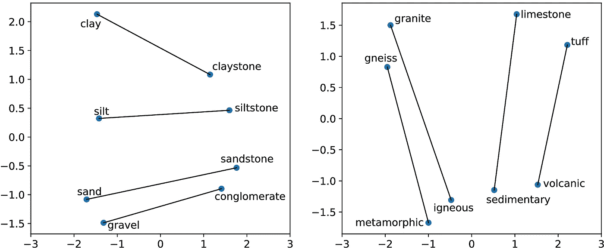
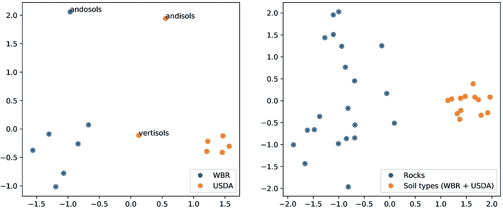
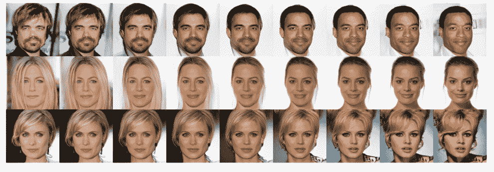
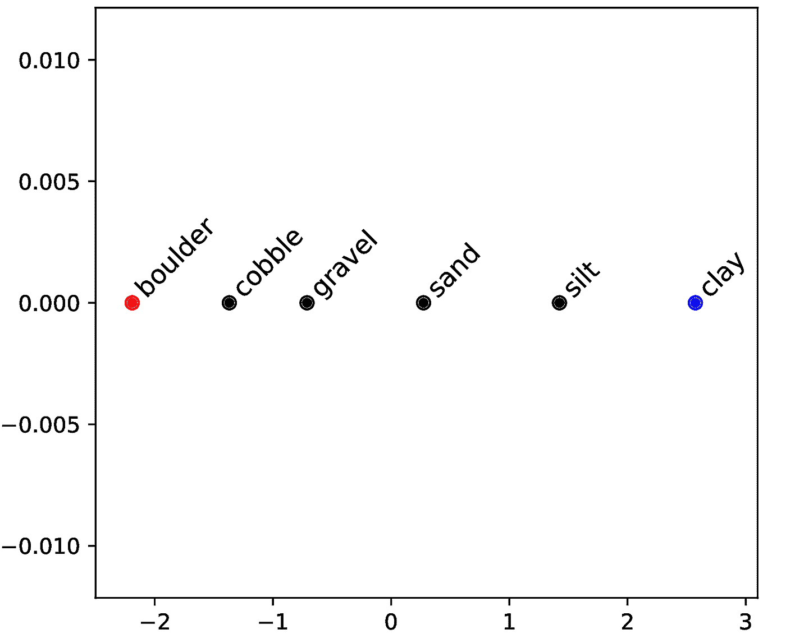
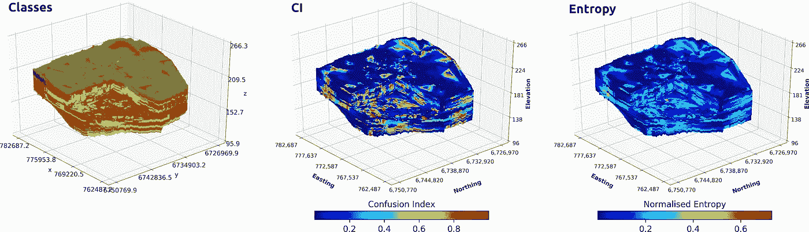

# GeoVec:用于地球科学的单词嵌入

> 原文：<https://towardsdatascience.com/geovec-word-embeddings-for-geosciences-ac1e1e854e19?source=collection_archive---------21----------------------->

## 词语嵌入的类比、分类、关联和空间插值。

# 本帖中引用的推荐读物

 [## 深度学习和土壤科学-第 1 部分

### 预测土壤性质的土壤光谱。预测多种土壤特性的多任务卷积神经网络…

towardsdatascience.com](/deep-learning-and-soil-science-part-1-8c0669b18097)  [## 深度学习和土壤科学—第二部分

### 使用上下文空间信息的数字土壤制图。从点信息生成土壤图的多任务 CNN。

towardsdatascience.com](/deep-learning-and-soil-science-part-2-129e0cb4be94) 

# 介绍

正如我在关于[深度学习和土壤科学](/deep-learning-and-soil-science-part-1-8c0669b18097)的第一篇文章中所描述的，土壤科学家的部分工作是在野外进行的，包括尽可能全面地描述我们所看到的。这些都是重要的记录，有助于我们形成研究区域的心智模型，并提醒我们可能忘记的细节。

以下是(部分)典型的土壤描述:

**Ap1** — 0 到 7 英寸；棕色(10 年 5/3)灰色细砂质壤土，非常暗的灰褐色(10 年 3/2)潮湿；弱细粒状结构；软，非常易碎，不粘，稍有塑性，常见的非常细和细根；很少非常细的间隙孔和管状孔；15%直径小于 2.0 毫米的沙状浮石；中性(pH 6.6)；清晰平滑的边界。(0 至 8 英寸厚)

**Ap2** — 7 到 9 寸；棕色(10 年 5/3)灰色细砂质壤土，非常暗的灰褐色(10 年 3/2)潮湿；弱中粒结构；稍硬，易碎，不粘，稍有塑性；普通非常细和细根；常见的微细和极微细管状孔隙和间隙孔隙；20%直径小于 2.0 毫米的沙状浮石；中性(pH 7.0)；清晰的波浪形边界。(0 至 7 英寸厚)

我们可以看到，它是按层组织的，包含颜色、根的存在、孔隙的描述、结构类别(估计的粘土、淤泥和沙子的比例)等细节。大多数情况下，描述遵循一些推荐的格式，但它们可能包含或多或少的自由格式文本，这取决于研究。

这些图层描述通常附有样本，这些样本被送到实验室，然后可以用于制作土壤属性地图，例如，我在[使用 CNN](/deep-learning-and-soil-science-part-2-129e0cb4be94)进行数字土壤制图中描述的地图。但是描述本身几乎从不使用，尽管它们包含了重要的信息。例如，与浅色层相比，深色层的有机物浓度相对较高(当然，也有例外)。

# 单词嵌入

为了使用描述中包含的有价值的信息，我和我的同事 Ignacio Fuentes 决定用自然语言处理(NLP)来生成特定领域的单词嵌入。我不打算解释什么是单词嵌入，但是你可以找到一些好文章，比如这个[单词嵌入介绍](/introduction-to-word-embeddings-4cf857b12edc)。

## 模型开发

由于大多数语言模型考虑了单词的共现，我们使用了相对较大的 280，764 篇与地球科学相关的全文文章的语料库。在对文本进行预处理(标记化、删除停用词等)之后。)，我们拟合了一个手套模型来生成可以在其他应用中使用的单词嵌入。

## 单词嵌入的评估

下载 280，764 篇文章，对它们进行预处理，并拟合手套模型，实际上是这个过程中最简单的部分。由于我们需要评估生成的向量空间，我们创建了一个领域特定的测试套件，考虑三个任务，即类比、相关性和分类。

如果这些任务听起来不熟悉，这里有一个简短的描述和例子。

*   **类比:**给定两对相关的单词，a:b 和 x:y，任务的目的是回答问题“a 对 x 就像 b 对？”。与矿物及其颜色相关的一个例子是“[蓝铜矿](https://en.wikipedia.org/wiki/Chalcanthite)之于蓝色，正如[孔雀石](https://en.wikipedia.org/wiki/Malachite)之于 __？(绿色)”。
*   **相关度:**对于给定的一对单词 *(a，b)* ，如果单词不相关或相关，则由人类主体分别分配 0 或 1 的分数。一个例子是配对“(Andisol，Volcano)”并且由于 Andi sol(土壤类型)与火山区域相关，因此相关度得分应为 1。
*   **分类:**给定 2 组单词 *s1 = {a，b，c，…}* 和 *s2 = {x，y，z，…}* ，该测试应该能够使用聚类算法将每个单词正确地分配到其对应的组中(参见结果中的示例)。

# 结果

我们将我们的特定领域嵌入(GeoVec)与 GloVe 作者提供的通用领域嵌入[进行了比较，我们观察到整体性能提高了 107.9%。当然，考虑到任务的特殊性，这是一个预期的结果。](https://nlp.stanford.edu/projects/glove/)

## 类比

如果你熟悉单词嵌入(或者你读过这篇[单词嵌入介绍](/introduction-to-word-embeddings-4cf857b12edc))，你大概见过展示首都城市和国家、国王-男性/女王-女性，或者其他组类比关系的情节。在这项工作中，我们能够获得类似的结果，但与地球科学有关。

Fig. 1: Two-dimensional PCA projection of selected words. Simple syntactic
relationship between particle fraction sizes and rocks (left panel) and advanced semantic
relationship between rocks and rock types (right panel).

从情节来看，任何一对相关词都可以表示为类比。例如，从左图中，可以得出类似的结论“粘土岩之于粘土，就像砂岩之于 __？(沙子)”而第一个模型输出确实是“沙子”。在左图中，可以观察到简单的类比，主要是句法上的，因为“粘土岩”包含“粘土”一词。右侧面板显示了一个更高级的关系，其中岩石名称被分配给其对应的岩石类型。

## 分类

在分类的情况下，下图显示了 k-means 算法可以正确区分嵌入组的两个示例。左图显示了来自两个不同分类系统(美国农业部和 WBR)的土壤类别组。两个分类系统中都只有一个模糊的土壤类别(变性土),但嵌入正确地编码了这种关系，将该类别置于两组之间。右侧面板显示了嵌入如何对来自不同聚合级别的信息进行编码的示例。在左图中，相同的土壤被正确地区分为两组，与右图中的岩石类型相比，它们形成了一个粘性组。

Fig. 2: Two-dimensional PCA projection of selected categorisations. Clusters
representing soil types from different soil classification systems (left panel) and a
different aggregation level where the same soil types are grouped as a single cluster
when compared with rocks (right panel).

## 插值嵌入

也许你已经看到了一些很酷的图像潜在空间插值的例子，比如下面的人脸插值例子，但它在单词嵌入的上下文中并不常用。

Fig. 3: Linear interpolation in latent space between real images (Kingma and Dhariwal, 2018)

在单词的情况下，我们想要探索内插嵌入(两个单词之间的空间)是否产生一些…

为了生成插值嵌入，我们通过使用以下公式获得两个单词嵌入的线性组合:

*v _ int*=α∫*v _ a*+(1α)∫*v _ b*

其中 *v_int* 是内插嵌入， *v_a* 和 *v_b* 是两个选定字的嵌入。通过在范围[0，1]内改变α的值，我们生成了嵌入的梯度。对于通过插值获得的每个中间嵌入，我们计算语料库中所有单词的余弦相似度，并选择最接近的一个。

Fig. 4: Interpolated embedding in a two-dimensional PCA projection showing a size
gradient with “clay”<“silt”<“sand”<“gravel”<“cobble”<”boulder”. Red and blue dots represent
selected words (“clay” and “boulder”) and black dots
represent the closest word (cosine similarity) to the interpolated embeddings.

在左边的图片中，你可以看到单词“boulder”和“clay”之间嵌入的渐变。这两个极端的词对应不同的颗粒大小，分别为粗颗粒和细颗粒。一个更完整的颗粒大小列表是，按照从粗到细的顺序，“漂石”>“卵石”>“砾石”>“沙子”>“淤泥”>“粘土”。所得的插值嵌入实际上对应于(接近于)这些颗粒尺寸，处于相同的顺序！

我们希望看到插值的结果(尽管如此，我们还是很惊讶！)因为我们想探索空间插值嵌入的想法，这更接近我们的领域。

## 嵌入的空间插值

该项目的目的是根据钻孔观测结果生成一张三维地质图，分布如下图所示。描述有相关的坐标和深度，类似于本博客顶部的土壤描述。

为了执行 3D 插值，首先我们必须生成“描述嵌入”。由于这是一个概念验证，我们决定使用简单的方法来计算每个描述中单词嵌入的平均值，从而为每个描述生成一个包含 300 个组件(GeoVec 组件的数量)的单个嵌入。

在插入嵌入后，我们获得了一个 3D 模型，看起来像:

Fig. 5: 3D lithological map of classes (left panel) and its associated measures of uncertainty. Uncertainties correspond to Confusion Index (CI) between the first and second most likely class (middle panel) and Entropy (right panel).

左图显示了每个体素的最可能的类(从多类分类器得到)，中间图显示了每个体素的第一和第二最可能的类之间的混淆指数，而右图显示了相应的熵。

插值过程和多类分类器的完整描述可以在相应的出版物中找到(目前它正在审查中，但我会在出版物被接受后更新这篇文章)。

# 最后的话

这些只是在地球科学中使用单词嵌入的第一次尝试。结果非常有趣，因为手套模型似乎很好地捕捉了许多“自然”属性(如颗粒大小)。当然，这只有在语料库足够大且足够多样化的情况下才有可能。

我们公开了嵌入内容，这样人们就可以使用和试验它们。我们还将使测试套件可用，以允许人们用新的和更复杂的测试来扩展它，并且还将它们用作新的(和更好的)测试的基线。)模特。

我看到了在地球科学中使用单词嵌入的巨大潜力。多年来收集的大量描述性信息可以被“拯救”和使用。我还认为用单词嵌入来补充数字数据是可能的，所以我会继续尝试并撰写相关文章。敬请期待！

# 引文

关于这项工作的更多细节可以在相应的论文中找到。

*   Padarian，j .和 Fuentes，I .，2019 年。地学应用中的单词嵌入:土壤相关概念的发展、评价和实例。土壤，5，177–187，[https://doi.org/10.5194/soil-5-177-2019](https://doi.org/10.5194/soil-5-177-2019,)。
*   Fuentes，j . Padarian，t . iwan aga，w .维尔伍特，2019。使用单词嵌入进行钻孔描述的 3D 岩性绘图。计算机与地球科学(正在审查中)。

embbedings 可从以下网址获得:

*   Padarian 和 I . Fuentes，2019 年。吉奥维克。https://doi.org/10.17605/OSF.IO/4UYEQ[。](https://doi.org/10.17605/OSF.IO/4UYEQ)

# 参考

Kingma，D.P .和 Dhariwal，p .，2018 年。辉光:带有可逆 1x1 卷积的生成流。神经信息处理系统进展(第 10215-10224 页)。