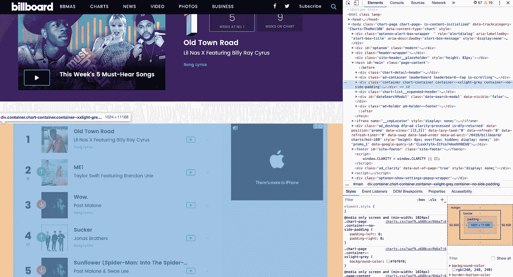
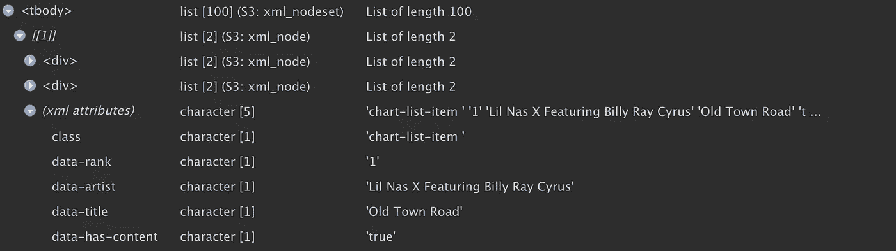
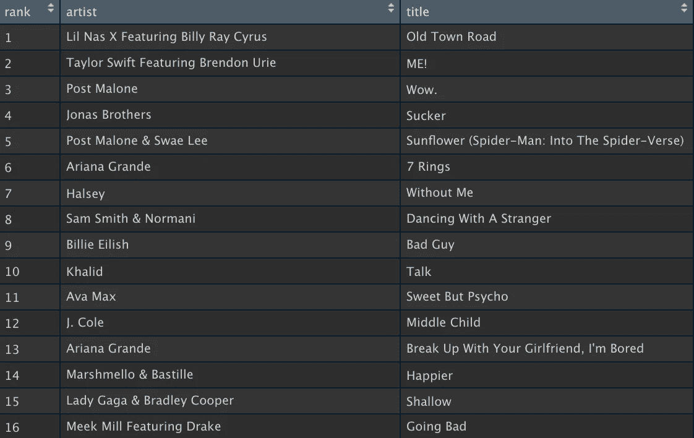
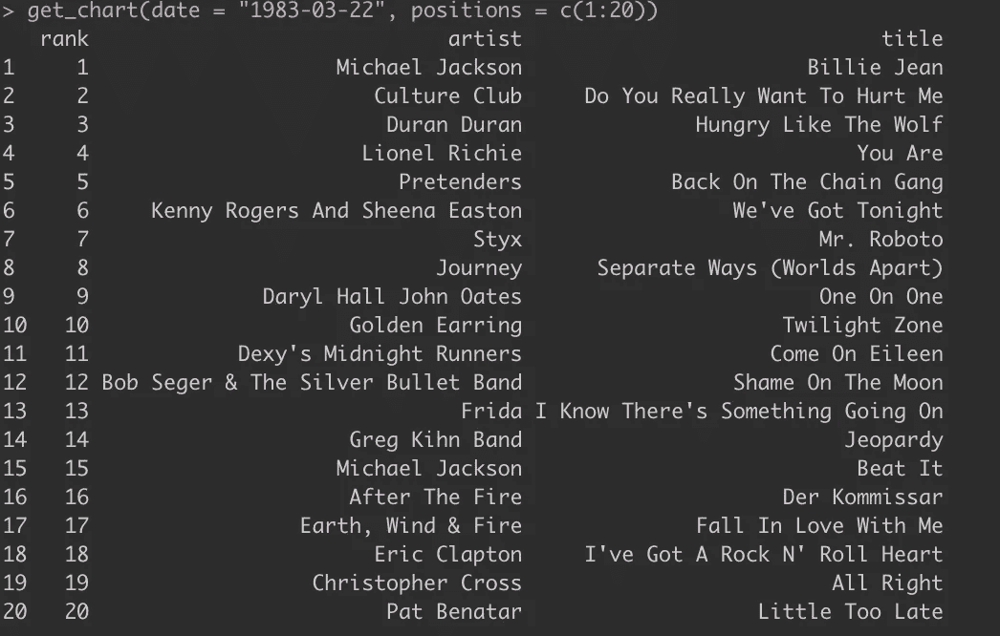
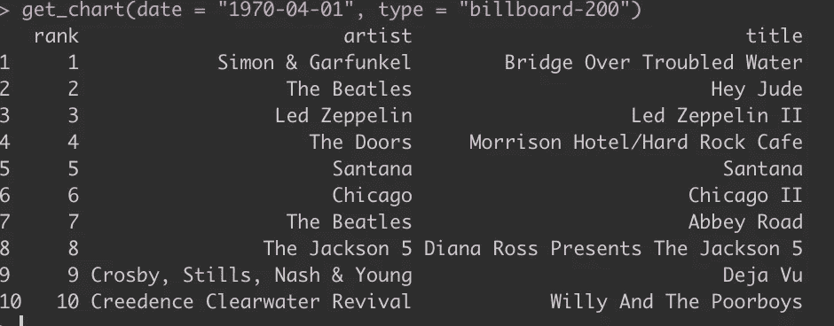

# 从 R 控制台历史记录中获取任何美国音乐排行榜

> 原文：<https://towardsdatascience.com/get-any-us-music-chart-listing-from-history-in-your-r-console-6bd168f192cb?source=collection_archive---------11----------------------->

## 了解 R 的抓取功能，并编写一个简单的函数来抓取过去任何日期的美国音乐图表

我们很幸运生活在一个我们可以得到几乎任何我们想要的事实的时代。如果我们想找出 1980 年以来排行榜前 200 名的专辑，我们只需要去官方的 [Billboard 200 网站](https://www.billboard.com/charts/billboard-200)，输入日期，列表上方就会出现一个漂亮的展示，里面有专辑封面和所有漂亮的东西。

但是我们通常不关心好的东西，我们不想访问一个网站，点击几次来获得我们需要的信息。如果我们可以通过简单的功能或命令在我们的控制台中获得它，这不是很好吗？

嗯，如果网站结构良好，并从结构化数据集中访问数据，那么很可能你可以抓取它，这意味着你可以将你想要的精确信息提取到一个向量或表格中，允许你进行分析或做任何事情。

在这篇文章中，我们将使用包`rvest`和`xml2`来回顾 R 中的基本 web 抓取。这些软件包非常容易使用。到本文结束时，我们将创建一个名为`get_charts()`的函数，它将一个日期、一个图表版本和一个排名位置向量作为其参数，并立即返回该日期这些位置的图表条目。我希望这将鼓励您在无数其他 web 数据源上进行尝试。

对于本教程，你需要安装`dplyr`、`xml2`和`rvest`软件包。你还需要使用谷歌浏览器。

## 开始行动——刮本周的公告牌 100 大热门

我们将从如何刮出本周的 Billboard Hot 100 开始，以获得艺术家和标题的排名列表。如果你看看 https://www.billboard.com/charts/hot-100[的热门 100 页，你可以观察到它的整体结构。它有各种各样的横幅和广告，还有很多正在进行的事情，但你可以立即看到页面上有一个热门的 100 个列表，所以我们知道我们想要的信息在这个页面上，我们需要导航底层代码来找到它。](https://www.billboard.com/charts/hot-100)

R 中的包`rvest`和`xml2`旨在使提取和分析当今大多数网站背后的深度嵌套的 HTML 和 XML 代码变得容易。HTML 和 XML 是不同的——我不会在这里详细讨论——但是您通常需要`rvest`来挖掘并找到您需要的特定 HTML 节点，以及`xml2`来提取包含您想要的特定数据的 XML 属性。

在我们加载包之后，我们想要做的第一件事就是从网页中读取 html，这样我们就有了一个挖掘的起点，可以找到我们想要的节点和属性。

```
# required libraries
library(rvest)
library(xml2)
library(dplyr)# get url from input
input <- "https://www.billboard.com/charts/hot-100"# read html code from url
chart_page <- xml2::read_html(input)
```

现在我们有了一个列表对象`chart_page`，它包含两个元素，一个用于网页的头部，另一个用于网页的主体。

我们现在需要使用 Chrome 来检查网站。右击网站，选择“检查”。这将打开一个面板，显示所有嵌套的 HTML 和 XML 代码。当您将鼠标滚动到这段代码上时，您会看到它所涉及的页面部分被突出显示。例如，您可以在这里看到，当我将鼠标放在突出显示的`<div class = "container chart-container ...">`上时，我们感兴趣的部分会突出显示，这很有意义。



如果您继续扩展这一部分并遵循这种方法，您将最终找到填充图表列表的特定 HTML 和 XML 代码。如果您看得足够近，您会看到图表项目都具有格式`<div class='chart-list-item' ...`。我们可以使用`rvest`的`html_nodes()`函数深入页面主体，并使用`xml2`的`xml_find_all()`函数获取所有将`chart-list-item`作为其类的`<div>`节点。

```
# browse nodes in body of articlechart <- chart_page %>% 
    rvest::html_nodes('body') %>% 
    xml2::xml_find_all("//div[contains([@class](http://twitter.com/class), 'chart-list-item  ')]")View(chart)
```

这给了我们一个嵌套的编号列表，我们可以点击和浏览，就像这样:



现在我们注意到，包含我们感兴趣的数据的实际 XML 类实际上在`chart-list-item`后面有一个空格，所以如果我们重写前面的命令，使其有一个额外的空格，这应该可以解析出包含我们想要的数据的节点。然后我们可以使用`xml2`的`xml_attr()`函数将排名、艺术家和标题提取到向量中。

```
# scrape data
  chart <- chart_page %>% 
    rvest::html_nodes('body') %>% 
    xml2::xml_find_all("//div[contains([@class](http://twitter.com/class), 'chart-list-item  ')]")# get rank, artist and title as vectorrank <- chart %>% 
    xml2::xml_attr('data-rank')

  artist <- chart %>% 
    xml2::xml_attr('data-artist')

  title <- chart %>% 
    xml2::xml_attr('data-title')# create dataframe, remove NAs and return result
  chart_df <- data.frame(rank, artist, title)
  chart_df <- chart_df %>% 
    dplyr::filter(!is.na(rank))View(chart_df)
```

这就是我们想要的，一个很好的列表，很高兴知道有 100 行是我们期望的:



## 概括地从任何日期提取任何图表

所以这需要做大量的调查工作，钻研 HTML 和 XML 可能会很烦人。有像 *SelectorGadget* 这样的 Chrome 插件可以帮助解决这个问题，但是我发现它们是不可预测的，我更喜欢像我上面做的那样研究下面的代码。

然而，既然我们知道了数据的位置，我们现在可以让它变得更加强大。如果你玩玩 billboard.com 网站，你会注意到你可以通过简单地编辑 URL 来获得任何历史日期的特定图表。例如，如果你想看 1983 年 3 月 22 日的广告牌 200，你只需去 https://www.billboard.com/charts/billboard-200/1983-03-22。

因此，这允许我们使用上面的代码，并通过创建一个接受我们感兴趣的日期、图表类型和位置的函数来轻松地对其进行概括。让我们用日期(今天)、图表类型(默认为热门 100)和位置(前 10 位)一些默认值来编写这个函数。

```
get_chart <- function(date = Sys.Date(), positions = c(1:10), type = "hot-100") {# get url from input and read html
  input <- paste0("[https://www.billboard.com/charts/](https://www.billboard.com/charts/)", type, "/", date) 
  chart_page <- xml2::read_html(input)# scrape data
  chart <- chart_page %>% 
    rvest::html_nodes('body') %>% 
    xml2::xml_find_all("//div[contains([@class](http://twitter.com/class), 'chart-list-item  ')]")rank <- chart %>% 
    xml2::xml_attr('data-rank')

  artist <- chart %>% 
    xml2::xml_attr('data-artist')

  title <- chart %>% 
    xml2::xml_attr('data-title')# create dataframe, remove nas and return result
  chart_df <- data.frame(rank, artist, title)
  chart_df <- chart_df %>% 
    dplyr::filter(!is.na(rank), rank %in% positions)chart_df}
```

好了，让我们来测试我们的功能。1983 年 3 月 22 日排名前 20 的单曲是什么？



1970 年 4 月 1 日排名前 10 的专辑是什么？



我喜欢`rvest`和`xml2`的地方在于它们是多么简单和强大。看看这个函数的内容有多精简——创建一个非常强大的东西并不需要花费太多时间。尝试一下其他来源的网络数据，如果您创建了任何其他很酷的抓取功能，可以在这里随意添加到 Github repo [中。](https://github.com/keithmcnulty/scraping/)

最初我是一名纯粹的数学家，后来我成为了一名心理计量学家和数据科学家。我热衷于将所有这些学科的严谨性应用到复杂的人的问题上。我也是一个编码极客和日本 RPG 的超级粉丝。在[*LinkedIn*](https://www.linkedin.com/in/keith-mcnulty/)*或*[*Twitter*](https://twitter.com/dr_keithmcnulty)*上找我。*

*你可以在这里**`*xml2*`*[这里](https://blog.rstudio.com/2015/04/21/xml2/)了解更多关于* `*rvest*` [*。*](https://blog.rstudio.com/2014/11/24/rvest-easy-web-scraping-with-r/)*

**