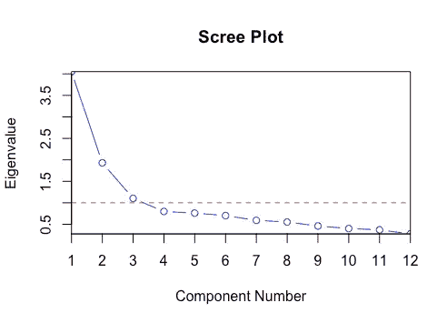
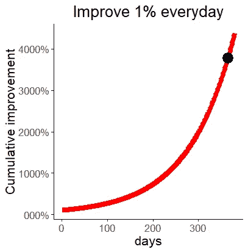
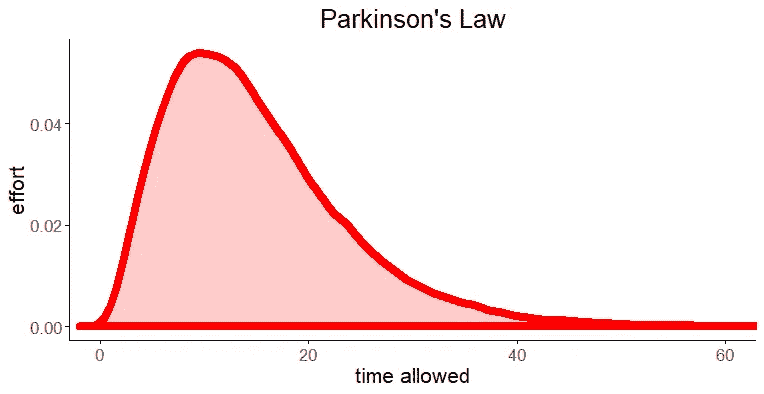
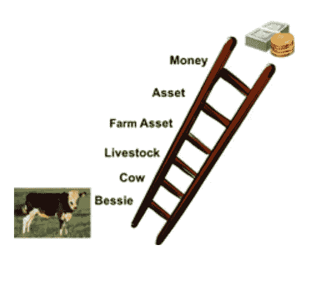
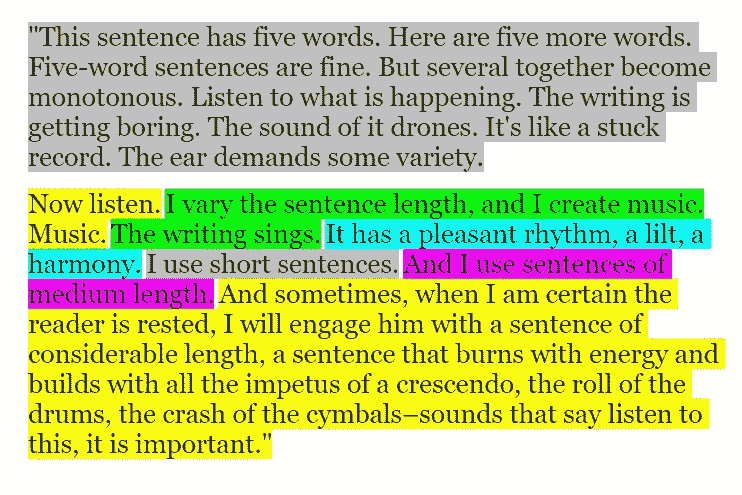
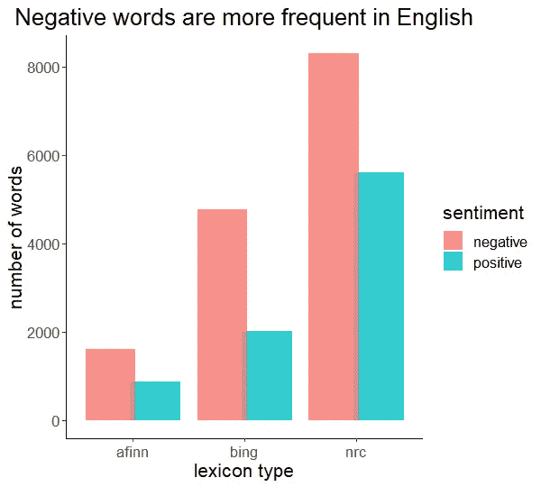
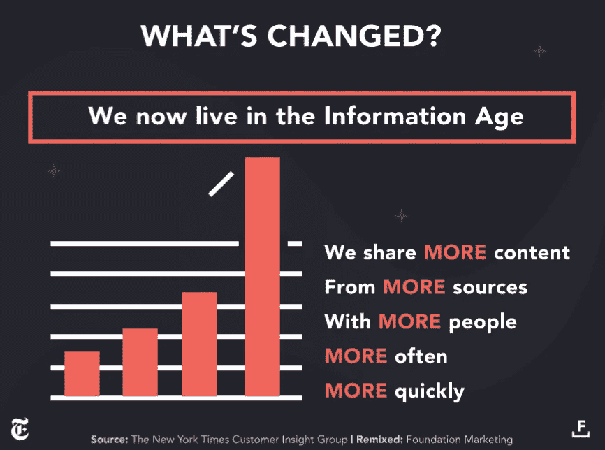

# 在数据科学写作方面做得更好，机会就会增加

> 原文：<https://towardsdatascience.com/get-better-in-data-science-writing-and-the-opportunities-will-grow-9d37fdada262?source=collection_archive---------35----------------------->


Photo by Ian Stauffer on Unsplash

## 如何在一年内将你的数据科学写作提高 3700%

## 改善沟通的 9 个技巧

我们一直都这样做。

写作是我们交流的一个重要部分**。我们写电子邮件、短信和博客。我们撰写项目报告和技术文档。我们写求职信和简历。我们写不完的文字，一整天都在写。**

> 请记住，你写的东西通常是你唯一的机会，让你可以向别人展示你需要的生意、金钱或善意。
> 
> —威廉·津瑟

他是对的。不要因为不够清楚而错失良机。如果写作是我们每天最常做的事情，想象一下哪怕提高一点点的回报。

在这篇文章中，我将通过一些简单的步骤，让你的写作更有效率，并提供一些最好的建议。

数据科学家通常需要向非技术受众解释他们的方法和发现。例如，经理或营销团队。


Photo by [Icons8 Team](https://unsplash.com/@icons8?utm_source=unsplash&utm_medium=referral&utm_content=creditCopyText) on [Unsplash](https://unsplash.com/s/photos/discussion?utm_source=unsplash&utm_medium=referral&utm_content=creditCopyText)

避免行话和杂乱的句子。不厌其烦地讲清楚，讲个人。

清晰的文字可以比作进行主成分分析。在 PCA 中，目标是选择解释数据中大部分变化的变量，并简化计算过程。



[https://en.wikipedia.org/wiki/Scree_plot#/media/File:Screeplotr.png](https://en.wikipedia.org/wiki/Scree_plot#/media/File:Screeplotr.png)

通过在你的文章中仔细选择最重要的事实和想法，并删除不太重要的，你可以让你的故事更容易被你的读者接受。

# 写得更好的 9 个简单步骤

以下步骤将帮助您更好地讲述您的数据科学故事。查看最后的参考资料，了解更深入的信息。

## 1.养成每天写作或重写 30 分钟的习惯

例如，在健身方面，如果你偶尔训练，你的肌肉不会有任何增长。只有当你经常锻炼时，你的肌肉才会开始生长并变得更强壮。同样，精神任务随着一致性而提高。

有才华的人之所以有才华，并不是因为他们曾经做过某件事，而且很棒。他们做了成千上万次的事情，只有在那之后，他们才成为传奇。**做事多次。** **写日常。你做得越多，就会做得越好。**

正如《华氏 451 度》的作者雷·布雷德伯里所说

> “数量产生质量。如果你只写几样东西，你就完了。”

生活中的许多事情都遵循指数增长曲线。开始时，你的收益很小，最后会高得多。

如果你在一年中每天提高 1%的技能，那么在一年结束时，你将获得 3700%的累积进步。

```
# Cumulative gains after 365 days
1.01^365 * 100
= 3778.343%
```



Daily 1% improvements result in a 3700% gain in one year

## 2.从结构开始

我得到的这个写作技巧来自我最喜欢的作家之一，

> “学结构。研究你最喜欢的非小说类书籍，特别要注意这本书是如何在书的层次上组织的，然后是章节层次，然后是段落层次。结构让其他一切变得更容易。”

您可以将此应用于撰写数据科学故事。分析你喜欢的数据科学文章的结构。作者如何组织整篇文章？他是如何构建每一段的？他如何利用故事将数据嵌入其中？这将帮助你理解和发现你自己的成功之路。结构会给你方向。

## 使用框架

写好一个故事的关键往往在于能够组织好自己的思路。为了以书面形式组织你的思想，你需要一个框架。任何框架都比没有好，甚至比开始-中间-结束帮助还要简单。


Photo by [Eliabe Costa](https://unsplash.com/@eliabevces?utm_source=unsplash&utm_medium=referral&utm_content=creditCopyText) on [Unsplash](https://unsplash.com/s/photos/bookshelf?utm_source=unsplash&utm_medium=referral&utm_content=creditCopyText)

你的卧室衣柜如何整理你的衣服？同样，即使是一个粗略的文章计划也会让一切变得更容易。尤其是在数据科学项目中，写作可能会变得复杂。有一个框架把不同的部分放在一起，会使构建最终的故事更加容易。

**博览群书，但要读得透彻。**研究你在 medium.com 或其他数据科学博客上找到的最佳文章。看看它们是如何在段落或句子层面上作为一个整体来构建的。

## 3.设定截止日期

截止日期帮助我们在更少的时间里做更多的事情。想象一下，你有一年的时间写完一本书。但是你很有野心，你给自己设定了一个期限，要在一个月内完成。你认为这一个月结束时事情会是什么样子？你可能无法完成，但**你会进步很多。**


Photo by [Luke Chesser](https://unsplash.com/@lukechesser?utm_source=unsplash&utm_medium=referral&utm_content=creditCopyText) on [Unsplash](https://unsplash.com/s/photos/picasso-time?utm_source=unsplash&utm_medium=referral&utm_content=creditCopyText)

对于数据科学文章，我会创建一个快速的初稿，我必须在一个小时内完成。这个练习将教你选择最重要的事实，并在你的文章中去掉不太重要的。这是让你的听众清楚明白的先决条件。

*   如果你只有 60 分钟来写 2000 字，你没有时间分心。这个限制将帮助你选择需要做的事情，放弃不太重要的事情。

这样做将有助于你掌握对项目核心的关注。

就像我们在化学课上学到的，气体会充满它们所在的空间。就像一滴古龙水会在房间的另一个角落被感觉到。任务膨胀以填满分配给它们的时间空间。这就是众所周知的帕金森定律，这个术语是由西里尔·诺斯古德·帕金森创造的。我使用**伽马分布函数**创建了一个描述原始帕金森定律的类似曲线。



完成一项任务的总努力(曲线下面积)随着允许时间的增加而增加。

除了帮助你管理时间之外，真正的好处是让你学会如何快速提取数据的核心。

## 4.简单解释一下

我们倾向于把使用复杂的句子和大量的术语作为我们智慧的一部分。T2:但是智慧的真正标志是能够把事情解释得更简单。清晰的文字需要更清晰、更简单的思维。我最喜欢爱因斯坦的一句名言是:

“如果你不能简单地解释它，你就不够了解它”

## 5.用故事。

故事在我们的大脑中根深蒂固，因为它们对生存至关重要。在书面语言出现之前，故事是我们传递信息的唯一方式。

也许我们需要被讲很多遍才能了解事实和数字**故事只需要讲一遍就永远不会被忘记。**你的故事与真实生活事件或真实具体的商业问题联系得越紧密，读者就越容易理解。

> “数据和故事的区别在于此:**数据列出了发生的事情；故事表达了事情发生的方式和原因。**数据按数量和频率汇编事实；故事揭示了这些事实背后的因果关系。故事消除不相关，专注于动态变化。

## 将个人兴趣与数据科学写作结合起来

在帖子中加入你的个人风格。读者喜欢知道文本背后的人是谁，喜欢了解真实人物的经历和更多信息。

## 6.具体点

美国参议员 S.I. Hayakawa 和语义学专家介绍了抽象的概念阶梯。非常具体的概念在底部，更一般的概念在阶梯的顶部。下面是奶牛贝西的例子:



source: [http://www.atlas101.ca/pm/concepts/ladder-of-abstraction/](http://www.atlas101.ca/pm/concepts/ladder-of-abstraction/)

使用一般概念来介绍一个主题，并通过给出具体的例子来解释你所得到的结果，尽可能降低抽象层次。当给出一个非常具体的例子时，大脑工作得最好，然后它可以更容易地理解复杂的主题。

> 如果你曾经使用过显微镜来观察一只小昆虫的部分，你知道你必须把物镜对准焦点。就像特定信息聚焦大脑一样。

## 避免使用你的直接判断，而是列出事实。

南 I Hayawaka 在《语言、思想和行动》中对此做了很好的解释:

> 而不是告诉读者，“这是一个可怕的事故！”我们可以让读者自己说出来。可以说，读者是通过自己得出结论来参与交际行为的。因此，一个有技巧的作家通常是一个特别擅长选择那些肯定会以期望的方式打动读者的事实的人。比起一系列明确的判断，我们更有可能被这样的描述性和事实性的文字所说服，因为作者并没有要求我们相信他所说的事故是“可怕的”。

## 7.改变段落

网上阅读和书本阅读是不同的。人们不喜欢文字墙。使用不同长度的段落和句子。



大声朗读那些句子，你会更好地感受到不同之处。**人类的大脑不断监测环境的变化，变化捕捉，单调扼杀人类的注意力。**改变句子的长度使用短、中、长句，让句子更有音乐感。

## 8.使用合适的图片和标题

如果你听说过罗伯特·恰尔迪尼关于说服的研究，你可能会对这些图片如何帮助你更有效地传达信息有所启发。

> 一本在市场营销方面很有影响力的书《劝说前》( pre-suisation)提供了证据，证明我们的行为受到我们在采取行动之前所做或所见的事情的影响。

例如，在 Mandel 和 Johnson 的实验中，当在线家具店的登录页面使用金钱作为背景图像时，访问者更关心价格，但是当登录页面上显示蓬松的云时，他们对舒适度更感兴趣，并购买更昂贵的物品。**让你的读者或商业伙伴明白你想要传达的信息。**

标题和图片通常是你的潜在读者看到的第一件事。通过使用与你希望他们所处的心态相关的恰当形象或信息来支持你的发现。

> 如果您的数据科学解决方案是关于降低生产线成本，请使用钱的图像，如果您找到了提高客户满意度的方法，请使用开心的客户照片。

想想你想把你的读者放在什么心情？这里有一段罗伯特·恰尔迪尼的简短视频，他给出了一些关于压力的建议。

## 9.获得可见性

网络上的噪音是巨大的。做好工作只是一半。你需要让世界知道你创造了什么。

> 挑战在于如何让你的观众理解。

馆长网站或博客可以提高你的数据科学博客的流量。例如，当我把我的博客提交给 R Bloggers 时，我一天的流量比我过去几周的流量还要多。

其他一些例子有:

显然，medium.com(如果你向数据科学提交会更好)。

Reddit

推特。

## **加贺**

看到最终产品会迫使你更快地完成它。例如，当我第一次使用 R Markdown 创建一篇博客文章，并在本地或使用 medium editor 查看时，我可以比使用 word 文档更快地完成文章。

在大多数语言中，否定词支配肯定词。背后的进化原因很可能是为了保护自己免受危险。



当我们看到或听到标题中的负面词汇或限制时，我们会停下来思考更久。这就是为什么当我们看到标题为“最后的机会，还有 3 个小时就可以享受优惠”的邮件时，我们更有可能点击我们的邮箱。

## 你会学到什么？

写作和做数据科学项目都是为了解决问题。在你的项目中，你正在解决一个业务问题。在你的写作中，你正在解决一个问题，比如如何组织一个混乱或复杂的故事，如何找到相关的材料，以及如何对它们进行排序。

成为一个强有力的沟通者会给你带来新的工作机会、新的伙伴关系和更好的关系。

# 摘要

如果你写的东西对解决一个问题有价值，或者提供了一些见解，或者以一种有趣的方式解释了一个抽象的概念**不要等到它成为历史上最完美的文章。**

你电脑里的某些东西对你或这个世界没什么帮助。T4:分享比隐藏更好。如果你这样做了，你可以应用本指南中的一些技巧来提高你的数据科学写作。

不要担心任何错误。我们都是人，我们都从犯错中学习。接受不完美打开了改进之门。

不仅在数据科学中应用这些技巧，而且在任何类型的写作中应用，你都会看到进步。

数据科学写作帮助你获得反馈，激发讨论和改进。

你不一定要成为某个主题的专家才能写它，写它才能成为这方面的专家。

**资源:**

[故事经济学](https://www.amazon.com/Storynomics/dp/B07BH2BH9M/ref=sr_1_1?keywords=storynomics&qid=1575104753&s=books&sr=1-1)。由罗伯特·麦基，托马斯·杰雷斯等人。

[关于写好](https://www.amazon.com/Writing-Well-Classic-Guide-Nonfiction/dp/0060891548/ref=pd_sbs_14_img_1/130-2788337-5329648?_encoding=UTF8&pd_rd_i=0060891548&pd_rd_r=c6778031-cc51-4874-90e2-c1ef07876736&pd_rd_w=I1wSJ&pd_rd_wg=0HXHW&pf_rd_p=5cfcfe89-300f-47d2-b1ad-a4e27203a02a&pf_rd_r=YJ5AG8H4R9F4NNP33SA1&psc=1&refRID=YJ5AG8H4R9F4NNP33SA1)。威廉·津瑟。(我的字幕来自这本书)

[一鸟接一鸟](https://www.amazon.com/Bird-Some-Instructions-Writing-Life/dp/0385480016)。安妮·拉莫特。

[雷·布雷德伯里最伟大的写作建议。](https://lithub.com/ray-bradburys-greatest-writing-advice/)lithub.com。

提高写作的 100 种方法。作者加里·普洛斯特

[帕金森定律](http://doc.cat-v.org/economics/parkinsons-law/the-economist-article.pdf)。*经济学家*。伦敦。

[为什么 25 个单词的句子长度是我们的极限。](https://insidegovuk.blog.gov.uk/2014/08/04/sentence-length-why-25-words-is-our-limit/)英国政府内部

[预先劝说:影响和说服的革命性方法，](https://www.amazon.com/Pre-Suasion-Revolutionary-Way-Influence-Persuade-ebook/dp/B01C36E2YS)罗伯特·恰尔迪尼博士

[影响力:说服的心理学。](https://www.amazon.com/Influence-The-Psychology-of-Persuasion/dp/B01KWAPHAK/ref=sr_1_1?keywords=persuasion&qid=1575197967&s=digital-text&sr=1-1)罗伯特·恰尔迪尼博士

[为什么人们会在网上分享？纽约时报。](https://foundationinc.co/wp-content/uploads/2018/12/nyt-final.pdf)

分享有用的内容是帮助彼此克服噪音和获取相关知识的好方法。最近的一项研究发现，人们会分享更多他们认为有用的内容。



谢谢你读到这里。希望你从中有所收获或者有所启发。

下次见！

塞尔达尔·科鲁尔