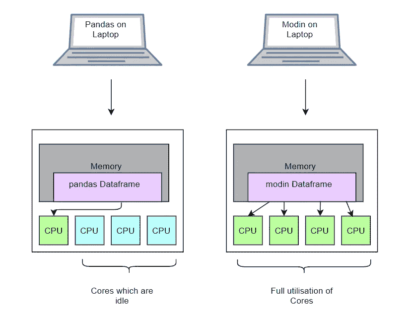
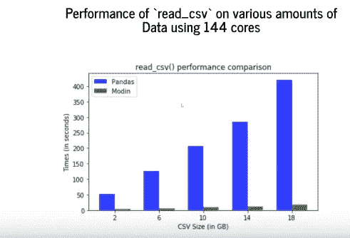
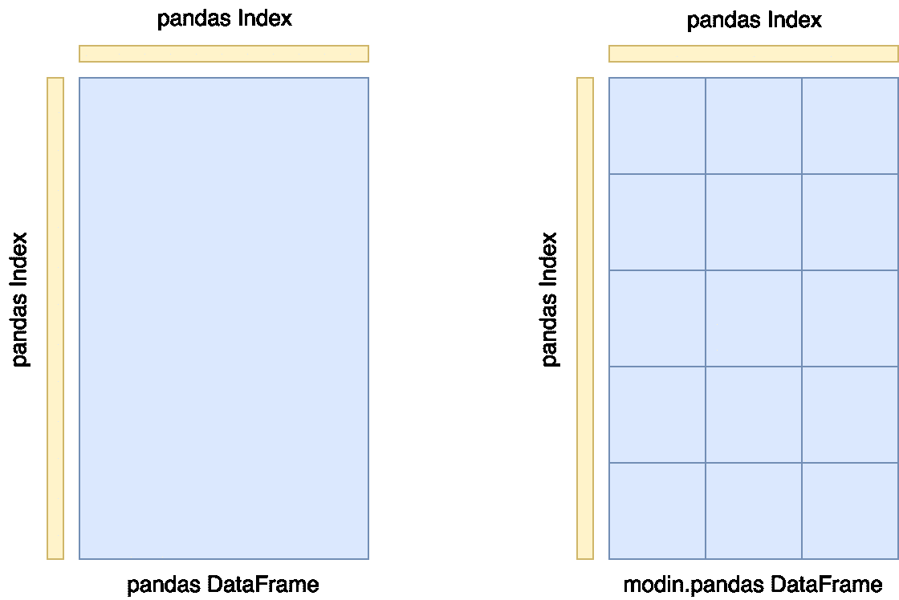
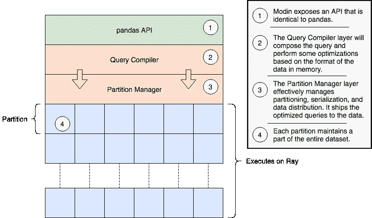
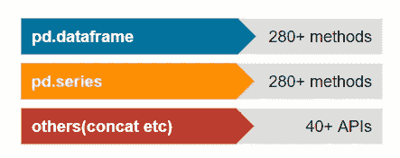
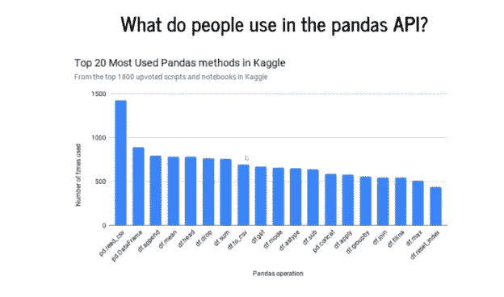
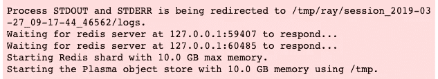
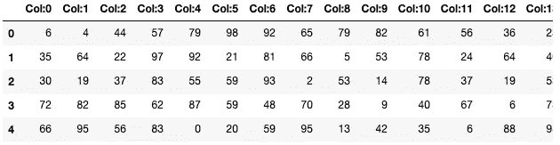
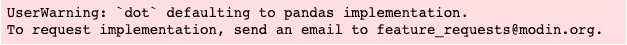

# 用摩丁获得更快的熊猫，甚至在你的笔记本电脑上。

> 原文：<https://towardsdatascience.com/get-faster-pandas-with-modin-even-on-your-laptops-b527a2eeda74?source=collection_archive---------3----------------------->

## 用 Modin 扩展交互式熊猫工作流。


[Source](https://www.pixelstalk.net/kung-fu-panda-wallpapers-hd)

> 通过更改一行代码来扩展您的熊猫工作流程

Pandas 是一个在数据科学领域无需介绍的库。它提供了高性能、易于使用的数据结构和数据分析工具。然而，当处理大量数据时，单核上的 Pandas 变得不够用，人们不得不求助于不同的分布式系统来提高性能。然而，提高性能的代价是陡峭的学习曲线。本质上，用户可能只是希望 Pandas 运行得更快，并不希望为他们特定的硬件设置优化他们的工作流程。这意味着人们希望对 10KB 数据集和 10TB 数据集使用相同的 Pandas 脚本。摩丁提出通过优化熊猫来提供解决方案，以便数据科学家将时间花在从数据中提取价值上，而不是花在提取数据的工具上。

# 摩丁


[**摩丁**](https://github.com/modin-project/modin) 是加州大学伯克利分校[rise lab](https://rise.cs.berkeley.edu/)的一个早期项目，旨在促进分布式计算在数据科学中的应用。这是一个多进程数据框架库，具有与 pandas 相同的 API，允许用户加速他们的 Pandas 工作流程。

Modin 在 8 核机器上将 Pandas 查询速度提高了 4 倍，只需要用户在笔记本上修改一行代码。该系统是为现有的 Pandas 用户设计的，他们希望自己的程序运行得更快，规模更大，而不需要进行重大的代码更改。这项工作的最终目标是能够在云环境中使用熊猫。

## 装置

摩丁是完全开源的，可以在 GitHub 上找到:[https://github.com/modin-project/modin](https://github.com/modin-project/modin)

可以从 PyPI 安装 Modin:

```
pip install modin
```

对于 Windows，其中一个依赖是[射线](http://ray.readthedocs.io/)。Ray 在 Windows 上还没有本地支持，所以为了安装它，需要使用 WSL(Linux 的 Windows 子系统)。

# 摩丁如何加快执行速度

## 在笔记本电脑上

考虑一台 4 核现代笔记本电脑，其数据框架非常适合。熊猫只使用一个 CPU 核心，而另一方面，摩丁使用所有的核心。



Utilisation of cores in pandas vs modin

基本上，modin 所做的只是提高了 CPU 所有内核的利用率，从而提供了更好的性能。

## 在大型机器上

在大型机器上，摩丁的用处变得更加明显。让我们假设有一些服务器或一些非常强大的机器。所以熊猫仍然会使用一个核，而摩丁会使用所有的核。下面是`read_csv` 在 144 核计算机上与熊猫和摩丁的性能对比。



source

熊猫有一个很好的线性扩展，但那是因为它仍然只使用一个核心。可能很难看到绿色条，因为它们在摩丁很低。

> 通常，2gb 大约需要 2 秒，18gb 大约不到 18 秒。

# 体系结构

让我们来看看摩丁的建筑。

## 数据帧分割

分区模式沿着列和行进行分区，因为它在支持的列数和行数方面为 Modin 提供了灵活性和可伸缩性。



[Source](https://modin.readthedocs.io/en/latest/architecture.html#dataframe-partitioning)

## 系统结构

摩丁被分成不同的层。：

*   熊猫 API 暴露在最顶层
*   下一层包含查询编译器，它从 pandas API 层接收查询并执行某些优化。
*   最后一层是分区管理器，它负责数据布局和重排、分区，以及序列化发送到每个分区的任务。



[a general architecture for modin](https://modin.readthedocs.io/en/latest/architecture.html#system-architecture)

# 在 Modin 中实现 pandas API

pandas API 非常庞大，这可能是为什么它有如此广泛的使用案例的原因。



pandas API

由于手头有如此多的操作，摩丁采用了数据驱动的方法。这意味着摩丁的创造者观察了人们在熊猫身上通常使用的东西。他们去了 Kaggle，对那里所有的笔记本和脚本进行了大规模的搜集，最终找出了
最受欢迎的熊猫方法，如下所示:



`pd.read_CSV`是熊猫迄今为止使用最多的方法，其次是`pd.Dataframe.`因此，在摩丁，他们开始按照受欢迎程度的顺序实施和优化一些东西:

*   目前，摩丁支持大约 **71%** 的熊猫 API。
*   根据研究，这代表了约 93%的使用量。

# 光线

摩丁使用[射线](https://github.com/ray-project/ray/)提供了一种毫不费力的方式来加速熊猫的笔记本、脚本和库。Ray 是一个高性能分布式执行框架，目标是大规模机器学习和强化学习应用。相同的代码可以在单台机器上运行，以实现高效的多处理，并且可以在集群上用于大型计算。你可以在 GitHub 上找到雷:[github.com/ray-project/ray](http://github.com/ray-project/ray)。

# 使用

## 进口

摩丁包装了[熊猫](https://pandas.pydata.org/pandas-docs/stable/)并透明地分发数据和计算，通过一行代码的改变加速了熊猫的工作流程。用户继续使用以前的 pandas 笔记本，同时体验到来自 Modin 的相当大的速度提升，即使是在单台机器上。只需要修改导入语句，其中需要导入`modin.pandas` 而不是简单的`pandas.`

```
import numpy as np
import modin.pandas as pd
```



让我们使用由随机整数组成的 Numpy 构建一个玩具数据集。注意，我们不必在这里指定分区。

```
ata = np.random.randint(0,100,size = (2**16, 2**4))
df = pd.DataFrame(data)
df = df.add_prefix("Col:")
```

当我们打印出来的时候，它是一个 **Modin** dataframe。

```
type(df)modin.pandas.dataframe.DataFrame
```

如果我们用 head 命令打印出前 5 行，它会呈现一个 HTML 表，就像 pandas 一样。

```
df.head()
```



# 比较

Modin 管理数据的划分和重组，以便用户能够专注于从数据中提取价值。**以下代码是在一台 2013 年的 4 核 iMac 上运行的，内存为 32GB。**

## pd.read_csv

read_csv 是目前为止熊猫用的最多的操作。我们在熊猫 vs 摩丁中使用 read_csv 的时候做一个快速对比。

*   **熊猫**

```
%%timeimport pandas 
pandas_csv_data = pandas.read_csv("../800MB.csv")-----------------------------------------------------------------CPU times: user 26.3 s, sys: 3.14 s, total: 29.4s
Wall time: 29.5 s
```

*   **摩丁**

```
%%time
modin_csv_data = pd.read_csv("../800MB.csv")-----------------------------------------------------------------CPU times: user 76.7 ms, sys: 5.08 ms, total: 81.8 ms
Wall time: 7.6 s
```

**有了 Modin，** `**read_csv**` **只需更改导入语句**即可在 4 核机器上实现高达 4 倍的速度提升

## df.groupby

熊猫 groupby 写的特别好，速度特别快。但即便如此，摩丁还是胜过熊猫。

*   熊猫

```
%%timeimport pandas_ = pandas_csv_data.groupby(by=pandas_csv_data.col_1).sum()
-----------------------------------------------------------------CPU times: user 5.98 s, sys: 1.77 s, total: 7.75 s
Wall time: 7.74 s
```

*   **摩丁**

```
%%timeresults = modin_csv_data.groupby(by=modin_csv_data.col_1).sum()
-----------------------------------------------------------------CPU times: user 3.18 s, sys: 42.2 ms, total: 3.23 s
Wall time: 7.3 s
```

# 默认为 pandas 实现

如果有人想使用尚未实现或优化的 pandas API，实际上可以默认使用 pandas。这使得该系统可用于使用尚未在 Modin 中实现的操作的笔记本电脑，即使性能会有所下降，因为它现在将使用 pandas API。当默认为熊猫时，您会看到一条警告:

```
dot_df = df.dot(df.T)
```



一旦计算完成，它返回一个分布式的 Modin 数据帧。

```
type(dot_df)
-----------------modin.pandas.dataframe.DataFrame
```

# 结论

摩丁仍处于早期阶段，似乎是一个非常有前途的大熊猫的补充。Modin 为用户处理所有的分区和洗牌，这样我们就可以专注于我们的工作流程。Modin 的基本目标是使用户能够在小数据和大数据上使用相同的工具，而不必担心改变 API 以适应不同的数据大小。

自从这篇文章发表后，很多人一直问我，就报价而言，摩丁和 Dask 有什么不同。下面是作者的详细对比:

[](https://github.com/modin-project/modin/issues/515#issuecomment-477722019) [## 质疑:达斯克和摩丁有什么区别？第 515 期摩丁-项目/摩丁

github.com](https://github.com/modin-project/modin/issues/515#issuecomment-477722019) 

参考

[https://rise . cs . Berkeley . edu/blog/modin-pandas-on-ray-2018 年 10 月/](https://rise.cs.berkeley.edu/blog/modin-pandas-on-ray-october-2018/)