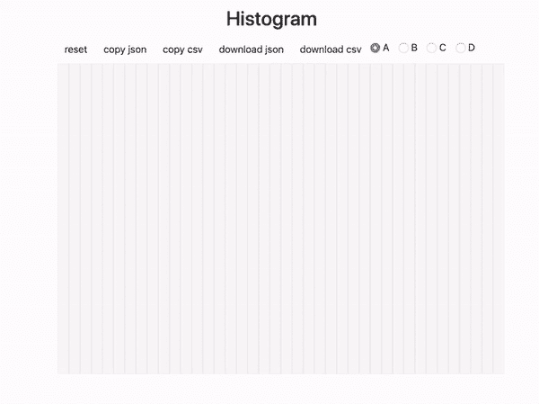
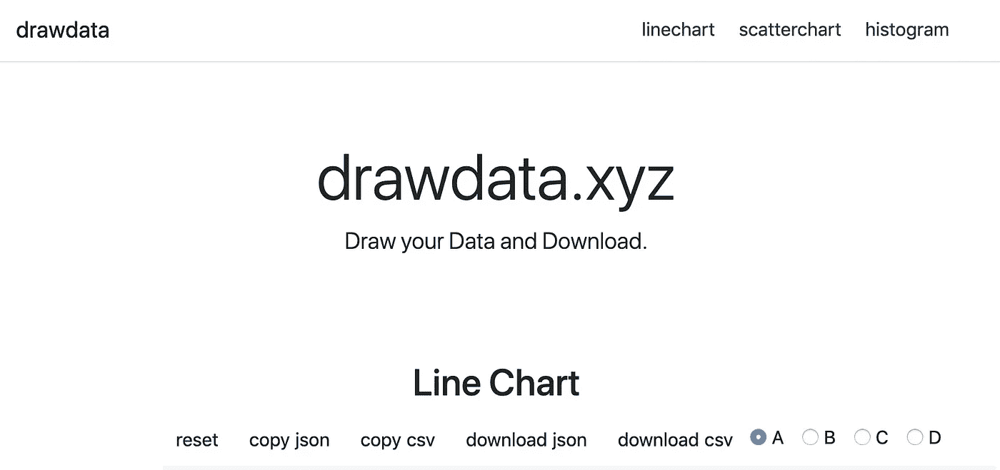
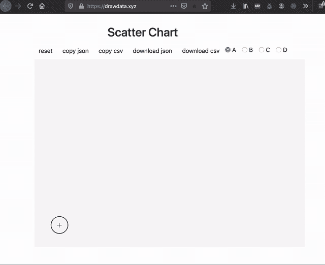
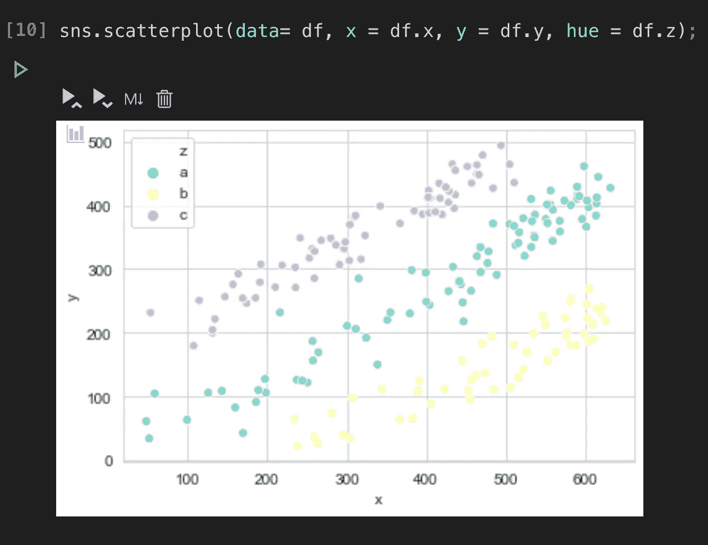

# 获取用于教学和实验的手绘可视化数据

> 原文：<https://towardsdatascience.com/get-hand-drawn-visualization-shaped-data-for-teaching-and-experimenting-391425fe3171?source=collection_archive---------43----------------------->

drawdata.xyz

实验和教学对遵循特定模式/形状/分布的定制/伪造数据的需求并不新鲜。最近我写了一篇关于 [{fakir}](/create-fake-but-meaningful-data-using-fakir-b193df1f4c94) 的文章，这是一个用于生成虚假数据的 R 包。

更进一步，如果您可以* *** *绘制* **一个可视化并下载该特定可视化的数据，会怎么样？太棒了，对吧？我很想用这样一个！

感谢 [Vincent D. Warmerdam](https://twitter.com/fishnets88) 创造了 [*drawdata.xyz*](https://drawdata.xyz/) 这是我从未见过的美丽事物。

## **需要吗？**

很多时候，当我们教授数据科学中的某些内容时，比如说“正相关”，我们需要展示一个具有正相关数据点的散点图。虽然看起来很简单，但要找到符合模式/形状的数据并不容易。在寻找数据的过程中，许多人对解决他们最初打算解决的问题失去了兴趣。

## 解决方案— [drawdata.xyz](http://drawdata.xyz)

Courtesy: drawdata.xyz

正如在上面的动画中演示的那样，drawdata.xyz 是一个免费的服务，它允许您绘制您想要的可视化模式/形状，并下载`csv`或`json`可用于这种可视化的数据。

目前 drawdata.xyz 支持以下可视化:

*   折线图
*   散点图
*   柱状图

## 验证解决方案

我试着用 Python 使用从上面的动画`data.csv`中下载的数据，看看数据是否真的遵循相似的形状，只是为了验证，下面是我从`seaborn`中得到的图

所以，它起作用了——就像它承诺的那样。

**生成自己数据的步骤:**

*   *打开 drawdata.xyz* ，向下滚动/导航至您喜欢的可视化格式
*   使用屏幕画布和鼠标指针*为所选可视化绘制*所需的形状/图案
*   *下载* `csv`或复制`json`随心所欲
*   如果你想尝试不同的图案/形状，重置画布

## 参考

*   [https://twitter.com/fishnets88/status/1189272650100678657](https://twitter.com/fishnets88/status/1189272650100678657)

## 笔记

*   上面显示的由**创建者**([**Vincent d . warmer dam**‏](https://twitter.com/fishnets88))快速生成模式跟踪/成形数据的 *drawdata* 项目托管在实际的服务器上，这耗费了开发者的经常性成本以及开发和维护时间，因此如果您将它用于任何商业目的或者想要捐赠/鼓励这些努力，请在[https://www.buymeacoffee.com/koaning](https://www.buymeacoffee.com/koaning)支持开发者。
*   我与该项目和开发人员都没有关系，这只是我试图编写和展示一个经过深思熟虑的项目，它可以帮助数据科学教学和实验。