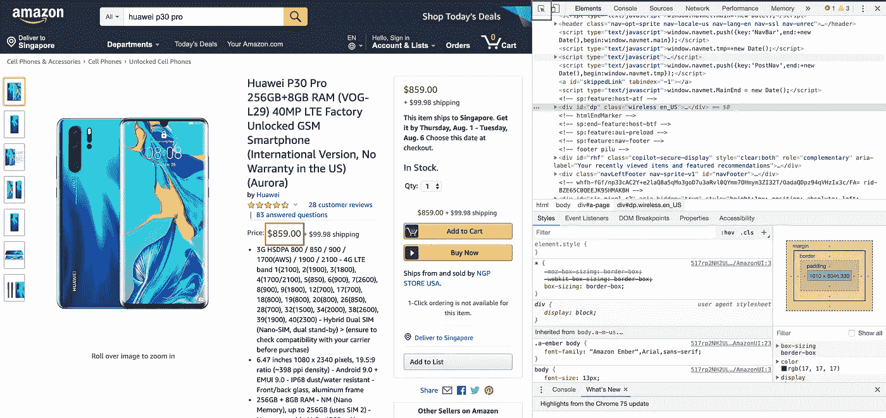

# 构建竞争对手价格监控仪表板的终极指南

> 原文：<https://towardsdatascience.com/get-rid-of-boring-stuff-using-python-part-2-b84d1e9ea595?source=collection_archive---------11----------------------->

## 用不到 20 行代码就能完成！

## 使用 Python 摆脱无聊的东西(第 2 部分)


> 感觉自己的工作充满了重复性的工作？
> 
> 为什么不开始考虑如何实现自动化呢？

事情是这样的，今天我要介绍一个工具来自动化你枯燥的东西——Python。Python 可能是最容易学习的语言。因为你掌握了 Python 技能，你不仅能提高你的生产力，还能专注于你更感兴趣的工作。

欢迎来到**使用 Python** 系列摆脱无聊的东西！请随意访问这个[链接](https://towardsdatascience.com/tagged/getridboringstuff)，你将能够看到这个正在进行的系列中的所有故事。

现在让我们假设你是一名手机销售商，在一个电子商务平台上销售产品。


你会有一份竞争对手的名单…

你会想监测你的竞争对手是如何设置他们的价格，以便你可以稍微降低你的价格，以更具竞争力。

另一个场景，假设你在一家电子商务公司做销售，你有一个客户，阿迪达斯。


因此，你需要监控阿迪达斯是否在每个电子商务平台上销售相同的价格，如果不是，那么你也可以质疑他们的定价。

价格监控仪表板非常重要，尤其是在电子商务中。当两个卖家在销售同一产品时，价格是顾客是否会选择购买该产品的决定因素。

我们开始吧！

我就用你在亚马逊做卖家的例子，卖**华为 P30 Pro** 。所以，今天你将建立一个非常简单的仪表板——**Google Sheet**，来监控你的价格有多有竞争力。

**这是我将要分享的议程:**

**第 1 部分** **—输入竞争对手的详细信息。**

**第 2 部分——获取您的 google sheet 证书文件。**

**第 3 部分——在竞争对手的网站上进行网页抓取【可视化】**

**第 4 部分—竞争对手网站上的网页抓取[编码]**

跟随整个旅程，你会发现让你无聊的事情自动化并在 5 秒内更新你的价格是多么简单。

# 第 1 部分—输入竞争对手的详细信息。


创建一个 google 表单，输入示例[竞争对手的链接](https://www.amazon.com/VOG-L29-Unlocked-Smartphone-International-Warranty/dp/B07PX3ZRJ6/ref=sr_1_1?crid=2C4AALGDRKZE0&keywords=huawei+p30+pro&qid=1564195377&s=gateway&sprefix=huawei%2Caps%2C342&sr=8-1)。给你的华为 P30 Pro 定个价。

为列 **Competitive** 定义一个条件格式，规则是如果你的价格比你的竞争对手低，它将是 1，单元格将填充绿色。否则，将其设置为 0 并用红色填充单元格，以提醒您的竞争对手正在设定比您更低的价格。

# 第 2 部分—获取 google sheet 的凭证文件。

按照这个[链接](https://medium.com/@denisluiz/python-with-google-sheets-service-account-step-by-step-8f74c26ed28e)，一步一步地，你将能够以 JSON 格式检索你的证书文件。在 JSON 格式的凭证文件中，您将能够看到您的电子邮件帐户，如下面的紫色框所示。


然后，将您的服务帐户的电子邮件共享到您刚刚创建的 google sheet，如下图所示。


然后点击发送按钮，就大功告成了！

# 第 3 部分—竞争对手网站上的网络抓取[可视化]

首先，在 google chrome 中启动竞争对手的网站，右键单击并选择 Inspect，然后您将能够在 Snapshot 1 中查看下面的快照。



Snapshot 1

然后，单击顶部中间的紫色括号，您将看到一个光标，然后单击红色括号检查产品价格的 HTML 元素，如下所示(快照 2)。


Snapshot 2

接下来，请注意快照 2 中上方的紫色框，这是我们需要提取的路径:

HTML 标记名:span

HTML 标记名属性 <id>: priceblock_ourprice</id>

**如果你不熟悉 HTML，* [*这个*](https://html-css-js.com/html/tutorial/html-tag-attributes.php) *对于上面的术语会是一个很好的参考。*

所以现在让我们从编码部分开始吧！

# 第 4 部分—竞争对手网站上的网络抓取[编码]

## 访问谷歌工作表

按照上面的要点连接到 google sheet。

请注意， *gc.open_by_key()* 的输入如下:***11 du 3 qbpoxlbuxj-o _ zerndjdqq 8 pnbmsazpebbfbwyc 0***。这实际上是 Google 找到你对应的 google sheet 的唯一标识符。

您可以获得如下所示的唯一标识符(紫色框):


Snapshot 3

## 从谷歌工作表中提取数据

使用 *get_all_values()* 函数从 sheet_name: Sheet1 的 google 工作表中检索数据。

然后，将该值存储到 pandas 数据框中，如下所示:

```
df = pd.DataFrame(sht1.worksheet("Sheet1").get_all_values()[1:])
```

你已经完成了 70%!

## 网页抓取

记住价格 HTML 标签:

HTML 标签属性 <id>: priceblock_ourprice</id>

所以现在，我们使用[美汤](https://www.crummy.com/software/BeautifulSoup/bs4/doc/)解析器来获取你需要的元素。

想象汤的格式如下:

> soup.find( HTML 标签，{标签属性:属性值})

在我们的案例中:

HTML 标记名:span

标签属性:id

属性值:价格块 _ 我们的价格

```
soup = BeautifulSoup(res.text)
price = soup.find("span", 
                 {"id": "priceblock_ourprice"}
                 ).text.replace("$","")
```

## 更新谷歌工作表的最新价格

使用 *update_acell(cell number，value)* 函数将我们刮到的价格插入到 google sheet **中，我们就完成了**！

```
sht1.worksheet("Sheet1").update_acell('D3', price)
```

将上面提到的所有内容与下面的代码结合起来:

# 最终想法

我目前是一名数据科学家。数据增长真的很快，所以让自己具备良好的搜集技能很重要，因为你将能够为你的机器学习模型获得更多数据。

感谢你阅读这篇文章。欢迎在下面留下你感兴趣的话题的评论。我将在未来发布更多关于我的经历和项目的帖子。

# 关于作者

[Low 魏宏](https://www.linkedin.com/in/lowweihong/?source=post_page---------------------------)是 Shopee 的数据科学家。他的经验更多地涉及抓取网站，创建数据管道，以及实施机器学习模型来解决业务问题。

他提供爬行服务，能够为你提供你所需要的准确和干净的数据。你可以访问[这个网站](https://www.thedataknight.com/)查看他的作品集，也可以联系他获取抓取服务。

你可以在 [LinkedIn](https://www.linkedin.com/in/lowweihong/?source=post_page---------------------------) 和 [Medium](https://medium.com/@lowweihong?source=post_page---------------------------) 上和他联系。

[](https://medium.com/@lowweihong?source=post_page---------------------------) [## 低微红—中等

### 在媒体上阅读低纬鸿的作品。Shopee 的数据科学家。每天，低伟鸿和其他成千上万的…

medium.com](https://medium.com/@lowweihong?source=post_page---------------------------)