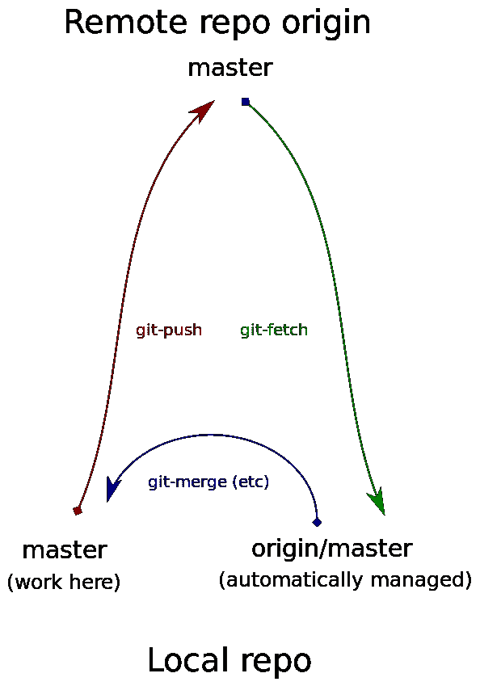
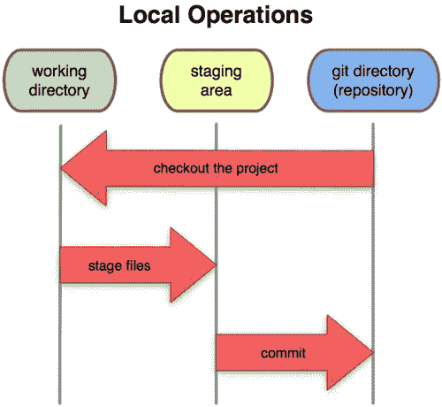

# 摆脱恐惧，不到五分钟就掌握 Git。

> 原文：<https://towardsdatascience.com/get-rid-of-your-fear-and-conqueror-git-in-less-than-five-minutes-56930c269ffd?source=collection_archive---------19----------------------->

## 为什么我们要写另一个指南？

我们写另一个是因为我们需要帮助自己真正理解 Git 是如何工作的，它能为我们做什么，我们需要稍微更深入的理解。

> 让我这样说吧，亲爱的读者们，我和我的朋友决定一起在一张纸上画一幅画，作为学校的家庭作业。我们在图书馆见面，复印了两份我们开始做的东西，我们都带了一份回家这是**拉**。我们都在图上添加了更多的东西，当我们明天回到学校时，我们剪切并粘贴我们改变的部分，然后影印改变这是**合并**。如果我们都擦除了同一个区域，必须有人选择使用哪个部分，这就是**解决冲突**。因为每次有东西改变时都有复印件，如果我不喜欢我所做的，我可以扔掉所有新的，这是**重置**。如果我们不喜欢我们所做的，那么我们可以烧掉所有新的复印件，这就是**恢复。**

让我们转到 Git 视角。对于 Git 这样的系统，我会首先在 Git 服务器上创建文件，并添加修改。然后，我*提交*那些变更到存储库。然后，我的朋友开始拉最新的变化。他添加了一些东西，然后*将*提交给回购。回购说*这个文件是存在的，并且和之前的版本不一样，我们就存成版本 2。*以此类推。Git repo 允许我们进行编辑并保持更改的有序性，所以如果我在某个时候删除了一些东西，我可以说， *Git，检查一下*之前的点，然后我就可以回去修复我的东西了。

每个提交都有一个所有者，所以我们知道谁做了什么。我可以比较 Beta 版和 Alfa 版，看看有什么变化，更容易发现有什么新的变化。

Git 还允许我创建分支。所以我们在 doc 的第 17 个版本上，但是我想要尝试一些新的东西。我的朋友想继续，所以我创建了一个名为 **MiTesoro** 的分支，并开始着手于此。这现在是代码的一个单独的路径，而我的朋友继续原来的路径，这通常被认为是*主路径。*所以 Git 基本上允许多人访问通常是代码的中心部分，并对其进行修改，而不会踩到别人的脚趾。

## Git 是什么？

Git 是一个成熟的、积极维护的开源项目，最初由 Linux 操作系统内核的著名创建者 Linus Torvalds 于 2005 年开发。数量惊人的软件项目依赖 Git 进行版本控制，包括商业项目和开源项目。使用过 Git 的开发人员在可用的软件开发人才库中有很好的代表性，它可以在各种操作系统和 ide(集成开发环境)上很好地工作。在这个技术介绍之后，让我们跳转来解释几个关于 Git 的词汇。

## Git 中的分支是什么？

在 Git 中，有三个感兴趣的分支，本地分支、远程分支和跟踪分支，它们可能都指向不同的提交:

1.  在**本地**回购中，分行名为*主*。这是我们工作和承诺的地方。这是当地的分公司。它在下图的左下方。
2.  在**远程**回购中，名为*主*的分支。这是远程分支，位于下图的顶部。我们通常根本看不到它，因为它通常位于另一台计算机上，需要网络操作才能与之交互。
3.  在**本地**回购中名为*起源/主*的分支。这是跟踪分支，在图的右下方。我们自己从不修改跟踪分支。它是由 Git 自动为我们维护的。每当 Git 与远程 repo 通信并了解到一些关于远程主分支的部署情况时，它就会更新本地分支或 *origin/master* 以反映它所了解到的情况。

Understanding branching in Git.

## Git 有哪些状态？

仔细阅读这篇文章，我亲爱的朋友。如果你想在 Git 中取得好的学习效果，这是关于 Git 要记住的主要事情。Git 有三种主要的文件状态:提交、修改和暂存。**提交**意味着数据安全地存储在您的本地存储库中，这是 *git 提交*的最终结果。 **Modified** 表示您已经更改了文件，但是还没有提交到您的数据库中。 **Staged** 意味着您已经在当前版本中标记了一个修改过的文件，以进入您的下一个提交快照。这是 *git add* 的最终结果。

Different states of Git.

## Git 有哪些领域？

Git 目录是您的**本地存储库**，是 Git 存储项目的元数据和对象数据库的地方。这是 Git 最重要的部分，当您从另一台计算机上克隆一个存储库时，它就是被复制的内容。

**工作目录**是项目的一个版本的单次检出。这些文件从 Git 目录下的压缩数据库中取出，放在磁盘上供您使用或修改。

**暂存区**是一个简单的文件，通常包含在您的 Git 目录中，它存储了关于您下一次提交的内容的信息。它有时被称为索引，但是将它称为临时区域已经成为标准。

## 基本工作流程是什么？

基本的 Git 工作流程是这样的:

1.  您可以修改工作目录中的文件。
2.  您转移文件，将它们的快照添加到您的转移区域。
3.  您执行一个提交操作，该操作将文件保存在临时区域中，并将快照永久存储到 Git 目录中。

Types of areas inside Git.

所以我希望你喜欢我们的文章，因为在接下来的故事中，我们将讨论 Git 的基本操作，以及还原和重置、拉取和获取、合并和重置之间的区别，Git 的不同工作流，以及如何解决合并冲突。

[*在 Udemy 上查看我们的免费课程。*](https://www.udemy.com/course/amazon-aws-mastering-boto3-using-python/?couponCode=1BDB3420D6804133A918)

> *感谢阅读。如果你喜欢这篇文章，请点击下面的按钮，这样我们就可以保持联系。*