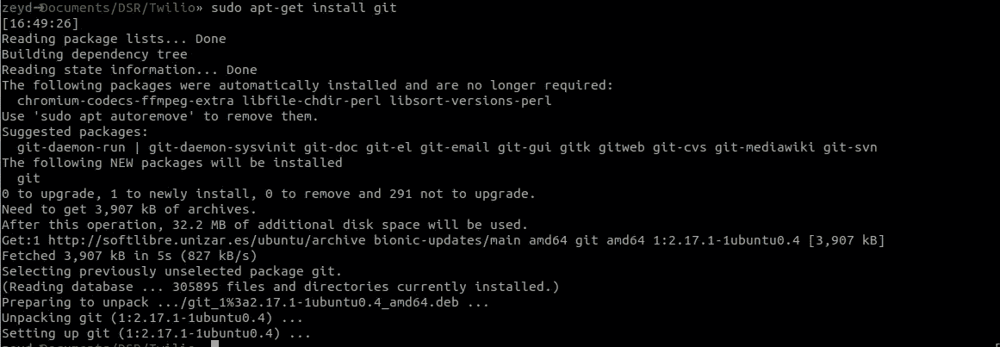
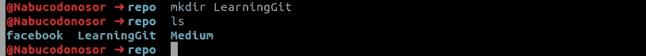
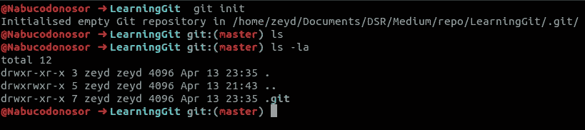
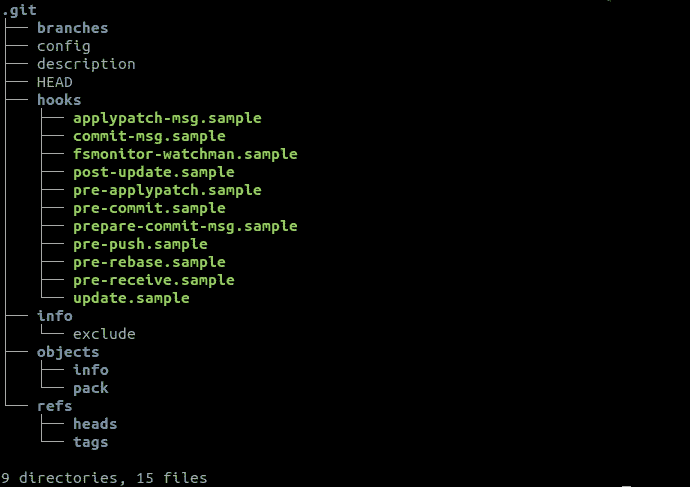
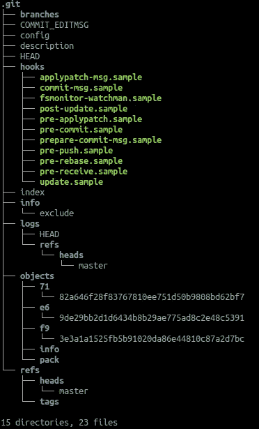
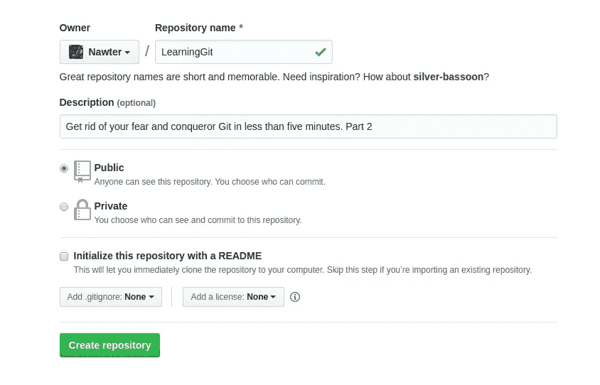
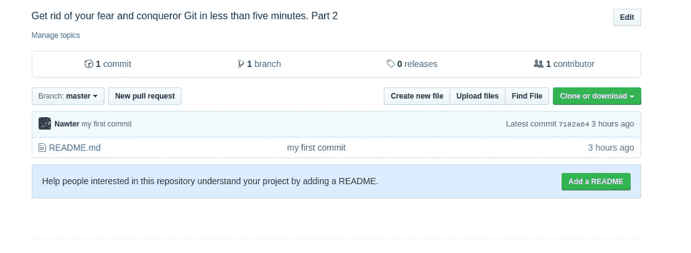

# 摆脱恐惧，不到五分钟就掌握 Git。第二部分

> 原文：<https://towardsdatascience.com/get-rid-of-your-fear-and-conqueror-git-in-less-than-five-minutes-part-2-49b951cdb8d9?source=collection_archive---------23----------------------->

这是一个由七个部分组成的系列，作为理解 Git 分布式版本控制系统基础的指南。好奇 Git 是怎么工作的？本系列的第二篇文章很好地理解了 Git 中使用的基本命令。你可以在这里 *阅读 Part One* [*。*](/get-rid-of-your-fear-and-conqueror-git-in-less-than-five-minutes-56930c269ffd)

在这一部分中，我们将深入了解 Git 的基本命令是如何工作的。在这个故事中，我们将有一个美好的旅程，经历 *git 配置、git 初始化、git 添加、git 提交、git 克隆、git 远程、git 推送和 git 状态*。如果你有几分钟的宝贵时间，并且你想提高自己，坐下来，和我们一起开始阅读和练习吧，我亲爱的朋友。

但是在进入 Git 的命令之前，我们先来看一下如何在 Ubuntu 18.04 上安装 Git。



How to install Git.

# Git 配置

现在您的系统上已经有了 Git，您需要做一些事情来定制您的 Git 环境。在任何给定的计算机上，您应该只需要做一次这些事情；他们会在升级之间逗留。您也可以通过再次运行这些命令来随时更改它们。

## 你是谁？

首先要做的是告诉 Git 你是谁，自我介绍，互相认识，因为这是一个漫长的旅程，它是以朋友来衡量的，而不是以英里来衡量的。

```
$ git config --global user.name "nawter"
$ git config --global user.email [4772025+Nawter@users.noreply.github.com](mailto:4772025+Nawter@users.noreply.github.com)
```

## 你的编辑是什么？

现在 Git 知道您是谁了，您可以配置默认的文本编辑器，当 Git 需要您输入消息时，将会使用这个编辑器。如果没有配置，Git 使用系统的默认编辑器。如果您想使用不同的文本编辑器，如 Vim，您可以执行以下操作:

```
$ git config --global core.editor vim
```

小心这一步，如果你不这样设置你的编辑器，当 Git 试图启动它时，你会进入一个非常混乱的状态。Windows 系统上的一个例子可能包括在 Git 启动的编辑期间过早终止的 Git 操作。

## 你的设置是什么？

如果您不确定您的配置设置，您可以使用`git config --list` a 命令列出 Git 可以找到的所有设置:

```
$git config --list
user.name=nawter
[user.email=4772025+Nawter@users.noreply.github.com](mailto:user.email=4772025+Nawter@users.noreply.github.com)
credential.helper=cache --timeout=3600
http.postbuffer=1757286400
core.editor=vim
```

# Git 初始化

我们到了这个部分，你的第一个想法是我的下一步是什么，我告诉你应该是`git init`。你正在编写一点代码来创建将改变世界的新视频游戏，或者你正在摆弄一些治疗癌症的新数据，你认为`git init`。

让我们从创建您自己的项目的方法开始。

*   创建一个新目录来包含项目。



Use of mkdir.

*   进入新目录。
*   类型`git init`。



git init sample

*   检查的内容。git 文件夹



The content of .git folder

*   写一些东西，比如一个 README.md 文件，以纯文本或带 Markdown 内容的形式，谈论你的项目，这是一个免费的[模板](https://gist.github.com/PurpleBooth/109311bb0361f32d87a2)来做这件事。
*   键入`git add`添加文件`git add README.md`
*   类型`git commit -m “my first commit”`

让我们先检查一些数据，然后再移动到下一部分。如果我们键入`git log`，我们可以看到该信息，它指示了头部位置和我们的上次提交。

```
commit 7182a646f28f83767810ee751d50b9808bd62bf7 (HEAD -> master)
Author: nawter <[4772025+Nawter@users.noreply.github.com](mailto:4772025+Nawter@users.noreply.github.com)>
Date: Sun Apr 14 12:46:05 2019 +0100my first commit
```

最后但同样重要的是，如果我们再次运行`tree .git`并亲自检查结果，我们会看到目录和文件的数量有一些变化，从 9 个目录和 15 个文件变成了 15 个目录和 23 个文件。



The .git folder after changes.

# Git 远程和 Git 推送

## 什么是远程存储库？

远程 URL 是 Git 对存储代码的地方的别出心裁的说法。那个 URL 可能是你在 Github 上的存储库，或者是另一个用户的分支，甚至是在一个完全不同的服务器上。Git 将一个远程 URL 与一个名称相关联，您的默认远程通常被称为`origin`。

> R 远程存储库可以在你的本地机器上。您完全有可能使用一个远程存储库，事实上，它位于您所在的同一台主机上。“远程”一词并不一定意味着储存库在网络或互联网上的某个地方，只是意味着它在某个地方。使用这样的远程存储库仍然会涉及到所有标准的推、拉和取操作，就像使用任何其他远程存储库一样。

## 如何连接到您的远程存储库？

现在您已经有了一个本地 Git 存储库。如果你愿意，你可以在本地使用 Git。但是如果你想让这个东西在 Github 上有一个家，那么做下面的事情。

*   转到 [Github](https://github.com/) 网站。
*   登录您的帐户。
*   点击右上角的[新建存储库](https://github.com/new)按钮。您可以选择用 README.md 文件初始化存储库。
*   点击**创建存储库**按钮。



Connecting to our remote repository.

现在，遵循第二组指令，其中您可以看到**…或者从命令行推送一个现有的存储库。**

```
$ git remote add origin https://github.com/Nawter/LearningGit.git
$ git push -u origin master
```

这是我们将更改推送到终端中的新存储库后的结果。

```
Counting objects: 3, done.
Writing objects: 100% (3/3), 227 bytes | 227.00 KiB/s, done.
Total 3 (delta 0), reused 0 (delta 0)
To [https://github.com/Nawter/LearningGit.git](https://github.com/Nawter/LearningGit.git)
 * [new branch] master -> master
Branch ‘master’ set up to track remote branch ‘master’ from ‘origin’.
```

结果显示在我们的网络浏览器中。



Result in the Github site.

## 你能在遥控器里看到什么？

如果你想看到更多关于特定遥控器的信息，你可以使用它们的`git remote show <remote>`命令。如果您使用一个特定的短名称运行这个命令，比如`origin`，您会得到如下结果:

```
$ git remote show origin
* remote origin
  Fetch URL: [https://github.com/Nawter/LearningGit.git](https://github.com/Nawter/LearningGit.git)
  Push  URL: [https://github.com/Nawter/LearningGit.git](https://github.com/Nawter/LearningGit.git)
  HEAD branch: master
  Remote branch:
    master tracked
  Local branch configured for 'git pull':
    master merges with remote master
  Local ref configured for 'git push':
    master pushes to master (up-to-date)
```

# Git 克隆与 Git 初始化

命令`git init`和`git clone`很容易混淆。在高层次上，它们都可以用来*初始化一个新的 git 库*。然而，`git clone`是依赖于`git init`的。`git clone`用于创建一个现有存储库的副本。在内部，`git clone`首先调用`git init`创建一个新的存储库，然后调用`git remote add` ，然后使用`git fetch`从该 URL 获取所有分支到您的本地存储库，最后使用`git checkout.`签出一组新的工作文件

# Git 状态

在教程的这一部分，我们将使用命令`git status`探索不同的真实场景

## 错误的地方

```
$ git status
fatal: not a git repository (or any of the parent directories): .git
```

如果我们得到这个错误，我们不在一个有 Git 库的目录中。在我们的终端中使用 *cd* 命令，或者参考 [Git 设置](https://help.github.com/en/articles/setting-your-username-in-git)文档来设置您的初始回购。

## 一切都干净了

```
$ git status
On branch master
Your branch is up-to-date with 'origin/master'.

nothing to commit, working directory clean
```

这是理想的 Git 状态消息。*与“源/主”保持同步。*表示没什么可推的。*工作目录清理*表示当前目录下的所有文件都由 Git 管理，并且文件的最新版本已经提交。

## 未跟踪的文件

如果`git status`提到*未跟踪文件*，我们可能需要添加一个或多个未跟踪文件。

```
$ git status
On branch masterNo commits yetUntracked files:
  (use "git add <file>..." to include in what will be committed)README.mdnothing added to commit but untracked files present (use "git add" to track)
```

在这种情况下，我们可能希望添加 README.md。一个好的规则是，如果我们直接用编辑器编辑该文件，该文件就属于它。

## 承诺还是不承诺

如果您看到消息*Changes to commit:…*，这意味着我们之前已经运行了`git add`，但是我们还没有运行`git commit`

```
$ git status
On branch masterNo commits yetChanges to be committed:
  (use "git rm --cached <file>..." to unstage)new file:   README.md
```

通过运行`git commit` 并附带一条短消息说明我们在文件中所做的更改来修复这个问题。

```
$ git commit -m "my first commit" 
[master (root-commit) 7182a64] my first commit
1 file changed, 0 insertions(+), 0 deletions(-)
create mode 100644 README.md
```

在修复提交之后。

```
$ git status
On branch master
nothing to commit, working tree clean
```

在 Udemy 上查看我们的免费课程。

> *感谢阅读。如果你喜欢这篇文章，请点击下面的按钮，这样我们就可以保持联系。*