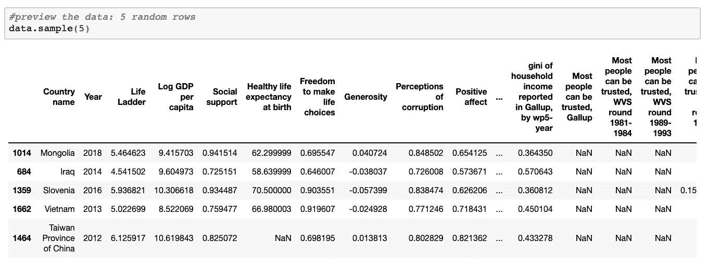

# 所以你想成为一名数据科学家？

> 原文：<https://towardsdatascience.com/get-started-with-python-e50dc8c96589?source=collection_archive---------10----------------------->


## PYTHON 入门

## 到底是什么阻止了你？下面是如何开始！

D 数据一直是做出明智且最终正确决策的关键。但是在过去的十年中，数据生成和数据利用率像[前所未有的](https://www.forbes.com/sites/bernardmarr/2018/05/21/how-much-data-do-we-create-every-day-the-mind-blowing-stats-everyone-should-read/)一样飞速增长。这种现象使得数据素养和数据分析成为几乎每个从事定量学科的人的必备技能。让我们面对现实吧，大多数工作正变得越来越量化和复杂。因为毕竟，平凡的日常工作正在被外包给机器，比我们更快更好。

你可能认为你精心磨练的 Excel 技能会让你退休。好吧，我不想打断你:但是如果你的 60 岁生日不在眼前，你很可能弄错了。

你可能会想:

> 我真的很想学习 Python，但是我甚至不知道从哪里开始！

他们说第一步总是最难的。但是跟着做，我向你保证，在 15 分钟内，你不仅会写出你的第一行代码，而且会在这个过程中学到一些关于快乐的东西！

**提醒一句:**为了简单起见，我将跳过并大大简化主题。然而，我们的目标不是让你成为一名成熟的程序员——至少现在还不是——而是让你继续前进！

# 1.设置 Anaconda

> A **naconda** 是针对[科学计算](https://en.wikipedia.org/wiki/Scientific_computing) ( [数据科学](https://en.wikipedia.org/wiki/Data_science)、[机器学习](https://en.wikipedia.org/wiki/Machine_learning)应用程序、[预测分析](https://en.wikipedia.org/wiki/Predictive_analytics)等的 [Python](https://en.wikipedia.org/wiki/Python_(programming_language)) 和 [R](https://en.wikipedia.org/wiki/R_(programming_language)) 编程语言的[免费开源](https://en.wikipedia.org/wiki/Free_and_open-source)发行版。)，旨在简化[包管理](https://en.wikipedia.org/wiki/Package_management)和部署。包版本由[包管理系统](https://en.wikipedia.org/wiki/Package_manager) [*康达*](https://en.wikipedia.org/wiki/Conda_(package_manager)) *管理。超过 1500 万用户使用 Anaconda 发行版，它包含了超过 1500 个适用于 Windows、Linux 和 MacOS 的流行数据科学包*

一种非常冗长的说法是:“Anaconda 安装 Python 和几乎所有它的基本包。”

我将带您在 Windows/Mac 上安装 Anaconda，但是它非常简单，甚至不需要截屏。然而，他们提出了一个观点。设置 Anaconda 又快又简单！

## 窗口:

所以我把生锈的(大约 10 年前的笔记本电脑)重新装上了最新的 Anaconda 版本。**咔嚓，咔嚓，咔嚓，搞定！好吧，第六步花了 10 分钟左右，但这都怪我的笔记本电脑。安装对你来说无疑会更快。继续下载 Anaconda [这里](https://www.anaconda.com/distribution/#windows)(获取 3.7 版本)！这里没什么可怕的。**


Installation of Anaconda on Windows

## Mac:

我卸载了 Anaconda，在这里[下载了最新版本](https://www.anaconda.com/distribution/#mac)(获得 3.7 版本)重新安装。没有任何打嗝，整个过程花了大约 2 分钟。


Installation of Anaconda on Mac

## Unix/Linux:

你在这里做什么？导航您的操作系统比 Anaconda 要复杂得多！

# 2.开始你的第一个笔记本

安装 Anaconda 之后，打开 Anaconda Navigator。你就快到了！


Anaconda Navigator

点击笔记本(左上第二个)。将打开一个新的浏览器选项卡，如下所示:


Hit the “New” button and select Python 3


Congratulations, you have created your first Jupyter Notebook.

# 3.开始编码

## 进口

我们将从进口开始。将以下内容输入您的笔记本。


Imports in the notebook

导入告诉笔记本我们还需要什么模块(特性集合)。`Pandas`是数据操作，`numpy`是科学计算，`datetime`是日期时间相关的功能，`matplotlib`和`seaborn`是绘图。`as XYZ`部分为模块定义了一个简短的名称(这样我们就可以通过键入 pd 来引用模块，而不是熊猫)。

现在，通过单击运行按钮或 shift+return 来运行单元。

**嘭！你可能会想，这是一个好的开始。**


我是故意这么做的，因为**错误确实是一件好事**，你应该对它们感到舒服。真正阅读和理解错误以有意义的方式解决它们是非常重要的。太多时候，人们在面对错误时会失去理智，尝试随机的事情，直到成功或沮丧地放弃。
例如，这个`ModuleNotFoundError`非常清楚地告诉我们没有名为 seaborn 的模块。尤普，这个我们能解决。似乎 Anaconda 没有提供这个模块。让我们通过跑步来纠正这一点

```
!pip install seaborn
```

在新的牢房里。然后重新运行导入单元格。

**精彩！**

**注意:**每当我写“在你的笔记本中运行一个命令”，这意味着你应该创建一个新的单元格，在那里键入命令并运行该单元格。

## 获取一些数据。它毕竟被称为数据科学

我们来看看《2019 世界幸福报告》中的一些数据。我通过抓取维基百科的一个页面，将各大洲添加到数据中。我还在下载中包含了抓取的代码，但是我将把弄清楚它是如何工作的(只有 15 行代码)留给好奇的读者作为练习。
一个 [GitHub Repo](https://github.com/FBosler/you-datascientist) 保存数据和代码。如果不熟悉 GitHub，还可以**从这个** [**链接**](https://github.com/FBosler/you-datascientist/archive/master.zip) **下载一个打包的 zip 文件！**解压文件并将内容(尤其是`happiness_with_continent.csv`)移动到 Jupyter 笔记本所在的文件夹中！

**加载数据(在笔记本上运行以下内容):**

```
data = pd.read_csv('happiness_with_continent.csv')
```

**检查数据(在笔记本上运行以下内容):**


data.head(x) previews the first x rows of the data


data.tail(x) previews the last x rows of the data



data.sample(x) previews x randomly selected rows of the data

**爽！我们来做一些分析:**


我们在这里做了几件事:

1.  蓝色:`groupby`为提供的列创建多个组。例如，在这里，我们查看数据集中的每个年份/洲的组合。如果您来自 Excel，请将其视为数据透视表中的行。
2.  紫色:我们选择感兴趣的列，在我们的例子中就是`Life Ladder`。如果您来自 Excel，请将其视为数据透视表中的列。
3.  Green:这里，我们应用了`mean`函数。还有其他功能，像`max`、`min`、`sum`、`count`等等。在某些情况下，您还可以定义自己的自定义函数。如果您来自 Excel，请将其视为数据透视表中的值。
4.  Orange: `reset_index`按照它说的做，它重置索引，这意味着它展平表格并删除组。

从上一节中您已经知道了`sample`是做什么的。为了简单起见，我们将整个表达式的结果赋给一个名为`grouped_by_year_and_continent`的新变量，用于我们随后的绘图。

## 将数据可视化


运行以下代码以生成可视化效果:

Create a neatly looking line chart with seaborn

很酷吧。我想你可能通过阅读代码就能知道这里发生了什么。我喜欢 Python 的简单性！

好吧，但是如果没有一些直方图就不是数据科学了。所以让我们创造一些。我很想更好地理解一个大陆内部的变化。现在让我们按洲名和国名对数据进行分组，并取一段时间内的平均值。根据我们之前所做的，这对您来说应该不陌生。


现在让我们使用这些数据来绘制一些直方图:


> **干得好！为自己感到骄傲。你迈出了第一步！**

今天到此为止。如果你想多练习一些，看看我的其他文章。

[](/replacing-sheets-with-python-f1608e58d2ca) [## 用 Python 从各种工作表中提取数据

### 或者如何学习统一 Google 工作表、Excel 和 CSV 文件——代码指南

towardsdatascience.com](/replacing-sheets-with-python-f1608e58d2ca) [](/how-to-explore-and-visualize-a-dataset-with-python-7da5024900ef) [## 如何使用 Python 浏览和可视化数据集

### 或者如何学习用 Python——一个代码向导——创建漂亮而有洞察力的图表

towardsdatascience.com](/how-to-explore-and-visualize-a-dataset-with-python-7da5024900ef) [](https://medium.com/better-programming/cohort-analysis-with-python-e81d9d740a9b) [## 使用 Python 进行队列分析

### 或者如何可视化您的客户保持——代码指南

medium.com](https://medium.com/better-programming/cohort-analysis-with-python-e81d9d740a9b)