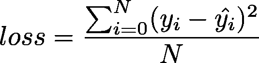

# 开始使用 TensorFlow 2.0 和线性回归

> 原文：<https://towardsdatascience.com/get-started-with-tensorflow-2-0-and-linear-regression-29b5dbd65977?source=collection_archive---------3----------------------->

## 🤖[深度学习](https://equipintelligence.medium.com/list/deep-learning-techniques-methods-and-how-tos-01015cf5f917)

## 使用新的 TF 2.0 APIs 的线性回归模型


Photo by [Joshua Earle](https://unsplash.com/@joshuaearle?utm_source=medium&utm_medium=referral) on [Unsplash](https://unsplash.com?utm_source=medium&utm_medium=referral)

TensorFlow 2.0 是 [TensorFlow](https://medium.com/u/b1d410cb9700?source=post_page-----29b5dbd65977--------------------------------) 家族的重大突破。这是全新的和翻新的，也*不那么令人毛骨悚然*！我们将在 [TensorFlow 2.0](https://www.tensorflow.org/alpha) 中创建一个简单的[线性回归](https://ml-cheatsheet.readthedocs.io/en/latest/linear_regression.html)模型来探索一些新的变化。所以，打开你的代码编辑器，让我们开始吧！

此外，打开[本笔记本](https://colab.research.google.com/drive/1HL1HDCDhh1FiV-NckjfTYPd50K7H7wzi#scrollTo=uyKcSFJrbhRf&forceEdit=true&offline=true&sandboxMode=true)进行互动学习体验。

**注意！TensorFlow 2.0 现已在稳定频道上线！**

要查看一些基本概念及其更简单的解释，请参见，

*   [机器学习词汇表|谷歌](https://developers.google.com/machine-learning/glossary/)
*   [毫升备忘单](https://ml-cheatsheet.readthedocs.io/en/latest/index.html)

# 让我们先从数学开始。

First impressions for Calculus

我们首先会得到一些关于线性回归的信息。在线性回归中，我们倾向于为您的数据找到最佳拟合线。

该线可在其[斜率截距表](https://www.khanacademy.org/math/algebra/two-var-linear-equations/slope-intercept-form/a/introduction-to-slope-intercept-form)中定义为:


The hypothesis function

> *m* 和 *c* 分别是斜率和 y 截距。其中 *W* 和 *b* 分别是 2ⁿᵈ方程的权重和偏差。

为了优化我们的参数 w 和 b，我们需要一个损失函数。这就是[均方误差(L1 / MSE )](https://ml-cheatsheet.readthedocs.io/en/latest/loss_functions.html#mse-l2) 出现的原因。



Mean Squared Error

> 其中 *N* 是批次/数据集中的样本数， *y* 是预测结果，而 *y⁻ ( y-hat )* 是目标结果。

此外，我们需要均方误差函数的导数，如下所示:


The derivative of the Mean Squared Error function

> 其中 *N* 是批次/数据集中的样本数，y 是预测结果，而 *y⁻ ( y-hat )* 是目标结果。

现在，进入[梯度下降](https://ml-cheatsheet.readthedocs.io/en/latest/gradient_descent.html)，通过它我们将更新我们的参数θ。


Gradient Descent update rule

> 其中 *θ* 是我们的参数， *α* 是学习率或步长，*损失*是我们的损失函数。

我们通过获得 w 和 b 相对于损失函数(MSE)的[偏导数](https://www.khanacademy.org/math/multivariable-calculus/multivariable-derivatives/partial-derivative-and-gradient-articles/a/introduction-to-partial-derivatives)来优化 w 和 b。


Partial derivatives w.r.t loss function

> 其中 *w* 和 *b* 是优化的参数， *h* 是假设函数， *loss* 是损失函数，*MSE’*是均方误差损失函数的导数。

# 钻研代码。获取一些数据！

TensorFlow 2.0!

我们将使用 Kaggle.com 大学研究生招生的数据。它包含 6 个连续特征和 1 个二元特征，总共有 7 个特征。标签或预期结果是学生的入学机会。这是我们的目标变量。

我们将下载数据集并将其解析成我们真正喜欢的东西——训练和验证数据集！

# 在 TF 2.0 中创建模型

我们使用 TensorFlow 的低级 API 定义了 3 种方法，用于:

1.  *均方误差函数*
2.  *均方误差函数的导数*
3.  *假设函数/回归函数*

我们之前在原始数学中讨论过。

然后，我们初始化一些用于训练的超参数，并创建`[tf.data.Dataset](https://www.tensorflow.org/versions/r2.0/api_docs/python/tf/data/Dataset)`对象来高效地存储和批处理我们的数据。

> **注意到一个 TF 2.0 的变化？对于 TF 1.x 的早期版本，我们使用了`tf.data.Dataset.make_one_shot_iterator()`方法来创建迭代器。这已经改变了，现在我们用`[tf.data.Dataset.__iter__()](https://www.tensorflow.org/versions/r2.0/api_docs/python/tf/data/Dataset#__iter__)`**

最后，我们用`batch_size`的[批量](https://developers.google.com/machine-learning/glossary/#batch_size)来训练`num_epochs`时期的模型，这使得`num_samples/batch_size`的[步长](https://developers.google.com/machine-learning/glossary/#learning_rate)。

> 变化:我们不需要通过一个`tf.Session()`对象运行 ops 和 tensors。TensorFlow 2.0 默认启用[急切执行](https://www.tensorflow.org/tutorials/eager/eager_basics)。为了得到一个`tf.Tensor`的值，我们只使用了`tf.Tensor.numpy()`方法。

此外，我们可以使用`matplotlib.pyplt`得到历元损失图，

```
import matplotlib.pyplot as pltplt.plot( epochs_plot , loss_plot ) 
plt.show()
```


现在为了评估我们模型的准确性，我们测量了平均绝对误差。

> 变化:`tf.metrics`现在返回一个 op(运算)而不是张量。不过那很好！

# 等等，还有呢！

# 仅此而已。

ope 这是对 TensorFlow 2.0 和线性回归的一个很好的介绍。谢谢大家，机器学习快乐！