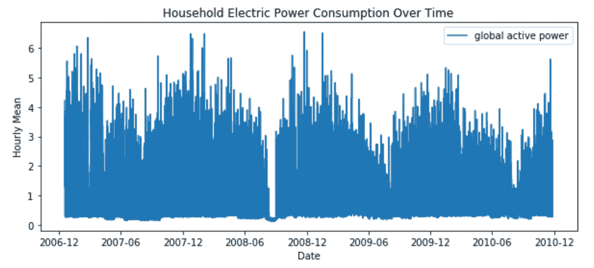
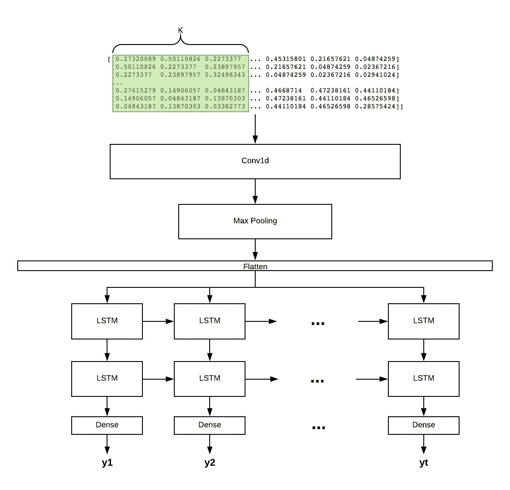

# 开始使用 CNN+LSTM 进行预测

> 原文：<https://towardsdatascience.com/get-started-with-using-cnn-lstm-for-forecasting-6f0f4dde5826?source=collection_archive---------5----------------------->

## 当您的数据粒度较低且具有循环本地模式时，应该考虑这种方法

预测趋势是一门古老的学科，但它从未失宠。无论是金融市场的股价、电力或能源消耗，还是企业规划的销售预测，一系列基于时间的数据点都可以成为世界在任何给定时刻如何思考的表征，这一直让我着迷。提前预见和反应的能力是在生活的许多方面取得成功的重要因素。

Photo from Unsplash

当数据具有明显的趋势性、季节性或自相关性时，时间序列模型非常有效。然而，现实世界的情况要复杂得多，受到多种因素的影响，包括经济现象、媒体效应、竞争对手的行为，甚至短期波动。这些因素在预测达到小时或分钟等粒度级别时尤为明显。LSTM(长短期记忆)是一种递归神经网络结构，已被用于时间序列预测。我一直在使用有状态 LSTM 进行我的自动实时预测，因为我需要模型在批次之间转移状态。最近，我发现在 LSTM 层上添加卷积层来捕捉本地的时间模式在某些情况下非常有用。在这篇文章中，我将用一个简单的例子来演示这个架构。我也强烈推荐 Jason Brownlee 的博文《时间序列的[深度学习》。这个系列我个人受益匪浅。](https://machinelearningmastery.com/category/deep-learning-time-series/)

1.  **数据**

在这个演示中，我使用了来自 UCI 机器学习知识库的[个人家庭电力消耗数据](https://archive.ics.uci.edu/ml/machine-learning-databases/00235/)。我花了几个小时重新采集数据。在这篇文章中，我将重点放在全局活跃功率属性上，忽略其他变量。数据如下所示:

**2。问题陈述**

在这个问题中，我想使用前一天的 24 小时功耗来生成第二天的 24 小时数。数据是从 2006/12 年到 2010/12 年。我用前两年的数据作为训练，后两年的数据作为验证。所以本质上这是一个序列到序列的预测问题。

**3。模型架构**

我使用了一个 1D 卷积层，然后是一个最大池层，输出是平坦的，然后馈入 LSTM 层。该模型有两个隐藏的 LSTM 图层，后跟一个密集图层来提供输出。

CNN-LSTM structure

首先对数据进行整形和缩放，以符合 Keras 序列模型的三维输入要求。对于简单的单变量模型，输入形状将是具有 1 个特征的 24 个时间步长。在卷积层中，我没有进一步将序列分成多个子序列，而是将时间步长保持为 24。我选择内核大小为 3。致密层有 24 个神经元产生 24 个输出数。下面是详细的模型总结。

如您所见，我使用的批量输入大小为 24。这是因为，在这个问题中，这也是许多现实世界情况的情况，我想每天预测。批量大小的数目需要能被 24 整除。最后，我拟合了 20 个时期的模型，并输出损失。我用了均方误差损失函数和 Adam 优化(自适应矩估计)。

**4。最终想法**

你是否应该使用 RNN 或 CNN 或混合模型进行时间序列预测，这实际上取决于数据和你试图解决的问题。我会选择一个简单的模型，如果它符合目的并且不会有过度拟合的风险。这个例子旨在提供一个使用 CNN-LSTM 结构的简单指南。我相信这个特殊的数据可以用多元 LSTM 模型更好地拟合。

参考资料:

1.  [https://machine learning mastery . com/how-to-develop-lstm-models-for-time-series-forecasting/](https://machinelearningmastery.com/how-to-develop-lstm-models-for-time-series-forecasting/)
2.  [https://www . business-science . io/business/2018/12/04/time-series-forecasting . html](https://www.business-science.io/business/2018/12/04/time-series-forecasting.html)
3.  [https://stack overflow . com/questions/51344610/how-to-setup-1d-convolution-and-lstm-in-keras](https://stackoverflow.com/questions/51344610/how-to-setup-1d-convolution-and-lstm-in-keras)
4.  [https://jeddy 92 . github . io/jeddy 92 . github . io/ts _ seq 2 seq _ conv/](https://jeddy92.github.io/JEddy92.github.io/ts_seq2seq_conv/)
5.  [https://github . com/amirrezaeian/Individual-household-electric-power-consumption-Data-Set-/blob/master/Data _ e _ power . ipynb](https://github.com/amirrezaeian/Individual-household-electric-power-consumption-Data-Set-/blob/master/data_e_power.ipynb)