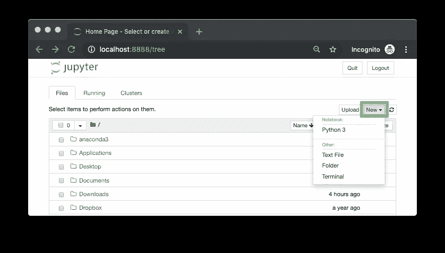
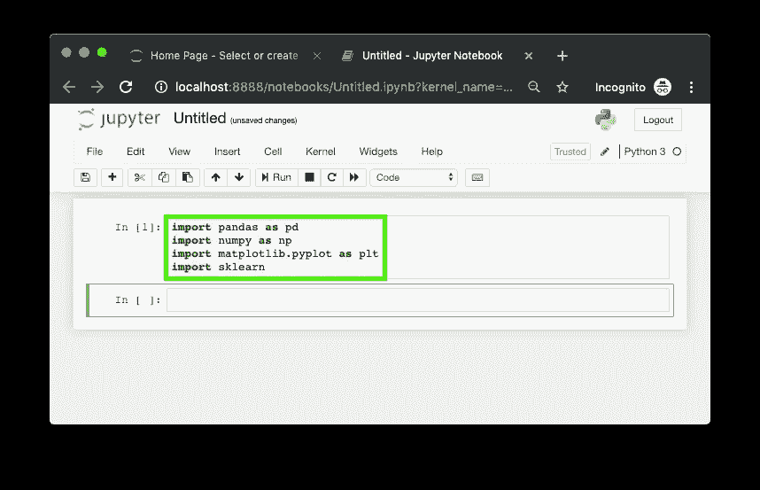

# 让你的电脑为机器学习做好准备:如何使用 Anaconda，Miniconda 和 conda，为什么要使用它们

> 原文：<https://towardsdatascience.com/get-your-computer-ready-for-machine-learning-how-what-and-why-you-should-use-anaconda-miniconda-d213444f36d6?source=collection_archive---------2----------------------->

## 蟒蛇？我们在玩什么？蛇和梯子？不。我们正在为机器学习准备我们的电脑。


This big bad beast is what we’re going to cover in this article. Check the [full interactive version here](https://dbourke.link/CHfGKB).

本文将介绍什么是 Anaconda，什么是 Minconda，什么是 conda，如果您是数据科学家或机器学习工程师，为什么应该了解它们，以及如何使用它们。

您的计算机能够运行许多不同的程序和应用程序。然而，当你想创建或编写自己的程序时，比如构建一个机器学习项目，以正确的方式设置你的计算机是很重要的。

假设您想使用一组患者记录来尝试预测谁有心脏病或没有心脏病。你需要一些工具来做这件事。

一个用于探索数据，另一个用于建立预测模型，一个用于制作图表以向他人展示您的发现，还有一个用于进行实验并将所有其他数据放在一起。

如果你在想，我甚至不知道从哪里开始，不要担心，你不是一个人。很多人都有这个问题。幸运的是，这就是 Anaconda、Miniconda 和 conda 的用武之地。

Anaconda、Miniconda 和 conda 是帮助您管理其他工具的工具。我们将很快讨论每一个的细节。让我们从它们为什么重要开始。

# 为什么 Anaconda，Miniconda，conda 很重要？


Anaconda, Miniconda and Conda help to create a shareable environment where you can conduct experiments so your colleague (or your future self) can reproduce them later.

很多机器学习和数据科学都是实验性的。你尝试了一些东西，但没有成功，然后你继续尝试其他的东西，直到有些东西成功了或者根本没有成功。

如果你自己在做这些实验，并且最终找到了有效的方法，你可能会希望能够再做一次。

如果你想分享你的作品，也是一样。无论是与同事、团队还是通过由机器学习系统支持的应用程序与世界交流。

Anaconda、Miniconda 和 conda 为您提供了共享您的实验所基于的基础的能力。

Anaconda、Miniconda 和 conda 确保如果其他人想要复制你的作品，他们会拥有和你一样的工具。

因此，无论你是独自工作，破解机器学习问题，还是与数据科学家团队合作，在互联网规模的数据集上寻找见解，Anaconda、Miniconda 和 conda 都为始终一致的体验提供了基础设施。

# 什么是蟒蛇，迷你蟒蛇，康达？

Anaconda 和 Miniconda 是软件发行版。Anaconda 提供了超过 150 个数据科学包，所有你能想到的都有，而 Miniconda 只提供了一小部分你需要的东西。

包是别人编写的一段代码，它可以运行，通常有特定的用途。您可以将包视为一种工具，用于您自己的项目。

包是有帮助的，因为没有它们，你将不得不写更多的代码来完成你需要做的事情。由于许多人都有类似的问题，你经常会发现一群人编写代码来帮助解决他们的问题，并将其作为一个包发布。

康达是一名包装经理。它通过处理安装、更新和删除来帮助你管理不同的包。


Anaconda contains all of the most common packages (tools) a data scientist needs and can be considered the hardware store of data science tools. Miniconda is more like a workbench, you can customise it with the tools you want. Conda is the assistant underlying Anaconda and Miniconda. It helps you order new tools and organise them when you need.

不止这些。还有 Pip，Pipenv 和其他人。但我们将重点放在蟒蛇，迷你康达和康达。它们足够让你开始了。

*   **Anaconda** 可以想到数据科学家五金店。它有你需要的一切。从探索数据集的工具，到为数据集建模的工具，再到将你的发现可视化的工具。每个人都可以访问五金店和里面的所有工具。
*   **Miniconda** 是数据科学家的工作台。每个工作台都是从最基本的必需品开始清洁的。但是随着项目的增长，工作台上的工具数量也在增长。它们被使用，被改变，被交换。每个工作台都可以按照数据科学家的意愿进行定制。一个数据科学家工作台可能与另一个完全不同，即使他们在同一个团队。
*   **Conda** 帮助整理所有这些工具。尽管 Anaconda 提供了许多现成的，但有时它们需要更改。康达就像盘点所有工具的助理。Miniconda 也是如此。

工具或软件包集合的另一个术语是**环境**。五金店是一个环境，每个单独的工作台是一个环境。

例如，如果您正在处理一个机器学习问题，并使用您环境中的工具(工作台)找到了一些见解，一位队友可能会要求您与他们共享您的环境，以便他们可以复制您的结果并为项目做出贡献。

# 应该使用 Anaconda 还是 Miniconda？


Downloading and installing Anaconda is the fastest way to get started with any data science or machine learning project. However, if you don’t have the disk space for all of what comes with Anaconda (a lot, including things you probably won’t use), you might want to consider Miniconda. See the [full-size interactive version of this image here](https://whimsical.com/BD751gt65nKjAD5i1CNEXU).

使用 Anaconda:

*   如果你在寻找一种适合所有人的方法，这种方法对于大多数项目来说都是现成的，那么在你的电脑上要有 3 GB 的空间。

使用 Miniconda:

*   如果您的计算机上没有 3 GB 的空间，并且希望设置只包含您需要的空间。

开始使用 Anaconda 或 Miniconda 时，您主要考虑的是计算机上的空间。

如果您选择了蟒蛇，请遵循蟒蛇的步骤。如果您选择了 Miniconda，请按照 Miniconda 的步骤操作。

```
**Note:** Both Anaconda and Miniconda come with Conda. And because Conda is a package manager, what you can accomplish with Anaconda, you can do with Miniconda. In other words, the steps in the Miniconda section (creating a custom environment with Conda) will work after you’ve gone through the Anaconda section.
```

# 使用 Anaconda 快速启动并运行数据科学项目

您可以将 Anaconda 视为数据科学工具的硬件商店。

把它下载到你的电脑上，它会带着你做很多数据科学或机器学习工作所需的工具(包)。如果它没有你需要的套餐，就像五金店一样，你可以订进来(下载)。

好消息是，遵循这些步骤并安装 Anaconda 也将安装 conda。

```
**Note:** These steps are for macOS (since that's my computer). If you're not using macOS, the concepts will be relevant but the code an images a little different.If you're on Windows, check out [this guide by Anaconda](https://docs.anaconda.com/anaconda/install/windows/).
```

**1。**进入[蟒蛇分发页面](https://www.anaconda.com/distribution/)。


What you’ll find on the Anaconda distribution page. Choose the right distribution for your machine.

**2。**为您的计算机下载合适的 Anaconda 发行版(需要一段时间，取决于您的网速)。除非您有特定的原因，否则最好下载每个版本的最新版本(最高编号)。

在我的例子中，我下载了 macOS Python 3.7 64 位图形安装程序。命令行和图形安装程序的区别在于，一个使用你能看到的应用程序，另一个需要你写代码行。为了简单起见，我们使用图形安装程序。

**3。**下载完成后，双击下载文件以完成设置步骤，一切保持默认。这将在您的计算机上安装 Anaconda。这可能需要几分钟的时间，并且您需要多达 3 GB 的可用空间。


What the installer looks like on my computer (macOS). I’m installing it on my user account.


Once the installation is complete, you can close this window and remove the Anaconda installer.

**4。若要检查安装，如果您在 Mac 上，请打开“终端”,如果您在另一台电脑上，请打开命令行。**

如果成功，您会看到`(base)`出现在您的名字旁边。这意味着我们在`base`环境中，想象这是在五金店的地板上。

要查看你刚刚安装的所有工具(包)，输入代码`conda list`并按回车键。别担心，你不会弄坏任何东西的。


Opening Terminal on a Mac and typing `conda list` and hitting enter will return all of the packages (data science tools) Anaconda installed on our computer. There should be a lot.

您应该看到的是四列。名称、版本、内部版本和频道。

**名称**是包的名称。记住，包是别人写的代码的集合。

**版本**是这个包的版本号，而**版本**是这个包的 Python 版本。现在，我们不会担心这些，但是你应该知道一些项目需要特定的版本和内部版本号。

**通道**是包来自的 Anaconda 通道，没有通道意味着默认通道。


The output of the `conda list` command. This show the name, version, build and channel of all the packages Anaconda installed.

**5。你也可以通过在命令行输入`python`并按回车键来检查它。这将显示您正在运行的 Python 版本以及 Anaconda 是否存在。**


If you downloaded and installed Anaconda, when you type `python` on the command line, you should see the word Anaconda somewhere appear. This means you're using Anaconda's Python package.

要退出 Python(T4)，键入`exit()`并按回车键。

6。我们刚刚将数据科学工具(包)的整个硬件商店下载到我们的计算机上。

现在，它们位于名为`(base)`的默认**环境**中，这是在我们安装 Anaconda 时自动创建的。环境是包或数据科学工具的集合。稍后我们将看到如何创建我们自己的环境。


The current environment (work space). In our case, this indicates we’re using the base environment. `(base)` is the default environment which gets installed automatically when installing Anaconda.

您可以通过键入`conda env list` (env 是环境的缩写)来查看您机器上的所有环境。


Running the command `conda env list` returns all of the environments you have setup on your computer. In my case, I have the environment `(base)`, which I'm in as indicated by the * and I have `env`, which is in the `project_1` folder, we'll look into this later.

好了，现在我们知道我们已经安装了 Anaconda，假设您的目标是为我们的项目做准备，用机器学习来预测心脏病。

在做了一些研究之后，您发现您需要的工具(包)是:

*   Jupyter 笔记本——用于编写 Python 代码、运行实验以及与他人交流您的工作。
*   [熊猫](https://pandas.pydata.org/)——用于探索和操纵数据。
*   [NumPy](https://numpy.org/) —用于对数据进行数值运算。
*   [Matplotlib](https://matplotlib.org/) —用于创建您的发现的可视化。
*   [sci kit-learn](https://scikit-learn.org/stable/)——也叫 sklearn，用于构建和分析机器学习模型。

如果你以前从未用过这些，不要担心。重要的是要知道，如果您按照上面的步骤安装了 Anaconda，那么这些包也已经安装了。

Anaconda 自带了许多现成的最流行和最有用的数据科学工具。上面的也不例外。

**7。为了真正测试，我们将启动一个 Jupyter 笔记本，看看上面的包是否可用。要打开 Jupyter 笔记本，请在命令行中键入`jupyter notebook`，然后按回车键。**


A command you’ll get very familiar with running during your data science career. This will automatically open up the Jupyter Notebook interface in your browser.

**8。您应该会看到 Jupyter 界面出现了。它将包含您当前目录中的所有文件。点击右上角的新建并选择 Python 3，这将创建一个新的 Jupyter 笔记本。**



Once the Jupyter Interface has loaded, you can create a new notebook by hitting the new button in the top right and clicking Python 3.

9。现在我们来试试我们需要的其他工具。

您可以通过键入命令`import pandas as pd`并按 shift+enter 来查看 pandas 是否已安装(这就是 Jupyter 单元中代码的运行方式)。

如果没有错误，感谢 Anaconda，我们现在可以使用 pandas 进行数据操作。

10。使用以下命令对 NumPy、Matplotlib 和 scikit-learn 包执行相同的操作:

*   NumPy — `import numpy as np`
*   Matplotlib — `import matplotlib.pyplot as plt`
*   scikit-learn — `import sklearn`


Installing Anaconda means we’ve also installed some of the most common data science and machine learning tools, such as, Jupyter, pandas, NumPy, Matplotlib and scikit-learn. If this cell runs without errors, you’ve successfully installed Anaconda.

## 水蟒概述

这可能看起来像是许多开始的步骤，但它们将形成你作为数据科学家或机器学习工程师前进所需的基础。

*   **为什么**——我们使用 Anaconda 访问其他人在我们之前编写的所有代码，这样我们就不用自己重写了。
*   **What** — Anaconda 提供了硬件商店价值的数据科学工具，如 Jupyter 笔记本、pandas、NumPy 等。
*   我们从网上下载了 Anaconda 到我们的电脑上，并通过一个例子展示了如何开始使用基本工具。

我们采取的步骤:

1.  从网上下载了巨蟒。
2.  在我们的电脑上安装了蟒蛇。
3.  使用`conda list`在安装终端中测试，它向我们展示了我们安装的所有包(数据科学工具)。
4.  加载了一个 Jupyter 笔记本(工具之一)。
5.  通过将 pandas、NumPy、Matplotlib 和 sklearn 导入 Jupyter 笔记本来执行最终检查。


The steps taken in this section. See the [full-size interactive version of this image here](https://whimsical.com/BD751gt65nKjAD5i1CNEXU).

# 使用 Miniconda 和 conda 创建自定义环境

使用 Anaconda，数据科学工具的整个硬件商店是一个很好的开始。但是对于长期的项目，您可能想要创建自己独特的环境(工作台),其中只有项目所需的工具，而不是所有的东西。

有几种方法可以用 Conda 创建自定义环境。对于这个例子，我们将下载 Miniconda，它只包含最少的数据科学工具。然后，我们将在项目文件夹(文件夹也称为目录)中创建一个自定义环境。

## **为什么这样？**

在每个项目开始时创建一个新的项目目录是一个好主意。然后在这个目录中，保存该项目的所有相关文件，比如数据、代码和您使用的工具。

在接下来的步骤中，我们将建立一个名为`project_1`的新项目文件夹。在这个目录中，我们将创建另一个名为`env`(环境的简称)的目录，其中包含我们需要的所有工具。

然后，在`env`目录中，我们将建立一个环境来处理与上面相同的项目，预测心脏病。所以我们需要 Jupyter 笔记本，熊猫，NumPy，Matplotlib 和 scikit-learn。

这样做可以在将来方便地与他人共享您的项目。


The typical steps you might take when starting a new machine learning project. Create a single project folder and then store all of the other relevant files, such as environment, data and notebooks within it. We’ll go through created an environment folder in this section.

```
**Note:** If you already have Anaconda, you don’t need Miniconda so you can skip step 1 and go straight to step 2\. Since Anaconda and Miniconda both come with Conda, all of the steps from step 2 onwards in this section are compatible with the previous section.
```

1.  首先，我们从 conda 文档网站下载 Miniconda。选择一个适合你的。由于我使用的是 Mac，所以我选择了 Python 3.7，64 位 pkg 版本。

下载完成后，请完成安装步骤。因为 Miniconda 不具备 Anaconda 的所有功能，所以它占用的磁盘空间要少 10 倍(2.15 GB 对 200 MB)。

当安装完成时，您可以在命令行上使用`which conda`来检查它的安装位置。


Downloading and installing Miniconda means installing Conda as well. You can check where it’s installed using `which conda` on the command line. In my case, it's stored at `/Users/daniel/miniconda3/bin/conda`.

**2。**在桌面上创建一个名为`project_1`的项目文件夹。在实践中，我们使用这个项目文件夹来完成我们所有的工作，这样就可以很容易地与他人共享。

要在桌面上创建一个名为`project_1`的文件夹，我们可以使用命令`mkdir desktop/project_1`。`mkdir`代表制作目录，`desktop/project_1`表示制作`desktop`上的`project_1`。


We’re creaitng a new project folder called project_1\. Whatever files we use for the project we’re working on will go in here. That way, if we wanted to share our work, we could easily send someone a single file.

**3。**我们将使用`cd desktop/project_1`切换到新创建的项目文件夹。`cd`代表变更目录。


It’s good practice to have separate project folders and environments for each new project. Keeping things separate prevents mixups in the future.

**4。进入项目文件夹后，下一步是在其中创建一个环境。**

该环境包含我们项目所需的所有基础代码。因此，如果我们想在以后复制我们的工作或与他人分享，我们可以确保我们未来的自己和他人有和我们一样的基础。

我们将创建另一个名为`env`的文件夹，在这个文件夹中会有所有相关的环境文件。为此，我们使用:

```
$ conda create --prefix ./env pandas numpy matplotlib scikit-learn
```

`--prefix`标签和`/env`前的`.`表示将在当前工作目录下创建`env`文件夹。在我们的例子中是`Users/daniel/desktop/project_1/`。


This line of code says, ‘Hey conda, create a folder called `env` inside the current folder and install the pandas, NumPy, Matplotlib and scikit-learn packages.' New Conda environments come with a few tools to get started but most of the time, you'll have to install what you're after.

运行上面的代码行后，会询问您是否要继续。按下`y`。

当代码完成时，现在在`project_1`文件夹中会有一个名为`env`的文件夹。使用`ls`可以看到一个目录中所有文件的列表，它是 list 的缩写。


We’ve now created a `project_1` folder and an `env` folder. The `project_1` folder will contain all of our project files such as data, Jupyter Notebooks and anything else we need. The `env` folder will contain all of the data science and machine learning tools we'll be using.

**5。**环境设置完成后，终端窗口中的输出会告诉我们如何激活新环境。

我的情况是`conda activate Users/daniel/desktop/project_1`。您可能想在某个地方写下这个命令。


Once an environment is created, it can be activated via `conda activate [ENV]` where `[ENV]` is the environment you want to activate.

这是因为我已经在`project_1`文件夹中的`desktop`上创建了`env`文件夹。

运行上面的代码行激活我们的新环境。激活新环境会将`(base)`更改为`(Users/daniel/desktop/project_1)`，因为这是新环境所在的位置。


When an environment is active, you’ll see its name in brackets next to your command prompt. Activating an environment gives you access to all of the tools stored in it.

**6。**现在我们的环境已经激活，我们应该可以访问上面安装的包了。让我们看看是否可以像上一节那样启动一个 Jupyter 笔记本。

为此，我们在命令行上运行命令`jupyter notebook`，激活新环境。


When we created our `env` folder, we forgot to install the `jupyter` package. This means we can't run the `jupyter notebook` command. Not to worry, Conda makes it easy to install new packages with `conda install`.

**7。糟糕…我们忘记安装 Jupyter 了。这是第一次设置新环境时的常见错误。但还是有办法解决的。例如从模板(或 YAML 文件)设置环境。我们将在扩展部分看到如何做到这一点。**

要安装 Jupyter 包和使用 Jupyter 笔记本，可以使用`conda install jupyter`。

这类似于我们之前运行来设置环境的内容，除了现在我们关注一个包，`jupyter`。

这就像说，‘嘿，康达，把`jupyter`包安装到当前环境中’。


If your environment is missing a package, you can install it using `conda install [PACKAGE]` where `[PACKAGE]` is your desired package.

运行此命令将再次询问您是否要继续。按下`y`。然后 Conda 会将`jupyter`包安装到您激活的环境中。在我们的例子中，它是`project_1`中的`env`文件夹。

**8。现在我们已经安装了 Jupyter，让我们再次尝试打开笔记本。我们可以使用`jupyter notebook`来实现。**


We’ve just installed the `jupyter` package into our environment, so now we'll able to run the `jupyter notebook` command.

9。漂亮，Jupyter 界面加载完毕，我们可以通过点击新建并选择 Python 3 来创建一个新的笔记本。


The Jupyter Interface shows you the files and folders in your current directory. In this case, you should be able to see the `env` folder you made. And since we're in the `project_1` folder, any new files you create with the *New* button will be stored within the `project_1` folder.

然后为了测试我们的其他工具 pandas、NumPy、Matploblib 和 scikit-learn 的安装，我们可以在第一个单元格中输入下面几行代码，然后按 shift+enter。

```
import pandas as pd
import numpy as np
import matplotlib.pyplot as plt
import sklearn
```



We can check if our environment has successfully installed the tools we’re after by trying to import them in our Jupyter Notebook.

10。若要停止 Jupyter 笔记本的运行，请在运行它的终端窗口中按 control+c。当它询问您是否要继续时，按下`y`。


When you want to close your Jupyter Notebook, be sure to save it before stopping it running within the terminal.

11。要退出您的环境，您可以使用`conda deactivate`。这将带您回到`(base)`环境。


Deactivating your current environment allows you to activate another environment or perform any changes using Conda outside of your environment.

12。要回到您的环境，运行您之前写下的`conda activate [ENV_NAME]`命令，其中`[ENV_NAME]`是您的环境。

然后，要重新访问 Jupyter 笔记本，运行`jupyter notebook`命令。这将加载 Jupyter 接口。

在我的例子中，代码如下所示:

```
(base) Daniels-MBP:~ daniel$ conda activate \ /Users/daniel/Desktop/project_1/env
(/Users/daniel/Desktop/project_1/env) Daniels-MBP:~ daniel$ jupyter notebook
```


When you want to resume work on a previous project, the practice is to reactivate the environment you were using and then continue working there. This ensures everything you do is contained in the same place.

## Miniconda 概要

这看起来有很多步骤，事实也的确如此。但是了解这些技能很重要。

确保你有一个良好的基础工作环境将有助于在未来节省大量时间。

想象一下在你的工具棚里工作，但是所有的东西都被放错了地方。你可能知道东西在哪里，但是一旦有人来帮忙，他们就会花几个小时去找合适的工具。相反，现在他们有了一个工作环境。

*   **为什么** —当我们不需要 Anaconda 提供的所有东西时，我们使用 Miniconda，并创建我们自己的定制环境，以便与他人共享。
*   **什么** — Minconda 是 Anaconda 的缩小版，conda 是一个完全可定制的包管理器，我们可以用它来创建和管理环境。
*   **如何做** —我们从网上下载了 Miniconda 到我们的电脑上，里面有 conda。然后我们使用 Conda 为`project_1` *创建了自己的定制环境。*

我们设置定制 Conda 环境的步骤(这些步骤也适用于 Anaconda):

1.  从网上下载了迷你康达。
2.  在我们的电脑上安装了迷你康达。
3.  使用`mkdir project_1`在桌面上创建一个名为`project_1`的项目文件夹，然后使用`cd project_1`将其改变。
4.  使用`conda create --prefix ./env pandas numpy matplotlib scikit-learn`创建一个名为`env`的环境文件夹，其中包含 pandas、NumPy、Matplotlib 和 scikit-learn。
5.  使用`conda activate /Users/daniel/Desktop/project_1/env`激活我们的环境
6.  尝试使用`jupyter notebook`加载 Jupyter 笔记本，但是没有成功，因为我们没有这个包。
7.  使用`conda install jupyter`安装 Jupyter。
8.  使用`jupyter notebook`启动了一个 Jupyter 笔记本，并通过将 pandas、NumPy、Matplotlib 和 sklearn 导入到 Jupyter 笔记本中来执行最终检查。


Steps we took in this section, downloading, installing and setting up Miniconda. Then we created a project folder as well as a custom environment for our machine learning project. See the [full-size interactive version of this image here](https://whimsical.com/BD751gt65nKjAD5i1CNEXU).

# 康达摘要

重要的是要记住，Anaconda 和 Miniconda 都是 conda 自带的。所以不管你下载哪一个，你都可以对每一个执行相同的步骤。

其中 Anaconda 是数据科学工具的硬件商店，Miniconda 是工作台(软件分发)，conda 是助手(包管理器)，帮助您获得新工具和定制您的硬件商店或工作台。

以下是一些你需要记住的有用的 Conda 命令。

# 扩展:将 Conda 环境导出为 YAML 文件

如果您已经完成了上述所有工作，那么下一步您将想去的地方是如何将您的环境共享为 YAML 文件。YAML 文件是一种常见的文件类型，可以方便地共享和使用。

要将我们之前在`/Users/daniel/Desktop/project_1/env`创建的环境导出为名为`environment.yaml`的 YAML 文件，我们可以使用命令:

```
$ conda env export --prefix /Users/daniel/Desktop/project_1/env > environment.yaml
```


Exporting your environment to a YAML file is another way of sharing it. You might do it this way if sharing everything in the `project_1` folder wasn't an option.

运行 export 命令后，我们可以看到新的 YAML 文件存储为`environment.yaml`。

一个示例 YAML 文件可能如下所示:

```
name: my_ml_env
dependencies:
  - numpy
  - pandas
  - scikit-learn
  - jupyter
  - matplotlib
```

实际的 YAML 文件会因环境名称和环境内容的不同而有所不同。

将环境导出为 YAML 文件后，您可能希望与队友共享该文件，以便他们可以重新创建您工作的环境。他们可能会运行下面的命令，使用您发送给他们的`environment.yaml`文件来创建`env2`。

```
$ conda env create --file environment.yaml --name env2
```


Creating `env2` like this ensures it will have all of the same tools and packages available within `env`. Which means your teammate will have access to the same tools as you.

一旦`env2`被创建，你的队友将能够通过使用`conda activate env2`激活它来访问其中的工具。


Since `env2` has all the same packages and dependencies as `env`, activating it will mean you'll have access to the same tools as before.

# 资源

对于 Anaconda、Miniconda 和 conda，您还可以做更多的事情，本文只是触及了皮毛。但是我们在这里介绍的内容已经足够开始了。

如果你想了解更多，我建议[查阅文档](https://docs.conda.io/projects/conda/en/latest/user-guide/overview.html)。通读它帮助我写了这篇文章。

如果你一开始不明白某件事，不要担心，试一试，看看是否可行，如果不行，再试一次。

为帮助我理解蟒蛇、迷你蟒蛇和康达，向下面的人大声呼喊。

*   [用 Conda 拯救环境(以及如何让别人运行你的程序)](https://kiwidamien.github.io/save-the-environment-with-conda-and-how-to-let-others-run-your-programs.html)作者 Sébastien Eustace。
*   [向(数据)科学家介绍 Conda](https://kaust-vislab.github.io/introduction-to-conda-for-data-scientists/)
*   整个 Anaconda 团队和他们惊人的文档