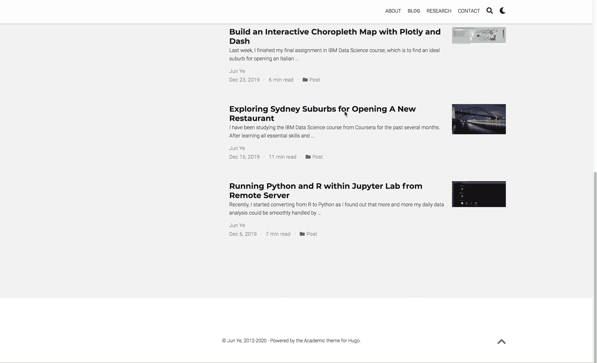
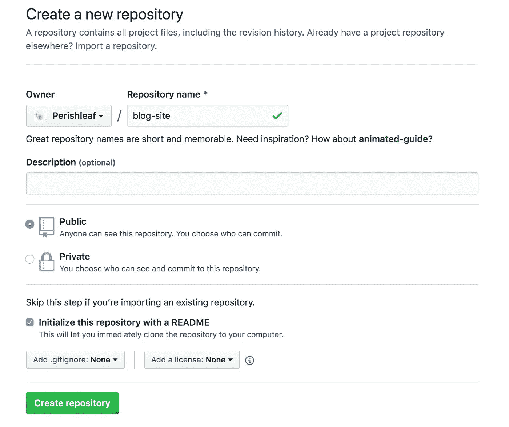
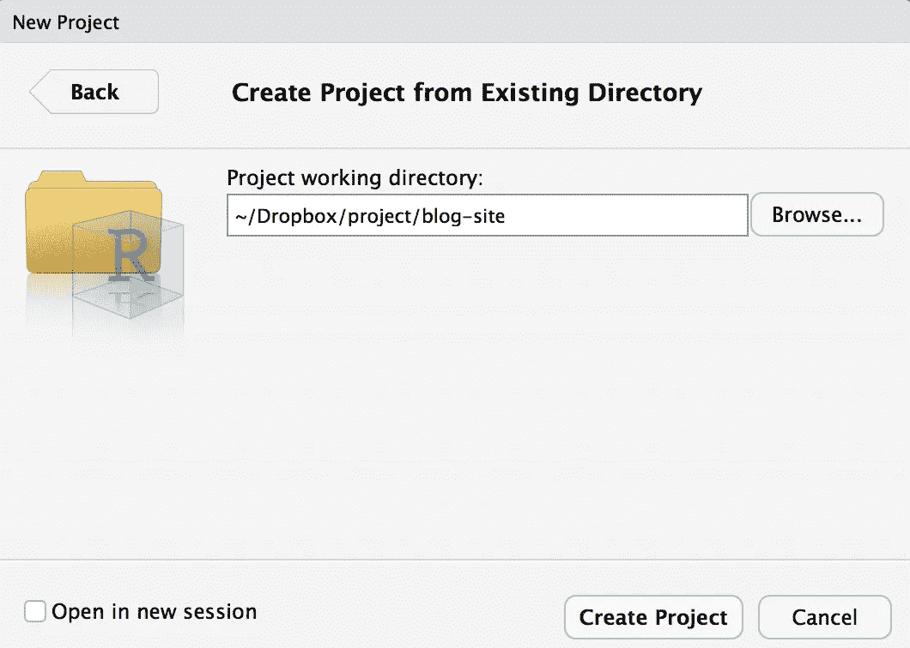
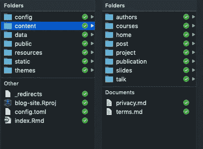
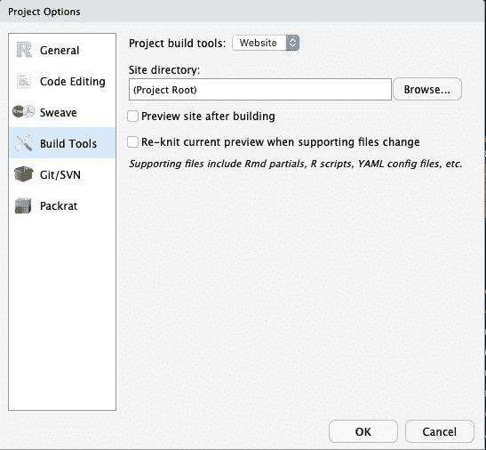
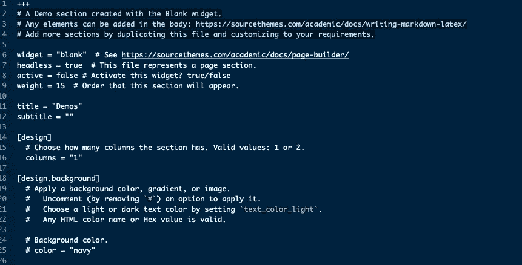
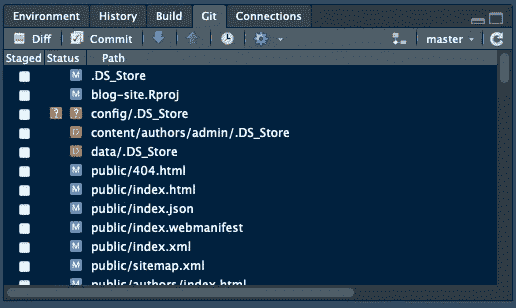
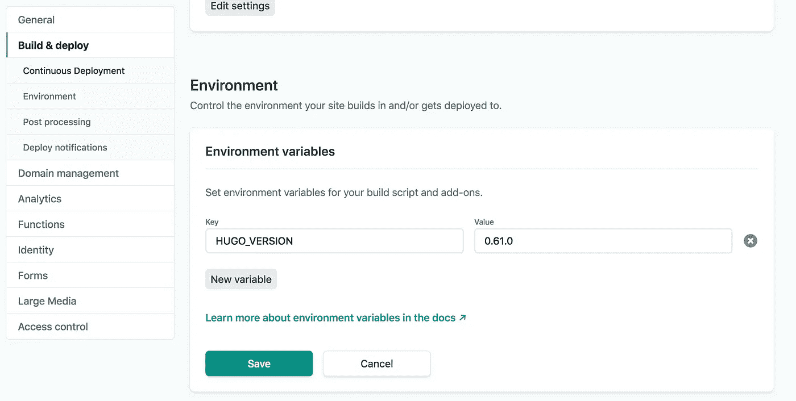
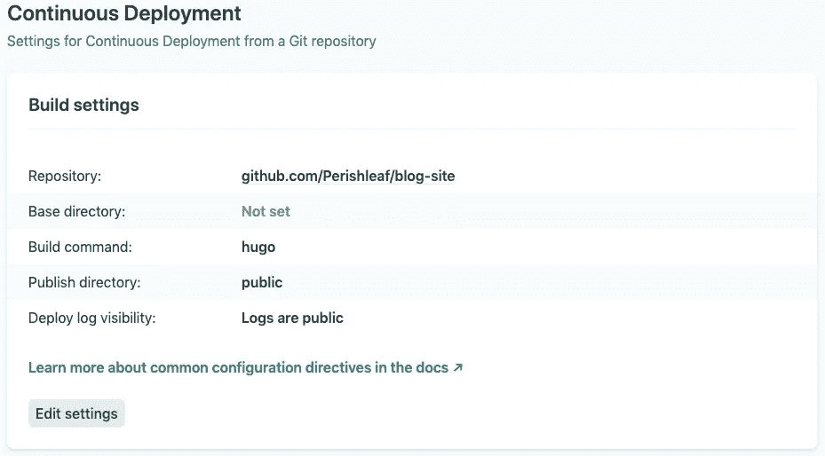
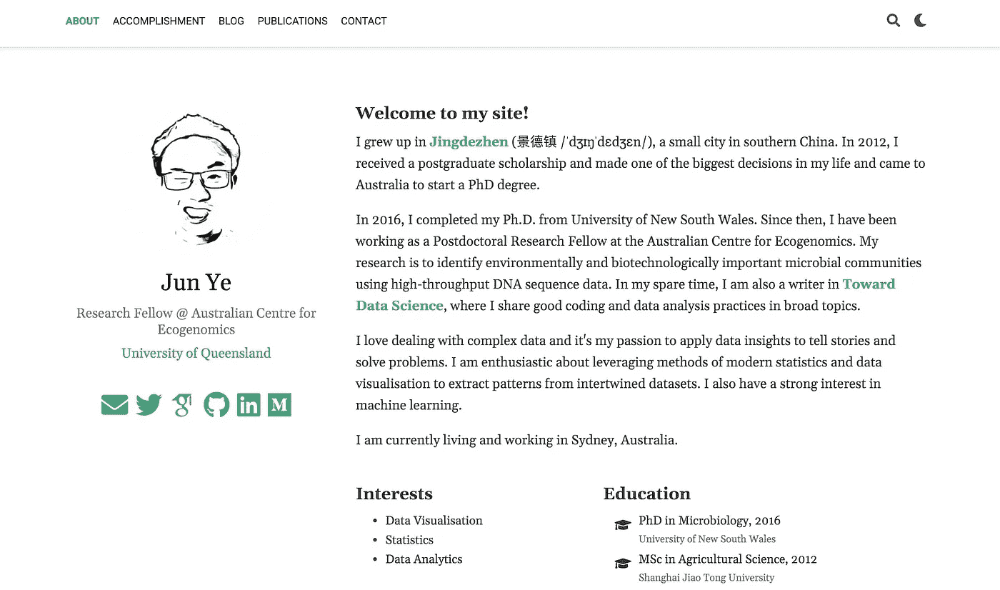

# 用四个步骤让你自己的网站上线

> 原文：<https://towardsdatascience.com/get-your-own-website-online-in-four-steps-adef65abe8bd?source=collection_archive---------16----------------------->



## 使用 R Blogdown 的简单指南

我喜欢收集设计精美或主题有趣的博客网站。吸引我的不仅是网站本身，还有建网站的人。我很佩服他们花时间设计自己的网站，不断发布内容。我总是想象如果有一天我能为自己建一个博客网站该有多好。然而，我总是害怕 HTML、CSS、PHP 和 JavaScript 这些复杂的知识。最近，我重访了 [Yihui Xie](https://yihui.org/) 的一篇博客，他是 RStudio 的一名活跃的软件工程师，也是许多流行 R 包的作者，包括我们在这篇文章中将要介绍的一个包`blogdown`。我被他的一句话深深打动了，这句话是他从[卡洛斯·沙伊德格](https://cscheid.net)中提炼出来的。

> “我网，故我在”

我对这个短语的理解有两个文件夹:1)拥有你的个人网站使你跟踪你做了什么和想了什么，因为你网站上的所有内容都在你自己的控制之下。2)最重要的是，这在很大程度上扩大了人们了解你的机会。你可以更有效地向未来的雇主展示你的工作。这对寻找[科技相关工作](/how-to-get-hired-as-an-entry-level-data-scientist-when-you-dont-already-have-3-years-experience-476394f2cc2c)的人非常有帮助。综合来看，我认为是时候把我的长期想象变成现实了。

在这篇文章中，我将分享我在使用`blogdown`创建[我的个人网站](https://junye0798.com/#resume)时的笔记，这是一个用来显著简化从创建网站到更新网站的整个过程的工具。这篇文章主要由四部分组成:

**在**[**Github**](https://github.com/)**→在**[**RStudio**](https://rstudio.com/)**→使用**[**Netlify**](https://www.netlify.com/)**→自定义域名**

## **在 Github 上创建新的回购**

由于 [Netlify](https://www.netlify.com/) (一种静态网站服务)将通过 github 源代码库自动呈现您的网站，我们需要首先为您的 github 帐户创建一个新的库来托管您网站的所有源文件。



Create a public repository for your website

之后，让我们在您的机器上创建这个存储库的本地版本。这叫做克隆。为此，单击存储库站点中的绿色“克隆或下载”按钮，然后单击复制图标将存储库 URL(使用 SSH 克隆)复制到剪贴板缓冲区。然后，返回到终端(我使用的是 Mac)，并导航到您希望存储库的本地版本所在的目录。在终端中运行以下命令:

```
git clone <repository_URL>
```

您应该会看到一个带有您的存储库名称的新文件夹出现。因此，在我的例子中，我应该看到在输入`ls`后出现**博客站点**。为了能够从您的机器上与 GitHub 通信，我假设您已经配置了 ssh 密钥并将其添加到您的 Github 帐户中。如果你以前从未使用过`git`，这里的是一个关于如何建立仓库并克隆它的详细教程。

## 在 RStudio 中建立一个网站

现在，让我们切换到 R studio(R 的免费 IDE)。我们需要安装`blogdown`包，然后安装`hugo`(开源静态站点生成器)。

```
## Install from CRAN
install.packages("blogdown")
## Or, install from GitHub
if (!requireNamespace("devtools")) install.packages("devtools")
devtools::install_github("rstudio/blogdown")blogdown::**install_hugo**()
```

然后，让我们在 RStudio 中为您的网站创建一个新项目。选择`File` > `New Project` > `Existing Directory`，然后浏览到 GitHub 库所在的目录，点击**创建项目**按钮。



Create a R project in RStudio

RStudio 将使用这个新创建的项目打开一个新会话。我们现在需要编辑`.gitignore`文件。您可以在 RStudio 的文件查看器面板中找到它(通常位于右下面板，`Files`选项卡)。单击该文件，在 RStudio 中打开它，并按如下方式编辑内容:

```
.Rproj.user
.Rhistory
.RData
.Ruserdata
blogdown
.DS_Store # if a windows user. Thumbs.db instead
public/ # if using Netlify
```

一切就绪后，我们就可以开始使用`blogdown::new_site()`函数来构建我们的网站了(只需在 R 控制台中简单地键入这个即可)。然而，正如这里的详细说明[所建议的那样](https://bookdown.org/yihui/blogdown/workflow.html)，我们最好现在就决定主题，而不是以后。而且，我们最好从一个简单的主题开始，而不是复杂的，尤其是当你不熟悉 HTML，CSS，或者 JavaScript，没有 Hugo 主题或者模板的经验的时候。我选择了[学术](https://themes.gohugo.io/academic/)主题，因为它处于主动维护中，并且非常灵活地进行定制。只需键入:

```
blogdown::new_site(theme = "gcushen/hugo-academic", theme_example = TRUE)
```

您会发现示例网站出现在 RStudio 的`Viewer`选项卡中，并且会在 **blog-site** 文件夹中自动创建几个文件夹。这些都是网站运行的文件。



New folders will be created automatically

接下来，我们需要根据这里的[建议](https://bookdown.org/yihui/blogdown/rstudio-ide.html#fig:project-options)更新项目选项。`Tools` > `Project Options`。基本上，取消选中这两个框。



Updating project options

现在是时候把样本网站变成我们自己的了，按照[这里](https://bookdown.org/yihui/blogdown/configuration.html)的指示编辑配置。如果你使用的是学术主题，一个快速定制样本网站的方法是进入`blog-site` > `content` > `home`文件夹，所有内容都存储在`content`子目录下的 markdown ( `md`)文件中。目录结构反映了站点结构。从那里，有不同部件(即网站上显示的部分)的配置文件。我们可以根据您自己的目的通过将`active`值更改为`false`来关闭它们。美化网站和给每个部分添加相应的内容是非常耗时的，为了能够现在在线启动我们的新网站，你可以只让`about.md`处于活动状态，这意味着你现在只需要为`about`页面填充内容。一旦这些部分的内容准备好了，我们就可以打开其他小部件。



Markdown file for demo section

## 使用 Netlify 部署网站

当`about`页面一切正常时，我们可以提交更改并将存储库从您的机器推送到 GitHub，然后联机到 [Netlify](https://www.netlify.com/) 。



Git tab in RStudio

从 RStudio 中选择`Git`选项卡，然后选择`Commit`。从那里，选择所有已更改的文件，并在`Commit message`窗口中写下一些消息以保留记录，例如，“关于页面的第一次更改”。然后点击`Commit`和`Push`。现在，GitHub 中的存储库已经更新。

我们需要向 Netlify 注册，使用您的 GitHub 帐户免费使用其服务。登录后，选择`New site from Git -> Continuous Deployment: GitHub`，从这里选择包含网站文件的 GitHub 库。然后我们需要配置构建。记得为你用来创建网站的 hugo 版本创建一个新的变量。在终端中输入`hugo version`。我的`hugo`版本是 0.61.0，所以这是我输入的。



HUGO_VERSION setting page



Build setting page

完成所有这些设置后，Netlify 将在几秒钟内部署网站，并为其分配一个随机的子域名。这是我网站的域名，`[objective-wright-b68557.netlify.com](https://objective-wright-b68557.netlify.com/)`。你可以随意更改域名，但需要以`netlify.com`结尾。现在，我们在网上有了自己的网站。



My first website

## **自定义域名**

如果你的域名是“yourname.com ”,而不是隶属于其他域名，你肯定会看起来像个极客。因此，我更进一步，花了大约 20 美元从一家 DNS 提供商那里购买了我自己的域名([*【junye0798.com】*](https://junye0798.com/))。这使我能够拥有两年的域名。为了保持中立，我不打算在这里为 DNS 提供商提出建议。你会很容易找到一个好的。然后我在 Netlify 中更新了我自己的域名信息，按照它的指示[这里](https://docs.netlify.com/domains-https/custom-domains/#definitions)。如果你想了解更多关于域名注册的知识，请阅读谢一辉的文章[部分](https://bookdown.org/yihui/blogdown/domain-name.html)，你会被说服拥有自己的域名。

以下是我用来建立网站的一些好资源:

*   [上&下](https://alison.rbind.io/post/2017-06-12-up-and-running-with-blogdown/#)运行
*   [blogdown:用 R Markdown 创建网站](https://bookdown.org/yihui/blogdown/)
*   [页面生成器入门](https://sourcethemes.com/academic/zh/docs/page-builder/#icons)

和往常一样，我欢迎反馈、建设性的批评以及倾听您的数据科学项目。我可以在 Linkedin[Linkedin](https://www.linkedin.com/in/jun-ye-29aaa769/)上找到我，现在也可以在我的网站[上找到我。](https://junye0798.com/)