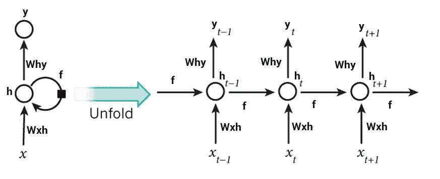
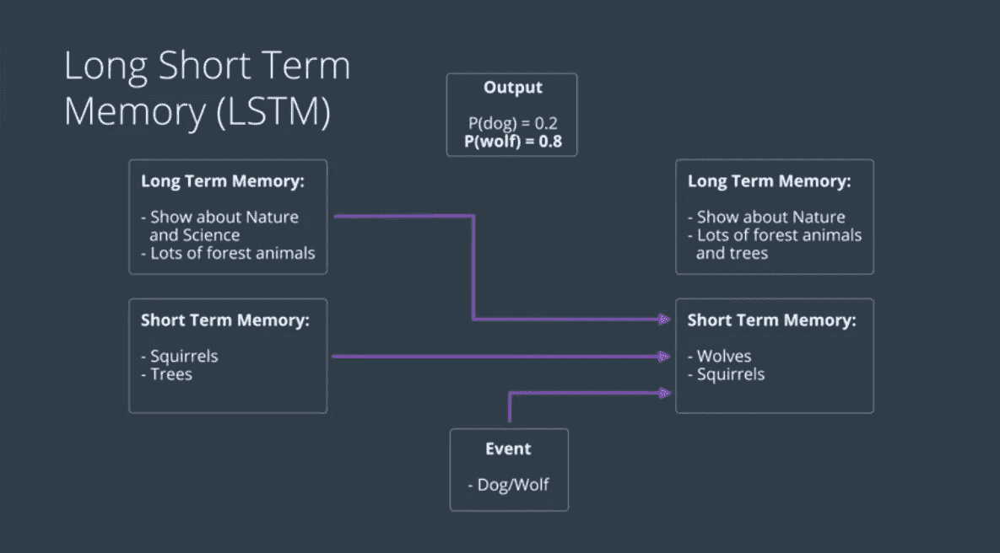
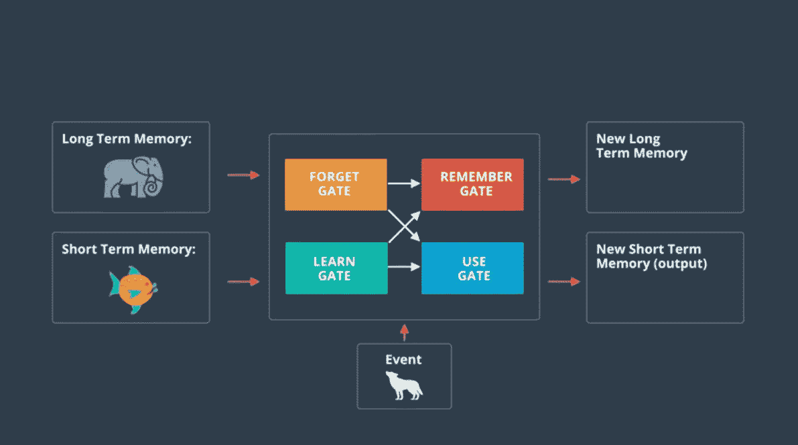

# 让一台机器帮我做英语作业

> 原文：<https://towardsdatascience.com/getting-a-machine-to-do-my-english-homework-for-me-5d339470fe42?source=collection_archive---------6----------------------->

## 使用递归神经网络生成文本

Photo by [Sharon McCutcheon](https://unsplash.com/@sharonmccutcheon?utm_source=medium&utm_medium=referral) on [Unsplash](https://unsplash.com?utm_source=medium&utm_medium=referral)

我一直不喜欢高中英语课。

可能是作业总是超级主观的事实吧。也许是因为我们被迫读的书又长又无聊。也许是因为莎士比亚是用另一种语言写的。

或者也许我只是不擅长写论文。😢

因为我真的不喜欢英语课，所以最终发生的事情是，我不再注意我的老师在说什么，我不读我们应该读的书。结果，我在作业和考试中得了一个糟糕的分数，我的分数下降了。

所以现在我需要挽回我的平均水平，我能做的两件事是:

*   上课专心听讲，做老师布置的工作
*   想办法让我摆脱用人工智能写无聊的文章

此时，第二种选择听起来更酷。

# 递归神经网络

我以前学过一点关于神经网络的知识，你可以看看我关于卷积神经网络用于图像识别的文章，或者我关于应用 CNN 对皮肤病变进行分类的文章。无论如何，神经网络一直在努力解决的一个问题是顺序数据和时间数据。**传统的神经网络需要有固定的输入输出大小。**

这就像如果你有一个人从楼梯上摔下来的视频，你想训练一个神经网络来对视频中发生的事情进行分类。一个常规的神经网络可能能够判断出这个人在视频的第一帧是站着的。然后，它可能会查看中间的帧，直到它看到视频的最后一帧，它看到一个人摔倒了。但是一旦到了那里，它就忘记了这个人一开始是不是站着的。

Ouch

由于它们的工作方式，递归神经网络将有助于解决这类问题。从更高的层面来看，rnn 通过相互循环来工作。神经网络进行前向传递，然后在第二次前向传递时，它从第一次迭代中获取一些信息，以获得更多的上下文来进行第二次预测。

A diagram showing an “unfolded” RNN with information being transferred between iterations.

从一开始，信息就可以在整个网络中传递。现在我们的网络可以了解是否有人*实际上*从楼梯上摔了下来！

# 递归神经网络的类型

正如我之前提到的，rnn 很酷，因为它们不需要固定的输入或输出，它们可以接受输入并产生序列的输出。

Different types of Recurrent Neural Networks from Andrej Karpathy’s [blog post](http://karpathy.github.io/2015/05/21/rnn-effectiveness/).

1.  **一对一:**这基本上是一个常规的神经网络。它接受固定的输入并提供固定的输出。
2.  **一对多:**这种 RNN 接受一个输入，提供多个输出。你可以做的是将第一个输出反馈到神经网络，以生成另一个输出，将结果反馈到神经网络，等等。**这被称为对神经网络进行采样，通过这样做，你可以生成全新的序列。**
3.  **多对一:**接收多个输入并给出单个输出的 RNN。这用于像*情绪分析*这样的应用，你给神经网络提供一段文本，并从中预测情绪或情绪。输出序列可以是句子中的单词，输出可以是神经网络对情感的预测。
4.  **多对多:**这种类型的 RNN 接收多个输入序列并产生多个输出。实际上有两种类型的多对多 rnn。**当两个序列不一定长度相同时，使用第一种类型。**对于诸如机器翻译的应用，输入可以是英语或任何其他语言的句子，输出可以是法语或其他语言的句子。在这种情况下，输入和输出的字数可以不同，这使得这种多对多网络非常有用。**当输入和输出同步时使用第二种类型。**如果我们要标记视频的每一帧，我们可以输入一帧，输出一个标签，然后继续处理视频的其余部分。

# 递归神经网络的问题

到目前为止，rnn 看起来很完美，对吧？我们使用这种新型网络对数据序列进行操作，其方式比我们使用传统网络要好得多。但是 RNNs 的一个问题是消失/爆炸梯度问题。

Representation of the vanishing gradient problem from Anish Singh Walia’s [article](https://medium.com/@anishsingh20/the-vanishing-gradient-problem-48ae7f501257).

当你使用反向传播更新你的模型并计算损耗的梯度时(你的模型是多么的错误)，梯度会越来越小。**这基本上意味着网络的层数越多，训练的效率就越低。**爆炸梯度基本上是相反的，如果梯度非常大，它会像雪崩一样反向传播，并且由于 rnn 经过许多序列和迭代，所以存在消失/爆炸梯度的问题。

## 长短期记忆

这个问题的一个解决方案是使用 LSTMs，即长短期存储单元。它包含一系列数学公式，帮助 RNNs 解决消失梯度问题，并使预测更加准确。当使用 LSTM 时，想象有四种信息:长期记忆、短期记忆、事件和输出。**LSTM 单元基于事件提供输出，并在进行预测时考虑长期记忆和短期记忆。**

A diagram showing an example of how information might be updated in an LSTM cell. [Source](https://www.udacity.com/course/deep-learning-pytorch--ud188).

从概念上讲，LSTM 包含四个门:遗忘门、学习门、记忆门和使用门。长期记忆进入*遗忘门*，不需要的信息被遗忘，短期记忆和事件进入*学习门*，有用的信息被保留。LTM、STM 和事件在*记忆门*中连接，然后存储在更新的 LTM 中，这三条信息也传递到*使用门*，在那里进行预测(STM)。

A diagram showing the structure and arrangement of gates in an LSTM cell. [Source](https://www.udacity.com/course/deep-learning-pytorch--ud188).

当然，这都是超级简化的。但是主要的收获应该是 LSTMs 在与 rnn 一起工作时非常有用。

# 用递归神经网络生成论文

现在我们对 RNNs 的工作原理有了基本的了解，让我们回到最初的问题:我如何摆脱做英语作业？

实现这一点的一种方法是利用一对多 RNN。我们可以在一堆不同的文章上训练神经网络，并对模型进行采样，以生成我们从未见过的新文章！

让我们使用 Keras，一个开发深度学习模型的高级 API。这遵循了 Keras Github repo 中使用 LSTMs 生成文本的示例代码。

我们将从导入所有必要的库和模块开始。

任何文本语料库都可以，但对于我的项目，我将使用尼采的著作。我们将导入文本文件，进行一些预处理，并对值进行矢量化。

现在是实际模型的时候了。它由一个 LSTM 组成，并使用 Adam 优化器。

现在定义两个函数，sample:这是一个帮助函数，用于从概率数组中对索引进行采样，on_epoch_end:这是一个函数，在每个 epoch 结束时调用，并打印模型生成的文本。

我们快到了！最后，我们将编写回调函数，在回调函数中我们将看到文本输出，并使模型适合数据。

仅此而已。在我的笔记本电脑上训练所有这些花费了大约三个小时，你也可以在 Google Colab 上用 GPU 运行时训练模型。理论上，生成的文本应该在大约 30 个时代后开始听起来连贯，所以让我们看看模型的一些输出。

> “首先培养的是我们的耐心——我们的感觉，即过程的世界对敬畏是同样的形式，是综合的主宰，感觉的节奏也是同样的节奏，是一切驯服的事物，是存在的矛盾的自由的例外——这并不是说，道德和对所有道德领域的人的位置的缺乏”,排除了灵魂对善的追求，总是对他的立场具有对超的危险的恐惧”
> 
> “甚至可以把
> 仇恨的情绪，或做的行为，和一个实例有一个很好地进入灵魂中的宗教状态，压抑和相应，可以是所有宗教的感情和意识的斗争很好地理解站在和可以满足他的主题的灵魂的行为，并依赖于宗教不是作为一种感情谁凌驾于神圣的感觉”

嗯……肯定不惊艳。但这一切都是由神经网络生成的，这难道不酷吗？毫无疑问，有了更好的架构和更广泛的数据，您可能会得到与人类所写的难以区分的结果。

尽管我可能还不能让一个神经网络为我写出我的英语论文，但我认为只要多做一点试验和测试，我就能至少在我的作业的*部分*中作弊。

# 一些关键要点

在我看来，自然语言处理目前正在取得一些令人敬畏的突破，并且摆弄文本生成实际上非常有趣。但是如果有什么要点你应该记住的话，下面就是:

1.  递归神经网络不同于传统神经网络，因为它们能够保留来自先前迭代的数据，以进行更好的预测。
2.  有许多不同类型的 rnn——包括一对一、一对多、多对一和多对多——每一种都适合特定的任务。
3.  长短期记忆(LSTM)门用于解决 RNNs 中的消失梯度问题，也用于连接神经网络中的长期信息。

感谢阅读！如果您喜欢，请:

*   在 LinkedIn 上添加我，关注我的媒体，了解我的旅程
*   留下一些反馈或者给我发邮件(alex@alexyu.ca)
*   与你的网络分享这篇文章