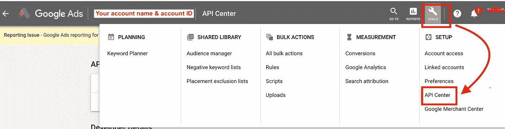
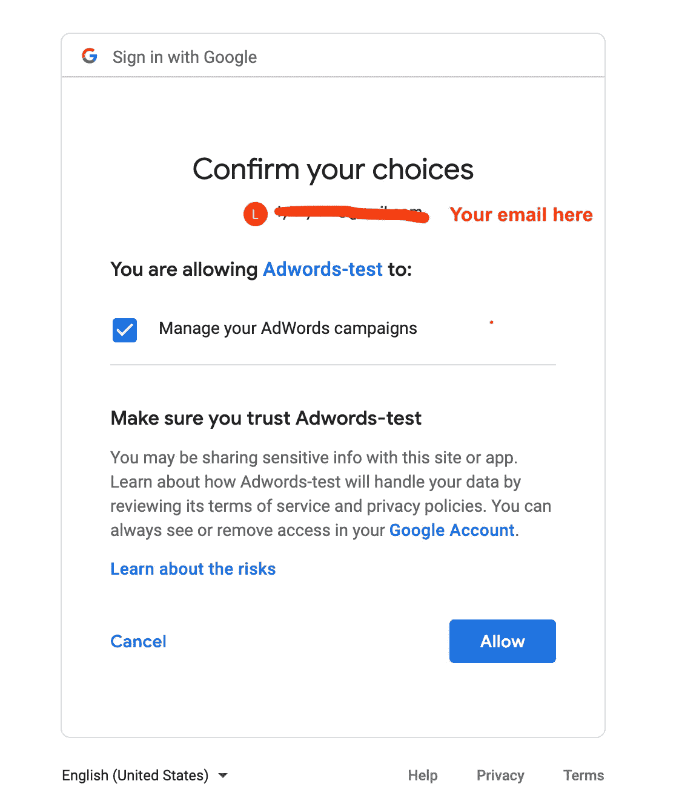

# 谷歌广告报道 Python —逐步指南

> 原文：<https://towardsdatascience.com/getting-adwords-kpis-reports-via-api-python-step-by-step-guide-245fc74d9d73?source=collection_archive---------1----------------------->

Google Adwords 的用户界面非常棒，并且会不断更新，以更加方便用户。它的用户界面功能并不总是能让你解决你的企业特有的问题。我从 SEM 团队的一个问题中受到启发，他们希望按一天中的小时来报告广告支出。

毫无疑问，每小时的广告支出报告可以通过 Adwords UI 创建，但它需要你的团队额外的资源来提取原始数据并生成报告，特别是当你有多个帐户时。内部数据库记录 adwords 的每日数据，但不记录一天中的小时。因此，让我们利用 Adwords API！

Adwords API 客户端库有好几个，像 [PHP](https://github.com/googleads/googleads-php-lib) 、 [Ruby](https://github.com/googleads/google-api-ads-ruby) 、 [Java](https://github.com/googleads/googleads-java-lib) 等。我选定了 [Python](https://github.com/googleads/googleads-python-lib) 库，因为我没有任何使用其他语言的经验。(有时候，我希望我能有一些网络/软件开发人员的工作经验… LOL)。

# 通过 OAuth2 进行 API 调用。

如果你是 Adwords API 的初学者，也没有 Adwords 账号，我会推荐跟随[官方指南](https://github.com/googleads/googleads-python-lib/wiki/API-access-using-own-credentials-(installed-application-flow))和[视频](https://www.youtube.com/watch?v=80KOeuCNc0c&list=PLOU2XLYxmsII2PCvm73bwxRCu2g_dyp67)(五集)。因为你需要创建一个[测试账户](https://developers.google.com/adwords/api/docs/guides/first-api-call#create_test_accounts)来玩 Adwords APIs，官方指南&视频将带你完成[第一次 API 调用](https://developers.google.com/adwords/api/docs/guides/first-api-call)。

如果你有 adwords 帐户，让我们开始我们的旅程。总之需要两个脚本:1。第一个脚本—获取刷新的令牌 2。第二个脚本——在活动级别按小时获取广告支出。

如果你以前从未使用过 Adwords API，请不要担心。下一部分将带您从头开始。

**步骤:**

1.  **通过 OAuth2 设置认证**
2.  为你的 adwords 帐户申请/获得一个开发者令牌
3.  **获取您的刷新令牌并配置您的 adwords 客户端—运行脚本“获取您的刷新令牌”**
4.  **进行 API 调用—运行脚本*' Get _ ads _ KPIs _ hourofday . py '***

现在让我们来看一下每个步骤中的所有细节。

1.  通过 OAuth2 设置身份验证

这一步的目标:获取客户端 id 和客户端机密。这些是你的应用凭证。你将在谷歌 API 中心创建自己的应用程序后拥有这些。

首先，在谷歌 API 中心创建一个应用程序，可以通过这个链接创建(【https://console.developers.google.com】T4)。请使用您用来访问 adwords 帐户的同一电子邮件。

打开 [Google API 控制台凭证页面](https://console.developers.google.com/apis/credentials)。点击“选择一个项目”>“新建项目”>输入项目名称>“创建”。

创建项目后，单击“创建凭据”并选择“OAuth 客户端 ID”。

pic-1

pic-2

pic-3

**请下载或复制&粘贴您的客户 ID 和客户密码，并保存在安全的地方:)**

点击图 3 中的“确定”后。你会看到类似的网页截图如下(图 1)。例如，在 pic-1 中，我的应用程序名称为“Ads-api ”,可以看到客户端 ID。

pic-4

2.获取/请求开发者令牌

转到您的 adwords 帐户，单击右上角的“工具”图标，然后单击“API 中心”。然后，你将登陆一个类似 P2 显示的页面。基本访问级别足以让您进行 API 调用。将开发者令牌信息复制并粘贴到您的“googleleads.yaml”中，您可以在其中存储访问 adwords 帐户的凭据。

pic-2

pic-3

3.获取您的刷新令牌并配置您的 adwords 客户端

将您在步骤 1 中获得的客户端 ID 和客户端密码添加到下面的脚本中。然后通过您的终端(Mac 用户)或注释行(PC 用户)运行“Get_your_refreshed_token.py”下面的脚本。因为我是 Mac 用户，所以我将使用终端来处理其余的步骤。

运行*' Get _ your _ refreshed _ token . py '*时，您会看到下面的截图

pic-5

按照 pic-5 中的说明，将 URL 从终端复制并粘贴到您的浏览器中。它可能会要求您选择一个 gmail 帐户。请记得选择与您的 adwords 帐户相关的电子邮件。然后你会看到:

pic-5

您可能会在图 5 中看到不同的名称。比如我的 app 名字叫‘Adwords-test’。所以你会看到你的应用程序名称。点击“允许”，然后登陆:

pic-6

再次点击“允许”，您将看到:

pic-7

按照网页上显示的说明，将代码复制回您的终端，然后按键盘上的“enter”或“return”。然后终端会显示:

pic-8

复制和粘贴刷新的令牌并保存它。到目前为止还好吗？我知道第一次它可能仍然令人困惑，但你已经有了所有的部分来建立通过 API 访问 adwords 的关键。

让我们从 [Google API Python 库](https://github.com/googleads/googleads-python-lib/blob/master/googleads.yaml)下载“ [googleleads.yaml](https://github.com/googleads/googleads-python-lib/blob/master/googleads.yaml) ”(其中存储了您访问账户的凭证)。

在“ [googleleads.yaml](https://github.com/googleads/googleads-python-lib/blob/master/googleads.yaml) ”中，有两种配置。根据您的 adwords 帐户类型，您只需要其中一个。在我的例子中，我使用 AdWordsClient 配置。现在，将已经获得的信息输入到“googleleads.yaml”文件中:

*开发者令牌(来自步骤 2)*

*客户端 id &客户端密码(来自步骤 1)*

*刷新 _ 令牌(来自步骤 3)*

完成以下信息后，将“googleleads.yaml”文件保存在本地驱动器的安全位置。完美！您已经完成了访问 Adword 的密钥设置！

4.进行 API 调用—运行脚本“获取每小时广告花费”

运行脚本“Get_ads_KPIs_HourOfDay.py”，为每个 adwords 帐户生成 csv 文件，包括最近 4 周的数据。

注意事项:

1.  初始化客户端对象时。adwords_client = adwords。AdWords client . LoadFromStorage('…/Google ads . YAML ')这里的' googleads.yaml' 文件包括你的凭证。
2.  小心 API 报告中的微量。为了得到美元，货币变量/1000000。在我的脚本中，我为 ***【成本】*变量做了这个。** *df['成本']=df。成本/1000000*
3.  我在字典中放了三个 adwords 帐户信息( *Ad_acc* )只是为了同时运行几个帐户的报告。如果你只有一个账号，那么只需在字典中输入一个账号( *Ad_acc* )。或者，您可以将您的品牌名称作为'*键'*输入，将 adwords 帐户 ID 作为 *'acc_id'* 输入，作为函数(*run _ hour 0 fday _ kip _ report*)的输入变量
4.  我使用函数根据今天的日期生成过去 28 天的开始日期和结束日期。但你并不真的需要那部分。只需输入任何开始/结束日期格式，如 yymmdd。
5.  在我的函数( *run_Hour0fDay_kip_report)中，*报告定义是用 AWQL(AdWords 查询语言)创建的。也可以用 XML 创建报告定义。 [*查看此处引用的*](https://developers.google.com/adwords/api/docs/guides/reporting) 。

最后，有许多不同类型的报告可以通过 AdWords API 构建。请检查[参考](https://developers.google.com/adwords/api/docs/appendix/reports/all-reports)。