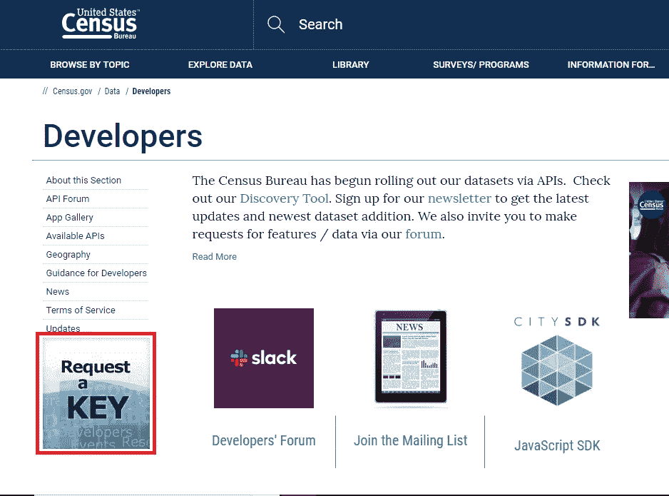
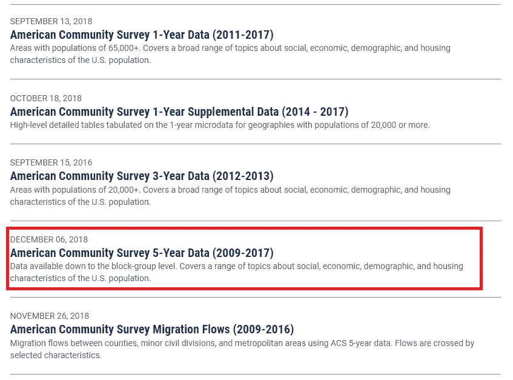
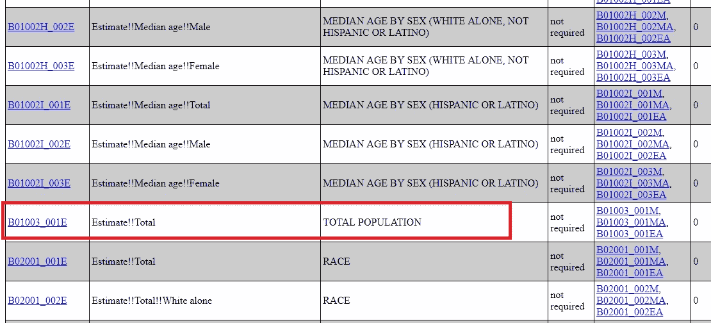
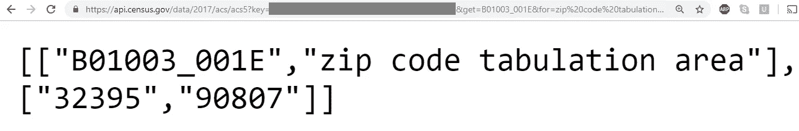

# 通过 5 个简单的步骤获得人口普查数据

> 原文：<https://towardsdatascience.com/getting-census-data-in-5-easy-steps-a08eeb63995d?source=collection_archive---------4----------------------->

Photo by [Ishan @seefromthesky](https://unsplash.com/photos/Fcopy8szaoM?utm_source=unsplash&utm_medium=referral&utm_content=creditCopyText) on [Unsplash](https://unsplash.com/search/photos/population?utm_source=unsplash&utm_medium=referral&utm_content=creditCopyText)

早在 2016 年，在与辛辛那提市合作帮助优化其紧急医疗服务的项目中，我的团队意识到我们需要获得关于该市的详细人口普查数据。我们需要测量，比如按年龄、种族、性别等细分的每个邮政编码的人口。

和*真的很难得到*。我清楚地记得这个过程需要大量的研究、数据搜集和令人头疼的**。**

**作为我目前正在撰写的另一篇文章的一部分，我再次发现需要获得人口普查数据，这一次是关于洛杉矶县的邮政编码**人口。“又来了”……我想。****

**然而，事实证明，在过去的几年里，获取人口普查数据的过程变得极其简单，而且相对来说也不那么痛苦。这里有一个快速的 5 步指南，让你自己得到它。**

## **1.向美国人口普查局请求密钥**

**为了进行 API 调用(只是一个要求特定数据的 web 请求的花哨名称)，您需要从美国人口普查局请求一个**密钥**。导航到人口普查[开发者页面](https://www.census.gov/developers/)，您应该会看到“*请求一个密钥*”。**

****

**您将被重定向到一个页面，要求输入您的组织名称(我刚刚输入了我的姓名)和您的电子邮件地址。很快，你会收到一封电子邮件，里面有一长串字母和数字，这就是你的 **API 密匙。****

> **非常重要:保持这个密钥的秘密。 *否则，别人可以以你的名义提出数据请求，而你不一定想要那样。***

## **2.找到正确的数据集**

**人口普查局有几个数据集，有些可能适合您的项目，有些则不适合。例如，在光谱的一端，我们有**美国社区(ACS)调查 1 年数据**，它每年都发生，但只针对人口超过 65，000 的地区。**

**在光谱的另一端，我们有大多数人认为的“人口普查”，官方称为**十年一次的人口普查**，每 10 年一次，但包括非常详细的地理区域。而且，中间还有几个层次。你可以在这里找到完整的列表。**

**在这篇文章的其余部分，让我们使用一个具体的例子，假设我们正在试图寻找加利福尼亚州美丽的长滩的邮政编码为 90807 的最近人口统计。**

**为此，我们将使用 **ACS 5 年期数据**，其中包括有关小型地理区域的汇总数据，以提高统计可靠性，而不是 1 年期指标(非常适合我们所追求的邮政编码指标)。我们将尽可能使用最新的数据集，来自 **2017** 。**

****

**导航到 ACS 5 年数据的[网页](https://www.census.gov/data/developers/data-sets/acs-5year.html)，我们看到我们的 API 调用将以:**

> **[*https://api.census.gov/data/2017/acs/acs5?key=[YOUR_API_KEY]*](https://api.census.gov/data/2017/acs/acs5?key=[YOUR_API_KEY])**

## **3.找到正确的变量**

**好了，我们有了正确的数据集。现在，我们需要考虑从数据集中需要哪些变量。你可以用你的变量得到相当一般或相当具体的东西。变量的一些例子包括:**

*   **总人口**
*   **申报加拿大血统的总人数**
*   **与祖父母同住的 18 岁以下孙辈总数**

**而且……这还只是皮毛。ACS 5 年评估的**完整变量列表**可在[这里](https://api.census.gov/data/2017/acs/acs5/variables.html)找到。**

**对我们来说，我们将保持它的基本性，使用总人口数。我们可以导航到变量网页，Ctrl-F 表示“总人口”，并获得变量名 **B01003_001E。****

****

**酷！到目前为止，我们的 API 调用如下所示:**

> ***https://api.census.gov/data/2017/acs/acs5?KEY =[YOUR _ API _ KEY]&get = b 01003 _ 001 e***

**上面写着“从 ACS 的 5 年数据中，我想要总人口”。**

## **4.找到正确的地理位置**

**最后一步是问**“哪里”**的问题。到目前为止，我们已经从 ACS 5 年的数据中请求了总人口，但是还没有指定我们想要邮政编码为 90807 的这个值。**

**实现这个结果就像**稍微修改一下 API 调用一样简单**:**

> ***https://api.census.gov/data/2017/acs/acs5?KEY =[YOUR _ API _ KEY]&get = b 01003 _ 001 e&for = zip % 20 code % 20 tabulation % 20 area:90807***

**如果你想知道， **"%20"** 只是空格的代码，因为我们不允许在 URL 中放真正的空格。**

**另请注意，**你不仅仅局限于邮政编码**作为你的地理位置。你可以用州、县等来代替。您只需要相应地修改 API 调用。我发现找出正确的 API 调用的最好方法是查看人口普查局提供的一些[例子](https://www.census.gov/data/developers/guidance/api-user-guide/query-examples.html)，然后**修改它们以满足你的需求**。**

## **5.进行 API 调用**

**所有艰苦的工作都完成了！**

**让我们将 API 调用复制/粘贴到浏览器中，看看会得到什么。**

****

**这告诉我们 2017 年邮政编码 90807 的总人口是 **32395** 。**

****相当酷！****

## **(6.)可选:将结果存储在电子表格中**

**您可能想要**将您的结果存储在某个地方**，这一步将带您通过一个示例了解如何使用 python 来做到这一点。以下脚本将**使用包含这些邮政编码列表的 txt 文件(在 my GitHub [这里](https://github.com/ritvikmath/StarbucksStoreScraping/blob/master/laZips.txt)找到)生成一个 CSV 电子表格**，其中包含洛杉矶县内所有邮政编码的人口。**

****感谢阅读**，我希望这篇文章能让你更容易收集自己的人口普查数据！**