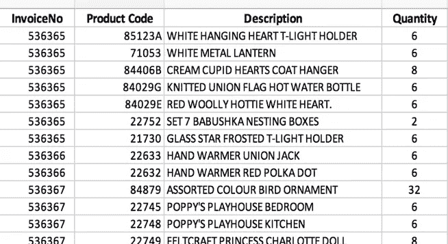
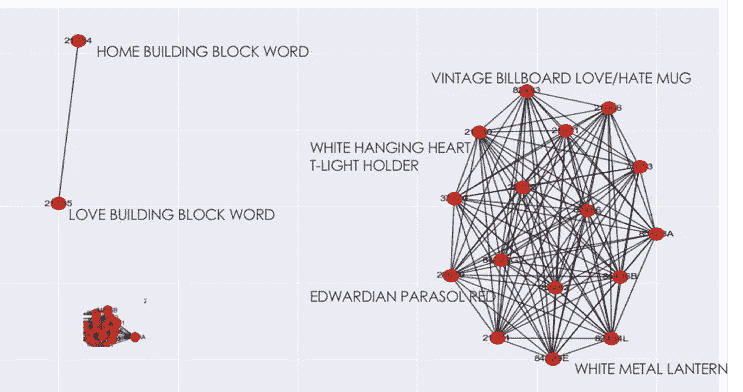
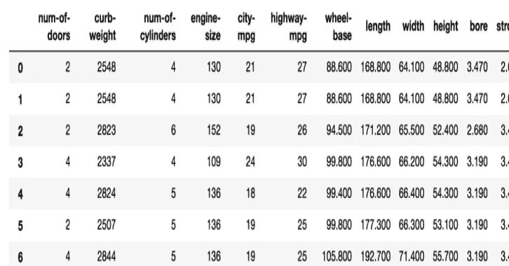
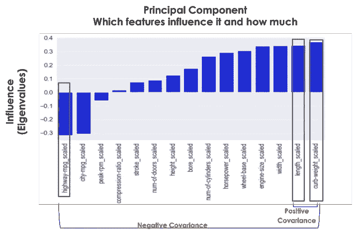
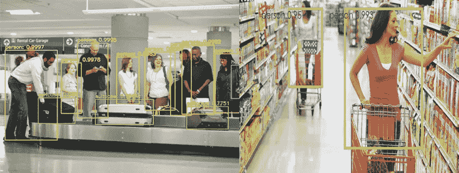
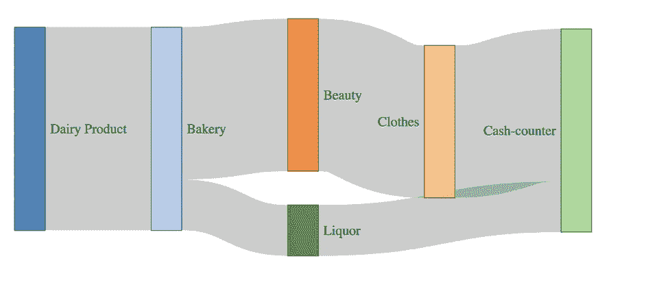

# 发挥数据科学算法的创造力

> 原文：<https://towardsdatascience.com/getting-creative-with-algorithms-c97e2680eb07?source=collection_archive---------21----------------------->

## 如何在数据科学中不再机械，保持创新优势

Get Creative with Algorithms

1972 年 4 月，《纽约时报》发表了一篇文章《工人越来越反抗流水线上的无聊》。虽然汽车工业被认为是非常创新的，但这种工作是非常机械和重复的。原因是汽车工业是基于装配线的概念，人们应该每天做一系列重复的工作。

同样，数据科学领域也非常有趣和创新，它有时会变得机械和重复。例如，当目标是对数据进行聚类时，通常我们倾向于使用诸如 KMeans 或 DBScan 之类的“常见可疑”算法。就预测而言，这个过程可能非常机械，只是遵循一系列步骤，如数据清理、一键编码、特征工程、机器学习和混淆矩阵。

总是应用相似的算法和方法，有时会导致数据科学疲劳。尽管数据科学被用于创新目的，但数据科学疲劳会导致你的大脑缺乏创新。

那么如何避免过于机械，避免流水线式的工作呢？一种方法是在算法上有所创新。这里有一些例子

# ***先想到客观，然后是算法***

当您想到聚类或分段时，我们通常会想到对具有许多特征的表格数据应用聚类算法，如 KMeans、DBScan 和其他算法。然而，让我们在这里看到一种不同于通常做法的聚类方法。

假设您有购物发票列表作为您的数据。它有三个字段发票号码，产品代码，描述和数量。

Invoice data

那么我们如何对这些数据进行聚类呢？首先，我们需要确定集群的目标。一个有用的目标可能是找到一起销售的产品群或细分市场。因此，我们解决这个问题的策略可以分为两步:1 .寻找一起出售的产品。查找一起销售的所有产品的聚类

因此，让我们首先找到一起销售的所有产品。购物篮分析有助于我们发现哪些产品是一起销售的。购物篮分析有各种算法。用于购物篮分析的常用算法之一是 apriori 算法。该算法的结果是经常一起销售的产品对。下面是一些基于购物发票数据集的例子

老式广告牌爱恨杯——&—爱德华七世时代的阳伞红

白色吊心 T 型灯座——白色金属灯笼

现在我们已经确定了一起销售的产品，下一步是找到这些产品的集群。要做到这一点，我们可以从图论中获得灵感，有时也称为网络理论。我们可以把每个产品看作一个节点。如果它们一起出售，我们可以在产品(节点)之间创造一个优势。图表可以如此处所示，显示几个最畅销的产品

Graph Algorithms to make cluster

我们可以清楚地看到一些产品集群。此外，诸如模块化算法的图形算法可以用于提取这些聚类

正如我们所见，我们可以使用 apriori 和图算法进行聚类。当您考虑集群时，您不应该自动总结使用 KMeans、DBScan 或其他类似的算法。人们应该考虑聚类的目的，然后决定使用哪种算法

# ***尝试寻找不同的方法做同一件事***

避免重复工作并保持创新优势的一个方法是从不同的角度看待问题。为了说明这一点，让我们以汽车数据集为例。该汽车数据集具有关于汽车的各种技术特征。

Automotive dataset

假设我们的目标是找到所有特征之间的协方差。首先想到的事情之一是在所有特征之间应用协方差算法。重复应用相同的算法总是让你失去创新的优势。

那么另一种寻找协方差的方法是什么呢？一种不同的方法是 PCA(主成分分析)。虽然 PCA 算法的目标是降维，但它是基于发现特征之间的变化。变化最大的特征用于降维。作为该算法的副产品，您还可以获得具有正协方差和负协方差的要素

这里显示的是特征及其对第一主成分的影响(或特征值)之间的图。人们可以得出结论，宽度，长度，高度有正协方差和正相关。mpg、rpm 具有负协方差和负相关

PCA to find variance

这里我们看到我们可以用不同的方法解决问题。这也有助于我们理解不同算法之间的关系。一旦你对算法之间的关系和相似性有了这样的想法，你就可以开始从不同的角度处理问题。这将带您进入数据科学创新的下一个阶段

# ***使用深度学习不是作为最终结果，而是作为数据来源***

在执行 YOLO 算法后，我们在图像上看到过多少次绿框。几年前，当 YOLO 被介绍给数据科学家时，那是超级有趣和令人兴奋的。有许多数据科学家使用 YOLO 对各种图像和视频进行对象识别。然而，现在仅仅使用 YOLO 来识别物体已经变得非常机械。所有这些绿色盒子并没有像几年前一样让数据科学家们兴奋。

深度学习非常具有创新性和前沿性。但是它的使用方式已经变得非常机械。保持其创新用法的方法之一是将深度学习视为数据来源。想象一下，你有一个零售店中人们移动的视频分析。我们可以使用深度学习算法来识别人类，如下例所示。这些例子说明了在机场或零售店中识别人

Deep learning YOLO output

现在，如果我们把上面的结果看作一个数据源，而不是一个目的，会怎么样呢？YOLO 可以帮助探测物体，但它也给出了物体的位置。因此，YOLO 的结果可以输入到另一个算法中，比如路径分析。我们可以分析人们的运动。我们可以使用它来查找零售店或机场中有大量活动的区域和不太繁忙的区域。我们还可以找到人们通常走的轨迹。就像在零售店一样，我们可以在来到收银台之前找出哪些区域被光顾过，以及哪些购物者没有经过收银台

如下图所示，是零售商店中所访问区域的路径分析

Path Analysis based on output from YOLO

这就是我们正在超越的仅仅是物体检测和绘制绿色方框。将深度学习算法的输出视为数据来源，将有助于您应用智能算法来得出面向业务和令人兴奋的结果

在本文中，我们看到了一些思考数据科学的有趣方式。使用这些技术，以免陷入机械和流水线式的数据科学研究方式。数据科学专业本质上是创新的。所以，换个角度思考，超越常规，保持你的创新优势

# 额外资源

# 网站(全球资讯网的主机站)

你可以访问我的网站进行零编码分析。[https://experiencedatascience.com](https://experiencedatascience.com)

请**订阅**每当我发布一个新的故事时，请及时通知我。

 [## 每当 Pranay Dave 发表文章时，您都会收到电子邮件。

### 每当 Pranay Dave 发表文章时，您都会收到电子邮件。通过注册，您将创建一个中型帐户，如果您还没有…

pranay-dave9.medium.com](https://pranay-dave9.medium.com/subscribe) 

你也可以通过我的推荐链接加入 Medium。

 [## 通过我的推荐链接加入 Medium—Pranay Dave

### 作为一个媒体会员，你的会员费的一部分会给你阅读的作家，你可以完全接触到每一个故事…

pranay-dave9.medium.com](https://pranay-dave9.medium.com/membership) 

**Youtube 频道**
这里是我的 Youtube 频道的链接
【https://www.youtube.com/c/DataScienceDemonstrated 