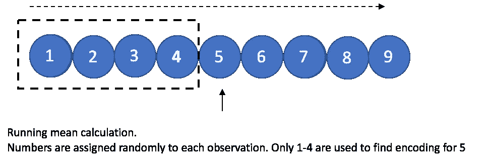
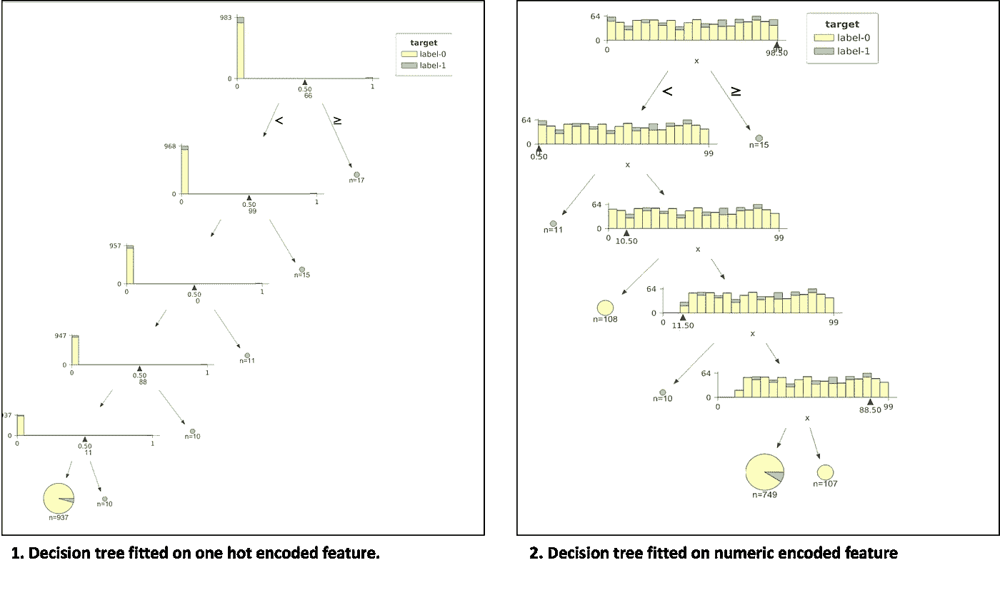
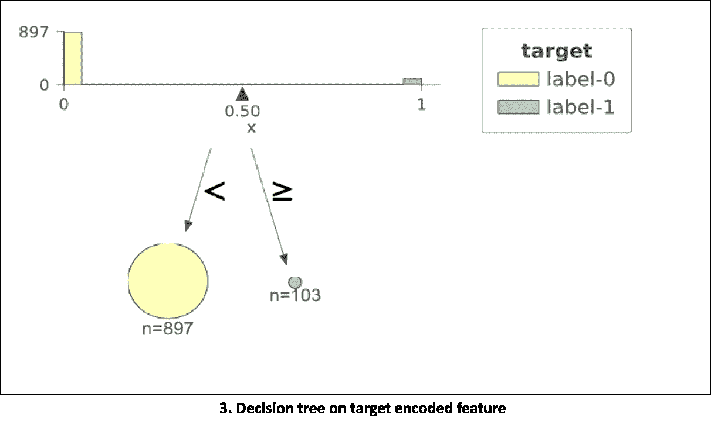
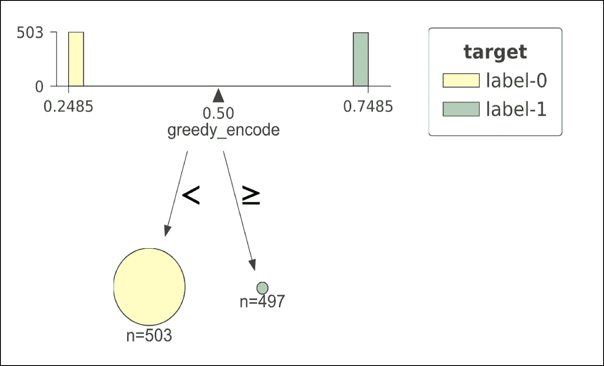
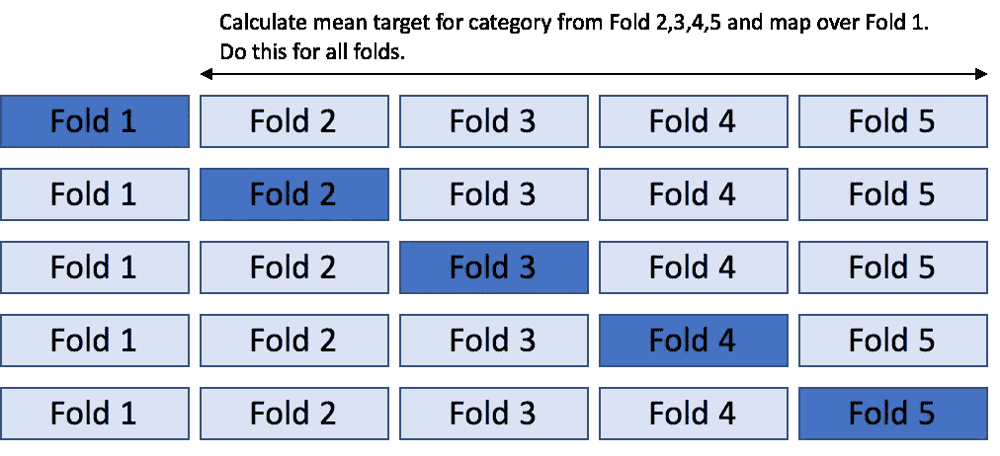
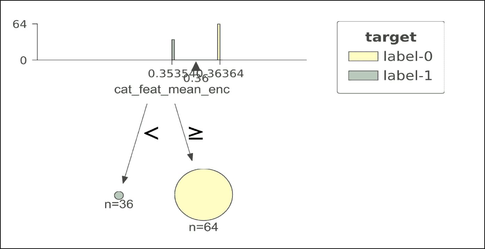
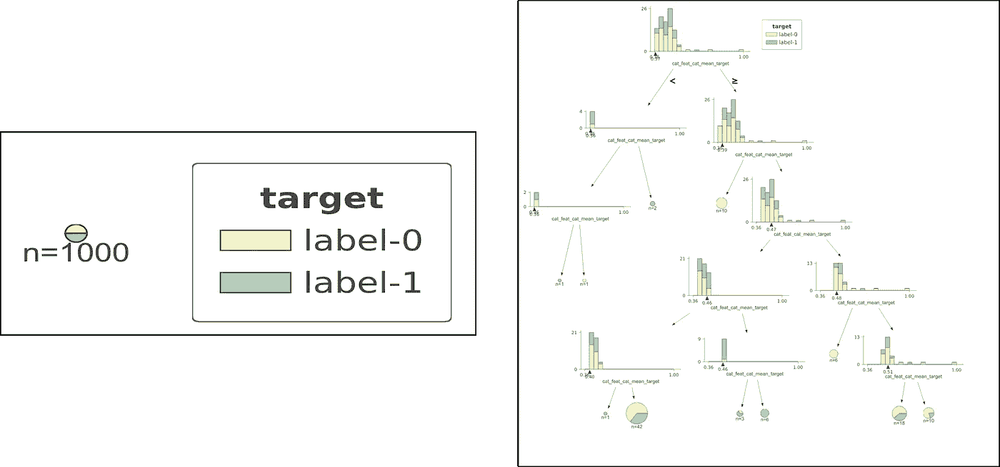
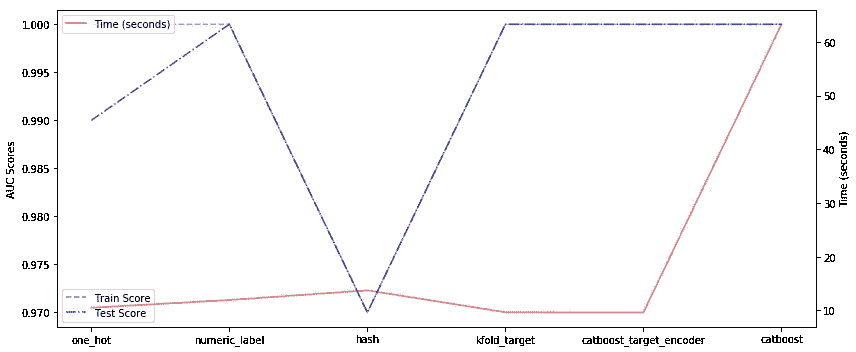
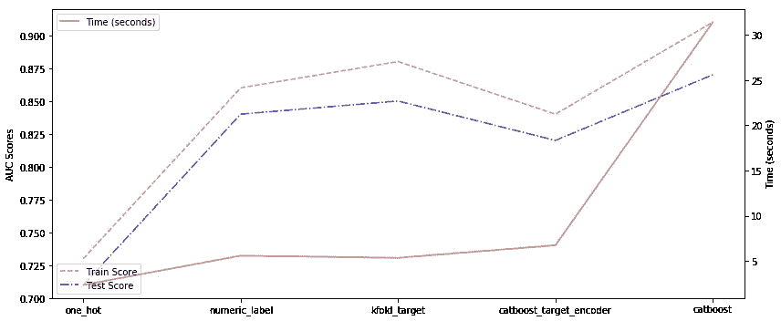

# 深入研究机器学习的分类编码

> 原文：<https://towardsdatascience.com/getting-deeper-into-categorical-encodings-for-machine-learning-2312acd347c8?source=collection_archive---------3----------------------->

**奖励:** [**Catboost**](https://catboost.ai/) 提出的有序目标编码

# 介绍

根据我在监督学习方面的经验，将模型性能从像样提高到像人一样需要创造性的特征工程。如果特征工程没有做好，从简单算法跳到复杂算法并不总是能提高性能。监督学习的目标是从相关特征中提取所有的汁液，为了做到这一点，我们通常必须丰富和转换特征，以便使算法更容易看到目标变量如何依赖于给定的数据。一种不容易泄露其包含的信息的特征是**分类特征**。他们一直隐藏信息，直到我们聪明地改变他们。在这篇特别的文章中，我将重点介绍一种叫做**目标编码**的特殊分类编码技术，这种技术在大多数情况下都非常有效，但是如果操作不正确，就会有目标泄漏的风险。目标泄漏意味着使用来自目标的一些信息来预测目标本身(你看到这里的问题了吗？).因此，这种泄漏增加了过度拟合训练数据的风险，尤其是当数据很小时。类似的目标泄漏也存在于标准梯度提升算法中。 [Catboost](https://catboost.ai/) 实现了一种叫做**排序原则**的技术，解决了两种情况下的目标泄漏问题。基于这种技术以及许多其他小的改进，Catboost 在一组流行的公开可用数据集上优于其他公开可用的梯度增强库。本文总结了 Catboost 所做的对比实验— [CatBoost:具有分类特征的无偏增强](https://papers.nips.cc/paper/7898-catboost-unbiased-boosting-with-categorical-features.pdf)。

# 标准方法

**一键编码** —处理分类特征的一种常用技术是**一键编码**，即对于每一级别的类别，我们创建一个二元特征。然而，在高基数的情况下(例如，城市 ID、地区 ID、邮政编码)，这种技术导致不可行的大量特征。基于树的模型尤其受到如此大量的一次性特征的困扰，因为:1)树仅在一个热要素的零的方向上生长(如下图所示)，2)如果树想要在一个热要素(0，1)上分割，它的信息增益将会很低，因此如果其他连续的要素也存在，树将无法从根附近的要素中分割。

**标签编码** —另一种标准编码技术是**数字编码**(又名**标签编码**)，我们给每个类别分配一个随机数。这种技术在数据中注入了某种形式的顺序，而这种顺序通常是没有意义的，是随机的。我们需要维护一个类别到数字的映射，以便以后对测试数据应用相同的映射。对于生产中的模型，维护映射有时会变得很困难。基于树的模型也遭受这种编码，因为树基于小于或大于最佳值的值找到最佳分割。在随机排序的情况下，小于或大于没有任何意义。

**哈希编码—** 这种常用的技术使用哈希函数将字符串类型的特征转换成固定维度的向量。sklearn 中使用的哈希函数是 Murmurhash3 的[带符号 32 位版本。一个 32 维向量可以保存 2 个唯一的组合。这对于高基数变量非常有用，在这种情况下，一个热编码将提供大量的特性。我最近注意到这种技术工作得非常好，特别是在类别的字符串模式中有一些信息的情况下。](https://scikit-learn.org/stable/modules/generated/sklearn.feature_extraction.FeatureHasher.html)

哈希的优点:1)不需要维护类别到数字的映射。只需要使用相同的哈希函数对测试数据进行编码；2)减少级别，特别是在高基数特征的情况下，这因此使得树更容易分裂；3)可以组合多个特征来创建单个散列。这有助于捕捉特征交互。

哈希的缺点:1)哈希冲突。不同级别的类别可以归入同一个桶。如果这些类别没有同等地影响目标，那么预测得分可能会受到影响；2)需要调整散列向量维数的另一个超参数。

**目标编码** —另一个选项，也是这篇博文的主要焦点是**目标编码**(又名**似然编码)。**想法是用一个数字替换分类特征的每一级，该数字是从该特定类别级的目标标签的分布计算的。例如，如果分类特征的级别是红色、蓝色和绿色。然后用一些统计集合(平均值、中值、方差等)替换红色。)在训练数据中特征值为红色的所有目标标签中。

下图显示了一个分类特征的决策树是如何构建的，当它是一个热点编码时，与当它是一个数字编码时(每个类别一个随机数)。第三个图显示了带有目标编码特征的决策树。**对于所有图，使用仅具有一个分类特征和一个二元目标的 1000 行模拟数据。分类特性具有很高的基数，有 100 个不同的级别，从 0 到 99** (记住顺序没有意义，因为我们将其视为名义分类特性)。**目标以这样的方式依赖于特征，即类别是 11 的倍数(0，11，22，33..99)的目标值为 1，对于所有其他情况为 0。该数据具有 897 个阴性标签和 103 个阳性标签)。**使用 [dtreeviz](https://github.com/parrt/dtreeviz) 库构建图形，用于决策树可视化，树的最大深度限制为 5。 [Jupyter 笔记本链接](https://github.com/groverpr/Machine-Learning/blob/master/catboost/ohc_dtreeviz.ipynb)获取生成这些图的代码。

在第一个图中，我们可以看到，具有一个热点编码特征的决策树创建了许多许多分裂，并且树都是左侧的。该树仍在完成工作，并能够分离数据。我们观察到从根到叶的分裂值分别为 66，99，0，88，11。在每次分割时，信息增益很低，因为分割只关注分类特征的一个级别。如果我们引入有噪声的连续特征，树可能会在噪声中找到比某个一次性编码特征更多的信息增益，并在特征重要性图中放弃这些信息，这有时会产生误导。这个问题在这篇博文中有详细的讨论— [分类变量在你的随机森林中迷失了吗？](https://roamanalytics.com/2016/10/28/are-categorical-variables-getting-lost-in-your-random-forests/)这个 kaggle 讨论页面——[为什么一键编码给出的分数更差？](https://www.kaggle.com/c/zillow-prize-1/discussion/38793)

在第二个样地中，树从根到叶分别在 98.5、0、10.5、11.5、88.5 处裂开。所以这棵树也能找到正确的答案，找到接近 11 的倍数的分裂。它假设分配给类别的数字是有序的，这实际上是随机分配。我们看到，即使对于这种基于完美规则的数据，该树也很难达到一个好的决策边界。在实践中，我注意到，只要基数不高，这种技术与随机森林或梯度提升技术配合得很好。如果基数很高，数字编码很可能会在您获得任何好处之前使您的计算成本激增。这个计算成本问题的解决方法是基于该级别的频率分配数字/等级。

在第三个图中，目标均值编码的树在仅仅一次决策践踏/分割中找到了数据的完美分割。我们看到这种编码在我们的玩具例子中非常有效。让我们更深入地研究这一点，并将本文的范围限制在目标编码、目标泄漏/预测偏移、由于这种类型的编码导致的过拟合；最后是 Catboost 对这个问题的解决方案。

# 目标编码

## 不同类型的目标编码

目标编码是用等于某个目标统计量(例如，目标的平均值、中值或最大值)的一个数字特征来代替第 k 个训练示例的类别。

1.  贪婪的
2.  坚持
3.  k 倍
4.  有序的(Catboost 提出的)

现在让我们讨论一下每种类型的优缺点。

## 贪婪目标编码

这是最直接的方法。只需将目标标签的平均值替换到具有相同类别的训练样本上。我们只能看到训练数据的标签。因此，我们从训练数据中找到所有类别的平均编码，并将其映射到测试数据。对于在测试中发现一些新类别而在训练数据中不可用的情况，我们用目标的总体平均值替换该类别的值。只要我们有大量的训练数据、基数较低的分类特征，并且目标分布在训练和测试数据中，这种方法就能很好地工作。但是这在其他情况下不起作用。

**Decision tree on greedy target encoded feature**

让我们看一个极端的例子来说明这种编码技术的失败。在左边，我们看到一个在 0.5 阈值处具有完美分割的决策树图。用于该模型的训练数据具有 1000 个观察值，其中只有一个分类特征具有 1000 个唯一级别。将用户 ID 视为这种独特分类特征的一个例子。标签(0，1)已被随机分配给训练数据。这意味着目标与特性没有任何关系。但是决策树向我们展示了什么呢？该树向我们展示了在第一个节点上的完美分割，尽管实际上完美分割并不存在。该模型将在训练数据上显示接近完美的分数。这是真的吗？不。测试数据可能有新的用户 id，在训练数据中看不到，我们的模型将吸收测试数据。这就是“在训练数据上过度拟合”的情况。稍后我们将解决这个问题。

## k 倍目标编码

这是最常用的方法，解决了训练数据过拟合的问题(“大部分”，不总是)。思路类似于 [k 重交叉验证](https://scikit-learn.org/stable/modules/cross_validation.html)。我们将数据分成 K 层或随机层，用除 M 层之外的所有其他层的数据的平均目标代替 M 层中的观察值。我们基本上是试图 1)使用给我们的所有训练数据，2)通过允许目标信息从其他同伴观察(相同类别但不同折叠)中流出，不泄漏来自自我目标标签的信息。大多数时候，我个人在 K=5 的情况下使用这种方法，到目前为止，这种方法对小型到大型数据集都很有效。

**Holdout 目标编码-**K = 2 时 K 倍的特例。

另一种选择是将训练数据集分成两部分。第一部分计算目标统计量，第二部分进行模型训练。这样我们就不会从第二部分的目标中泄露任何信息，这些信息实际上是用于训练的。但是这种技术导致了数据减少的问题，因为我们基本上使用的训练数据比我们实际拥有的要少。使用这种方法，我们并没有有效地利用手头的所有训练数据。当我们有大量数据时，仍然不是一个很好的解决方案。

**留一目标编码-** 当 K =训练数据长度时 K-fold 的特例。

这在我们有小数据集时特别有用。我们通过使用除了特定观察之外的所有观察的标签来计算每个观察的目标统计。但是这种技术在某些情况下也会导致过度拟合。让我们用决策树可视化来看一个这样的失败例子。

**Decision tree on leave one out encoded feature**

在这个例子中，我们的训练数据有 100 个观察值，只有一个特征；称它为颜色，它总是红色的。很明显这个功能是没用的。如果我们尝试在这个特性上用一个编码来拟合决策树，我们可能会以训练数据的完美分割而结束(如下所示)。这是一种误导，因为这种完美的分割并不存在。它给出这种分割的原因是因为当我们使用留一时，它要么留 0 要么留 1，只给我们两个唯一的编码。当我们在此基础上训练模型时，它使用这两个唯一值来寻找完美的分割。

## 有序目标编码

这不是常用的方法。但这是 Catboost 库背后的核心思想，它对分类数据非常有效，如[这篇](https://papers.nips.cc/paper/7898-catboost-unbiased-boosting-with-categorical-features.pdf)论文所示。这种技术源于用于处理时间序列数据的验证技术。当目标的分布与时间不一致时，我们需要特别注意在调整超参数时不要泄漏任何来自未来的信息。在这篇博文中讨论了在时间序列数据中进行超参数调整或分裂验证集的不同方法— [时间序列嵌套交叉验证](/time-series-nested-cross-validation-76adba623eb9)。基本思想是使用**超时验证**方法，因为传统的 k-fold 方法在这种情况下效果不佳。类似地，有序目标编码依赖于人工时间依赖性的概念。我们只使用历史记录中的目标来计算每个示例的目标统计数据。为了生成时间的代理概念，我们随机打乱数据。为了简化，我们随机排列行，并对按每个类别分组的目标标签进行移动平均。

但是，取群体的移动平均数有一个问题。对于随机化数据中的最初几行，均值编码将具有较高的方差，因为它只看到历史中的几个点。但随着数据越来越多，移动平均值开始变得稳定。由于随机选择的初始数据点造成的这种不稳定性使得数据集的初始部分具有弱估计。Catboost 通过使用多个随机排列来处理这个问题。它同时训练几个模型，每个模型都根据自己的排列进行训练。所有模型共享相同的树森林，即相同的树结构。但是这些模型的叶值是不同的。在构建下一棵树之前，CatBoost 选择其中一个模型，该模型将用于选择树结构。使用此模型选择结构，然后用于计算所有模型的叶值。

让我们看看有序编码是否解决了我们讨论的遗漏一项和贪婪目标编码技术的失败案例。

**Left: No successful split in case of all unique categories. Right: Decision tree construction for case of all same category.**

案例 1(左图)。当我们拥有所有独特的类别，贪婪的方法失败了。我们看到，有序编码一开始就不能简单地找到任何好的分割。案例 2(右图)。当我们都有相同的类别时。在这种情况下，如果在第一个节点中给出完美的分割，则省略一个节点会失败。但是有序编码很难找到一个理想的模型。

> CatBoost 还对分类要素组合使用有序目标编码，这对于某些数据集很有用。这些组合是在训练期间以贪婪的方式选择的。我们不是在这里讨论程序。但是好奇的读者可以阅读这篇论文来学习组合特性的过程。

## 排行榜

看过不同类型的编码后，让我们做一些有趣的事情。让我们在几个数据集上比较随机森林在所有这些编码下的性能，看看哪个在排行榜上名列前茅。还增加了 Catboost 在每个数据集上的性能。

> *以下实验在数据集上运行:
> 1。随机森林(500 棵树，10 个最大深度)在一个热编码特征
> 2 上。数字标签上的随机森林(500 棵树，最大深度 10)
> 3。散列编码特征
> 4 上的随机森林(500 棵树，10 max_depth)。K 倍目标编码上的随机森林(500 棵树，10 max _ depth)
> 5。有序/Catboost 目标编码上的随机森林(500 棵树，10 max _ depth)
> 6。Catboost (500 次迭代，20 轮提前停止)；分类索引*

## 数据集 1。

只有一个分类特征的模拟数据集。10，000 个数据点，100 级基数。该功能是创建使用随机字符串生成器。每个字符串的长度为 5，生成 100 个这样的唯一字符串。这 100 个字符串通过替换被重新采样，以给出 10，000 个数据点。以元音开头的字符串的目标标签为 1，其他字符串的目标标签为 0。大约 20%的数据有正面标签。

**结果**

**Left to right. 1–5 are categorical encodings on RF. 6 is Catboost GBM.**

我们看到目标编码和数字编码在测试数据上给出了完美的分数。所有情况下的树都被调整到最大深度 10。One hot 编码和 hash 编码不能在测试数据上给出完美的分数。哈希编码肯定遇到了一些冲突，会将一些以元音开头的单词与以辅音开头的单词放在同一个桶中，这就是为什么我们会看到一些分数下降。就时间而言，与随机森林的 500 棵树相比，Catboost 中的 500 次迭代要花费更多的时间。有效使用梯度推进算法的最佳方式是使用早期停止循环和更好的学习速率。

## 数据集 2。

Kaggle 数据。【Amazon.com 员工准入挑战。该数据集有 8 个特征，所有特征都是基数从低值到高值的分类特征。(0.2%至 22%的独特类别)。

**结果**

**Left to right. 1–4 are categorical encodings on RF. 5 is Catboost GBM.**

我们看到 catboost 在性能方面优于随机森林，但速度相对较慢。当我们使用 K-fold 目标编码，然后是 number 和 ordered/catboost 目标编码时，可以获得最佳的随机森林模型。数据集中没有字符串类型特征，所以我们没有使用哈希编码。对于固定深度的 RF，one hot 编码不能提供良好的性能。

Jupyter notebook with comparisons of different encoding techniques

## 结论

通过实验我们了解到，在实践中，数字编码的特征在随机森林中表现很好。目标编码在数字编码的基础上做了一点改进。就时间效率而言，目标编码特征帮助树找到具有更少分裂的解决方案。传统的贪婪和遗漏一个目标编码有过度拟合的风险。这种过拟合
可以通过使用 5/10 倍目标编码或有序目标编码来解决。有序目标编码通过随机排列行在数据中引入了人为的时间概念。Catboost 创建具有不同随机排列的多个树，以生成没有任何目标泄漏的强模型。

[将](https://github.com/groverpr/Machine-Learning/tree/master/catboost)链接到代码库

**关于我:**我目前在 AWS 的亚马逊欺诈检测团队担任研究科学家。如果你有兴趣了解 ML 欺诈或与我们合作，请通过 [linkedin](https://www.linkedin.com/in/groverpr/) 联系我。你可以在这里阅读我的其他博客。

## **推荐读物**

1.  [将分类特征转换为数字特征](https://catboost.ai/docs/concepts/algorithm-main-stages_cat-to-numberic.html) - Catboost
2.  激发这篇文章的论文: [CatBoost:带有分类特征的无偏增强](https://papers.nips.cc/paper/7898-catboost-unbiased-boosting-with-categorical-features.pdf)
3.  另一篇关于分类特征树可视化的文章:[访问:决策树中的分类特征和编码](https://medium.com/data-design/visiting-categorical-features-and-encoding-in-decision-trees-53400fa65931)
4.  由[特伦斯·帕尔](http://parrt.cs.usfca.edu/)和[杰瑞米·霍华德](http://www.fast.ai/about/#jeremy) : [直截了当地说](https://mlbook.explained.ai/catvars.html)
5.  如果不知道梯度推进，阅读这篇简单易懂的文章:[从零开始的梯度推进](https://medium.com/mlreview/gradient-boosting-from-scratch-1e317ae4587d)
6.  [让我们从头开始写一个决策树分类器——机器学习方法#8](https://www.youtube.com/watch?v=LDRbO9a6XPU&t=292s)
7.  一键编码让你的基于树的集合变得更糟，这是为什么？