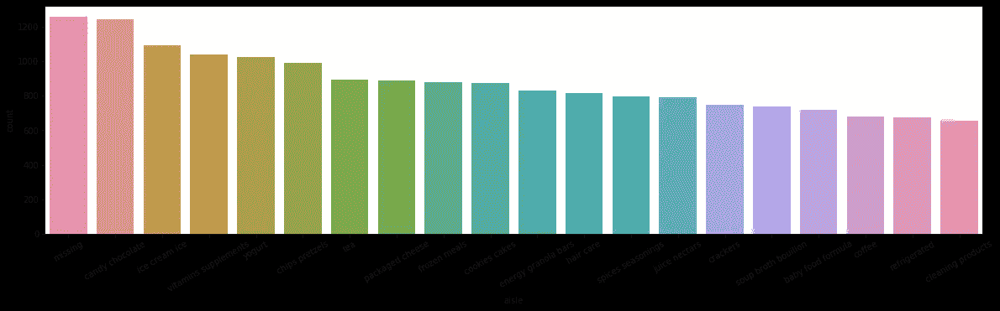

# 动手操作数据库

> 原文：<https://towardsdatascience.com/getting-hands-on-with-databases-5ac7b2ae1444?source=collection_archive---------22----------------------->

## 获得数据科学家最需要的技能之一的经验

Photo by [Jan Antonin Kolar](https://unsplash.com/@jankolar?utm_source=unsplash&utm_medium=referral&utm_content=creditCopyText) on [Unsplash](https://unsplash.com/search/photos/database?utm_source=unsplash&utm_medium=referral&utm_content=creditCopyText)

数据科学是一个在过去几年中经历爆炸式增长的领域，并在 2012 年被《哈佛商业评论》评为[“21 世纪最性感的工作”](https://hbr.org/2012/10/data-scientist-the-sexiest-job-of-the-21st-century)。随着高薪和对人工智能的不断炒作，越来越多的人试图转向数据科学。

谷歌快速搜索显示，SQL 和 NoSQL 等数据库查询语言是成为数据科学家所需的顶级编程语言。与其他顶级编程语言相比，这些语言通常更难学习，因为没有多少项目和教程是围绕学习数据库而构建的。这就是我写这篇关于数据库以及如何设置数据库的简介的原因，您可以在学习下游分析时使用它。

# 那么什么是数据库呢？

数据库，至少是关系数据库，可以被认为是服用了兴奋剂的 Excel 电子表格。每个数据库都由表组成，这些表可以看作是 Excel 中的工作表，每个表都由数据列组成。但是，对存储在数据库中的数据有一些 Excel 中没有的约束。例如，创建数据库表时，必须为每列指定数据类型，并且不能在一列中混合使用。每个表还有一个主键，它是每行的唯一标识符。这些可以指定(用户名)，也可以自动生成。它们也用于将桌子连接在一起。这应该是足够的信息，如果你想更深入地了解数据库，我建议查看斯坦福大学这门课的前几堂课，关于[数据管理和数据系统](https://cs145-fa18.github.io/index.html)。

# Instacart 数据集

对于这个数据库，我决定使用 Instacart 在 2017 年发布的数据，作为 Kaggle 上一场比赛的一部分。我选择这个数据是因为它显然是从 SQL 数据库中保存的，而且有些 CSV 文件太大，无法在 Chromebook 上使用。来自 Instacart 的数据可在此处找到[以及使用数据的](https://www.instacart.com/datasets/grocery-shopping-2017)[服务条款](https://gist.github.com/jeremystan/582eba13d6ee27ed465c43dc78934700)。为了下载数据，我复制了链接地址，并使用`wget`和`untar`来下载和解压缩数据。

# 创建数据库

下载完示例数据后，就可以创建数据库了。有许多不同的开源 SQL 数据库可供选择。为此，我决定使用 PostgreSQL，因为它是我在 Heroku 上部署应用程序时开始使用的。如果你还没有安装它，我发现最简单的安装方法是使用 EDB·波斯格里斯提供的安装程序。

在数据库中，每个 CSV 文件都有一个表。如果我们看一下`aisles.csv`的头部，我们看到有两列，一列是过道 id，另一列是过道名称。

对于靠过道的桌子，我们也需要两列。第一列用`integers`填充，是表的主键，第二列是长度可变的`text`。下面的 SQL 将创建这样一个表。

可以为每个表构造类似的语句，并放入名为 create_tables.sql 的文件中。

使用`COPY table_name(columns) FROM 'path/to/csv/file.csv';`命令，可以用 CSV 文件中的数据填充每个表。同样，我们可以将每个 SQL 语句放入一个名为 add_data.sql 的文件中。

现在我们已经有了创建和填充数据库表的代码，是时候创建实际的数据库了。我们可以通过从命令行首先登录 Postgres，`psql -U postgres`来做到这一点。我们现在可以运行命令`CREATE DATABASE instacart_db;`来创建数据库。为了结帐或连接到数据库，我们在终端中输入`\c instacart_db`。在连接到新创建的数据库后，我们可以创建并填充表`\i create_tables.sql;`，然后是`\i add_data.sql;`。请注意，根据处理器的速度，填充表格可能需要一段时间。

# 用 Python 连接到数据库

我们现在可以用 Python 连接到数据库，并开始做一些分析。要连接到数据库，我们需要安装 psycopg2。我发现用 conda 安装最简单，因为它也可以安装一些需要的库文件。运行`conda install psycopg2`后，你可以启动一个 Jupyter 笔记本。我已经包含了一个样例笔记本，它演示了如何连接到数据库并执行 SQL 命令。在笔记本里，我看`products`表，看什么部门和过道的产品最多。

Number of Products in Each Department

Number of Products in the Top 20 Aisles

我希望这有助于您创建一个可以用来练习 SQL 查询和数据分析的数据库。如果您有任何问题或发现任何错误，请联系我。