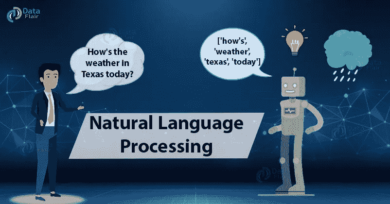
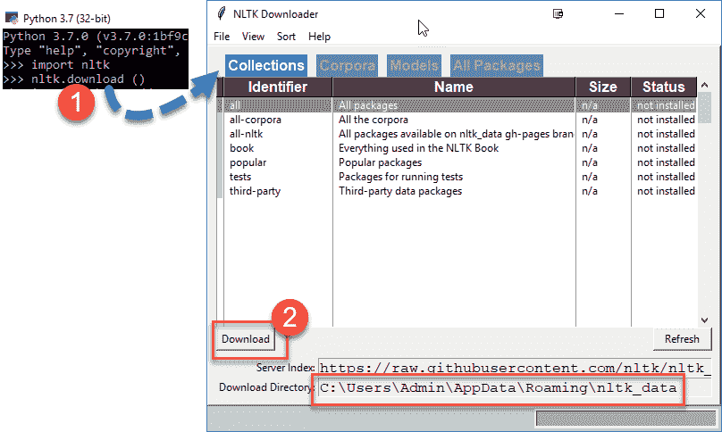
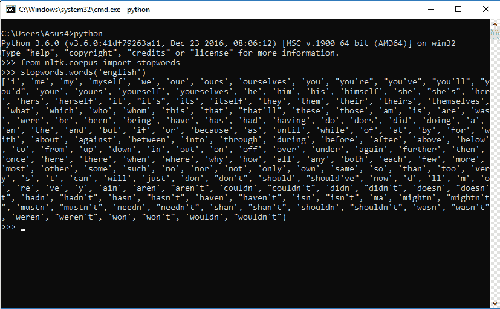

# 通过自然语言处理进入机器的灵魂

> 原文：<https://towardsdatascience.com/getting-into-the-soul-of-machines-through-nlp-10316e3d3299?source=collection_archive---------26----------------------->

## 使用 NLTK 库的 NLP 概览

# 介绍

自然语言处理，简称 NLP，是计算机用来理解人类语言的人工智能的一个子领域。对自然语言处理的研究始于 20 世纪 50 年代，直到 20 世纪 80 年代，开发人员一直通过编写复杂的手写规则来构建自然语言处理系统。


当机器学习算法被开发用于自然语言处理时，这一切都改变了，一场革命开始了。新的 NLP 系统基于统计和概率模型。

[***让你的数据科学梦想变成现实***](https://data-flair.training/blogs/data-science-interview-questions/)

# **NLP 是如何工作的？**

在我们深入 NLP 之前，让我们先看看人类是如何理解语言的。我们人类使用一组单词来组成句子，并通过说和写来表达我们的思想和观点，以便与他人交流。

## 示例-

我来自法国，我会说 ________？

**回答** —法语



人类将根据句子的上下文进行解释，并回答法语，因为法语是法国的官方语言。在自然语言处理中，计算机试图理解句子的上下文，然后像人一样做出决定。

我们有大量原始英语文本或任何其他语言形式的非结构化数据。计算机还不能完全理解英语，但是它们已经可以做很多事情并节省大量时间。

[***与所有最新技术保持联系***](https://data-flair.training/blogs/big-data-and-data-science-telegram-channel/)

# **NLTK 库**

自然语言处理的基本库是 NLTK(自然语言工具包)。它是用 Python 编写的，支持分类、词干提取、解析、语义推理、标记化等任务。

**安装 NLTK**

Windows、Linux 和 Mac 用户可以使用 pip 命令直接安装包。

```
pip install nltk
```

安装软件包后，编写以下 python 代码

```
import nltk
nltk.download()
```

这将打开一个 GUI，您可以从中下载 NTLK 包。你可以下载所有的软件包，因为它们都很小。



现在，让我们开始编写一些代码。

# **标记文本**

记号化是一种将字符串分解成小部分的技术。通常，在 NLP 问题中，我们有一个包含文本的大字符串。第一步，我们把字符串分解成句子。

## **NLTK 句子分词器**

**代码:**

```
text = “I seem to have caught cold. I’m a little feverish.”
from nltk import sent_tokenize
sentences = sent_tokenize(text)
print(sentences)
```

**输出:**

'我好像感冒了。'，“我有点发烧。

为了标记英语以外的句子，我们将语言名称作为第二个参数传递。

**代号:**

```
fren = sent_tokenize(“Enchanté, comment allez-vous? Tres bien. Mersi, et vous?”,”french”)
print(fren)
```

**输出:**

***【‘你好，请问你是哪位？’，'好极了'“梅西，你呢？”】***

## **NLTK 工作标记器**

下一步，我们将字符串分解成单词。

**代码:**

```
from nltk import word_tokenize
tokens = word_tokenize(“Hello Mr. Roy. How was your day? ”)
print(tokens)
```

**输出:**

***【‘你好’，‘先生’，‘罗伊’，’、'怎么样'、'曾经是'、'你的'、'一天'、'？'】***

## **注**:

你注意到“先生”在一个 token 和“罗伊。”被分成两个记号，像“罗伊”和“.”

# **同义词和反义词**

在自然语言中，多个单词可以有相同的意思。所以有一个函数可以给我们一个单词的同义词或反义词是非常方便的。NTLK 图书馆有一个用于此目的的 wordnet 数据库。

## **同义词**

**代码:**

```
from nltk.corpus import wordnet
syn=wordnet.synsets(‘fight’)
print(syn)
```

**输出:**

***【Synset(' battle . n . 01 ')、Synset('fight.n.02 ')、Synset(' competitive . n . 01 ')、Synset('fight.n.05 ')、Synset(' content . v . 06 ')、Synset('fight.v.02 ')、Synset('fight.v.03 ')、Synset(' crusade . v . 01 ')】***

我们还可以得到这个词的定义和例子。

```
print(syn[0].examples())
print(syn[0].definition())
```

**输出**:

***【‘格兰特在奇卡莫加战役中取得了决定性的胜利’，‘当他真正投入战斗时，他失去了关于战争的浪漫想法’】***

***战争过程中敌对军事力量的敌对会面***

## **反义词**

为了得到反义词的列表，你必须在添加它们之前检查词条。

**代码:**

```
from nltk.corpus import wordnet
antonyms=[]
for syn in wordnet.synsets(‘stupid’):
    for l in syn.lemmas():
        if l.antonyms():
            antonyms.append(l.antonyms()[0].name())
print(antonyms)
```

**输出**:

***[‘智能’，‘智能’]***

[***懂得制造机器的艺术***](https://data-flair.training/blogs/machine-learning-tutorials-home/)

# **词干化和词汇化**

这也是自然语言处理的重要部分之一。在这些过程中，我们将单词规范化为它们的词根形式。

**例如，** *“吃，吃过，吃”这几个字可以简化为“吃”*

词干法使用一种启发式方法，即砍掉单词的末尾来快速达到目标，而词干法通过考虑单词的词汇和形态分析来正确地处理事情。

**让我们看看如何实现它们-**

## **词干**

**代号:**

```
from nltk.stem import PorterStemmer
stem = PorterStemmer()
print(stem.stem(‘swimming’))
print(stem.stem(“cats”))
print(stem.stem(“trouble”))
```

**输出:**

***游
猫
游***

## **词汇化**

NLTK 库提供了 wordnet lemmatizer，它查看 wordnet 数据库并返回实际存在的真实单词。

**代码:**

```
from nltk.stem import WordNetLemmatizer
lemmatizer=WordNetLemmatizer()
print(lemmatizer.lemmatize(‘believes’))
print(lemmatizer.lemmatize(‘swimming’))
print(lemmatizer.lemmatize(‘trouble’))
```

**输出:**

***信念
游泳
麻烦***

词干化和词汇化都做同样的工作，但方式不同。如果你知道它们之间的区别，那么你就可以决定什么时候用什么。在速度和准确性之间有一个折衷。词干化很快，而词汇化很精确。

# **停用词**

这在预处理步骤中被大量使用，以过滤掉没有提供关于句子的太多信息的无用单词，如(a、an、the 等)。我们可以从 NLTK 库中看到所有停用词的列表。

**代码:**

```
from nltk.corpus import stopwords
sw = stopwords.words(‘english’)
print(sw)
```

**输出**:



停用字词通过移除不需要的字词来帮助清理标记列表。让我们来看一个例子，如何在构建 NLP 系统之前对文本进行预处理。

**代码:**

```
from nltk.corpus import stopwords
from nltk.tokenize import word_tokenizetext = “This is a sample sentence, showing off the stop words filtration.”
stop_words = set(stopwords.words(‘english’))
word_tokens = word_tokenize(text)
filtered_sentence = [w for w in word_tokens if not w in stop_words]
filtered_sentence = []for w in word_tokens:
    if w not in stop_words:
        filtered_sentence.append(w)print(word_tokens)
print(filtered_sentence)
```

**输出:**

***['这个'，'是'，'一个'，'样本'，'句子'，'，'显示'，'关闭'，'该'，'停止'，'词语'，'过滤'，'.']
['这个'，'样本'，'句子'，'，'显示'，'停止'，'词语'，'过滤'，'.'】***

# 包装东西

这是自然语言处理的一个快速体验，其中我们理解了 NLP 的一些基础知识，并且实际上使用流行的 NLTK 库实现了一些技术。

希望你喜欢学习新概念！

那你为什么等这么久？
[***现在成为一名 Python 传教士***](https://data-flair.github.io/python-tutorial/)