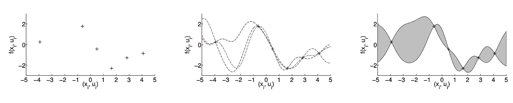
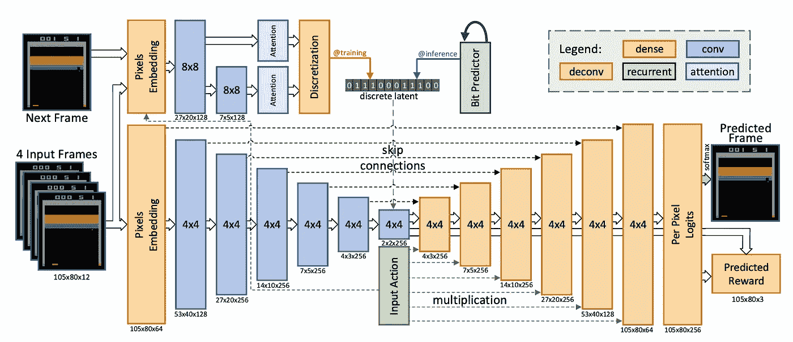

# 最新深度增强算法概述

> 原文：<https://towardsdatascience.com/getting-just-the-gist-of-deep-rl-algorithms-dbffbfdf0dec?source=collection_archive---------5----------------------->

## 一个不需要浏览大量文档就能获得 RL 算法要点的资源——一个面向学生和研究人员的资源，没有一个公式。

作为一名强化学习(RL)研究人员，我经常需要提醒自己算法之间的细微差别。在这里，我想创建一个算法列表，并为每个算法添加一两句话，使其在子领域与其他算法有所区别。我将此与该领域的简要历史介绍相结合。

Source: [Shedding Light on AlphaZero](https://deepmind.com/blog/alphazero-shedding-new-light-grand-games-chess-shogi-and-go/)

强化学习植根于最优控制的历史。这个故事始于 20 世纪 50 年代的精确动态规划，从广义上讲，这是一种结构化的方法，将一个受限的问题分解成更小的、可解决的子问题[ [维基百科](https://en.wikipedia.org/wiki/Dynamic_programming) ]，归功于理查德·贝尔曼。众所周知，克劳德·香农和理查德·贝尔曼在 20 世纪 50 年代和 60 年代革新了许多计算科学。

Richard Bellman — source [wikipedia](https://en.wikipedia.org/wiki/Richard_E._Bellman)

在 20 世纪 80 年代，出现了一些关于 RL 和控制之间联系的初步工作，第一个值得注意的结果是 1992 年基于时差模型的 Tesauro 的[双陆棋程序。在 20 世纪 90 年代，更多的算法分析出现了，并倾向于我们现在所说的 RL。一篇开创性的论文是 Ronald J. Williams 的“用于联结主义强化学习的简单统计梯度跟踪算法”，它介绍了现在的标准策略梯度。请注意，在标题中，他加入了术语“连接主义者”来描述 RL——这是他按照人类认知的设计对模型指定算法的方式。这些现在被称为神经网络，但仅仅在 25 年前还是研究的一个小分支。](https://en.wikipedia.org/wiki/TD-Gammon)

Historical application of dynamic programming — trees and other classical computer science data-structures. Source: Cormen et al. “Introduction to Algorithms”

直到 2000 年代中期，随着大数据和计算革命的到来，RL 才转向基于神经网络，以及许多基于梯度的收敛算法。现代 RL 通常分为两种类型，即“自由模型”和“基于模型”的 RL。我也会这么做。

Some core tradeoffs in different types of RL. For deep RL, most algorithms have shallow backups and follows Monte Carlo methods.

# 无模型 RL:

*模型自由 RL 直接生成一个 actor 的策略。我喜欢把它看作是如何行动的端到端学习，所有的环境知识都嵌入在这个政策中。*

## 策略梯度算法:

*策略梯度算法修改代理的策略，以跟踪那些为其带来更高回报的行为*。这使得这些算法是基于策略的，因此它们只能从算法中采取的动作中学习。

**联结主义强化学习的简单统计梯度跟踪算法**(强化)——[1992](https://link.springer.com/article/10.1007/BF00992696):这篇论文启动了政策梯度思想，提出了系统地增加产生高回报的行动可能性的核心思想。

## 基于值的算法:

*基于价值的算法根据给定状态的感知价值修改代理的策略。*这使得这些算法脱离策略，因为代理可以通过从任何策略读取奖励函数来更新状态的内部值结构。

Q-Learning—[1992](https://link.springer.com/article/10.1007/BF00992698):Q-Learning 是现代 RL 中经典的基于值的方法，其中代理存储每个动作的感知值，状态对，然后通知策略动作。

**深度 Q-网络**(DQN)——[2015](https://arxiv.org/pdf/1509.06461.pdf):深度 Q-学习只是应用一个神经网络来近似每个动作和状态的 Q 函数，可以节省大量的计算资源，并有可能扩展到连续时间的动作空间。

Summary of Actor Critic Algorithms: [source](https://arxiv.org/pdf/1708.05866.pdf) — Arulkumaran et al. “A Brief Survey of Deep Reinforcement Learning”

## 演员-评论家算法:

*行动者-批评者算法将基于策略和基于价值的方法结合在一起——通过对价值(批评者)和行动(行动者)进行独立的网络近似。这两个网络共同努力，使彼此规范化，并有望创造更稳定的结果。*

**Actor Critic Algorithms**—[2000](https://papers.nips.cc/paper/1786-actor-critic-algorithms.pdf):本文介绍了使用两个独立但相互关联的模型来生成控制策略的想法。

## 从基础开始:

十年后，我们发现自己处于深度 RL 算法的爆炸中。请注意，在你阅读的所有报刊中,《核心深处》指的是使用神经网络近似的方法。

策略梯度算法经常受到噪声梯度的影响。我在另一篇文章中谈到了最近提出的[梯度计算中的一个变化，当时一堆最新的‘艺术状态’算法试图解决这个问题，包括 TRPO 和 PPO。](https://medium.com/@natolambert/deep-rl-case-study-policy-based-vs-model-conditioned-gradients-in-rl-4546434c84b0)

Visualization of the TRPO constraint. Green L(theta) is the log probability, or loss. Blue is the lower bound constructed with the KL constraint. The parameters are stepped along eta while maximizing the lower bound on performance. [Source](https://drive.google.com/file/d/0BxXI_RttTZAhMVhsNk5VSXU0U3c/view) of figure. [More on TRPO here.](https://medium.com/@jonathan_hui/rl-trust-region-policy-optimization-trpo-explained-a6ee04eeeee9)

**信任区域政策优化**(TRPO)——[2015](http://proceedings.mlr.press/v37/schulman15.pdf):TRPO 的作者基于 actor critic 方法，希望在每次训练迭代中调整政策的变化，他们引入了 KL 散度(***)的硬约束，或新政策分布中的信息变化。在实践中，使用约束而不是惩罚允许更大的训练步长和更快的收敛。

**最近的政策优化** (PPO) — [2017](https://arxiv.org/abs/1707.06347) : PPO 建立在与 KL 散度的 TRPO 相似的思想上，并通过使用考虑 KL 散度的替代损失函数，解决了实施 TRPO(涉及共轭梯度以估计 Fisher 信息矩阵)的困难。PPO 使用削波来实现这种替代损失并帮助收敛。

**深度确定性策略梯度**(DDPG)——[2016](https://arxiv.org/pdf/1509.02971.pdf):DDPG 将 Q 学习的改进与策略梯度更新规则相结合，这使得 Q 学习能够应用于许多连续控制环境。

**结合深度 RL 中的改进**(Rainbow)——[2017](https://arxiv.org/abs/1710.02298):Rainbow 结合并比较了深度 Q 学习(DQN)中的诸多创新。这里引用了许多论文，因此这是了解 DQN 进展的好地方:

*   优先化 DQN:重放 Q 学习中的转换，在那里有更多的不确定性，即更多的学习。
*   决斗 DQN:分别估计国家价值和行动优势，以帮助推广行动。
*   A3C:通过多步引导学习，将新知识传播到网络的早期。
*   分配 DQN:学习奖励的分配，而不仅仅是方法。
*   嘈杂的 DQN:利用随机层进行探索，这使得行动选择更少剥削。

接下来的两个合并了对演员评论算法的类似改变。注意，SAC 不是 TD3 的继任者，因为它们几乎是同时发布的，但是 SAC 使用了 TD3 中使用的一些技巧。

**Twin Delayed Deep Deterministic Policy Gradient**(TD3)——[2018](https://arxiv.org/abs/1802.09477):TD3 建立在 DDPG 的基础上，有 3 个关键变化:1)“Twin”:同时学习两个 Q 函数，为贝尔曼估计取较低值以减少方差，2)“Delayed”:更新策略的频率低于 Q 函数，3)向目标动作添加噪声以降低剥削策略。

**软演员评论家**(SAC)——[2018](https://arxiv.org/abs/1801.01290):为了在机器人*实验*中使用无模型 RL，作者希望提高采样效率、数据收集的广度和探索的安全性。使用基于熵的 RL，他们控制探索以及 DDPG 风格的 Q 函数近似连续控制。*注意:* SAC 也像 TD3 一样实现了裁剪，并且使用随机策略，它受益于规范化的动作选择，这类似于平滑。

随着样本复杂度的下降和结果的增加，许多人对无模型 RL 的应用感到非常兴奋。最近的研究已经将越来越多的这些方法应用到物理实验中，这使得广泛可用的机器人的前景更近了一步。

# 基于模型的 RL:

*基于模型的 RL(MBRL)试图构建环境知识，并利用所述知识采取明智的行动。这些方法的目标通常是降低更接近端到端学习的无模型变量的样本复杂度。*

**学习控制的概率推理**(PILCO)——[2011](https://www.ias.informatik.tu-darmstadt.de/uploads/Publications/Deisenroth_ICML_2011.pdf):本文是基于模型的 RL 中的第一篇，它提出了一种基于高斯过程(GP)动力学模型(内置不确定性估计)的策略搜索方法(本质上是策略迭代)。利用 GPs 进行学习的应用有很多，但迄今为止核心算法还不多。

Modeling state transitions with GPs visualization. Left: observed data, middle: multiple plausible function fits, right: uncertainty estimates of the GP. [Source](https://www.ias.informatik.tu-darmstadt.de/uploads/Publications/Deisenroth_ICML_2011.pdf).

**具有轨迹采样的概率集成**(PETS)——[2018](https://arxiv.org/abs/1805.12114):PETS 将三个部分组合成一个功能算法:1)由多个随机初始化的神经网络(模型集成)组成的动力学模型，2)基于粒子的传播算法，以及 3)简单的模型预测控制器。这三个部分以潜在的可推广方式利用动力学模型的深度学习。

System flow for PETS algorithm. Fit multiple neural network bootstraps to data, propagate different trajectories through different models, and plan via Model Predictive Control (MPC). [Source](https://arxiv.org/abs/1805.12114).

**基于模型的元策略优化**(m b-MPO)——[2018](https://arxiv.org/abs/1809.05214):本文使用元学习来选择集合中的哪个动力学模型能够最佳地优化策略并减轻模型偏差。这种元优化允许 MBRL 在低得多的样本中更接近渐近无模型性能。

**模型集合信任区域策略优化**(ME-TRPO)——[2018](https://arxiv.org/abs/1802.10592):ME-TRPO 是 TRPO 在假设为环境的地面真实的模型集合上的应用。无模型版本的一个微妙的附加是，仅当集合中用户定义比例的模型在策略迭代时不再看到改进时，策略训练的停止条件。

【Atari 的基于模型的强化学习(SimPLe)——[2019](https://arxiv.org/abs/1903.00374):SimPLe 结合了基于模型的 RL 领域的许多技巧，以及一个从像素建模动态的变分自动编码器。这展示了 MBRL 在 Atari 游戏中的艺术现状(我个人认为这是一个非常酷的阅读作品，并期待人们很快在它的基础上开发)。

The “SimPLe” experimental setup. I recommend looking at the [source](https://arxiv.org/abs/1903.00374) for more info, but it is really a fantastic experimental setup.

近年来，基于模型的 RL 背后的宣传越来越多。它经常被忽略，因为它缺乏其无模型对应物的渐近性能。我对它特别感兴趣，因为它已经实现了许多仅用于实验的令人兴奋的应用，包括:[四旋翼飞行器](https://arxiv.org/abs/1901.03737)和[步行机器人](https://arxiv.org/abs/1708.02596)。

感谢阅读！我可能会在我认为合适的时候更新这个页面——我希望把它作为提醒自己的资源！干杯。

(***) KL 散度，更少被称为 [Kullback-Leibler 散度](https://en.wikipedia.org/wiki/Kullback%E2%80%93Leibler_divergence)是两个概率分布之间差异的度量。我最好把它想成两个分布 *p* (原始)和 *q* (新) *H(p，q)* 的交叉熵与原始分布 *p，H(p)* 的熵之差。它由 KL(P | Q)表示，是信息增益的度量。

# 参考资料和资源:

一篇回顾截至 2017 年 deep RL 的伟大论文:[https://arxiv.org/pdf/1708.05866.pdf](https://arxiv.org/pdf/1708.05866.pdf)

 [## CS 294-112

### 这些讲座将被流式传输和录制。本课程不是以在线课程的形式提供，视频是…

rail.eecs.berkeley.edu](http://rail.eecs.berkeley.edu/deeprlcourse/)  [## 在深水中旋转

### 我们将在 Deep RL 中发布 Spinning Up，这是一个教育资源，旨在让任何人学会成为一名熟练的…

blog.openai.com](https://blog.openai.com/spinning-up-in-deep-rl/) 

更多？订阅我关于机器人、人工智能和社会的时事通讯！

 [## 自动化大众化

### 一个关于机器人和人工智能的博客，让它们对每个人都有益，以及即将到来的自动化浪潮…

robotic.substack.com](https://robotic.substack.com/)