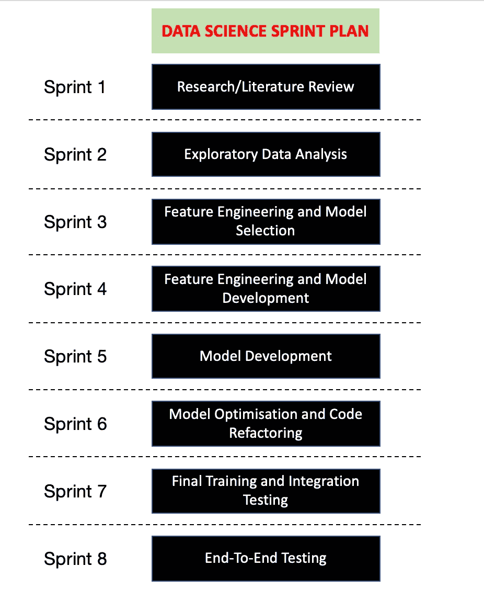

# 为生产准备好机器学习模型

> 原文：<https://towardsdatascience.com/getting-machine-learning-models-ready-for-production-a970b5cfb88d?source=collection_archive---------13----------------------->

## 银行中的数据科学团队如何将机器学习模型投入生产

The Journey To Production

作为一名科学家，能够通过应用新的研究和快速原型化来自由地进行实验是令人难以置信的满足感。这种满足感在实验室环境中可以保持得很好，但在公司环境中会很快消失。这是因为科学在商业环境中的潜在商业价值动机——如果它不能为员工或客户增加商业价值，就没有它的位置！然而，商业价值不仅仅是向员工或客户展示潜在价值的漂亮实验。在机器学习模型的背景下，唯一[商业]有价值的模型是生产中的模型！

在这篇博文中，我将带您了解我和我的团队在将机器学习模型投入生产的过程中所经历的旅程，以及在此过程中所学到的一些重要经验。

# 我们的方法

在构建了几个没有转化为 MVP 的概念验证后，我们意识到有 3 件事我们需要做好:

*   高度集中—团队成员不能同时处理多个项目。分散的焦点和频繁的上下文切换使人们脱离了他们的问题陈述(缺乏解决问题的沉浸感),也导致了大量的技术债务。
*   软件工程**和**数据科学——从机器学习模型中获取价值既是一个数据科学问题，也是一个软件工程问题。葡萄干面包的比喻在这里响亮地响起:人工智能是葡萄干，软件工程和系统集成是面包。它们一起构成了美味而有价值的产品，但它们本身都不特别或不令人想要。
*   接近我们的业务！！与你的商业利益相关者保持一致可以成就你的项目，也可以毁掉你的项目——**这一点我怎么强调都不为过！**

因此，为了做好这三件事，我们制定了一个 8 周的 sprint 计划(从数据科学的角度来看),如下所示。

**注:本帖不讨论实际生产部署中涉及的技术细节。我将把它留到另一篇文章中。**

8 Week Production Cycle Sprint Plan

# 冲刺 1:研究/文献综述

AI 是一个极其压倒性的领域！每天都有新的技术、算法和方法被开发和发布。为此，研究是关键！

在我们的环境中，我们正在处理一个异常检测问题，因此团队中的每个数据科学家都在第一个 sprint 中研究可以应用于我们问题的不同异常检测方法。这个研究过程包括阅读论文、博客、观看视频、克隆 Github repos 和玩代码——你能想到的都有！所有这些研究最终形成了与解决我们的问题相关的技术前景的综合视图。

到周末，每个数据科学家都必须写一篇简短的文献综述，并向团队播放他们的研究结果。

# 冲刺 2:探索性数据分析(EDA)

> 垃圾进，垃圾出。

这就是做模特的方式！因此，为了防止这种情况发生，您**理解您正在处理的数据**是至关重要的！要获得这种理解，EDA 是必由之路！

对我们来说，这个过程是相当模型不可知的——我们只是想理解我们的数据。这个过程包括检查我们的数据的清洁度，绘制数据分布图，发现相关性，并提取对特征工程潜在有用的字段。有大量的资源可以帮助 EDA，包括一些非常棒的库，如 [**熊猫简介**](https://github.com/pandas-profiling/pandas-profiling) **。**

该练习的结果是理解了使用什么数据以及如何将它用于特征工程和模型构建。

# 冲刺 3–4:特征工程和模型选择

特征工程可以说是建立机器学习模型最重要的一步。不管您有多少数据，也不管您应用什么模型架构，**糟糕的特性=糟糕的模型！**

我们决定了一个规则:*每个模型有一名数据科学家*。每个数据科学家都花了这个 sprint 在特定的机器学习算法的上下文中进行功能工程。在特性工程中涉及了相当多的实验，但是在之前的 sprint 中执行的 EDA，以及来自我们业务利益相关者的一些直觉，给了我们一个很好的起点。我们很快意识到，很难决定哪些功能最适合某个特定的型号。为了做出决定，我们运行了各种特性排列的基线模型(默认超参数),并根据适当的成功指标测量了模型性能。

这个 sprint 的输出是向业务和团队回放我们的特性选择，向他们展示基线模型性能结果，并通过所用特性背后的直觉进行讨论。

# 冲刺 5:模型开发

“性感的东西！”

一个常见的误解是，模型开发占用了数据科学家的大部分时间。正如我们发现的那样，大量数据科学家的时间都花在了清理、探索和操作数据上，以便机器学习算法可以使用这些数据，而不是开发算法本身。

这次冲刺的目的我们很清楚: ***找到完美的泡菜！***

每个数据科学家都通过尝试不同的模型架构和超参数，在基线模型的基础上进一步开发。适当的成功指标很重要，例如 F1 分数、准确性等。在这个 sprint 之前被选中，因为这是决定你的模型表现如何的因素。

这个冲刺阶段结束时的可交付成果是 ***完美的泡菜***——一个可以投入生产的经过训练的模型文件。

# Sprint 6:模型优化和代码重构

一旦我们有了一个训练有素的模型，产生了我们和我们的企业都满意的结果，我们就继续进行模型优化。对我们来说，模型优化过程主要集中在提高模型的预测速度上。我们有一个独特的系统集成限制，要求我们在 100 毫秒内执行端到端预测。

此时，大多数数据科学家会停下来说“*好了，我的工作完成了”。*

数据科学家:“好的，酷，我已经训练好了我的模型。给你……”

软件工程师:“我必须用这个做什么？”

数据科学家:“拿去生产？”

软件工程师:“怎么做？”

数据科学家:“不知道。那是你的工作，不是吗？”

有点夸张的转换，但信息是明确的:数据科学必须满足工程！这就是代码重构的用武之地。

每个模型都必须有服务代码(代码将获取生产数据，对其进行适当的转换，加载模型文件，并使用它进行预测)。对我们来说，创建了一个标准的模型服务模板，我们的服务代码放在其中。然后，这个服务代码被打包成一个模块，封装并部署到开发环境中。这个重构过程的一个重要部分是要求必须为服务方法编写单元测试，并且在你的代码可以被合并到主代码之前，所有的单元测试都必须通过。

我迄今为止的经验表明，让数据科学家编写生产就绪代码是困难的，但并非不可能。在这一点上，工程师和数据科学家之间有相当多的摩擦，但有一些策略可以让事情变得更顺利(我也将在另一篇博客文章中讨论)。

这个 sprint 的输出是在 Dev 中部署和运行的服务代码和模型文件！

# 冲刺 7–8:最后冲刺

在我们为期 8 周的生产周期中，最后两次冲刺涉及以下内容:

*   最终模型培训
*   端到端测试

在我们的上下文中，我们有一个非常大的数据集(> 200 000 000 行)。在如此大的数据集上进行实验是不可行的，因此，我们将基线模型(在较小的数据子集上进行训练)部署到开发中。这样做的目的是确保与本地环境相比，部署到开发环境的代码和模型能够如预期的那样执行。

运行了几个集成测试，以确保我们架构中的每个组件在开发中都能按预期执行。

一旦我们对 Dev 中的性能感到满意，我们就开始在完整的数据集上进行训练。最终培训中的模型是将要投入生产的模型。

> *轰！我们现在可以开始生产了！*

# 吸取的教训和遵循的纪律

在生产过程中遇到了许多挑战。下面总结了一些挑战以及我们为实现交付目标而必须遵循的原则:

*   [实际上]运行敏捷——每日站立、每周回顾和业务冲刺计划确保了我们保持高度专注，软件工程符合数据科学，并且存在业务一致性。
*   DevOps 工具——强大的 Git 纪律对我们的部署成功至关重要。是的，数据科学家也必须使用 Git，这是无可避免的！我们利用 [JIRA](https://www.atlassian.com/software/jira?&aceid=&adposition=1t1&adgroup=63127837864&campaign=1439934854&creative=340023072955&device=c&keyword=jira&matchtype=e&network=g&placement=&ds_kids=p34164036290&ds_e=GOOGLE&ds_eid=700000001558501&ds_e1=GOOGLE&gclid=CjwKCAjwzdLrBRBiEiwAEHrAYoKr0ymRtBNy2MAk8Y2ylxZlmdLHVn8HhGAl6G2_gWolbQHlCe1FARoC4sAQAvD_BwE&gclsrc=aw.ds) 来管理我们的 sprint 故事， [Bitbucket](https://bitbucket.org/product?&aceid=&adposition=1t1&adgroup=55499725436&campaign=1407243005&creative=377621228819&device=c&keyword=bitbucket&matchtype=e&network=g&placement=&ds_kids=p33208875779&ds_e=GOOGLE&ds_eid=700000001551985&ds_e1=GOOGLE&gclid=CjwKCAjwzdLrBRBiEiwAEHrAYhLoDHnKJ8dMWDXAk5IGNuS1eU-Frw4U5hV4S3KT--ThGZ5emkSUehoCBOEQAvD_BwE&gclsrc=aw.ds) 来管理我们的代码库，以及 [Confluence](https://www.atlassian.com/software/confluence?&aceid=&adposition=1t1&adgroup=56762752698&campaign=1398156602&creative=301831929106&device=c&keyword=confluence&matchtype=e&network=g&placement=&ds_kids=p32969589259&ds_e=GOOGLE&ds_eid=700000001542923&ds_e1=GOOGLE&gclid=CjwKCAjwzdLrBRBiEiwAEHrAYhHgfnMme1QmZjZq8bSKb-yo-i9yH7RjYEl1bnB9QHVx8e9W3wIkHRoCrSwQAvD_BwE&gclsrc=aw.ds) 来管理文档。
*   文档——为了确保可重复性和连续性，每个团队成员都必须对他们的代码做一定程度的文档记录。这防止了关键人物依赖性的形成。简单文档的一个例子包括简要概述开始特定模型的培训所涉及的步骤。
*   过早的优化是万恶之源——我们首先关注基线性能，让代码工作起来！如果代码库一开始就不工作，那么投入资源进行优化是没有意义的。我们还很快了解到，企业对技术细节不太感兴趣。他们想看到结果。每周向他们展示逐渐改善的结果，你会赢得他们的信任。
*   自动化——在数百个需要手动运行的 Untitled.ipynb 笔记本中编写代码所产生的技术债务是惊人的！一般来说，如果某件事需要重复几次，那就自动化吧！这包括数据提取、模型训练和集成测试等活动。自动化为您节省了大量时间，并且可以像参数化 Python 脚本一样简单。

正如我在本文开头提到的，从实验中获得的满足感是巨大的！同样重要的是，或者至少对我来说，看到你的工作实时运行所获得的满足感！

将机器学习模型投入生产绝非易事！重要的是要认识到这确实是一次旅程——一次需要耐心、承诺、纪律和韧性的旅程，但带你到达一个目的地是非常有益的！