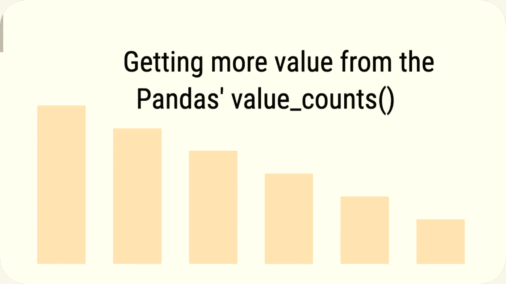
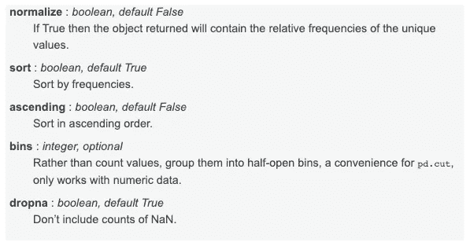
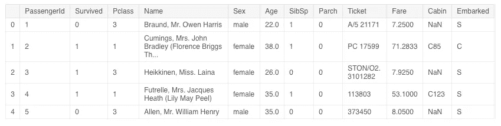
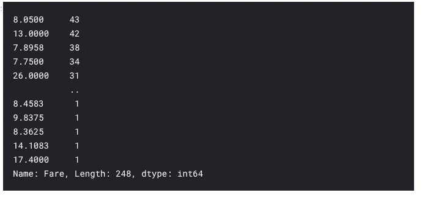
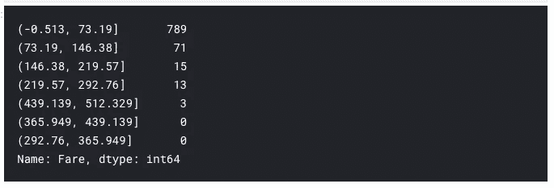

# 从熊猫的价值计数中获取更多价值()

> 原文：<https://towardsdatascience.com/getting-more-value-from-the-pandas-value-counts-aa17230907a6?source=collection_archive---------1----------------------->

## 在 Python 中有效使用 value_counts()函数的五种方法


[Plush Design Studio on Unsplash](https://unsplash.com/@plushdesignstudio?utm_source=beautifulai&utm_medium=referral)

数据探索是机器学习管道的一个重要方面。在我们决定训练哪个模型和训练多少之前，我们必须对我们的数据包含什么有一个概念。熊猫库为此配备了许多有用的功能，`value_counts`就是其中之一。此函数返回熊猫数据帧中唯一项目的计数。然而，大多数时候，我们最终使用带有默认参数的 value_counts。因此，在这篇短文中，我将向您展示如何通过改变默认参数来实现更多。



# 值计数()

value_counts()方法返回一个包含唯一值计数的`Series`。这意味着，对于 dataframe 中的任何列，此方法都返回该列中唯一条目的计数。

## [语法](https://pandas.pydata.org/pandas-docs/stable/reference/api/pandas.Series.value_counts.html)

`Series.**value_counts**`()

## 因素



[https://pandas.pydata.org/pandas-docs/stable/reference/api/pandas.Series.value_counts.html](https://pandas.pydata.org/pandas-docs/stable/reference/api/pandas.Series.value_counts.html)

## 基本用法

让我们看看这个方法在数据集上的基本用法。我将使用[泰坦尼克号数据集](https://www.kaggle.com/c/titanic/data)进行演示。我还在 Kaggle 上发布了一个附带的[笔记本，以防你想直接获得代码。](https://www.kaggle.com/parulpandey/five-ways-to-use-value-counts)

[](https://www.kaggle.com/parulpandey/five-ways-to-use-value-counts)

## 导入数据集

让我们从导入必要的库和数据集开始。这是每个数据分析过程中的基本步骤。

```
*# Importing necessary libraries*import pandas as pd
import numpy as np
import matplotlib.pyplot as plt
import seaborn as sns
%matplotlib inline*# Reading in the data*
train = pd.read_csv('../input/titanic/train.csv')
```

## 浏览数据集的前几行

```
train.head()
```



## 计算空值的数量

```
train.isnull().sum()
```


因此，`Age`、`Cabin`和`Embarked`列具有空值。有了这些，我们对数据集有了一个大概的了解。现在让我们看看如何以五种不同的方式使用`value_counts()`来进一步探索这些数据。

# 1.带有默认参数的 value_counts()

让我们调用数据集的`Embarked`列上的`value_counts()`。这将返回该列中唯一出现的次数。

```
train['Embarked'].value_counts()
-------------------------------------------------------------------S      644
C      168
Q       77
```

该函数以降序返回给定索引中所有唯一值的计数，不包含任何空值。我们可以很快看到最多的人从**南安普顿**出发，其次是**瑟堡**然后是**皇后镇**。

# 2.value_counts()以及唯一值的相对频率。

有时候，得到一个百分比是一个比计数更好的标准。通过设置`normalize=True`，返回的对象将包含唯一值的相对频率。默认情况下，`normalize`参数设置为`False`。

```
train['Embarked'].value_counts(normalize=True)
-------------------------------------------------------------------S    0.724409
C    0.188976
Q    0.086614
```

知道 72%的人从南安普顿出发比说 644 人从南安普顿出发更好。

# 3.value_counts()按升序排列

`value_counts()`返回的序列默认为降序。我们可以通过将`ascending`参数设置为`True`来颠倒过来。

```
train['Embarked'].value_counts(ascending=True)
-------------------------------------------------------------------Q     77
C    168
S    644
```

# 4.value_counts()显示 NaN 值

默认情况下，结果中不包括空值的计数。但是，通过将`dropna`参数设置为`False`，同样可以轻松显示。

```
train['Embarked'].value_counts(dropna=False)
-------------------------------------------------------------------S      644
C      168
Q       77
NaN      2
```

我们很容易看到该列中有两个空值。

# 5.value_counts()将连续数据绑定到离散区间

这是 value_counts()函数的一个我最喜欢的用法，也是一个未被充分利用的用法。在`bin`参数的帮助下， `value_counts()`可用于将连续数据归入离散区间。此选项仅适用于数字数据。它类似于`pd.cut`功能。让我们使用`Fare`列来看看它是如何工作的。

```
*# applying value_counts on a numerical column without the bin parameter*train['Fare'].value_counts()
```



这并没有传达太多的信息，因为输出包含每个票价值的许多类别。相反，让我们把它们分成七个箱子。

```
train['Fare'].value_counts(bins=7)
```



宁滨让人们很容易理解所传达的思想。我们可以很容易地看到，总人口中的大多数人支付的门票费用不到 73.19 英镑。此外，我们可以看到，有五个箱柜服务于我们的目的，因为没有乘客落入最后两个箱柜。

因此，我们可以看到 value_counts()是一个方便的工具，我们可以用这一行代码进行一些有趣的分析。

# 参考

*   [熊猫。Series.value_counts 文档](https://pandas.pydata.org/pandas-docs/stable/reference/api/pandas.Series.value_counts.html)