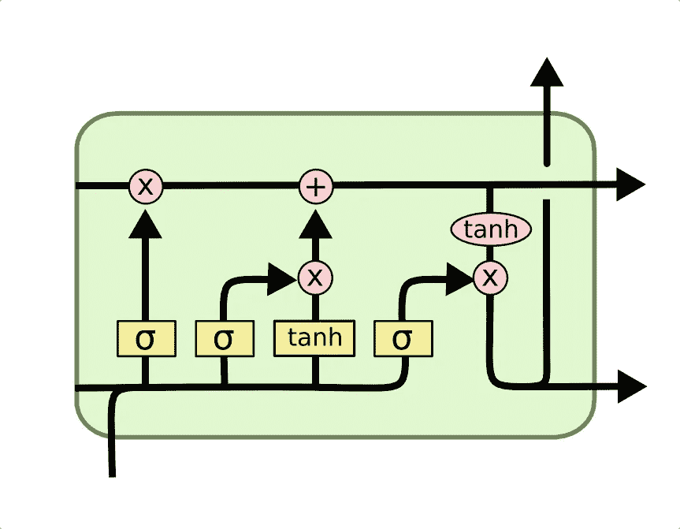
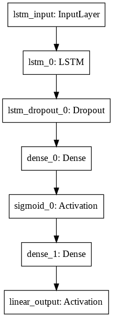
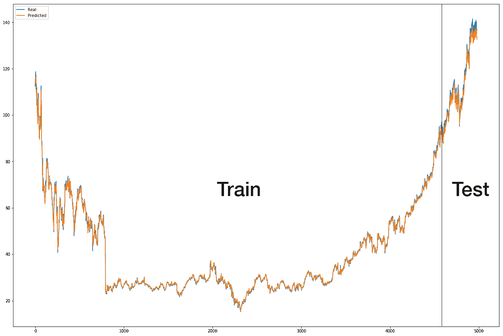
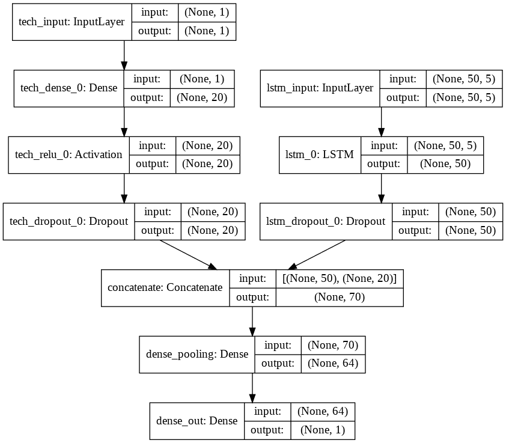
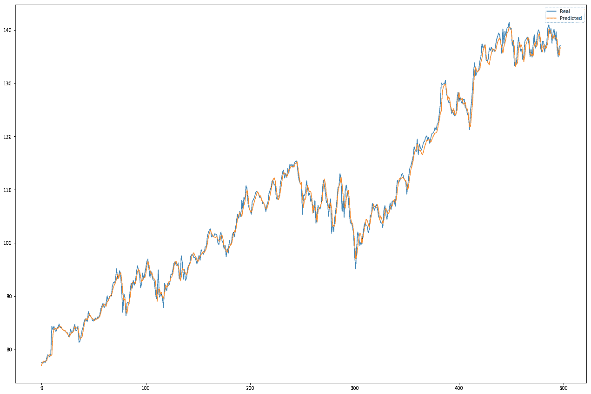
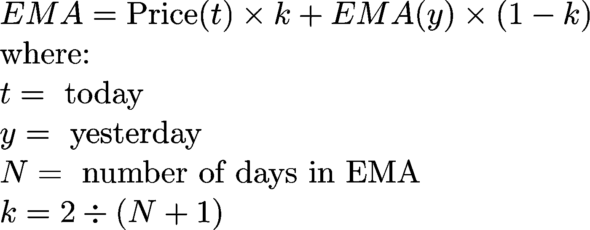
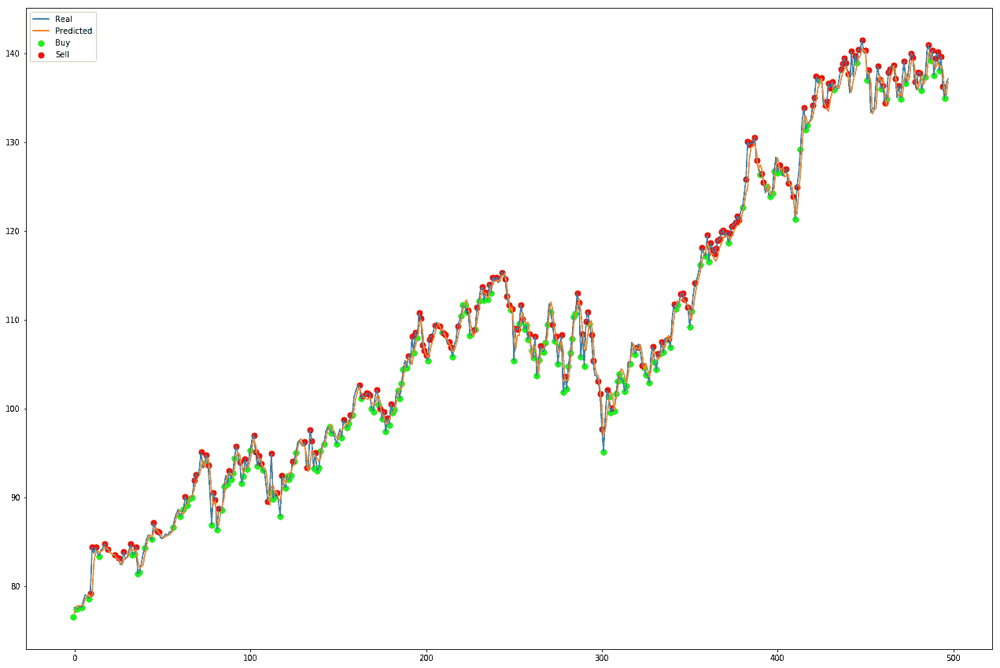
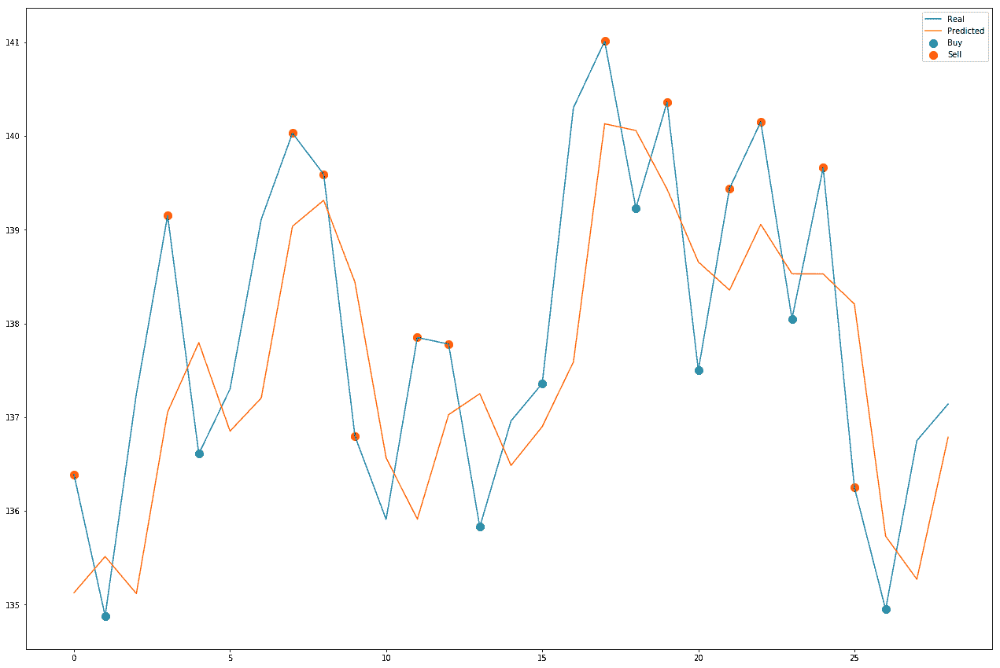

# 使用深度学习预测股票价格

> 原文：<https://towardsdatascience.com/getting-rich-quick-with-machine-learning-and-stock-market-predictions-696802da94fe?source=collection_archive---------0----------------------->

## 如果人类投资者可以成功，为什么机器不能？

我只想补充一个免责声明——这个项目完全是为了研究目的！我只是一个学习深度学习的学生，该项目是一项正在进行的工作，请不要把任何钱投入到像这样天真的算法中！

算法交易彻底改变了股票市场及其周边行业。现在美国超过 70%的交易都是由机器人处理的。穿着西装的人挥舞着纸片对着电话大喊的日子已经一去不复返了。

这让我开始思考如何开发自己的股票交易算法，或者至少尝试准确预测股票。

结果还不错！

My trading algorithm for the MSFT stock September — October 2019

我在这个夏天学到了很多关于神经网络和机器学习的知识，我学到的最新和最适用的 ML 技术之一是 LSTM 细胞[2]。

An LSTM cell. Credit: [https://colah.github.io/posts/2015-08-Understanding-LSTMs/](https://colah.github.io/posts/2015-08-Understanding-LSTMs/)

长短期记忆细胞类似于迷你神经网络，设计用于在更大的神经网络中进行记忆。这是通过使用 LSTM 细胞内的循环节点实现的。这个节点有一个权重为 1 的环回边，这意味着在每一次前馈迭代中，单元可以保存来自上一步以及所有上一步的信息。由于循环连接的权重是 1，旧的记忆不会像在传统的 rnn 中那样随着时间而褪色。

由于它们能够记住过去，因此 LTSMs 和递归神经网络擅长处理时间序列数据。通过在这些循环节点中存储一些旧状态，rnn 和 LSTMs 可以推断当前信息以及网络在一步、十步或一千步之前看到的信息。更好的是，我不必自己编写 LSTM 单元的实现；[它们是 Tensorflow 的 Keras](https://keras.io/layers/recurrent/#lstm) 中的默认图层。

所以我有我的计划；利用 LSTMs 和 Keras 预测股市，甚至可能赚点钱。

如果你想直接进入代码，你可以查看一下 [GitHub repo](https://github.com/yacoubb/stock-trading-ml) :)

***注来自《走向数据科学》的编辑:*** *虽然我们允许独立作者根据我们的* [*规则和指导方针*](/questions-96667b06af5) *发表文章，但我们不认可每个作者的贡献。你不应该在没有寻求专业建议的情况下依赖一个作者的作品。详见我们的* [*读者术语*](/readers-terms-b5d780a700a4) *。*

# 数据集

股票价格历史的好处是，它基本上是一个标记良好的预制数据集。在谷歌搜索了一番后，我找到了一项名为 AlphaVantage 的服务。他们提供了纳斯达克股票过去 20 年的每日价格历史。这包括从今天到 1999 年每天的开盘价、最高价、最低价、收盘价和交易量。更好的是，该服务有一个 [python 包装器](https://github.com/RomelTorres/alpha_vantage)。我从网站上获得了免费的 API 密匙，并下载了微软的每日股票历史。

由于 AlphaVantage 的免费 API 每分钟只允许 5 次调用(一天最多 500 次)，我选择下载数据集并以 CSV 格式保存，这样我就可以随时使用它们。

对于在过去 20 年内首次公开募股上市的股票，由于巨大的交易量，股票交易的第一天通常看起来不正常。这种膨胀的最大体积值还会影响数据集中其他体积值在标准化数据时的缩放方式，因此我选择从每个数据集中删除最旧的数据点。我还删除了日期，因为模型不需要知道任何关于*交易何时发生的信息，它需要的只是有序的时间序列数据。*

我还记录了我们想要使用的{ *history_points* }的数量；模型预测所依据的股票历史天数。因此，如果 history_points 设置为 50，模型将继续训练，并要求过去 50 天的股票历史来预测第二天的情况。

现在我们必须将数据标准化——在 0 和 1 之间调整——以提高我们网络的收敛速度。Sklearn 有一个很棒的*预处理*库能够做到这一点。

数据正常化现在包含正常化的股票价格。

现在让数据集为模型消费做好准备。

训练神经网络时， *ohlcv_histories* 列表将是我们的 x 参数。列表中的每个值都是一个 numpy 数组，包含 50 个开盘、盘高、盘低、收盘成交量值，从最早到最新排列。这由*历史点数*参数控制，如切片操作中所示。

所以对于每个 x 值，我们得到[i : i + history_points]个股票价格(记住 numpy 切片是[inclusive:exclusive])，那么 y 值必须是单数的[i + history_points]个股票价格；第二天的股票价格。

在这里，我们还必须选择我们打算预测的值。我决定预测第二天的 **open** 值，所以我们需要获得数据中每个 ohlcv 值的第 0 个元素，因此 *data_scaled[:，0]* 。

还有一个名为 y_normaliser 的变量。这在预测结束时使用，此时模型将吐出一个介于 0 和 1 之间的*归一化*数，我们希望应用数据集归一化的逆过程，将其按比例放大到真实值。在未来，我们也将使用它来计算我们模型的真实世界(非标准化)误差。

然后，为了获得与 Keras 一起工作的数据，我通过 *np.expand_dims()* 使 y 数组成为二维数组。最后，我保留未缩放的第二天开放值，以便稍后绘制结果。

在返回数据之前，我们检查 x 的数量= =的数量。

现在，我们可以通过运行以下命令来获取任何具有 csv 文件的数据集:

就是这样！我们的数据集准备好了。

# 模型

我开始这个项目时只知道如何编写顺序 Keras 代码，但我最终学习了它的函数式 API，因为我想要一个更复杂的网络结构，最终以每个分支中不同层类型的两个输入为特色。

我将首先检查我想出的最基本的模型。

这给了我们一个看起来像这样的模型:

Basic model architecture

输入层具有形状(history_points，5)，因为每个输入数据点都是一个形状类似于[*history _ points*】×OHLCV]的数组。该模型在第一层中有 50 个 LSTM 单元，一个用于防止过度拟合的下降层，以及一些用于将所有 LSTM 数据汇集在一起的密集层。

该网络的一个重要特征是线性输出激活，允许模型精确地调整其倒数第二个权重。

# 培训

这就是我喜欢 Keras 的原因。只需 3 行代码，您就可以立即知道您的模型在数据集上的表现如何。我得到了 0.00029 的最终评估分数，这看起来非常低，但请记住这是*标准化*数据的均方误差。缩放后，该值将显著上升，因此它不是一个很好的损失指标。

# 评估

为了更准确地评估该模型，让我们看看它是如何预测测试集并与真实值进行比较的。首先，我们放大预测值，然后计算均方误差，但为了得出相对于数据集的误差，我们将其除以测试数据的“分布”,即最大测试数据点减去最小值。

这给了我们一个调整后的均方差 **7.17** 。这样好吗？这并不令人惊讶，这意味着平均预测线偏离实际超过 7%。让我们看看它在图上的样子。

Real and predicted daily opening stock price of MSFT from the last 500 days, basic network

但是还不错！我不确定为什么预测值总是低于实际值，也许这与测试集和训练集的划分方式有关。以及整个数据集的结果:

Real and predicted daily opening stock price of MSFT since 1999, basic network

很难说算法在整个图表中的表现有多好，但正如我们所预期的那样，你肯定可以在训练集中看到更紧密的拟合。

# 改进

我们可以尝试让我们的模型更复杂，同时增加数据集的大小。让我们从尝试创建一个更复杂的模型开始。

股票市场分析师常用的指标是*技术指标*。技术指标是对股票价格历史进行的数学运算，传统上被用作视觉辅助工具来帮助识别市场的变化方向。我们可以通过二级输入分支来扩充我们的模型以接受这些技术指标。

现在让我们只使用简单的移动平均线 SMA 指标作为我们网络的额外输入。

要计算股票的简单移动平均线，只需取股票的*收盘*价格在过去 n 个时间步【5】的平均值。这对我们很有用，因为我们已经在处理固定时间步长的价格历史。为了在我们的模型中包含 SMA，我们必须更改数据集处理代码。

这发生在我们定义了 ohlcv_histories 和 next_day_open_values 数组之后。我们遍历每个 50 个价格的数据块，计算第三列的平均值，即收盘价，并将该值添加到一个*技术指标*列表中。然后，该列表经过与其余数据相同的转换，被缩放以适应值 0 到 1。然后我们修改 return 语句来返回技术指标，以及之前返回的其他内容。

现在来扩充模型以匹配这个新的数据集。我们希望能够使用我们的旧 LSTM 结构，但在组合中的某个地方纳入 SMA 技术指标。因为 SMA 不是时间序列数据，所以我们不应该通过 LSTM 传递它。相反，我们应该在做出最终预测之前将其混合；我们应该把它输入到倒数第二个 64 节点密集层。所以我们需要一个有两个输入的模型，一个连接层和一个输出。

Model architecture after augmentation to use technical indicators

请注意我们如何使用 technical_indicators.shape[1]作为 tech_input 层的输入形状。这意味着，当我们重新编译模型时，我们添加的任何新的技术指标都会很好地适应。

评估代码也必须更改，以匹配数据集的更改。

我们传入一个[ohlcv，technical_indicators]列表作为模型的输入。这个顺序与我们定义模型输入的方式相匹配。

并且我们得到调整后的均方差 **2.25** ！低得多，并且当绘制时，预测看起来明显更接近测试集；

Real and predicted daily opening stock price of MSFT from the last 500 days, using SMA

这个模型看起来没有以前的问题，即持续偏离一个固定的量，但似乎也没有捕捉到突然的跳跃。就像在 x 坐标 120 附近，实际价格会出现大幅的跳跃和下降，但模型未能有效地捕捉到这一点。但是越来越好了！看起来技术指标可能是前进的方向。

让我们试着包括一个更高级的技术指标:移动平均线收敛背离。MACD 的计算方法是从 12 期均线中减去 26 期指数移动平均线[6]。使用以下公式计算均线:

更新我们的技术指标循环，以包括 MACD 指标:

使用 SMA 和 MACD 指标，我们的模型实现了 2.60 的调整均方差。比仅使用 SMA 时略高，这反映在图表中。

Real and predicted daily opening stock price of MSFT from the last 500 days, using SMA and MACD

您可以看到，它不像仅使用 SMA 时那样精确。也许因为我们给了模型更多的数据，它需要更多的层来理解它，但现在我只是要省略 MACD 技术指标的使用。

我们还可以尝试使用更大的数据集。如果我们假设应用于微软股票的股票预测的技术可以推广到所有股票，那么我们就可以结合大量不同股票历史的 csv_to_dataset()函数的结果。例如，我们可以对 AMZN、FB、GOOGL、MSFT、NFLX 的股票历史进行训练，并测试 AAPL 股票的结果。

首先运行 save_dataset 方法，从本文开始的地方开始，对所有你想使用的不同股票进行操作。然后，数据集创建方法看起来像这样:

这基本上就是说对于当前目录下的每一个 csv 文件，如果文件名不是 *test_set_name* ，从其中加载数据集并追加到整个数据集。然后加载 *test_set_name* csv 文件，并将其用作测试数据集。使用 AMZN、NFLX、GOOGL、FB 和 MSFT 股票价格作为训练集，我们得到 19854 个训练样本。使用 AAPL 股票作为测试集，我们得到 4981 个测试样本。

在用这个新的、更大的数据集对 SMA 指标进行 50 个时期的训练后，我们得到了调整后的 MSE 值 **12.97** ，比我们只对一只股票进行训练时要高。也许股票预测实际上是特定符号的。不同股票的表现可能略有不同。很明显，它们基本上表现相似，因为网络能够从不同的股票中学习和归纳，但为了最准确的预测，最好只训练该股票的历史。毕竟，微软的数据集似乎有足够的训练数据来解决这个问题。

# 该算法

有了一个不错的股票预测算法，我想到了一个简单的方法来创建一个机器人，根据股票的历史来决定今天买/卖股票。本质上，你只是预测股票第二天的开盘价，如果开盘价超过了阈值，你就买入股票。如果低于另一个阈值，卖出股票。这个非常简单的算法实际上似乎工作得很好——至少在视觉上是这样。

然后绘制交易图。

看起来不错！该算法似乎是正确的低买高卖。请记住，这都是基于测试数据——网络从未见过的数据。没有理由说这些数据不可能是实时的，这些交易实际上是真实的！

给定这些买卖，如果我们说在每一次“买入”时我们买入价值 10 美元的股票，而在每一次“卖出”时我们卖出所有股票，那么该算法将赚得 38.47 美元。但请记住这是跨越 500 天的。计算算法收益的代码在这里；

相反，如果我们在 30 天内尝试这种算法，使用同样的 10 美元购买金额和 0.2 的阈值水平，该算法将获得微不足道的 1.55 美元。但这总比什么都没有好！

Trading algorithm for the MSFT stock over the past 30 days

# 结论

我认为预测算法还有一定的改进空间。也就是说，所使用的技术指标、历史点数超参数、购买/出售算法/超参数和模型架构都是我希望在未来优化的内容。

我还想通过建立更多的 LSTM 分支机构来为模型提供更多的数据，AlphaVantage 上的每个时间步长都有一个分支机构，这样网络就可以根据短期、中期和长期趋势做出决策。

这个项目的完整代码可以在我的 [GitHub](https://github.com/yacoubb/stock-trading-ml) 上找到。欢迎在问题页面留下任何反馈/改进！

我确实计划在这个项目上做更多的扩展，以真正推动仅仅使用数字数据来预测股票所能达到的极限。在我的[博客](https://yacoubahmed.me/blog)上了解我的最新动态！

# 参考

[1]:[https://www . exper fy . com/blog/the-future-of-algorithmic-trading](https://www.experfy.com/blog/the-future-of-algorithmic-trading)

【2】:【https://colah.github.io/posts/2015-08-Understanding-LSTMs/ 

[3]:[https://jovianlin . io/why-is-normalization-important-in-neural-networks/](https://jovianlin.io/why-is-normalization-important-in-neural-networks/)

【4】:[https://www.investopedia.com/terms/t/technicalindicator.asp](https://www.investopedia.com/terms/t/technicalindicator.asp)

【5】:[https://www.investopedia.com/terms/s/sma.asp](https://www.investopedia.com/terms/s/sma.asp)

[6]:[https://www.investopedia.com/terms/m/macd.asp](https://www.investopedia.com/terms/m/macd.asp)

[7]:[https://www . investopedia . com/ask/answers/122314/what-index-moving-average-EMA-formula-and-how-EMA-calculated . ASP](https://www.investopedia.com/ask/answers/122314/what-exponential-moving-average-ema-formula-and-how-ema-calculated.asp)