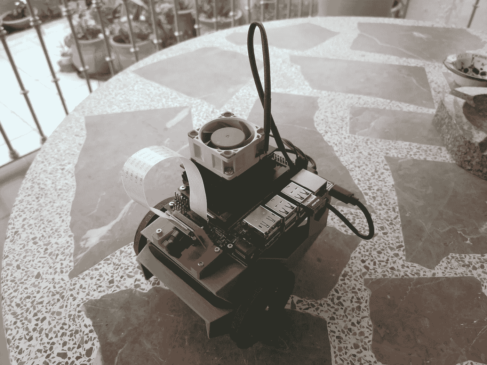
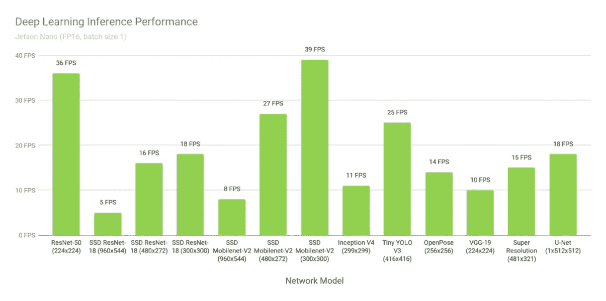
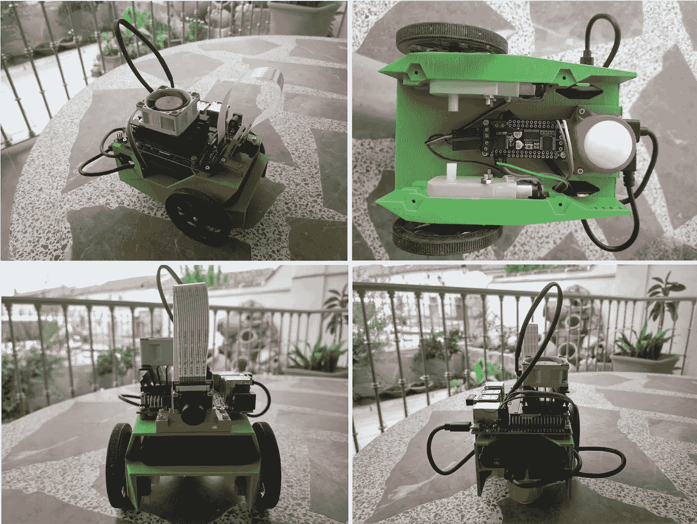
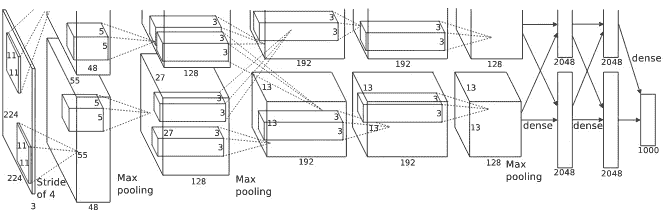
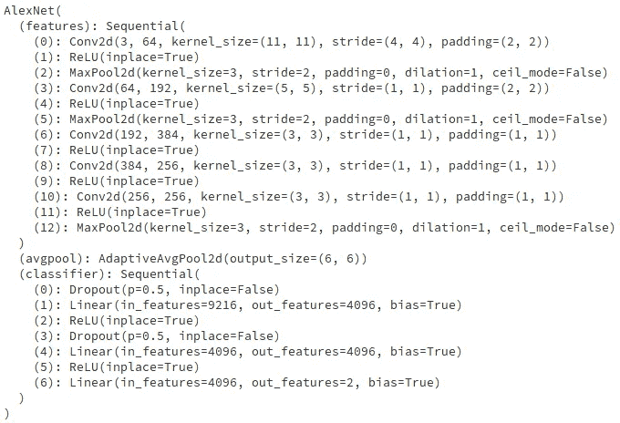

# Nvidia Jetson Nano 的人工智能和计算机视觉入门。JetBot 项目的实践方法

> 原文：<https://towardsdatascience.com/getting-started-in-ai-and-computer-vision-with-nvidia-jetson-nano-df2cacbd291c?source=collection_archive---------21----------------------->

## Nividia Jetson Nano board 允许您在嵌入式系统中开发定制的 ia 项目。从人脸检测到自动驾驶。



JetBot robot

随着 AI 和 IoT 的兴起，Nvidia 为我们提供了一个简单、廉价、强大的嵌入式人工智能应用开发解决方案。杰特森纳米公司为创造自制机器人、智能系统创造了机会

Jetson Nano 是一款类似覆盆子的主板，但功能更强大，它运行预装 Nvidia 软件的自定义 Ubuntu 映像。它拥有一个四核 ARM Cortex -A57 MPCore 处理器、带有 128 个 NVIDIA CUDA 内核的 NVIDIA Maxwell 架构 GPU 和 4 GB 64 位 LPDDR4 1600MHz 内存。这种硬件使得 Jetson Nano 适用于深度学习问题中的训练和推理阶段。它支持最常见的深度学习框架，如 TensorFlow、Caffe 或 PyTorch。



Jetson Nano performance on different models (source [here](https://developer.nvidia.com/embedded/jetson-nano-dl-inference-benchmarks))

有了这个板子，你就可以做一个叫 JetBot 的教育型 AI 机器人。构建和使用 JetBot 提供了创建全新人工智能项目所需的实践经验，包括硬件和软件阶段。构建 JetBot 不是本文的目标。在 GitHub 官方页面你可以找到所有的信息和需求。【https://github.com/NVIDIA-AI-IOT/jetbot 号

> *使用 Jetson Nano board，你可以轻松高效地运行大多数深度学习框架，如 TensorFlow、Caffe 或 PyTorch。*



JetBot perspectives

# 让我们让喷气机器人工作。拍照，训练我们的网络

运行这个项目的所有必要代码都可以在上面提到的 JetBot GitHub 页面上找到。不过，你可以利用我修改过的笔记本，它有一些改进，比如动态拍照，而用 Xbox 控制器远程移动你的 JetBot(很容易扩展到其他控制器)。

**第一步**。-收集数据以支持您的模型

[https://github . com/davidRetana/jetbot/blob/davidRetana/notebooks/collection _ remote operation . ipynb](https://github.com/davidRetana/jetbot/blob/davidretana/notebooks/collision_avoidance/data_collection_teleoperation.ipynb)

为了训练我们的神经网络，我们需要从相机中收集图像。我们需要两种图像:封锁和自由。注意以平衡的方式(50-50%)从两个类别中收集图像，并尝试同一遮挡物体或畅通路径的不同位置。一个好的数据集是机器人正常运行的关键。

如果路径受阻，JetBot 将向左转，相反，如果路径畅通，JetBot 将继续直行。

**步骤 2:** 训练网络

[https://github . com/davidRetana/jetbot/blob/davidRetana/notebooks/collision _ avoidance/train _ model . ipynb](https://github.com/davidRetana/jetbot/blob/davidretana/notebooks/collision_avoidance/train_model.ipynb)

从这项工作中选择的网络架构是 [AlexNet](https://papers.nips.cc/paper/4824-imagenet-classification-with-deep-convolutional-neural-networks.pdf) ，但稍加修改，以完成我们的要求。



AlexNet architecture

这个架构是为 ImageNet LSVRC-2010 竞赛设计的，有 1000 个不同的类。然而，我们的网络只需要区分一个图像是自由的还是阻塞的来移动 JetBot，所以最后一层只有 2 个输出。此外，PyTorch 允许我们下载预训练的 AlexNet 网络，这对于解决我们的问题是一个巨大的优势，因为在训练阶段，我们不需要随机启动网络权重。这些层拥有在 ImageNet LSVRC-2010 竞赛中从 1000 个不同班级学到的知识。为任务开发的模型被重用为模型完成不同任务的起点。这种技术被称为*迁移学习。*

```
import torch
import torchvision.models as models
model = models.alexnet(pretrained=True)
model.classifier[6] = torch.nn.Linear(model.classifier[6].in_features, 2)
print(model)
```



PyTorch representation of AlexNet

您可以在 JetBot 本身或外部系统中训练网络。笔记本准备将模型的权重导出到一个文件中，您可以稍后在 JetBot 中导入该文件。

第三步:运行你的模型

[https://github . com/davidRetana/jetbot/blob/davidRetana/notebooks/collision _ avoidance/live _ demo . ipynb](https://github.com/davidRetana/jetbot/blob/davidretana/notebooks/collision_avoidance/live_demo.ipynb)

现在，是时候运行您的模型，看看它是如何工作的。