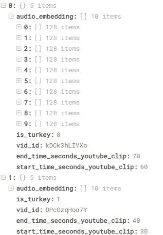
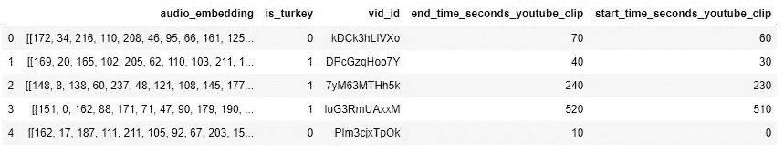
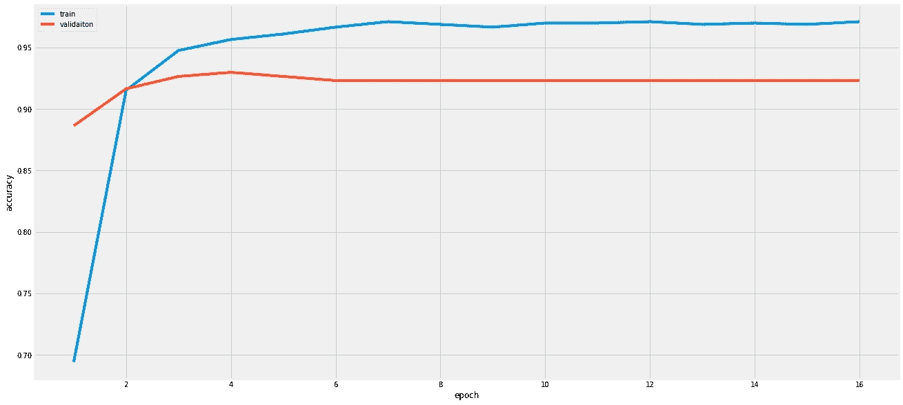
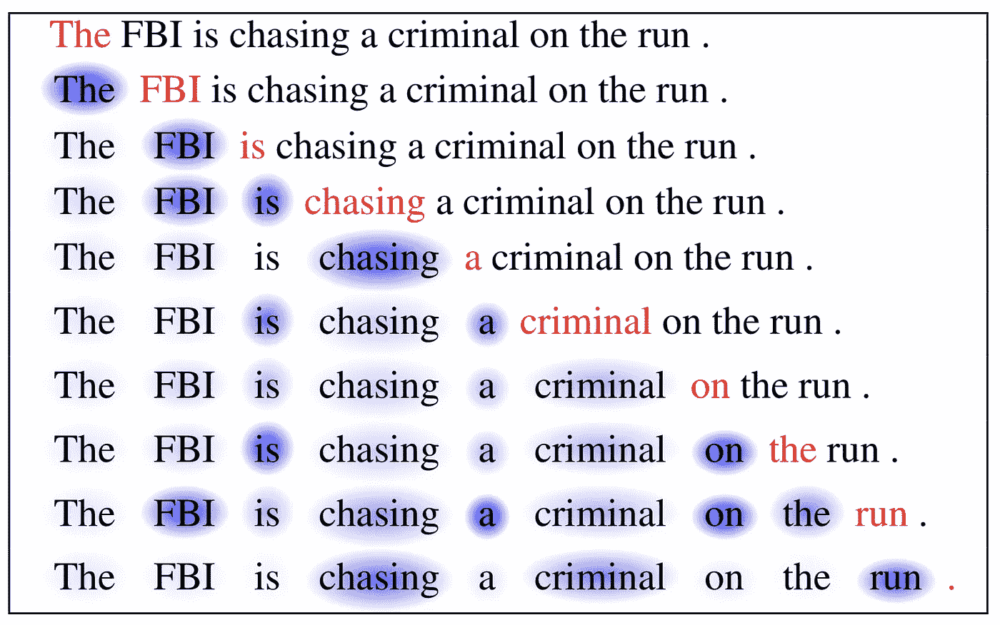

# 音频数据深度学习入门

> 原文：<https://towardsdatascience.com/getting-started-on-deep-learning-for-audio-data-667d9aa76a33?source=collection_archive---------11----------------------->

尽管随着梯度推进方法的兴起，传统的机器学习算法仍然在结构化数据上取得了胜利，但在处理非结构化数据方面，没有什么比深度学习更好了。


Photo by [Hitesh Choudhary](https://unsplash.com/@hiteshchoudhary?utm_source=medium&utm_medium=referral) on [Unsplash](https://unsplash.com?utm_source=medium&utm_medium=referral)

让我们回到标题。

*音频数据，你确定？*

好吧，不管是不是有意的，我想我们大多数人已经在基于音频的深度学习系统中尝试了一些解决方案。


[Ok, Google!](https://techcrunch.com/2016/06/29/ok-google-tea-earl-grey-hot/)

我可以肯定地假设我们大多数人都尝试过这个东西。

*你有没有想过那个功能是怎么建立的？*

# 非结构化数据的深度学习

是的，非结构化数据是迄今为止最适合深度学习的数据。虽然你也可以在结构化数据上使用它，但传统的机器学习可以在中等数量的数据上轻松击败性能。

像自动驾驶汽车、人脸识别或几个月前传播开来的臭名昭著的 FaceApp 这样的东西，都是图像数据深度学习系统的副产品。

***图像数据=像素颜色=非结构化数据***

基本上，非结构化数据意味着一堆数据点，没有对它们进行统计分析的手段。你不能在像素上使用任何形式的标准差，所以图像是非结构化的。

文本和音频也是如此。

音频数据是一串一个接一个排序的波形信号。你不可能分析均值对模型的影响。

# 我们去找音频数据

你知道非结构化数据的概念。现在，你想知道“好吧，谷歌！”正在建造的东西。

通俗地说，流程应该是这样的:

**你的手机听周围的话→有人说关键词“好的，谷歌！”→助手应用程序激活。**

什么！

*我手机每次都听我的？那不是侵犯隐私吗？*

嗯，这篇文章我不想谈那个问题。让我们继续第 2 步和第 3 步。

**如果你的手机听到关键词，它会打开应用程序。**

因此，在这个特别的教程中，我想分享你如何建立一个算法，能够区分关键词和其他声音。

# 音频数据深度学习教程

让我们来看看 [Kaggle](http://www.kaggle.com) ，

有一个关于如何区分火鸡(动物)的声音和其他声音的比赛。为什么是土耳其？我不知道。至少，它符合我们的需求。**关键词不一定要人声吧？Lol。**

下载数据，可以看到训练数据(train.json)



train.json data

您将看到一个包含 1195 个项目的 JSON 列表，这意味着您有 1995 个项目作为训练数据。

每个项目将有 5 个属性，

1.  视频 id，即来自 YouTube 的视频的 ID
2.  剪辑的开始时间
3.  剪辑的结束时间(因此，没有使用所有视频，只有 10 秒的视频)
4.  是火鸡，确定那是不是火鸡
5.  音频嵌入，这是从音频嵌入的 10 秒钟。他们使用[https://github . com/tensor flow/models/tree/master/research/audioset](https://github.com/tensorflow/models/tree/master/research/audioset)中的脚本将音频波转换成数字。我们可以只使用处理后的结果。

例如，你可以看这个超赞的火鸡视频，

美味的火鸡

从第 30 秒到第 40 秒观看。你知道有火鸡，尽管背景音乐扰乱了宁静。

# 准备工作

*等等*，我有点不知所措了。

看起来很复杂。我想从头说起。我不懂深度学习，连火鸡都不懂。

你可以在网上找到很多资源，从书籍、讲座到课程。去谷歌一下。

或者你可以从我之前策划的[开始。](https://thedatamage.com/best-course-for-ai-2019-updated/)

所以，现在你已经熟悉了术语和其他种类的东西，你已经准备好了。

# Python 和包

当然，Python。需要先从 [Python 官网](https://www.python.org/downloads/)安装。您需要安装 3.6+版以保持库的最新状态。

并从终端安装其他东西，

```
pip install numpy
pip install pandas
pip install seaborn
pip install matplotlib
pip install tensorflow
pip install keras
pip install jupyter
```

让我们从终端键入 *jupyter notebook* ，我们就可以开始了！

```
import numpy as np
import pandas as pd 
import os
import seaborn as sns
import matplotlib.pyplot as plt
import seaborn as sns
plt.style.use('fivethirtyeight')
from tqdm import tqdm
print(os.listdir("../input"))
```

准备好库，您可以看到输出

```
['train.json', 'sample_submission.csv', 'test.json']
```

导入您需要的 Keras 包

```
from keras import Sequential
from keras import optimizers
from keras.preprocessing.sequence import pad_sequences
from keras.models import Sequential,Model
from keras.layers import LSTM, Dense, Bidirectional, Input,Dropout,BatchNormalization,CuDNNLSTM, GRU, CuDNNGRU, Embedding, GlobalMaxPooling1D, GlobalAveragePooling1D, Flatten
from keras import backend as K
from keras.engine.topology import Layer
from keras import initializers, regularizers, constraints
from sklearn.model_selection import KFold, cross_val_score, train_test_split
```

当然，还要准备好你的数据

```
train = pd.read_json('../input/train.json')
display(train.shape)
```

它会显示

```
(1195, 5)
```

是的，你有 1195 个数据要处理。

让我们看看数据的内部

```
train.head()
```



让我们为训练准备数据。您需要拆分其中的一些进行验证，这样您就可以确保模型能够很好地处理看不见的数据。

```
train_train, train_val = train_test_split(train, random_state = 42)
xtrain = [k for k in train_train['audio_embedding']]
ytrain = train_train['is_turkey'].valuesxval = [k for k in train_val['audio_embedding']]
yval = train_val['is_turkey'].values
```

train_test_split 方法默认情况下，将数据按 3:1 分割意味着 75%的数据进入定型集，而剩余的 25%进入验证集。

为了在数据上创建一个标准，让我们用零填充所有音频嵌入，直到它们都具有相同的 10 秒长度。

```
# Pad the audio features so that all are "10 seconds" long
x_train = pad_sequences(xtrain, maxlen=10)
x_val = pad_sequences(xval, maxlen=10)y_train = np.asarray(ytrain)
y_val = np.asarray(yval)
```

# 让我们创建模型！

```
model = Sequential()
model.add(BatchNormalization(momentum=0.98,input_shape=(10, 128)))
model.add(Bidirectional(CuDNNGRU(128, return_sequences = True)))
model.add(Flatten())
model.add(Dense(1,activation='sigmoid'))
model.compile(loss='binary_crossentropy', optimizer = optimizers.Nadam(lr=0.001), metrics=['accuracy'])
print(model.summary())
```

详细情况如下:

```
_________________________________________________________________
Layer (type)                 Output Shape              Param #   
=================================================================
batch_normalization_7 (Batch (None, 10, 128)           512       
_________________________________________________________________
bidirectional_7 (Bidirection (None, 10, 256)           198144    
_________________________________________________________________
flatten_2 (Flatten)          (None, 2560)              0         
_________________________________________________________________
dense_7 (Dense)              (None, 1)                 2561      
=================================================================
Total params: 201,217
Trainable params: 200,961
Non-trainable params: 256
_________________________________________________________________
```

看一下这段代码

```
model.add(Bidirectional(CuDNNGRU(128, return_sequences = True)))
```

那是什么鬼东西？


Photo by [Sean O.](https://unsplash.com/@seantookthese?utm_source=medium&utm_medium=referral) on [Unsplash](https://unsplash.com?utm_source=medium&utm_medium=referral)

在继续之前，让我们看看美丽的日出。当然也能提神醒脑。哈哈

# 处理音频数据

这是你必须知道的事情。音频数据是一系列声波。将一个连接到另一个。

有了这个属性，音频数据基本上就是一个数字序列。

当然，对于数字，你可以用格鲁的 LSTM

这两种算法都非常擅长处理数列。基本上，他们可以保存他们“阅读”的内容，并在处理下一个数字时使用该信息。**这种“短期记忆”让他们比其他算法更有优势。**

在这个教程中，我用了 GRU

让我们回到代码上来

```
model = Sequential()
model.add(BatchNormalization(momentum=0.98,input_shape=(10, 128)))
model.add(Bidirectional(CuDNNGRU(128, return_sequences = True)))
model.add(Flatten())
model.add(Dense(1,activation='sigmoid'))
```

我在 Keras 上创建了一个简单的模型，

1.  添加 BatchNorm 层以标准化输入数字(音频输入尚未标准化)
2.  添加双向 GRU 来处理输入
3.  拉平结果
4.  为“对-错”或二元问题创建一个 sigmoid 密集层。

# **训练时间！**

```
#fit on a portion of the training data, and validate on the rest
from keras.callbacks import EarlyStopping, ModelCheckpoint, ReduceLROnPlateaureduce_lr = ReduceLROnPlateau(monitor='val_acc', factor=0.1, patience=2, verbose=1, min_lr=1e-8)early_stop = EarlyStopping(monitor='val_loss', verbose=1, patience=20,  restore_best_weights=True)history = model.fit(x_train, y_train,batch_size=512, epochs=16,validation_data=[x_val, y_val],verbose = 2,callbacks=[reduce_lr,early_stop])
```

它会显示这个结果

```
Epoch 16/16
 - 0s - loss: 0.1037 - acc: 0.9710 - val_loss: 0.1694 - val_acc: 0.9231
```

它在验证测试中有 92.31%的准确率！厉害！

让我们绘制培训历史

```
def eva_plot(History):
    plt.figure(figsize=(20,10))
    sns.lineplot(range(1, 16+1), History.history['acc'], label='Train Accuracy')
    sns.lineplot(range(1, 16+1), History.history['val_acc'], label='Test Accuracy')
    plt.legend(['train', 'validaiton'], loc='upper left')
    plt.ylabel('accuracy')
    plt.xlabel('epoch')
    plt.show()
    plt.figure(figsize=(20,10))
    sns.lineplot(range(1, 16+1), History.history['loss'], label='Train loss')
    sns.lineplot(range(1, 16+1), History.history['val_loss'], label='Test loss')
    plt.legend(['train', 'validaiton'], loc='upper left')
    plt.ylabel('loss')
    plt.xlabel('epoch')
    plt.show()eva_plot(history)
```



这个简单的模型实际上可以做一些伟大的事情。我们甚至没有对它做任何优化。

好吧，如果你想优化，欢迎你来做。

虽然，我想做另一种形式的优化。不知道结果如何，何乐而不为。

# 求关注！

不，我是说，注意力机制。看看下面的图片


Photo by [Zdeněk Macháček](https://unsplash.com/@zmachacek?utm_source=medium&utm_medium=referral) on [Unsplash](https://unsplash.com?utm_source=medium&utm_medium=referral)

你看到了什么？

当然，**那只鸟**

而不是图像中的绿色背景。

这就是人类的感知方式。我们想在机器上模拟这个机制。



[Attention! Attention!](https://lilianweng.github.io/lil-log/2018/06/24/attention-attention.html)

上图向你展示了注意力机制。这是一种机制，它迫使网络在处理新事物的同时关注某些事物。

每一行都意味着一步一步的处理。**红色的**字是当前正在处理的字。而蓝色的，越蓝意味着越多的机器关注这个词。

这将使机器与上下文保持一致。

# 实施

感谢我们在 [kaggle](https://www.kaggle.com/qqgeogor/keras-lstm-attention-glove840b-lb-0-043) 的朋友，我们可以使用这个令人敬畏的类，

```
class Attention(Layer):
    def __init__(self, step_dim,
                 W_regularizer=None, b_regularizer=None,
                 W_constraint=None, b_constraint=None,
                 bias=True, **kwargs):
        self.supports_masking = True
        self.init = initializers.get('glorot_uniform')self.W_regularizer = regularizers.get(W_regularizer)
        self.b_regularizer = regularizers.get(b_regularizer)self.W_constraint = constraints.get(W_constraint)
        self.b_constraint = constraints.get(b_constraint)self.bias = bias
        self.step_dim = step_dim
        self.features_dim = 0
        super(Attention, self).__init__(**kwargs) def build(self, input_shape):
        assert len(input_shape) == 3 self.W = self.add_weight((input_shape[-1],),
                                 initializer=self.init,
                                 name='{}_W'.format(self.name),
                                 regularizer=self.W_regularizer,
                                 constraint=self.W_constraint)
        self.features_dim = input_shape[-1] if self.bias:
            self.b = self.add_weight((input_shape[1],),
                                     initializer='zero',
                                     name='{}_b'.format(self.name),
                                     regularizer=self.b_regularizer,
                                     constraint=self.b_constraint)
        else:
            self.b = None self.built = True def compute_mask(self, input, input_mask=None):
        return None def call(self, x, mask=None):
        features_dim = self.features_dim
        step_dim = self.step_dim eij = K.reshape(K.dot(K.reshape(x, (-1, features_dim)),
                        K.reshape(self.W, (features_dim, 1))), (-1, step_dim)) if self.bias:
            eij += self.b eij = K.tanh(eij) a = K.exp(eij) if mask is not None:
            a *= K.cast(mask, K.floatx()) a /= K.cast(K.sum(a, axis=1, keepdims=True) + K.epsilon(), K.floatx()) a = K.expand_dims(a)
        weighted_input = x * a
        return K.sum(weighted_input, axis=1) def compute_output_shape(self, input_shape):
        return input_shape[0],  self.features_dim
```

不要强迫自己去理解这件事。让我们只是改变我们的模型

```
model = Sequential()
model.add(BatchNormalization(momentum=0.98,input_shape=(10, 128)))
model.add(Bidirectional(CuDNNGRU(128, return_sequences = True)))
model.add(Attention(10))
model.add(Dense(1,activation='sigmoid'))
model.compile(loss='binary_crossentropy', optimizer = optimizers.Nadam(lr=0.001), metrics=['accuracy'])
print(model.summary())
```

改变扁平化层注意。你会看到

```
_________________________________________________________________
Layer (type)                 Output Shape              Param #   
=================================================================
batch_normalization_6 (Batch (None, 10, 128)           512       
_________________________________________________________________
bidirectional_6 (Bidirection (None, 10, 256)           198144    
_________________________________________________________________
attention_2 (Attention)      (None, 256)               266       
_________________________________________________________________
dense_6 (Dense)              (None, 1)                 257       
=================================================================
Total params: 199,179
Trainable params: 198,923
Non-trainable params: 256
_________________________________________________________________
```

它减少了大约 2000 个可训练参数。嗯，这是好事。让我们试试训练

# 培训 v2

```
early_stop = EarlyStopping(monitor='val_loss', verbose=1, patience=20,  restore_best_weights=True)model.fit(x_train, y_train,batch_size=512, epochs=16,validation_data=[x_val, y_val],verbose = 2,callbacks=[reduce_lr,early_stop])
```

现在你得到了:

```
Epoch 16/16
 - 0s - loss: 0.1037 - acc: 0.9710 - val_loss: 0.1680 - val_acc: 0.9331
```

耶！1%增长到 **93.31%**

不多，但肯定是增加了！


Photo by [Warren Wong](https://unsplash.com/@wflwong?utm_source=medium&utm_medium=referral) on [Unsplash](https://unsplash.com?utm_source=medium&utm_medium=referral)

# 结论

创建音频数据的深度学习系统非常容易。

你只需要知道怎么做。变得更好，以创造真正的“好吧，谷歌！”。

去试试吧。当然，你可以尝试教程，并改变你想要的参数或网络。

祝你好运！