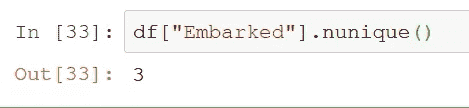
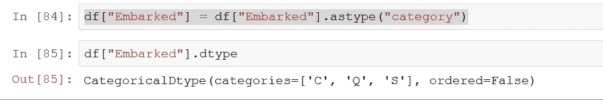

# Python 熊猫数据分析入门

> 原文：<https://towardsdatascience.com/getting-started-to-data-analysis-with-python-pandas-with-titanic-dataset-a195ab043c77?source=collection_archive---------5----------------------->

## **动手练习(使用 Titanic 数据集)**


在本文中，我将重点介绍导入数据集、处理**缺失值**、更改**数据类型**、**过滤**、**排序**、**选择特定列**、处理**重复值**、**删除**和**添加行**和**列**、**计数值**、**计算唯一值**

**在我的毕业设计中，我在没有使用任何库的情况下处理了许多数据预处理的东西。我刚刚使用了 if 语句和 for 循环。简直要了我的命。在我开始学习熊猫后，我决定写这篇文章来帮助学生和初学者入门。我将尽我所能向你介绍熊猫在探索性数据分析阶段的一些最有用的能力。先说蟒蛇熊猫的定义。**

****Pandas** 是一个为 **Python** 编程语言编写的软件库，用于数据操作和分析。**

*   **用于集成索引的数据操作的 DataFrame 对象。**
*   **用于在内存数据结构和不同文件格式之间读写数据的工具。**
*   **数据对齐和缺失数据的综合处理。**
*   **数据集的整形和旋转。**
*   **大型数据集的基于标签的切片、花式索引和子集化。**
*   **数据结构列的插入和删除。**
*   **按引擎分组，允许对数据集进行拆分-应用-组合操作。**
*   **数据集合并和连接。**
*   **层次轴索引用于在低维数据结构中处理高维数据。**
*   **时间序列-功能:日期范围生成和频率转换，移动窗口统计，移动窗口线性回归，日期移动和滞后。**
*   **提供数据过滤。( [Ref-1](https://en.wikipedia.org/wiki/Pandas_(software))**

# ****数据集****

**我们将使用 Kaggle 上著名的泰坦尼克号数据集。要下载并使用它，请点击此处的。在你点击给定的链接后，你必须点击“全部下载”。如果找不到下载按钮，如下所示。**

****

**Downloading the dataset**

**该网站可能会引导你到竞争选项卡，你所要做的就是点击“加入竞争”。之后，您将能够下载数据集。**

## **先说进口熊猫。**

```
import pandas as pd
```

**熊猫常见的捷径是 pd。而不是写“熊猫”我们可以写“pd”现在。所以，在“pd”后面有一个点，用来从 Pandas 库中调用一个方法。**

# **使用 read_csv 导入数据集**

**为了读取数据集，我们将使用 ***read_csv*** 。**

```
df = pd.read_csv("train.csv")
```

# ****检查数据帧的第一个元素。头()方法****

**运行上面的代码后，什么都不会出现。所以你要写 df 才能看到你的数据。但是我们不是看到所有的数据，而是使用“**”。头**()"方法查看第**个**元素的数据。在运行 read_csv 代码之前，可以编写下面的 df.head()。所以会是这样的:**

****

**.head() to see first 5 elements of the dataframe**

**在括号内，我们可以写下我们想要看到的元素的数量。如果我们将其留空，它将显示五个元素中的第一个**。如果我们在括号内写 25，它将显示数据帧的前 25 个元素。****

****

**.head(25) to see first 25 elements of the dataframe**

# **用检查数据帧的最后元素。tail()方法**

**还有一种方法可以查看最后 n 个元素。该方法称为**。尾巴()**。**

**同样的规则也适用于此。如果我们将括号留空，它将被设置为 5，如果我们在括号内写 25，它将显示数据帧的最后 25 个元素。**

```
df.tail(25)
```

****

**.tail(25) to see last 25 elements of the dataframe**

## **总结。头()和。尾部()**

**总而言之，这些方法返回数据帧的顶部和底部。默认行数设置为 5。但是，您可以通过在括号内写入您希望看到的行数来更改它。**

## ****读取具有特定列的 CSV 文件****

**假设您不想要 CSV 文件中的所有列。你只是想要三个，你想一开始就摆脱他们。怎么做呢？好消息！有一个非常简单的方法可以做到这一点。我们将使用 **usecols** 参数来指定我们想要使用的列名。让我们只使用 **PassengerId、Survived、Pclass** 列。**

```
df = pd.read_csv("train.csv", usecols= ["PassengerId", "Survived", "Pclass"]) 
df.head() #and add this to see if our code worked
```

****

**Reading only three columns with **usecols** argument**

**这只是一个例子。我们将处理全部数据。**

# **获取有关数据集的一些信息。描述()和。信息()**

**在我们用 **read_csv，**加载数据集之后，我们希望获得一些关于列的信息。为此，我们将使用。描述()和。信息()**

## **。describe()方法**

**此方法用于获取数据集中数值的汇总。它计算带有数值的列的平均值、标准差、最小值、最大值、第 1 个百分点、第 2 个百分点、第 3 个百分点。它还计算数据集中变量的数量。因此，我们将能够看到列中是否有丢失的值。**

```
df.describe()
```

****

**Summary of statistics with **.describe()** method**

**我们可以看到**年龄**栏的计数是 714，均值是 29.6，标准差是 14.52 等等。多亏了 count，我们才能明白这一列中有一些缺失的值。我们稍后会处理它们。**

## **。信息()方法**

**这个方法打印关于数据帧的信息，包括索引数据类型和列数据类型、非空值和内存使用情况。( [Ref-2](https://pandas.pydata.org/pandas-docs/stable/reference/api/pandas.DataFrame.info.html)**

```
df.info()
```

****

**我们还可以看到带有**的列的数据类型。数据类型****

****

# **基于列对数据帧进行排序**

## **排序数字数据**

**在我们的数据框架中有一列表示乘客购买的机票价格。让我们假设我们希望看到最低的票价。为此，我们必须使用**。sort_values()** 方法。不管要排序的列是字符串还是数字。如果包含字母，它将按字母顺序排序。**

```
df.sort_values("Fare")
```

****

****.sort_values** without any arguments**

**我们曾经。head()方法只能看到排序后的前 10 个结果。我们可以看到最低的“票价”值是 0。如果我们想看最高票价呢？我们所要做的就是使用**。**法尾()。不，只是开玩笑。我们必须将**升序**参数设置为 **False** 。但是使用**。tail()** 是替代:p。**

```
df.sort_values("Fare", ascending = False).head(10)
```

****

****.sort_values** with **ascending** argument**

**由于这一点，我们可以看到乘客支付的最高票价。如果我们想保存数据帧的排序版本，有两种选择。一种是老方法，那就是**

```
df = df.sort_values("Fare", ascending = False)
```

**另一种方法是使用**代替**参数。如果我们把这个论点设为真，它就会改写它。**

```
df.sort_values("Fare", ascending = False, inplace = True)
```

**执行完上面的代码后，我们将使用**。head()** 方法来检查我们的 DataFrame 的新版本。**

****

****.sort_values** and save it with **inplace** argument**

## ****用字符串对列进行排序****

**我们要对**【小屋】**列进行排序。此列中有许多缺失(NaN)值。我们该如何对付他们？幸运的是，有一个名为 **na_position** 的参数可以帮助我们设置 NaN 值在数据集中的位置。**

```
df.sort_values("Cabin", ascending = True, na_position ='last')
```

****

**通过使用。tail(20)，我们可以看到数据集的最后 20 个元素。如果我们查看 Cabin 列，我们可以看到所有的值都是 NaN。**

**到 ***总结*** ，我们学会了用**读取 csv 文件。read_csv** 方法(选择和不选择特定列)，使用**。头()**和**。tail()** 查看顶部和底部的元素，用**获取关于数据集的信息。形容()**和**。info()，**包含字符串或数值的已排序列(有和没有 NaN 值)**

# **计算变量的出现次数**

**在某些情况下，知道一列中有多少唯一变量，或者一列中每一项的出现次数可能非常有用。我们用**来统计一下男女乘客的数量。value_counts()****

## **使用。value_counts()计算一列中每个变量的出现次数**

**要计算变量的出现次数，我们必须首先选择列。您可以用两种不同的方式选择列:**

```
df.Sex
df["Sex"]
```

**自从。value_counts()是一个方法，我们所要做的就是将这个方法附加到上面的代码中。它看起来会像这样:**

```
df[“Sex”].value_counts()
```

****

**Counting the occurences of elements in “Sex” column with **.value_counts()****

## **使用。nunique()计算数据集或列中出现的唯一值的数量**

**如果我们想查看一个数据集或一个列中唯一记录的数量，我们必须使用。nunique()方法。**

```
df.nunique() #by typing this, we can see the counts of unique numbers in each column
```

****

**Counting the number of unique records in each column with **.nunique()****

**我们还可以用**统计唯一记录。nunique()** 为一列。我们所要做的就是添加列名。**

```
df["Embarked"].nunique()
```

****

**Counting unique records in a column with **.nunique()****

**如果您想要查看多列的唯一记录的数量，您必须再添加一个方括号。**

```
df[["Embarked", "Sex"]].nunique()
```

****

**Counting unique records for more than one column with **.nunique()****

# **更改数据类型**

**我们检查了 Titanic 数据集中列的数据类型。我们看到**搭载的**列的类型是 object。对**栏中的唯一值进行计数后，用。unique()，我们可以看到该列中有 3 个唯一值。所以我们可以认为数据类型应该是分类的。要更改该列的数据类型，必须执行下面的代码:****

```
df["Embarked"] = df["Embarked"].astype("category")
df["Embarked"].dtype
```

**输出是:**

****

**Converting the data type of **Embarked** column to **Category****

# **过滤**

## **在一个条件下过滤**

**Python 中的比较符号是 **==** (双等号)。所以你应该仔细检查你是否使用了两个等号。如果你只使用一个等号，你可能会破坏你的数据。假设我想看看“已上船”一栏是否等于“C”。比较的真实版本是:**

```
df["Embarked"] == "C" 
```

**输出将是:**

****

**Checking if Embarked column is C for each row in data with **double equal sign****

**如果我像这样写代码**

```
df["Embarked"] = "C"
```

**它会将已装载列中的所有值设置为“C”。**

****

**Wrong usage of equal signs**

**如果我们不想只看到真和假呢？如果我们想看到所有 C 语言用户的信息怎么办？为此:**

```
df[df["Embarked"] == "C"]
```

**如果我们这样写，熊猫会理解我们希望看到那些有真正价值的行。输出是:**

****

**另一种方法可能是:**

```
embarked_c_mask = df["Embarked"] == "C"
df[embarked_c_mask]
```

**如果我们想过滤我们的数据，反之亦然:**

```
df[df[“Embarked”] != “C”]
```

**它将向行显示它们的已装载列不是“C”。输出是**

****

**Not equal to filtering**

## **在两个或多个条件下过滤**

## **逻辑积算符**

**我们将使用 AND 和 OR 运算符来过滤多个条件。假设我们想要查看票价小于 100 且为女性的乘客。我们将创建 2 个新的遮罩来完成此操作。**

```
df_fare_mask = df["Fare"] < 100
df_sex_mask = df["Sex"] == "female"
df[df_fare_mask & df_sex_mask]
```

**输出是:**

****

**Those passengers whose fare is less than 100 and who are female**

## **OR 运算符**

**让我们用 OR 运算符做另一个例子。我们将使用|符号来实现这一点。让我们看看票价在 500 以上或 70 岁以上的乘客。**

```
df_fare_mask2 = df[“Fare”] > 500
df_age_mask = df["Age"] > 70
df[df_fare_mask2 | df_age_mask]
```

**输出是:**

****

# **用查找空值。isnull()**

**数据科学中最常见的问题之一是缺少值。要检测它们，有一个很好的方法，叫做。isnull()。用这种方法，我们可以得到一个布尔数列(真或假)。正如我们之前所做的，通过屏蔽条件，我们可以提取空值。例如**

```
null_mask = df["Cabin"].isnull()
df[null_mask]
```

**有了这个代码，我们就是在说“给我看看客舱未知的乘客”。输出是:**

****

**除了在列上使用这种方法，它还可以在整个数据集上使用。如果我们想计算一个数据帧中所有列的空值，我们只需编写下面的代码**

```
df.isnull().sum()
```

****

**It is possible to see all sum of the missing values in all columns in a dataset with **.isnull().sum()****

# **处理缺失值**

**有很多处理缺失值的方法，但在本文中，我们将使用“忽略元组”和“用中位数填充它”。我们将忽略“**舱**栏，因为该栏的 **%70** 是**缺失**。我们将用该列的中值**填充缺失的年龄。****

## ****删除一列****

**要删除“Cabin”列，我们必须执行下面的代码。**

```
df.drop(labels = ["Cabin"], axis=1).head()
```

**我们曾经。空投舱柱的空投方法。上面有一个 2 的论点。在 labels 参数中，我们必须指定要删除的列名，在 axis 参数中，我们指定按列删除。**

****

**如果你想删除不止一列的**，你所要做的就是把它添加到方括号中。例如:****

```
df.drop(labels = ["Cabin", "Name"], axis=1).head()
```

**我们将同时删除客舱列和名称列。正如我之前提到的，如果我们知道我们不会使用这些列，我们就会使用**的 **usecols** 参数。read_csv** 方法去掉开头的列。**

## **用填充缺少的值。菲尔娜**

**为了填充数据帧中缺失的值，有一个叫做**的方法。菲尔娜()**。**

**让我们假设在一列中有许多缺失值，我们想用 0 来填充它们。我们要做的就是写下面的代码**

```
df["columnname"].fillna(0, inplace = True) #with inplace argument, we don't have to write it as
df["columnname"] = df["columnname"].fillna(0, inplace = True)
```

**我们也可以用一个特定的值来填充它。让我们在泰坦尼克号数据集上举个例子**

```
df["Age"].fillna("Unknown", inplace = True)
```

**但是，我们不是用“未知”来填充年龄列中缺少的值，而是使用该列的中值。为此:**

```
df['Age'] = df['Age'].fillna((df['Age'].median()))
```

**如果我们想用均值或其他东西填充缺失的值，我们要做的就是在最后改变方法。执行完这段代码后，我们应该检查年龄列中是否还有空值。**

****

**如果你有任何问题，不要犹豫地问。非常感谢你的评论。**

**你可以通过 LinkedIn 联系我:[https://www.linkedin.com/in/sukruyavuz/](https://www.linkedin.com/in/sukruyavuz/)**

**或电子邮件:sukruyavuz96@gmail.com**

**谢谢你的时间。**