# Apache Cassandra 和 Python 入门

> 原文：<https://towardsdatascience.com/getting-started-with-apache-cassandra-and-python-81e00ccf17c9?source=collection_archive---------2----------------------->


在这篇文章中，我将谈论 Apache Cassandra，它的用途、用法、配置和设置集群，最后，你如何在你的 Python 应用程序中访问它。在这篇文章的最后，你应该对 Cassandra 有了一个基本的了解，以及如何在你的 Python 应用中使用它。

# 什么是阿帕奇卡珊德拉？

根据维基百科:

> Apache Cassandra 是一个免费的开源分布式宽列存储 NoSQL 数据库管理系统，旨在处理许多商用服务器上的大量数据，提供无单点故障的高可用性。Cassandra 为跨多个数据中心的集群提供了强大的支持，[1]异步无主机复制允许所有客户端进行低延迟操作。

两位脸书工程师开发的 Cassandra 用于处理收件箱的搜索机制。后来，脸书将其作为谷歌代码的开源项目发布，过了一段时间，它被移交给阿帕奇基金会。许多知名公司都在使用 Cassandra，比如网飞、苹果、天气频道、易贝等等。它的分散性(无主系统)、容错性、可伸缩性和持久性使其优于竞争对手。让我们讨论一下它的架构，如果你愿意，你可以跳到安装和设置部分。我建议你浏览一下架构部分，因为它会让你知道为什么你会想使用它。

# 卡桑德拉建筑

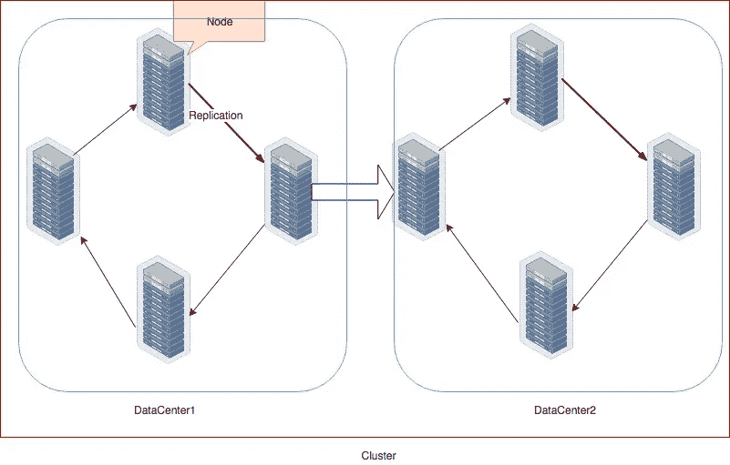

Cassandra 架构由以下组件组成:

## 结节

它是数据的基本组成部分，是存储数据的机器

## 资料处理中心

相关节点的集合。它可以是物理数据中心或虚拟数据中心

## 串

一个集群包含一个或多个数据中心，它可以跨越多个位置。

## 提交日志

每个写操作首先存储在提交日志中。它用于崩溃恢复。

## 记忆表

将数据写入提交日志后，它会存储在 Mem-Table(内存表)中，直到达到阈值。

## 表

Sorted-String Table 或 SSTable 是一个磁盘文件，它在 MemTable 达到阈值时存储其中的数据。表按顺序存储在磁盘上，并为每个数据库表进行维护。

# 写操作

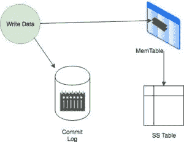

Write Operation Flow

*   一旦收到写请求，它首先被转储到提交日志中，以确保数据被保存。
*   数据还被写入 MemTable，这是一个内存系统，它保存数据直到填满。
*   一旦 MemTable 达到其阈值，其数据就会被刷新到 SS 表中。

接受写请求的节点被称为用于特定操作的**协调器**。它充当发送请求的客户端和其他节点之间的代理。然后，协调器根据集群配置确定环中的哪个节点应该接收该数据。

*一致性级别*决定了有多少节点会用成功确认来回应。

# 读取操作

协调器可以向副本发送三种类型的读取请求:

1.  **直接请求:-** 协调器节点向其中一个副本发送读取请求。之后，向其他副本发送一个摘要请求，以确定返回的数据是否是更新的数据。
2.  **摘要请求:**协调器联系由一致性级别指定的复制品。被联系的节点用所需数据的摘要请求来响应。每个副本中的行在内存中进行比较，以确保一致性。如果它们不一致，协调器将使用具有最新数据(时间戳)的副本将结果转发回客户端。
3.  **读取修复请求:**如果节点上的数据不一致，将启动后台读取修复请求，以确保节点上的最新数据可用。

# 数据复制策略

数据复制是一项必不可少的功能，以确保不会因硬件或网络故障而丢失数据。复制策略决定在哪些节点上放置副本。Cassandra 提供了两种不同的复制策略。

**简单策略**

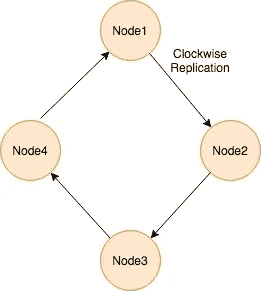

当您只有一个数据中心时，使用 SimpleStrategy。它将第一个副本放在由*分区器*选择的节点上。分割器决定数据如何在集群中的节点之间分布(包括副本)。之后，剩余的副本以顺时针方向放置在节点环中。

**网络拓扑策略**

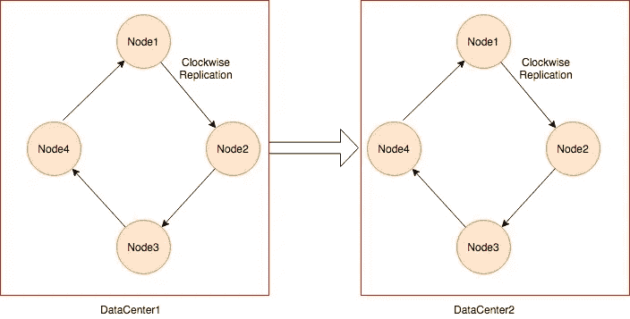

当您跨多个数据中心进行部署时，会用到它。该策略通过顺时针遍历环，直到到达另一个机架中的第一个节点，将副本放置在同一数据中心。这是因为机架中有时会出现故障或问题。那么其他节点上的副本可以提供数据。出于可伸缩性和未来扩展的目的，强烈建议采用这种策略。

好了，理论讨论够了，来点实际的吧。

# 安装和设置

你可以从[官方网站](http://cassandra.apache.org/download/)下载该软件包，并以单一模式运行用于开发目的，但它不会帮助你了解 Cassandra 的真正实力，因为它的行为就像任何其他数据库一样。因此，我将使用它的 docker 版本，其中我将设置一个包含两个节点的集群。

***注意:在开始之前，请确保将 Docker 内存设置为至少 4GB，否则容器会以错误代码 137 退出。由于内存资源不足，我花了一个小时才发现这个错误。***

在你的机器上创建一个文件夹，就像我创建的`/Development/PetProjects/CassandraTut/data`。在这个文件夹中，我创建了两个子文件夹来存储两个节点的数据。完成后，它将如下所示:

```
➜  data tree -a.├── node1└── node22 directories, 1 file
```

留在同一个文件夹，运行命令`docker pull cassandra`下载[官方镜像](https://hub.docker.com/_/cassandra)。如果你是 docker 的新手，那么你应该看看我在 Docker 系列[的帖子。一旦下载完毕，`docker images`命令就会显示在你的终端上。确保 docker 已安装并正在运行。此外，您必须给 Cassandra 存储数据的文件夹写权限。](http://blog.adnansiddiqi.me/tag/docker/)

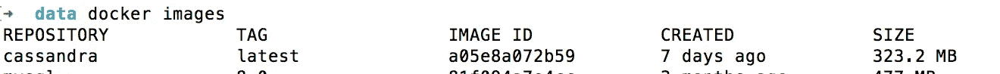

我们将设置两个节点: **Node1** 为主节点， **Node2** 为*种子节点*。种子在启动过程中用于发现集群。让我们运行第一个节点。

```
docker run --name cas1 -p 9042:9042 -v /Development/PetProjects/CassandraTut/data/node1:/var/lib/cassandra/data -e CASSANDRA_CLUSTER_NAME=MyCluster -e CASSANDRA_ENDPOINT_SNITCH=GossipingPropertyFileSnitch -e CASSANDRA_DC=datacenter1 -d cassandra
```

许多环境变量是不言自明的，我将讨论`CASSANDRA_ENDPOINT_SNITCH`

告密者决定卡珊德拉如何分发复制品。这个飞贼推荐生产。`GossipingPropertyFileSnitch`在添加新节点时使用[八卦协议](https://docs.datastax.com/en/cassandra/3.0/cassandra/architecture/archGossipAbout.html)自动更新所有节点，建议用于生产。运行以下命令了解节点的状态。

```
➜  data docker exec -it cas1  nodetool status
Datacenter: datacenter1
=======================
Status=Up/Down
|/ State=Normal/Leaving/Joining/Moving
--  Address     Load       Tokens       Owns (effective)  Host ID                               Rack
UN  172.17.0.2  103.67 KiB  256          100.0%            bcb57440-7303-4849-9afc-af0237587870  rack1
```

`UN`表示状态为 **U** p 和 **N** 正常。当其他节点加入时，您可能会看到状态 UJ，这意味着 **U** p 和 **J** 正在加入。我正在使用`docker run`的`-d`开关在后台运行它。另外，请注意**节点 1** 文件夹的内容。它创建默认的系统数据库，类似于 MySQL。

```
➜  node1 ls
system             system_auth        system_distributed system_schema      system_traces
➜  node1
```

现在让我们运行第二个节点:

```
docker run --name cas2 -v /Development/PetProjects/CassandraTut/data/node2:/var/lib/cassandra/data -e CASSANDRA_SEEDS="$(docker inspect --format='{{ .NetworkSettings.IPAddress }}' cas1)" -e CASSANDRA_CLUSTER_NAME=MyCluster -e CASSANDRA_ENDPOINT_SNITCH=GossipingPropertyFileSnitch -e CASSANDRA_DC=datacenter1 -d cassandra:latest
```

在设置了相关的容器名和数据中心后，您还可以将这里的`CASSANDRA_SEEDS` 设置为节点`cas1`的 IP 地址，该节点可以使用`docker inspect`命令获取。过一会儿，当您在`cas1`中运行`nodetool status`命令时，您应该会看到如下所示的内容:

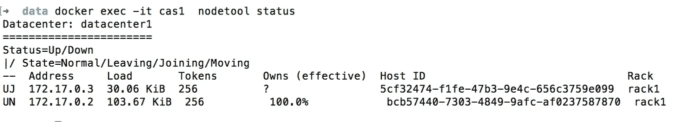

如您所见，我们的第二个节点正在加入集群，我们从状态`UJ`中了解到这一点。

如果你查看挂载的卷，`node2`文件夹，你也会看到系统文件夹。

从终端运行命令很烦人，因此我创建了一个`docker-compose.yaml`文件来运行集群，没有任何麻烦。

为了确保`cas1`启动并运行，我让`cas2`依赖于`cas1`，并设置一个 60 秒的`sleep`。

我得到 RPC 错误`INFO [main] 2019-05-14 01:51:07,336 CassandraDaemon.java:556 - Not starting RPC server as requested. Use JMX (StorageService->startRPCServer()) or nodetool (enablethrift) to start it`，所以我也调用`CASSANDRA_START_RPC`环境参数，并将其设置为真。

让我们运行`docker-compose up -d`以在分离模式下运行。

正如您可以看到的，第一个节点没有启动，第二个节点启动过程也没有启动。

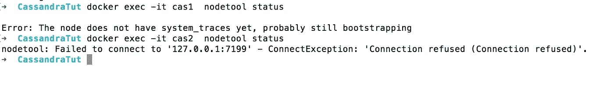

过了一会儿，两个节点都使用各自独特的 IP 启动。

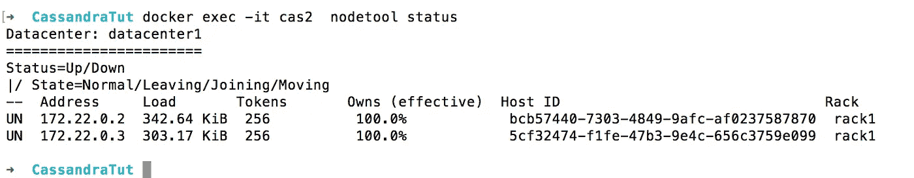

所有 Cassandra 配置文件都位于容器内的`/etc/cassandra/`文件夹中。

让我们运行 CQL 外壳。

```
➜  CassandraTut docker exec -it cas2  cqlsh          
Connected to MyCluster at 127.0.0.1:9042.
[cqlsh 5.0.1 | Cassandra 3.11.4 | CQL spec 3.4.4 | Native protocol v4]
Use HELP for help.
cqlsh>
```

它类似于 MySQL shell。CQL，Cassandra 查询语言在语法上与 SQL 相似，但其用法与 RDBMS 系统不同。我们将很快对此进行更深入的研究。坚持住！

如果你注意到我已经在`docker run`和`docker compose`命令中公开了默认的 Cassandra 端口`9042`。使用终端 like 并不吸引人，使用 GUI 客户端怎么样？我使用的是 SQL/NoSQL 客户端 [TablePlus](https://tableplus.io/) 。

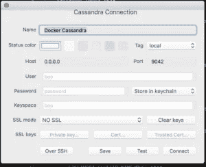

一旦连接，您将看到默认的系统数据库。

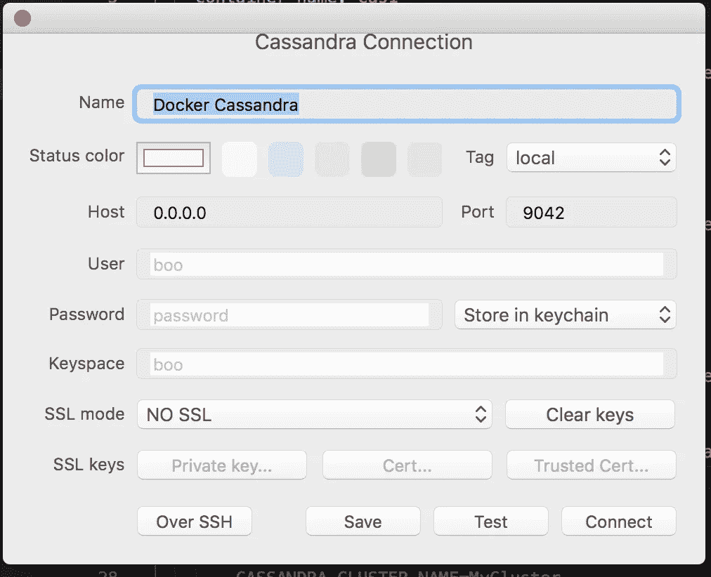

让我们在节点`cas1`上创建一个测试密钥空间、数据库的 Cassandra 版本和一个表。别担心，我稍后会详细讨论。现在，我们的目的是告诉您数据是如何复制的。

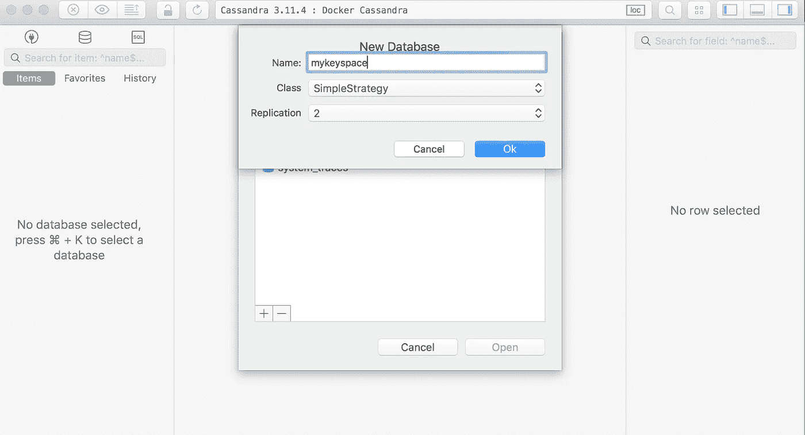

将复制因子设置为 2，这意味着将有 2 份数据拷贝，每个节点一份。

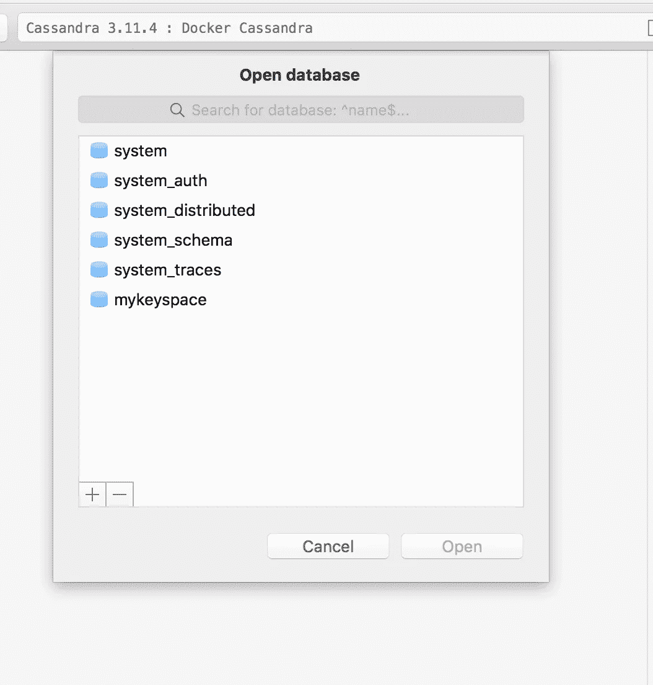

让我们连接到第二个节点。

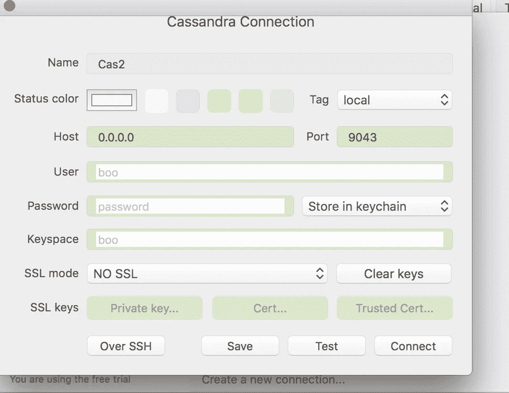

请注意端口 9043。9042 已经分配给`cas1`。

瞧啊！我的密钥空间在这里也存在，它被很好地从**案例 1** 复制到**案例 2**

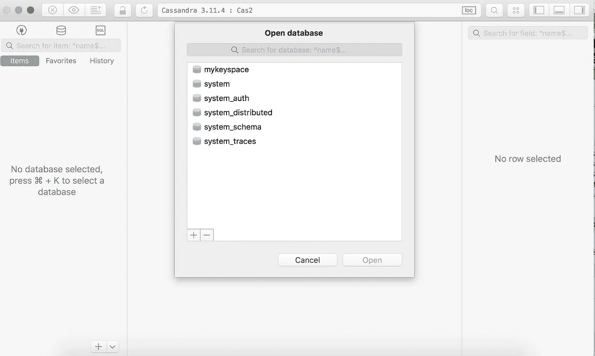

无论您在 Cas1 或 Cas2 上进行更改，它最终都会被传播。这并不类似于典型的主/从概念，而是被称为*无主*，因为整个系统是分散的，P2P 连接是在环中建立的(*它让你想起区块链了吗？*)

接下来是数据建模概念和在 CQL 创建实体。

# 卡珊德拉数据建模和 CQL

Cassandra 是一头野兽，不可能在这里涵盖数据建模的每个方面。因此，我将介绍一些基础知识，让您了解它与典型的关系数据库系统有何不同。尽管 CQL 看起来非常类似于 SQL 或基于 MySQL 的 SQL，但它根本不是 SQL。让自己做好准备，忘掉 RDBMS 的东西。

## 术语

下面是 Cassandra 和 RDBMS world 的一点对比。

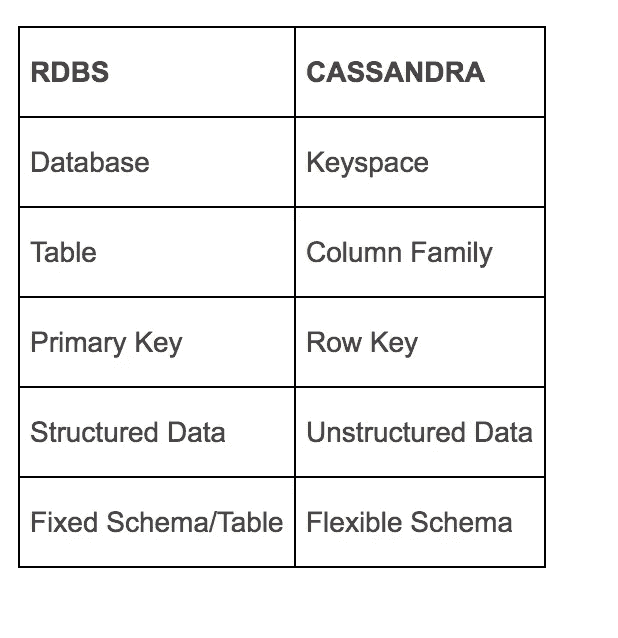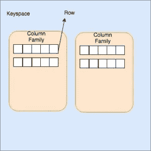

Keyspace :-它是列族的容器集合。你可以把它想象成 RDBMS 世界中的一个*数据库*。

**列族:-** 列族是行的有序集合的容器。每一行又是列的有序集合。可以把它想象成 RDBMS 世界中的一个*表*。

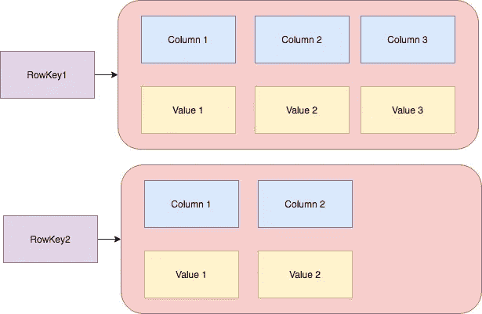

**行:-** 行是列的集合，按列排序。

**列:-** 列是键/值对的集合。

**行键:-** 主键叫做行键。

**复合主键:-** 主键由多列组成。该密钥一部分被称为分区密钥和剩余的簇密钥*。*

***分区键:-**Cassandra 中的数据分布在各个节点上。分区键的目的是识别存储了被请求的特定行的节点。名为 *partition* 的函数用于在写入行时计算分区键的哈希值。例如，**节点 1** 的键值范围从*1–10*，**节点 2** 包含*11–20*，**节点 3** 包含范围*21–30*。当执行带有 WHERE 子句的 SELECT 命令时，使用分区键的哈希值来查找所需的节点，一旦找到该节点，它就会获取数据并返回给客户端。例如，查询是`SELECT * FROM users where id = 5`，假设分区键的哈希值(在本例中是 5)是 15，那么将会是**节点 2** 获得该行。下面是它的图示。*

*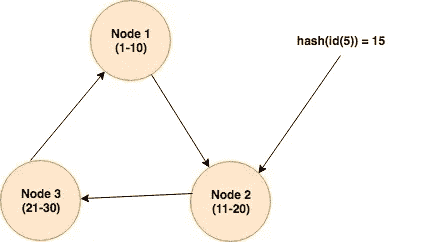*

*我们来举个例子。您正在开发一个保存网站用户及其所在城市信息的系统。我们将创建一个名为 CityInfo 的密钥空间。你可以使用 CQLSH 或 TablePlus GUI，由你决定。*

*`create keyspace CityInfo with replication = {'class' : 'SimpleStrategy', 'replication_factor':2}`*

*因为我有 2 个节点，所以我将`replication_factor`设置为`2`。*

# *设计模型*

*在 RDBMS 中，我们有一个类似 JOINs 的工具，而编写并不便宜，因此我们通过在相关表中使用外键来避免重复。《卡珊德拉》就不是这样的。Cassandra 是一个分布式系统，编写起来很便宜，因此非常欢迎你在需要的地方去规范化数据。这有助于检索通常通过连接获取的数据。另一方面，数据读取可能会很昂贵，因为数据跨越多个节点并通过分区键检索。设计模型时，您应该记住以下目标:*

1.  ***在集群中均匀分布数据:-** 如果主键由单列组成，则主键是分区键，如果是复合主键，则主键是分区键和集群键。要平均分布数据，您必须为 PK 选择一个具有唯一性的列，这样就可以跨节点分布。像 *ID、用户名、*和 *email* 这样的东西具有唯一性，会充分利用节点的集群。但是如果您使用像*名字/姓氏*、*性别*等这样的键，那么分区键的选择将会非常少，尽管有 100 个节点，但总是只有少数几个会被使用，从而使一个分区变得臃肿，性能降低。*
2.  ***尽量减少读取次数:-** 正如我提到的，读取是很昂贵的。如果您以一种单个查询从多个分区获取的方式建模，将会使系统变慢。*

*因此，与 RDBMS 不同，在 RDBMS 中，您首先设计模式，然后根据您的需求自由地创建查询，而 Cassandra 却不是这样。你必须预先知道系统中需要的查询，然后相应地设计模型。*

## *示例使用案例*

*我们有一个系统，不同城市的用户访问一个网站。管理层要求提供以下信息:*

1.  *所有用户的列表*
2.  *所有城市的列表。*
3.  *按城市列出的用户列表*

*让我们首先创建`cities`表。*

```
*CREATE TABLE cities (
 id int,
 name text,
 country text,
 PRIMARY KEY(id)
);*
```

*然后`users`*

```
*CREATE TABLE users (
 username text,
 name text,
 age int,
 PRIMARY KEY(username)
);*
```

*插入几个城市。*

```
*INSERT INTO cities(id,name,country) VALUES (1,'Karachi','Pakistan');
INSERT INTO cities(id,name,country) VALUES (2,'Lahore','Pakistan');
INSERT INTO cities(id,name,country) VALUES (3,'Dubai','UAE');
INSERT INTO cities(id,name,country) VALUES (4,'Berlin','Germany');*
```

*并插入一些用户*

```
*INSERT INTO users(username,name,age) VALUES ('aali24','Ali Amin',34);
INSERT INTO users(username,name,age) VALUES ('jack01','Jack David',23);
INSERT INTO users(username,name,age) VALUES ('ninopk','Nina Rehman',34);*
```

*这些插入满足了我们的前两个要求，但是第三个要求呢？在 RDBMS 世界中，我们将使用`city_id`作为`users`表中的 FK，连接将很容易返回数据，但这是 Cassandra，我们不能这样做，剩下的是我们创建另一个表来满足我们的需求。*

```
*CREATE TABLE users_by_cities (
 username text,
 name text,
 city text,
 age int,
 PRIMARY KEY(city,age)
);*
```

*这个主键有两个组成部分:第一个成为分区键，第二个成为簇键。它将查找 w . r . t . city，所有记录都按年龄分组。*

*现在插入一些记录:*

```
*INSERT INTO users_by_cities(username,name,city,age) VALUES ('aali24','Ali Amin','Karachi',34);
INSERT INTO users_by_cities(username,name,city, age) VALUES ('jack01','Jack David','Berlin',23);
INSERT INTO users_by_cities(username,name,city, age) VALUES ('ninopk','Nina Rehman','Lahore',34);*
```

*通常情况下，在两个表中的这些插入会在“添加用户”界面中一次完成，从 CQL 端，您可以做类似这样的事情来添加用户信息。*

```
*BEGIN BATCH
INSERT into users(username,name,age) VALUES('raziz12','Rashid Aziz',34);
INSERT INTO users_by_cities(username,name,city, age) VALUES ('raziz12','Rashid Aziz','Karachi',30);
APPLY BATCH;*
```

*在继续之前，我想提醒您一下我之前讨论过的散列令牌。首先，在 CQL shell 上运行`EXPAND ON`命令。一旦你这样做了，你会看到如下结果:*

*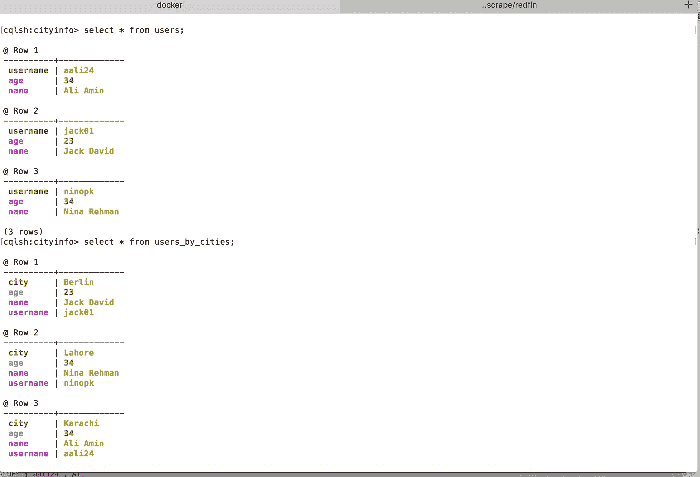*

*看起来不错，不是吗？好了，现在我们将看到我们的主键的令牌值。它返回以下结果:*

```
*cqlsh:cityinfo> select token(username) from users;@ Row 1
------------------------+----------------------
 system.token(username) | -7905752472182359000@ Row 2
------------------------+----------------------
 system.token(username) | 2621513098312339776@ Row 3
------------------------+----------------------
 system.token(username) | 6013687671608201304*
```

*有道理，令牌是唯一的，因为用户名是唯一的。这些令牌将跨节点传播。当用户运行命令`SELECT * FROM users where username = 'raziz12'`时，它将根据这个令牌值选择节点。我已经在上面几行中展示过了。*

*下面的查询显示了来自`users_by_cities`表的令牌值。*

```
*cqlsh:cityinfo> select token(username),username,city from users_by_cities;@ Row 1
------------------------+----------------------
 system.token(username) | 2621513098312339776
 username               | jack01
 city                   | Berlin@ Row 2
------------------------+----------------------
 system.token(username) | 6013687671608201304
 username               | ninopk
 city                   | Lahore@ Row 3
------------------------+----------------------
 system.token(username) | -882788003101376442
 username               | raziz12
 city                   | Karachi@ Row 4
------------------------+----------------------
 system.token(username) | -7905752472182359000
 username               | aali24
 city                   | Karachi*
```

*`Select * from users_by_cities where city = 'Karachi';`返回以下内容:*

```
*cqlsh:cityinfo> select * from users_by_cities where city = 'Karachi';@ Row 1
----------+-------------
 city     | Karachi
 username | aali24
 name     | Ali Amin@ Row 2
----------+-------------
 city     | Karachi
 username | raziz12
 name     | Rashid Aziz*
```

*该模型还服务于查询`select * from users_by_cities where city = 'Karachi' and age = 34`*

*但是，如果您想根据字段选择一条记录，该怎么办呢？*

*`SELECT * from users_by_cities where name = 'Ali Amin';`*

*您会得到下面的错误。*

```
*Error from server: code=2200 [Invalid query] message="Cannot execute this query as it might involve data filtering and thus may have unpredictable performance. If you want to execute this query despite the performance unpredictability*
```

*这是因为没有提到分区键，Cassandra 要求在所有节点中搜索所需的名称，是的，所有节点，想象一下如果节点是 10 或 100，返回数据需要时间。因此不建议这样做。如果您想在 w.r.t 字段中找到一些东西，要么创建另一个表(强烈推荐)，要么创建一个二级索引(*不推荐*)*

*数据按城市分区，在查找时，一个节点用城市的令牌响应，一旦发现该节点，它就获取该分区中属于卡拉奇城市的用户的所有记录。对于与卡拉奇相关的数据聚类，也可以看到类似的情况。数据根据*年龄*列进行聚类。*

*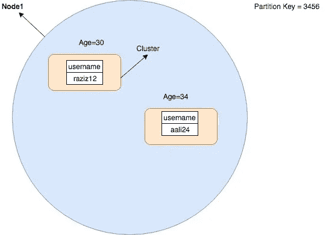*

*所以对于一个保存所有 Karachiites 记录的分区，你会看到记录的集群。*

*你的脑袋一定在打转，会想念你心爱的 MySQL，但我告诉你，这是值得学习的东西，我也在学习，我只是触及了这个野兽的表面。*

*你可能想知道这篇文章的标题提到了 Python，但是我听说到目前为止还没有写 Python 代码。有必要准备一个基础，因为您将只是在 Python 应用程序中执行查询。主要工作在别的地方，就在上面。*

*好了，在我转向开发之前，我讨论过 Cassandra 最初在 ***Commitlog 中写数据。****

*Cassandra CommitLog 的路径可以从`/etc/cassandra/cassandra.yaml`获得，也就是从`/var/lib/cassandra/commitlog`获得，这里它创建了带有时间戳的日志文件。这是不可读的，但当我搜索一些插入的记录，然后发现一些痕迹。检查下面的屏幕:*

*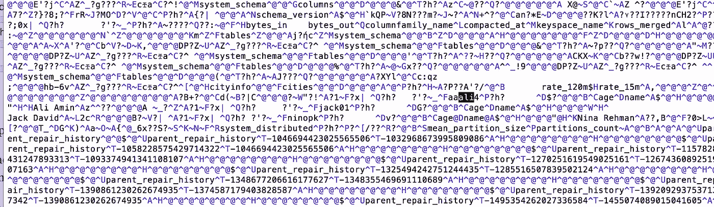*

*你可以在这里找到**杰克 01** 、**阿力、**和**尼诺普**的踪迹。你也可以找到与修复机制相关的文字。*

*在`/var/lib/cassandra/data/<keyspacename>`可以找到桌子。我的情况是`cityinfo`*

*对于每个表/列族，它生成`manifest.json`文件，一些`*.db`和一些其他类型的文件，下面是表`users_by_cities`表的文件。*

```
*./users_by_cities-62cea5f0788e11e9b568e709cd27ef9f/snapshots/truncated-1558089482008-users_by_cities
./users_by_cities-62cea5f0788e11e9b568e709cd27ef9f/snapshots/truncated-1558089482008-users_by_cities/manifest.json
./users_by_cities-62cea5f0788e11e9b568e709cd27ef9f/snapshots/truncated-1558089482008-users_by_cities/md-1-big-CompressionInfo.db
./users_by_cities-62cea5f0788e11e9b568e709cd27ef9f/snapshots/truncated-1558089482008-users_by_cities/md-1-big-Data.db
./users_by_cities-62cea5f0788e11e9b568e709cd27ef9f/snapshots/truncated-1558089482008-users_by_cities/md-1-big-Digest.crc32
./users_by_cities-62cea5f0788e11e9b568e709cd27ef9f/snapshots/truncated-1558089482008-users_by_cities/md-1-big-Filter.db
./users_by_cities-62cea5f0788e11e9b568e709cd27ef9f/snapshots/truncated-1558089482008-users_by_cities/md-1-big-Index.db
./users_by_cities-62cea5f0788e11e9b568e709cd27ef9f/snapshots/truncated-1558089482008-users_by_cities/md-1-big-Statistics.db
./users_by_cities-62cea5f0788e11e9b568e709cd27ef9f/snapshots/truncated-1558089482008-users_by_cities/md-1-big-Summary.db
./users_by_cities-62cea5f0788e11e9b568e709cd27ef9f/snapshots/truncated-1558089482008-users_by_cities/md-1-big-TOC.txt
./users_by_cities-62cea5f0788e11e9b568e709cd27ef9f/snapshots/truncated-1558089482008-users_by_cities/schema.cql*
```

*你可以在这里了解更多。*

# *从 Python 访问 Cassandra*

*好的，首先，我们需要安装驱动程序。我在 docker shell 之外，因为我将从我的主机访问它。运行命令`pip install cassandra-driver`*

*构建驱动程序需要一段时间:*

```
*Requirement already satisfied: six>=1.9 in /anaconda3/anaconda/lib/python3.6/site-packages (from cassandra-driver) (1.11.0)
Building wheels for collected packages: cassandra-driver
  Building wheel for cassandra-driver (setup.py) ... done
  Stored in directory: /Users/AdnanAhmad/Library/Caches/pip/wheels/df/f4/40/941c98128d60f08d2f628b04a7a1b10006655aac3803e0e227
Successfully built cassandra-driver
Installing collected packages: cassandra-driver
Successfully installed cassandra-driver-3.17.1*
```

*下面是从 Docker 中运行的 Python 脚本连接到 Docker 中的 Cassandra 集群的代码。*

```
*from cassandra.cluster import Clusterif __name__ == "__main__":
    cluster = Cluster(['0.0.0.0'],port=9042)
    session = cluster.connect('cityinfo',wait_for_all_pools=True)
    session.execute('USE cityinfo')
    rows = session.execute('SELECT * FROM users')
    for row in rows:
        print(row.age,row.name,row.username)*
```

*返回了以下输出:*

```
*➜  CassandraTut python cassandra_connect.py
34 Ali Amin aali24
34 Rashid Aziz raziz12
23 Jack David jack01
34 Nina Rehman ninopk
➜  CassandraTut*
```

*你可以在这里了解更多信息*

# *结论*

*所以在这篇文章中，你学习了一些关于 Cassandra 的知识，以及如何使用 CQL 并在你的 Python 脚本中连接它。请在下面留下您的评论，以便提出意见、更正或反馈。和往常一样，代码在 [Github](https://github.com/kadnan/PythonCassandraTutorial/) 上。*

**本帖原载* [*此处*](http://blog.adnansiddiqi.me/getting-started-with-apache-cassandra-and-python/) *。**