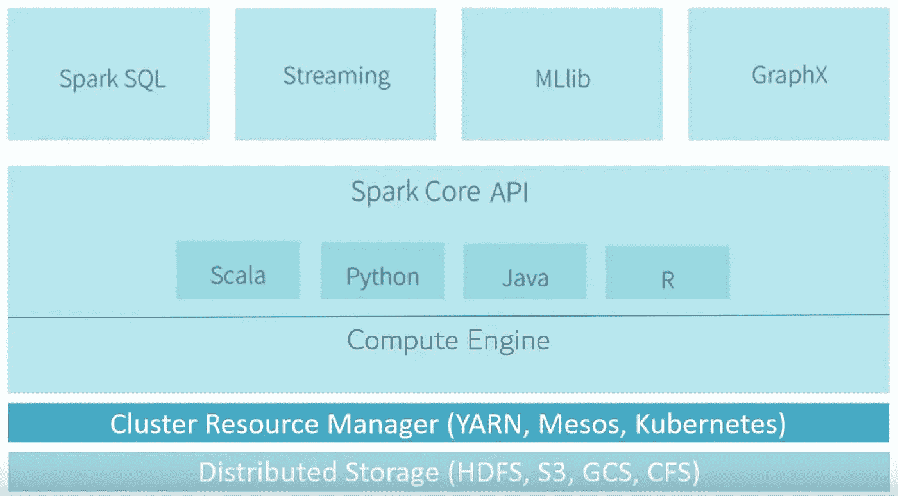
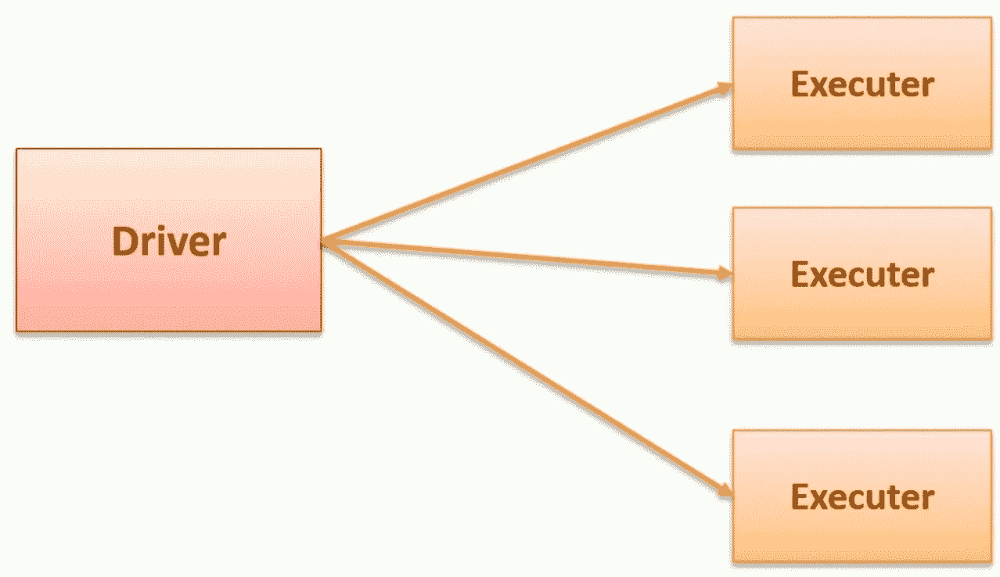
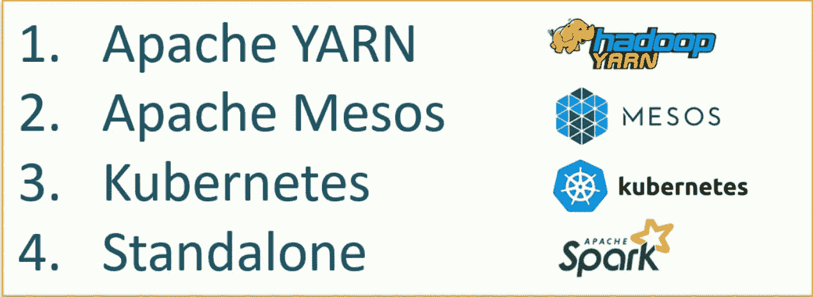
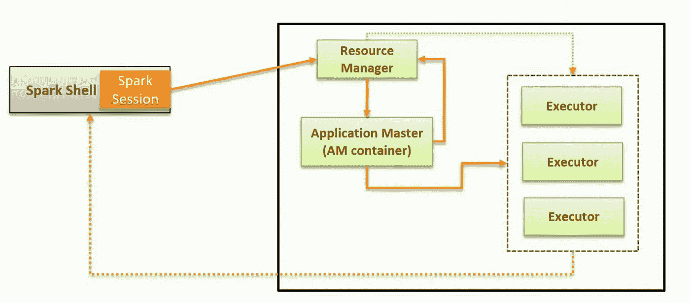
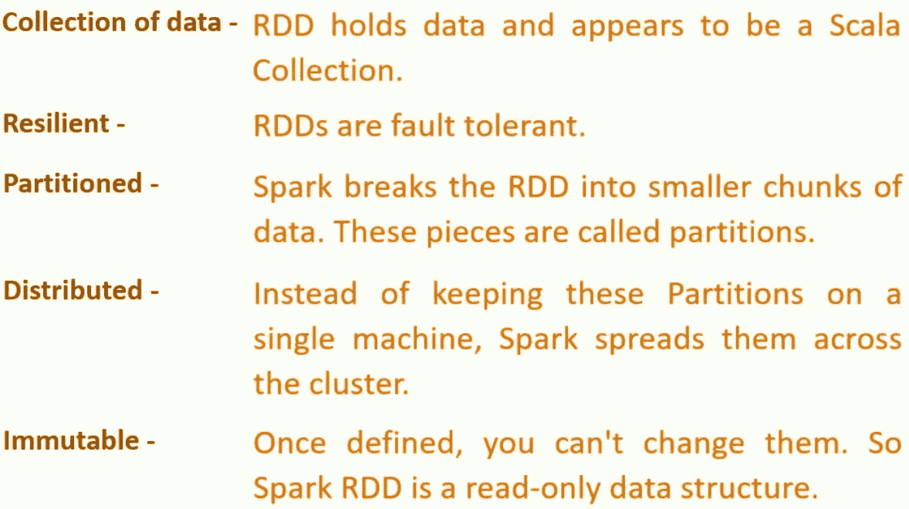

# Apache Spark 入门

> 原文：<https://towardsdatascience.com/getting-started-with-apache-spark-ad9d59e71f6f?source=collection_archive---------7----------------------->

## Java 中 Spark 的体系结构及应用


Photo by [Markus Spiske](https://unsplash.com/@markusspiske?utm_source=unsplash&utm_medium=referral&utm_content=creditCopyText) on [Unsplash](https://unsplash.com/s/photos/data?utm_source=unsplash&utm_medium=referral&utm_content=creditCopyText)

Apache Spark 被解释为“大规模数据处理的快速通用引擎”然而，这甚至没有开始概括它成为大数据领域如此突出的参与者的原因。Apache Spark 是一个分布式计算平台，大数据公司对它的采用一直在以令人瞩目的速度增长。

# 火花建筑

spark 的架构如下所示:



Spark Eco-System — Image by Author

Spark 是一个分布式处理引擎，但是它没有自己的分布式存储和资源集群管理器。它运行在现成的集群资源管理器和分布式存储之上。

Spark core 由两部分组成:

*   核心 API:非结构化 API(rdd)，结构化 API(数据帧，数据集)。在 Scala、Python、Java 和 r 中可用。
*   计算引擎:内存管理、任务调度、故障恢复、与集群管理器交互。

> 注意:我们将在文章末尾看到核心 API 的 Java 实现。

在核心 API 之外，Spark 提供了:

*   Spark SQL:通过类似 SQL 的查询与结构化数据进行交互。
*   流:消费和处理连续的数据流。
*   机器学习库。但是，我不会推荐在这里训练深度学习模型。
*   GraphX:典型的图形处理算法。

以上四个都直接依赖于 spark 核心 API 进行分布式计算。

## Spark 的优势

*   Spark 为批处理、结构化数据处理、流等提供了一个统一的平台。
*   与 Hadoop 的 map-reduce 相比，spark 代码更容易编写和使用。
*   Spark 最重要的特性，它抽象了并行编程方面。Spark core 抽象了分布式存储、计算和并行编程的复杂性。

Apache Spark 的主要用例之一是大规模数据处理。我们创建程序并在 spark 集群上执行它们。

## 程序在集群上的执行

在 spark cluster 上执行程序主要有两种方法:

1.  互动客户端如[](https://jaceklaskowski.gitbooks.io/mastering-apache-spark/spark-shell.html)*[*py-spark*](https://spark.apache.org/docs/2.2.0/api/python/pyspark.html)，笔记本等。*
2.  *提交作业。*

*大多数开发过程发生在交互式客户机上，但是当我们必须将应用程序投入生产时，我们使用提交作业方法。*

*对于长时间运行的流作业或定期批处理作业，我们将应用程序打包并提交给 Spark cluster 执行。*

*Spark 是一个分布式处理引擎，遵循主从架构。在 spark 术语中，主人是 [*驱动者*](https://jaceklaskowski.gitbooks.io/mastering-apache-spark/spark-driver.html) ，奴隶是 [*执行者*](https://jaceklaskowski.gitbooks.io/mastering-apache-spark/spark-Executor.html) 。*

**

*Image by Author*

*司机负责:*

1.  *分析*
2.  *分发。*
3.  *监控。*
4.  *日程安排。*
5.  *在 spark 进程的生命周期内维护所有必要的信息。*

*执行者只负责执行驱动程序分配给他们的那部分代码，并将状态报告给驱动程序。*

*每个 spark 进程都有一个单独的驱动程序和独占的执行器。*

## *执行方式*

1.  ***客户端模式:**驱动程序是本地虚拟机，您可以在这里提交应用程序。默认情况下，spark 以客户端模式提交所有应用程序。由于驱动程序是整个 spark 流程中的主节点，因此在生产设置中，这是不可取的。对于调试，使用客户端模式更有意义。*
2.  ***集群模式:**司机是集群中的执行者之一。在 spark-submit 中，您可以如下传递参数:*

```
*--deploy-mode cluster*
```

## ***集群资源管理器***

**

*Image by Author*

*Yarn 和 Mesos 是常用的集群管理器。*

*Kubernetes 是一个通用容器编制器。*

> *注意:在撰写本文时，Kubernetes 上的 Spark 还没有做好生产准备。*

*Yarn 是 spark 最受欢迎的资源管理器，让我们看看它的内部工作原理:*

*在客户端模式应用程序中，驱动程序是我们的本地虚拟机，用于启动 spark 应用程序:*

***步骤 1:** 一旦驱动程序启动，spark 会话请求就会发送到 yarn 以创建一个 Yarn 应用程序。*

***步骤 2:** 纱线资源经理创建一个应用程序主程序。对于客户机模式，AM 充当执行器启动器。*

***第 3 步:** AM 将联系纱线资源经理，要求提供更多容器。*

***步骤 4:** 资源管理器将分配新的容器，AM 将启动每个容器中的执行器。之后，执行者直接与司机沟通。*

**

*Image by Author*

> *注意:在集群模式下，驱动程序在上午启动。*

## ***执行器和内存调优***

***硬件— 6 个节点，每个节点 16 个内核，64 GB RAM***

*让我们从核心的数量开始。核心的数量代表一个执行器可以运行的并发任务。研究表明，任何具有 5 个以上并发任务的应用程序都会导致糟糕的表现。因此，我建议坚持 5。*

> *注意:上面的数字来自于一个执行器的性能，而不是来自于系统有多少内核。因此，对于 32 核系统来说也是一样的。*

*操作系统和 Hadoop 守护程序需要 1 个内核和 1 GB RAM。因此，我们只剩下 63 GB 内存和 15 个内核。*

*对于 15 个内核，每个节点可以有 3 个执行器。我们总共有 18 个遗嘱执行人。AM 容器需要 1 个执行器。因此我们可以得到 17 个遗嘱执行人。*

*回到内存，我们得到每个执行器 63/3 = 21 GB。但是，在计算完整的内存请求时，需要考虑少量的开销。*

```
*Formula for that over head = max(384, .07 * spark.executor.memory)Calculating that overhead = .07 * 21 = 1.47*
```

*因此，内存下降到大约 19 GB。*

*因此，该系统得出:*

```
*--num-executors 17 --executor-memory 19G --executor-cores 5* 
```

> *注意:如果我们需要更少的内存，我们可以减少内核的数量来增加执行器的数量。*

# *火花核心*

*现在我们来看看 spark 提供的一些核心 API。Spark 需要一个数据结构来保存数据。我们有三种选择 RDD、数据帧和数据集。从 Spark 2.0 开始，建议只使用数据集和数据帧。这两个内部编译到 RDD 本身。*

*这三个是弹性的、分布式的、分区的和不可变的数据集合。*

**

*Image by Author*

***Task:**Spark 中最小的工作单元，由一个执行者执行。*

*数据集提供两种类型的操作:*

*   ***转换:**从现有的数据集创建新的数据集。它是懒惰的，数据仍然是分布式的。*
*   ***动作:**动作向驱动返回数据，本质上是非分布式的。数据集上的操作触发作业。*

***混洗和排序:**对数据集进行重新分区，以便对其执行操作。它是 spark 中的一个抽象，我们不需要为它编写代码。这项活动需要一个新的阶段。*

# *常见操作和转换*

## *1) lit，geq，leq，gt，lt*

*lit:创建一个文字值列。可用于与其他列进行比较。*

*geq(大于等于)，leq(小于等于)，gt(大于)，lt(小于):用于与其他列值进行比较。例如:*

## *2)加入*

*Spark 允许我们以各种方式连接数据集。我将试着用一个例子来解释*

*结果看起来像这样:*

## *3)工会*

*Spark 联合函数让我们在两个数据集之间建立一个联合。数据集应该具有相同的模式。*

## *4)窗户*

*Spark 的基本功能之一。它允许您基于一组行(称为*帧*)计算表中每个输入行的返回值。*

*Spark 提供了翻滚窗口、希望窗口、滑动窗口和延迟窗口的 API。*

*我们用它来排序、求和、普通的窗口等等。一些使用案例包括:*

*其他函数，如 *lag* 、 *lead* 等等，允许您进行其他操作，使您能够对数据集进行复杂的分析。*

*但是，如果您仍然需要对数据集执行更复杂的操作，您可以使用 UDF。UDF 的用法示例:*

> *注意:使用 UDF 应该是最后的手段，因为它们不是为 Spark 优化的；他们可能需要更长的时间来执行死刑。建议在 UDF 上使用本机 spark 函数。*

*这只是 Apache Spark 的冰山一角。它的应用扩展到各个领域，不仅限于数据分析。请关注此空间了解更多信息。*

# *参考*

*   *https://www.youtube.com/watch?v=AYZCpxYVxH4&list = plkz 1 SCF 5 IB 4d xipdfd 4 hxwhergrwhmd 6k*
*   *[https://stack overflow . com/questions/37871194/how-to-tune-spark-executor-number-cores-and-executor-memory](https://stackoverflow.com/questions/37871194/how-to-tune-spark-executor-number-cores-and-executor-memory)*
*   *[https://medium . com/@ farox 2q/UDFs-vs-map-vs-custom-spark-native-functions-91 ab 2c 154 b 44](https://medium.com/@Farox2q/udfs-vs-map-vs-custom-spark-native-functions-91ab2c154b44)*
*   *[https://stack overflow . com/questions/45990633/what-the-variable-join-types-in-spark](https://stackoverflow.com/questions/45990633/what-are-the-various-join-types-in-spark)*