# 使用 AWS Glue、RDS 和 S3 在 Amazon EMR 上开始使用 Apache Zeppelin

> 原文：<https://towardsdatascience.com/getting-started-with-apache-zeppelin-on-amazon-emr-using-aws-glue-rds-and-s3-2b5d231a788a?source=collection_archive---------21----------------------->

## 使用一系列预制的 Zeppelin 笔记本，探索在 Amazon EMR 上使用 Apache Zeppelin 进行数据分析和数据科学。

# 介绍

毫无疑问，[大数据分析](https://searchbusinessanalytics.techtarget.com/definition/big-data-analytics)、[数据科学](https://en.wikipedia.org/wiki/Data_science)、[人工智能](https://en.wikipedia.org/wiki/Artificial_intelligence) (AI)和[机器学习](https://en.wikipedia.org/wiki/Machine_learning) (ML)，人工智能的一个子类，在过去 3-5 年里都经历了巨大的受欢迎程度。在炒作周期和营销热潮的背后，这些技术正在对我们现代生活的各个方面产生重大影响。由于其受欢迎程度，商业企业、学术机构和公共部门都争相开发硬件和软件解决方案，以降低进入门槛并提高 ML 和数据科学家和工程师的速度。

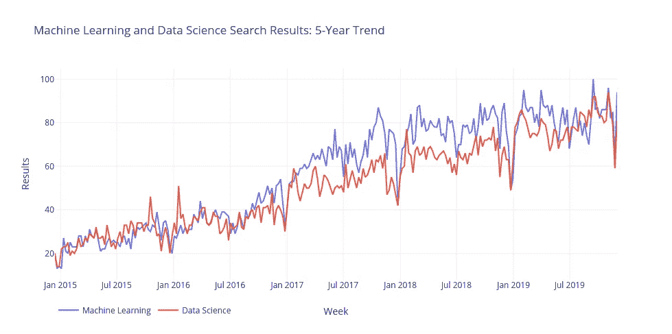

(courtesy [Google Trends](https://trends.google.com/trends/explore?date=today%205-y&geo=US&q=%2Fm%2F01hyh_,%2Fm%2F0jt3_q3) and [Plotly](https://plot.ly/~garystafford/64/))

# 技术

所有三大云提供商，亚马逊网络服务(AWS)、微软 Azure 和谷歌云，都拥有快速成熟的大数据分析、数据科学以及人工智能和人工智能服务。例如，AWS 在 2009 年推出了[Amazon Elastic MapReduce](https://aws.amazon.com/emr/)(EMR)，主要作为基于 [Apache Hadoop](https://hadoop.apache.org/) 的大数据处理服务。据亚马逊称，从那时起，EMR 已经发展成为一种服务，它使用 [Apache Spark](https://spark.apache.org/) 、 [Apache Hadoop](https://hadoop.apache.org/) 和其他几个领先的开源框架来快速、经济高效地处理和分析大量数据。最近，在 2017 年末，亚马逊发布了 [SageMaker](https://aws.amazon.com/sagemaker/) ，这是一项提供快速安全地构建、训练和部署机器学习模型的能力的服务。

同时，组织正在构建集成和增强这些基于云的大数据分析、数据科学、人工智能和 ML 服务的解决方案。一个这样的例子是阿帕奇齐柏林飞艇。类似于非常受欢迎的[项目 Jupyter](http://jupyter.org/) 和新近开源的[网飞的 Polynote](https://medium.com/netflix-techblog/open-sourcing-polynote-an-ide-inspired-polyglot-notebook-7f929d3f447) ，Apache Zeppelin 是一个基于网络的多语言计算笔记本。Zeppelin 使用大量的[解释器](https://zeppelin.apache.org/docs/0.8.2/usage/interpreter/overview.html)，如 Scala、Python、Spark SQL、JDBC、Markdown 和 Shell，实现了数据驱动的交互式数据分析和文档协作。Zeppelin 是亚马逊 EMR 原生支持的核心应用之一。

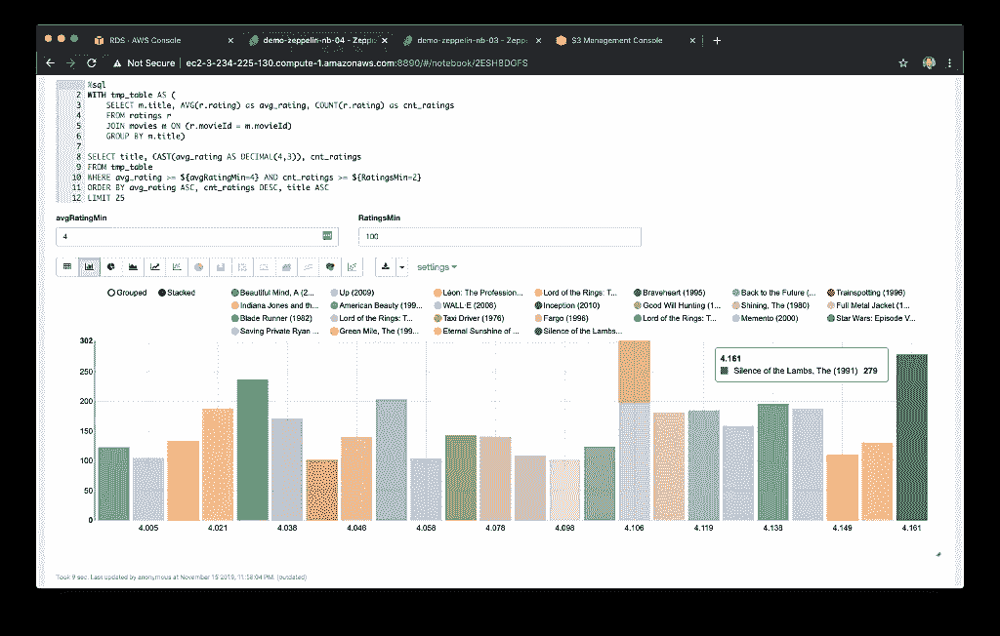

Example of an Apache Zeppelin Notebook Paragraph

在接下来的文章中，我们将使用一系列 Zeppelin 笔记本，探索在 EMR 上使用 Apache Zeppelin 进行数据分析和数据科学。这些笔记本电脑使用了 [AWS Glue](https://aws.amazon.com/glue/) ，这是一种完全托管的提取、转换和加载(ETL)服务，可以轻松准备和加载数据以进行分析。这些笔记本还采用了针对 PostgreSQL 的[亚马逊关系数据库服务](https://aws.amazon.com/rds/) (RDS)和[亚马逊简单云存储服务](https://aws.amazon.com/s3/) (S3)。亚马逊 S3 将作为一个数据湖来存储我们的非结构化数据。鉴于目前 Zeppelin 的二十多个不同的[解释器](https://zeppelin.apache.org/supported_interpreters.html)的选择，我们将为所有笔记本使用 Python3 和 [Apache Spark](https://spark.apache.org/) ，具体来说就是 [Spark SQL](https://spark.apache.org/sql/) 和 [PySpark](https://spark.apache.org/docs/2.4.4/api/python/index.html) 。

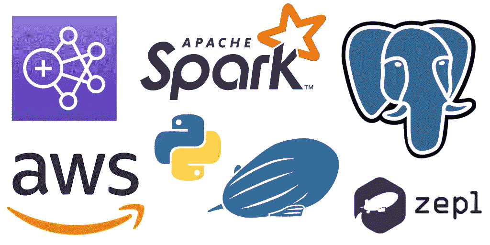

Featured Technologies

我们将构建一个经济的单节点 EMR 集群来进行数据探索，以及一个更大的多节点 EMR 集群来高效地分析大型数据集。亚马逊 S3 将用于存储输入和输出数据，而中间结果存储在 EMR 集群上的 [Hadoop 分布式文件系统](https://docs.aws.amazon.com/emr/latest/ManagementGuide/emr-overview-arch.html#emr-arch-storage) (HDFS)中。亚马逊提供了一个很好的概述 [EMR 架构](https://docs.aws.amazon.com/emr/latest/ManagementGuide/emr-overview-arch.html)。下面是我们将为本次演示构建的基础架构的高级架构图。

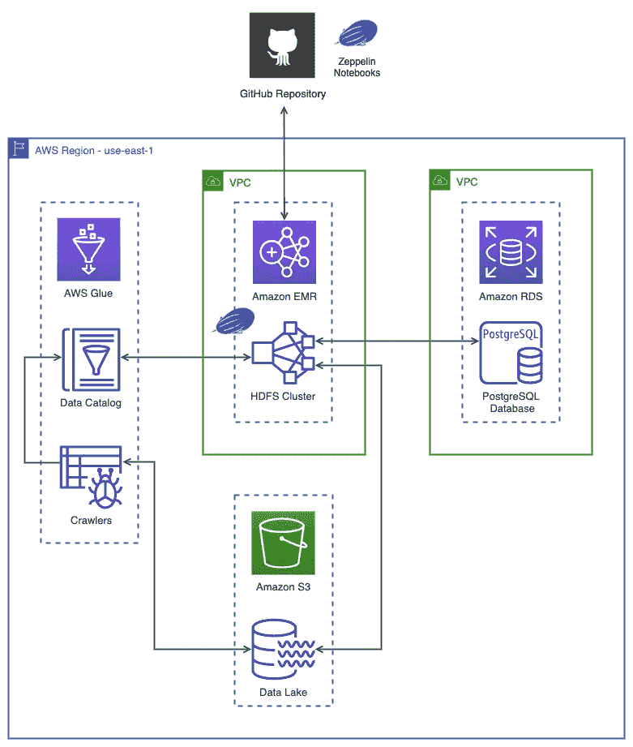

High-level AWS Architecture

# 笔记本功能

下面是每个 Zeppelin 笔记本的简要概述，并带有链接，可以使用 Zepl 的免费[笔记本浏览器](https://www.zepl.com/explore)进行查看。Zepl 由开发阿帕奇齐柏林飞艇的同一批工程师创建，包括阿帕奇齐柏林飞艇的首席技术官兼创造者 Moonsoo Lee。Zepl 的企业协作平台建立在 Apache Zeppelin 的基础上，使数据科学和 AI/ML 团队能够围绕数据进行协作。

## 笔记本 1

[第一个笔记本](https://www.zepl.com/viewer/github/garystafford/zeppelin-emr-demo/blob/master/2ERVVKTCG/note.json)使用一个小的 21k 行 [kaggle](https://www.kaggle.com/) 数据集，来自面包店的[交易。该笔记本展示了 Zeppelin 与](https://www.kaggle.com/sulmansarwar/transactions-from-a-bakery) [Helium](https://zeppelin.apache.org/docs/0.8.2/development/helium/overview.html) 插件系统的集成能力，用于添加新的图表类型，使用亚马逊 S3 进行数据存储和检索，使用 [Apache Parquet](https://parquet.apache.org/) ，一种压缩和高效的列数据存储格式，以及 Zeppelin 与 GitHub 的存储集成，用于笔记本版本控制。

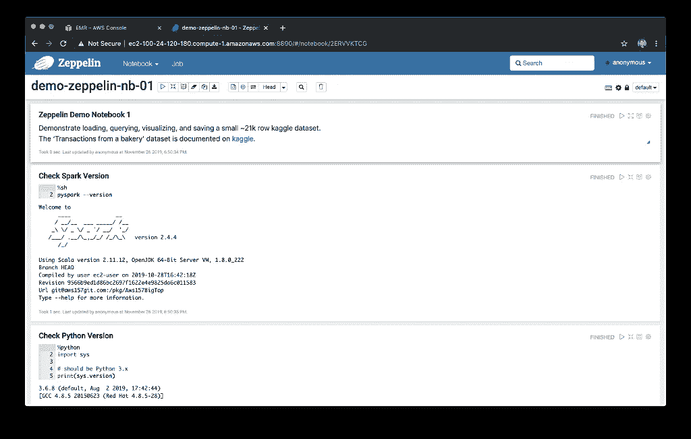

## 笔记本 2

第二本[笔记本](https://www.zepl.com/viewer/github/garystafford/zeppelin-emr-demo/blob/master/2EUZKQXX7/note.json)演示了使用[单节点](https://docs.aws.amazon.com/emr/latest/ManagementGuide/emr-overview.html#emr-overview-clusters)和[多节点](https://docs.aws.amazon.com/emr/latest/ManagementGuide/emr-master-core-task-nodes.html)亚马逊 EMR 集群，使用 Zeppelin 探索和分析从大约 100k 行到 27MM 行的公共数据集。我们将使用最新的 GroupLens [MovieLens](https://grouplens.org/datasets/movielens/) 评级数据集，在单节点和多节点 EMR 集群上使用 Spark 来检查 Zeppelin 的性能特征，以便使用各种 [Amazon EC2 实例类型](https://aws.amazon.com/ec2/instance-types/)来分析大数据。

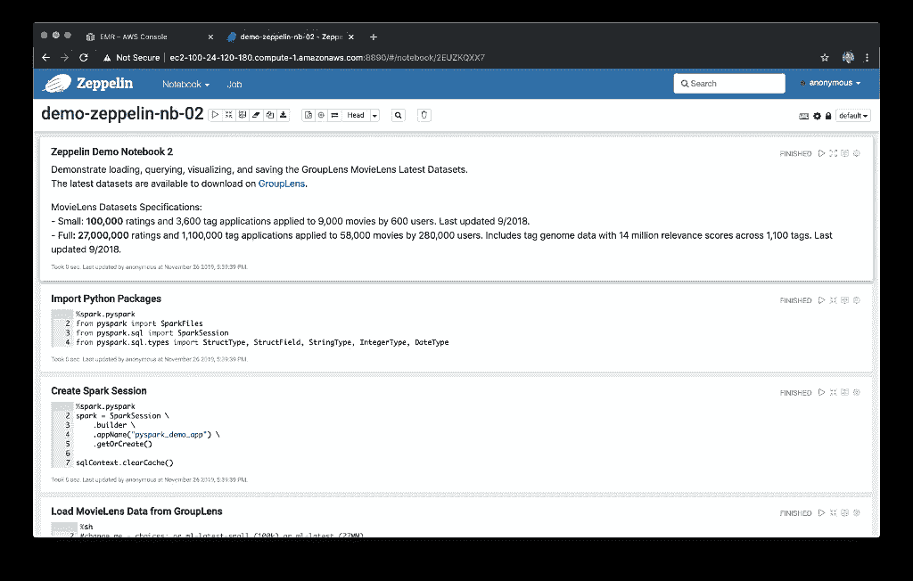

## 笔记本 3

第三个笔记本[展示了](https://www.zepl.com/viewer/github/garystafford/zeppelin-emr-demo/blob/master/2ERYY923A/note.json)[亚马逊 EMR](https://aws.amazon.com/emr/) 和 Zeppelin 的集成能力，其中一个 [AWS Glue](https://aws.amazon.com/glue/) [数据目录](https://docs.aws.amazon.com/glue/latest/dg/components-overview.html#data-catalog-intro)作为兼容 [Apache Hive](https://hive.apache.org/) 的[metastore](https://cwiki.apache.org/confluence/display/Hive/Design#Design-Metastore)for[Spark SQL](https://spark.apache.org/sql/)。我们将使用 AWS Glue 数据目录和一组 [AWS Glue 爬虫](https://docs.aws.amazon.com/glue/latest/dg/add-crawler.html)创建一个基于亚马逊 S3 的[数据湖](https://aws.amazon.com/big-data/datalakes-and-analytics/what-is-a-data-lake/)。

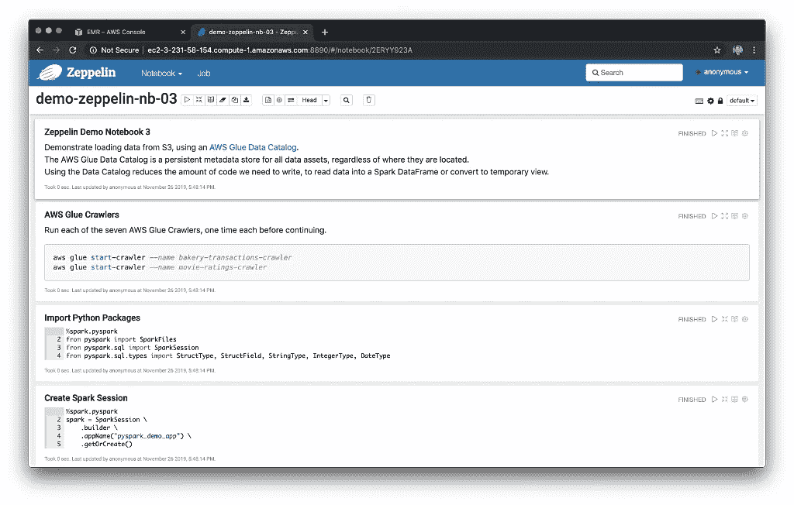

## 笔记本 4

第四个笔记本展示了 Zeppelin 与[外部数据源](https://zeppelin.apache.org/docs/0.8.2/interpreter/jdbc.html#overview)集成的能力。在这种情况下，我们将使用三种方法与 [Amazon RDS PostgreSQL](https://aws.amazon.com/rds/postgresql/) 关系数据库中的数据进行交互，包括用于 Python 的 [Psycopg 2](http://initd.org/psycopg/) PostgreSQL 适配器、Spark 的原生 JDBC 功能和 Zeppelin 的 [JDBC 解释器](https://zeppelin.apache.org/docs/0.8.2/interpreter/jdbc.html)。

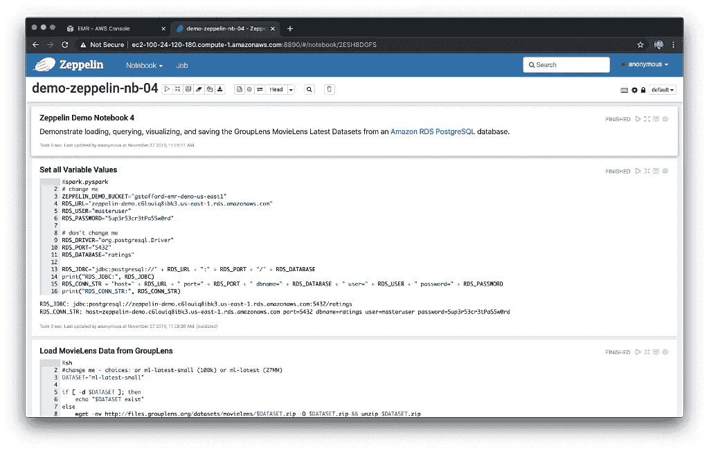

# 示范

首先，作为一名数据操作工程师，我们将使用 AWS Glue 数据目录、Amazon RDS PostgreSQL 数据库和基于 S3 的数据湖，创建和配置演示在 EMR 上使用 Apache Zeppelin 所需的 AWS 资源。设置完成后，作为数据分析师，我们将使用预构建的 Zeppelin 笔记本电脑探索 Apache Zeppelin 的功能以及与各种 AWS 服务的集成能力。

# 源代码

演示的源代码包含在两个公共的 GitHub 存储库中。第一个存储库， [zeppelin-emr-demo](https://github.com/garystafford/zeppelin-emr-demo) ，包括四个预建的 zeppelin 笔记本，根据 Zeppelin 的[可插拔笔记本存储机制](https://zeppelin.apache.org/docs/0.8.2/setup/storage/storage.html#notebook-storage-options-for-apache-zeppelin)的惯例进行组织。

```
.
├── 2ERVVKTCG
│   └── note.json
├── 2ERYY923A
│   └── note.json
├── 2ESH8DGFS
│   └── note.json
├── 2EUZKQXX7
│   └── note.json
├── LICENSE
└── README.md
```

# 齐柏林 GitHub 存储

在演示过程中，当提交发生时，对运行在 EMR 上的 Zeppelin 笔记本副本所做的更改将自动推回到 GitHub。为了实现这一点，不仅仅是克隆 zeppelin-emr-demo 项目存储库的本地副本，您还需要在您的个人 GitHub 帐户中有自己的副本。您可以派生 zeppelin-emr-demo GitHub 存储库，或者将一个克隆拷贝到您自己的 GitHub 存储库中。

要在您自己的 GitHub 帐户中创建项目的副本，首先，在 GitHub 上创建一个新的空存储库，例如，“my-zeppelin-emr-demo-copy”。然后，从您的终端执行以下命令，将原始项目存储库克隆到您的本地环境，最后，将其推送到您的 GitHub 帐户。

## GitHub 个人访问令牌

为了在提交时自动将更改推送到 GitHub 存储库，Zeppelin 将需要一个 [GitHub 个人访问令牌](https://github.com/settings/tokens)。创建一个个人访问令牌，其范围如下所示。一定要保守令牌的秘密。确保不要意外地将令牌值签入 GitHub 上的源代码。为了最大限度地降低风险，请在完成演示后立即更改或删除令牌。

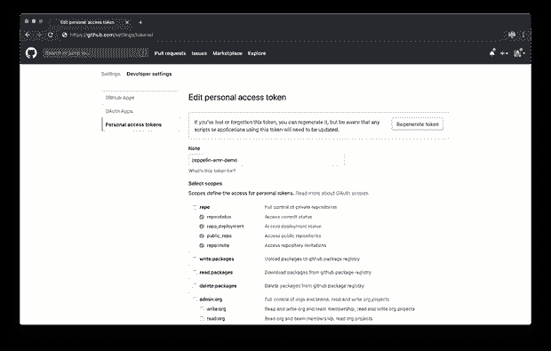

GitHub Developer Settings — Personal Access Tokens

第二个存储库 [zeppelin-emr-config](https://github.com/garystafford/zeppelin-emr-config) ，包含必要的引导文件、CloudFormation 模板和 PostgreSQL DDL(数据定义语言)SQL 脚本。

```
.
├── LICENSE
├── README.md
├── bootstrap
│   ├── bootstrap.sh
│   ├── emr-config.json
│   ├── helium.json
├── cloudformation
│   ├── crawler.yml
│   ├── emr_single_node.yml
│   ├── emr_cluster.yml
│   └── rds_postgres.yml
└── sql
    └── ratings.sql
```

使用以下 AWS CLI 命令将 GitHub 存储库克隆到您的本地环境中。

# 要求

为了进行演示，您将需要一个 AWS 帐户、一个现有的亚马逊 S3 桶来存储 EMR 配置和数据，以及一个 [EC2 密钥对](https://docs.aws.amazon.com/AWSEC2/latest/UserGuide/ec2-key-pairs.html)。您还需要在您的工作环境中安装最新版本的 [AWS CLI](https://aws.amazon.com/cli/) 。由于我们将使用特定的 EMR 功能，我建议使用`us-east-1` AWS 区域来创建演示资源。

# S3 的配置文件

首先，将三个配置文件， [bootstrap.sh](https://github.com/garystafford/zeppelin-emr-config/blob/master/bootstrap/bootstrap.sh) 、 [helium.json](https://github.com/garystafford/zeppelin-emr-config/blob/master/bootstrap/helium.json) 和 [ratings.sql](https://github.com/garystafford/zeppelin-emr-config/blob/master/sql/ratings.sql) ，从`zeppelin-emr-demo-setup`项目目录复制到我们的 S3 存储桶。更改`ZEPPELIN_DEMO_BUCKET`变量值，然后使用 AWS CLI 运行下面的`s3 cp` API 命令。这三个文件将被复制到 S3 存储桶内的引导目录中。

下面是将本地文件复制到 S3 的示例输出。

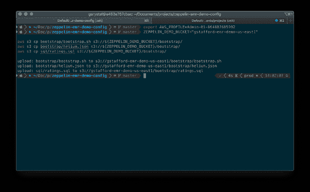

Copy Configuration Files to S3

# 创建 AWS 资源

我们将首先使用三个 [AWS CloudFormation](https://aws.amazon.com/cloudformation/) 模板创建演示所需的大部分 AWS 资源。我们将创建一个单节点 Amazon EMR 集群、一个 Amazon RDS PostgresSQL 数据库、一个 AWS Glue 数据目录数据库、两个 AWS Glue 爬虫和一个 Glue IAM 角色。由于在集群中运行大型 EC2 实例的[计算成本](https://aws.amazon.com/emr/faqs/?nc=sn&loc=7#Billing)，我们将等待创建多节点 EMR 集群。在继续之前，您应该了解这些资源的成本，并确保在演示完成后立即销毁这些资源，以最大限度地减少您的开支。

# 单节点 EMR 集群

我们将从创建单节点 Amazon EMR 集群开始，它只包含一个主节点，没有核心或任务节点(一个集群)。所有操作都将在主节点上进行。

## 默认 EMR 资源

以下 EMR 说明假设您过去已经在当前 AWS 区域使用带有“创建集群—快速选项”选项的 EMR web 界面创建了至少一个 EMR 集群。以这种方式创建集群会创建几个额外的 AWS 资源，比如`EMR_EC2_DefaultRole` EC2 实例概要、默认的`EMR_DefaultRole` EMR IAM 角色和默认的 EMR S3 日志存储桶。

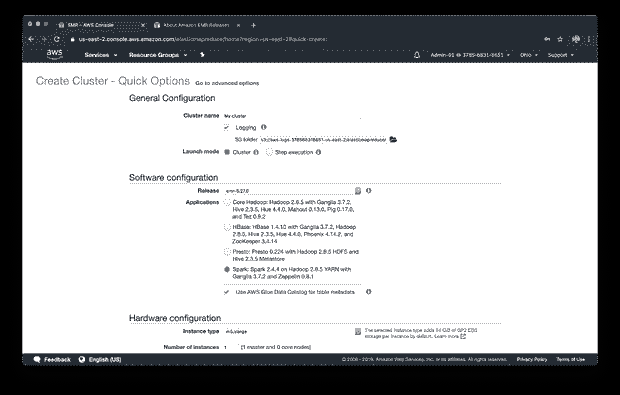

EMR — AWS Console

如果您过去没有使用 EMR 的“创建集群-快速选项”功能创建任何 EMR 集群，请不要担心。您还可以使用一些快速的 AWS CLI 命令来创建所需的资源。更改下面的`LOG_BUCKET`变量值，然后使用 AWS CLI 运行`aws emr`和`aws s3api` API 命令。`LOG_BUCKET`变量值遵循`aws-logs-awsaccount-region`的惯例。比如`aws-logs-012345678901-us-east-1`。

可以在 IAM 角色 web 界面中查看新的 EMR IAM 角色。

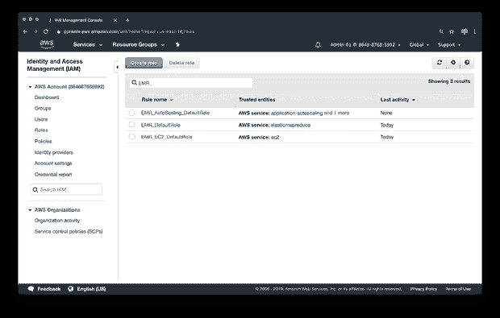

IAM Management Console

我经常看到从 AWS CLI 或 CloudFormation 引用这些默认 EMR 资源的教程，而没有对它们是如何创建的任何理解或解释。

## EMR 引导脚本

作为创建 EMR 集群的一部分，云模板 [emr_single_node.yml](https://github.com/garystafford/zeppelin-emr-config/blob/master/cloudformation/emr_single_node.yml) 将调用我们之前复制到 S3 的引导脚本 [bootstrap.sh](https://github.com/garystafford/zeppelin-emr-config/blob/master/bootstrap/bootstrap.sh) 。bootstrap 脚本预装了所需的 Python 和 Linux 软件包，以及 [PostgreSQL 驱动程序 JAR](https://jdbc.postgresql.org/) 。引导脚本还会克隆您的 [zeppelin-emr-demo](https://github.com/garystafford/zeppelin-emr-demo) GitHub 存储库副本。

## EMR 应用程序配置

EMR CloudFormation 模板还将修改 EMR 集群的 Spark 和 Zeppelin 应用程序配置。在其他配置属性中，模板将默认 Python 版本设置为 Python3，指示 Zeppelin 使用克隆的 GitHub 笔记本目录路径，并将 PostgreSQL 驱动程序 JAR 添加到 JVM 类路径中。下面我们可以看到应用于现有 EMR 集群的配置属性。

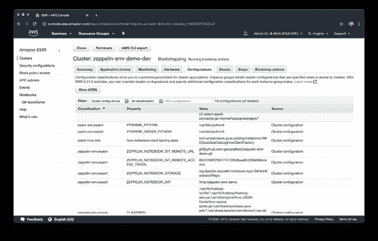

EMR — AWS Console

## EMR 应用程序版本

截至本文发布之日(2019 年 12 月)，EMR 的版本为 [5.28.0](https://docs.aws.amazon.com/emr/latest/ReleaseGuide/emr-release-5x.html) 。如 EMR web 界面所示，下面是可安装在 EMR 上的当前(21)个应用程序和框架。

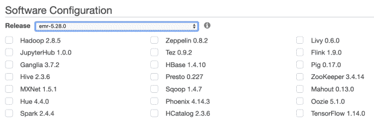

对于这个演示，我们将安装 Apache Spark v2.4.4、 [Ganglia](http://ganglia.info/) v3.7.2 和 Zeppelin 0.8.2。

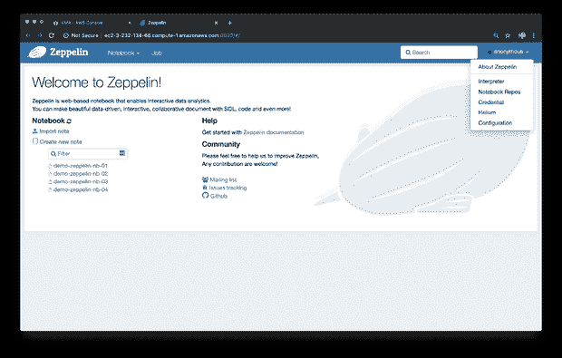

*Apache Zeppelin: Web Interface*

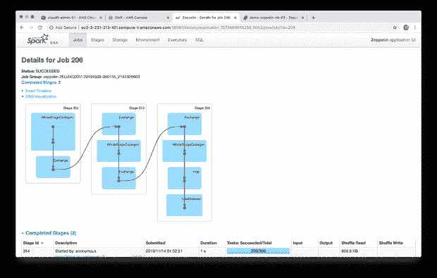

*Apache Spark: DAG Visualization*

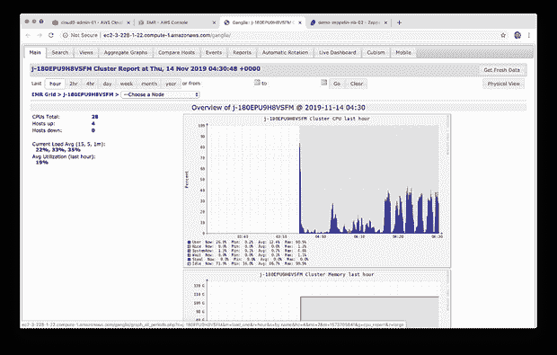

*Ganglia: Cluster CPU Monitoring*

## 创建 EMR 云信息堆栈

更改以下(7)个变量值，然后使用 AWS CLI 运行`emr cloudformation create-stack` API 命令。

您可以使用 Amazon EMR web 界面来确认 CloudFormation 堆栈的结果。集群应该处于“等待”状态。


EMR — AWS Console

# 亚马逊 RDS 上的 PostgreSQL

接下来，使用包含的 CloudFormation 模板 [rds_postgres.yml](https://github.com/garystafford/zeppelin-emr-config/blob/master/cloudformation/rds_postgres.yml) ，创建一个简单的、单 AZ、单主、非复制的 [Amazon RDS PostgreSQL](https://docs.aws.amazon.com/AmazonRDS/latest/UserGuide/CHAP_PostgreSQL.html) 数据库。我们将在笔记本 4 中使用该数据库。对于演示，我选择了当前通用的`db.m4.large` EC2 实例类型来运行 PostgreSQL。您可以轻松地将实例类型更改为另一个支持 RDS 的实例类型，以满足您的特定需求。

更改以下(3)个变量值，然后使用 AWS CLI 运行`cloudformation create-stack` API 命令。

您可以使用 Amazon RDS web 界面来确认 CloudFormation 堆栈的结果。

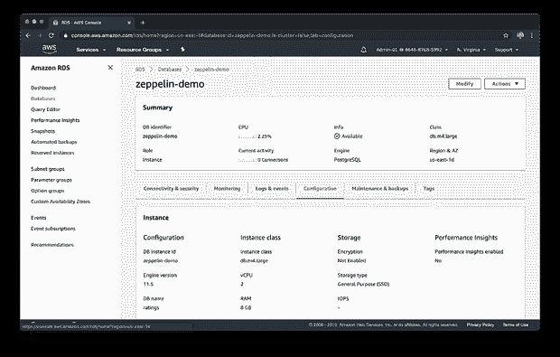

RDS — AWS Console

# AWS 胶水

接下来，使用包含的 CloudFormation 模板 [crawler.yml](https://github.com/garystafford/zeppelin-emr-config/blob/master/cloudformation/crawler.yml) 创建 AWS Glue 数据目录数据库、Apache Hive 兼容的 metastore for Spark SQL、两个 AWS Glue Crawlers 和一个 Glue IAM 角色(`ZeppelinDemoCrawlerRole`)。AWS 胶水数据目录数据库将在笔记本 3 中使用。

更改以下变量值，然后使用 AWS CLI 运行`cloudformation create-stack` API 命令。

您可以使用 AWS Glue web 界面来确认 CloudFormation 堆栈的结果。注意数据目录数据库和两个 Glue Crawlers。我们不会在后面的文章中运行这两个爬虫。因此，数据目录数据库中还不存在任何表。

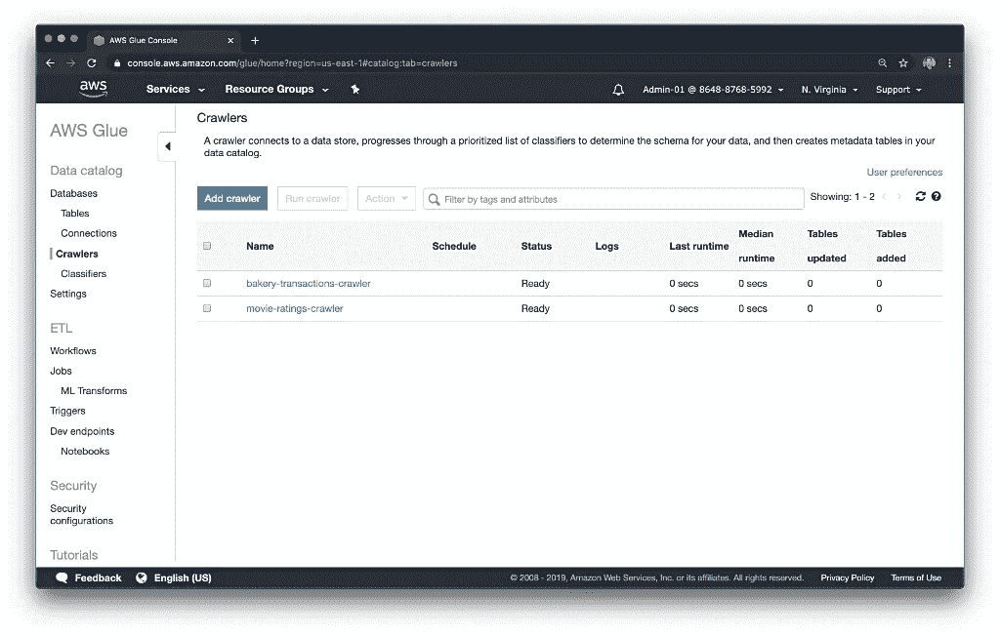

AWS Glue Console

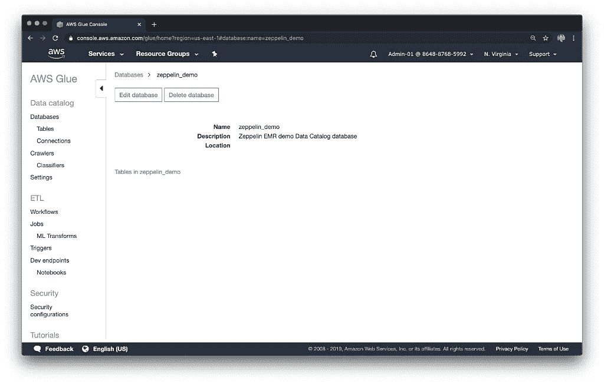

AWS Glue Console

至此，您应该已经成功创建了一个单节点 Amazon EMR 集群、一个 Amazon RDS PostgresSQL 数据库和几个 AWS Glue 资源，所有这些都使用了 CloudFormation 模板。

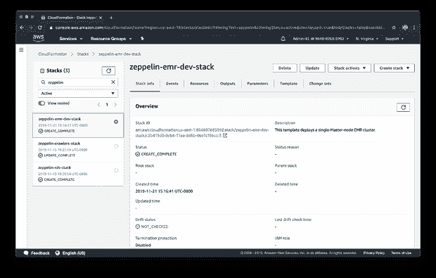

CloudFormation — AWS Console

# EMR 创建后配置

## RDS 安全性

为了让新的 EMR 集群与 RDS PostgreSQL 数据库通信，我们需要确保从 RDS 数据库的 VPC 安全组(默认的 VPC 安全组)到 EMR 节点的安全组的端口 5432 是开放的。从 EMR web 界面或使用 AWS CLI 获取`ElasticMapReduce-master`和`ElasticMapReduce-slave`安全组的组 ID。

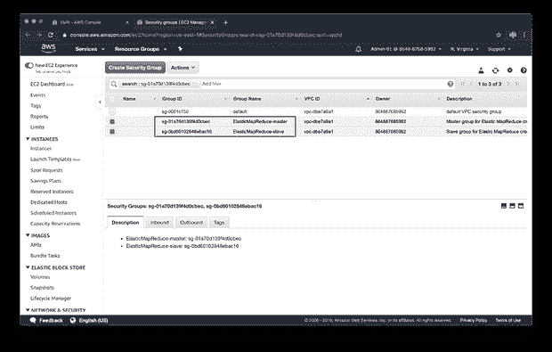

EMR — AWS Console

使用 RDS web 界面访问 RDS 数据库的安全组。将端口 5432 的入站规则更改为包含两个安全组 id。

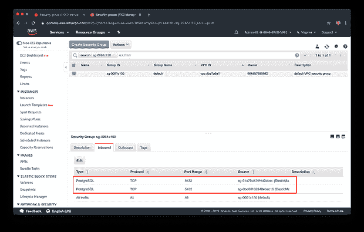

EC2 Management Console

## 到 EMR 主节点的 SSH

除了引导脚本和配置之外，我们已经应用于 EMR 集群，我们需要对 EMR 集群进行一些 EMR 创建后配置更改，以便进行演示。这些变化需要使用 SSH 连接到 EMR 集群。使用主节点的公共 DNS 地址和 EMR web 控制台中提供的 SSH 命令，SSH 进入主节点。

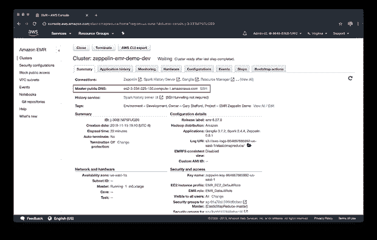

EMR — AWS Console

如果您无法使用 SSH 访问节点，请检查相关 EMR 主节点 IAM 安全组(`ElasticMapReduce-master`)上的端口 22 是否对您的 IP 地址或地址范围开放。

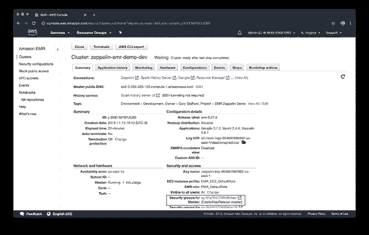

EMR — AWS Console

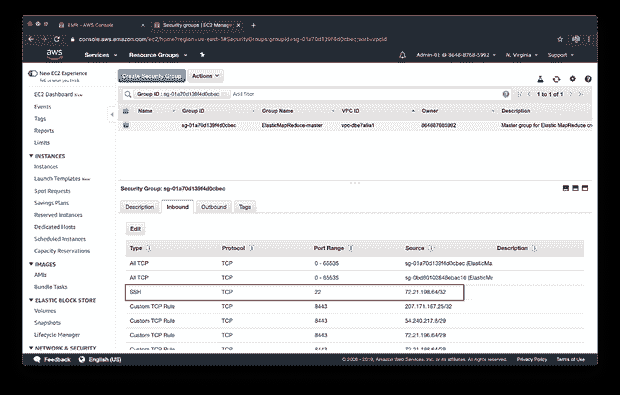

EC2 Management Console

## Git 权限

我们需要更改在 EMR 引导阶段安装的 git 存储库的权限。通常，对于 EC2 实例，您作为`ec2-user`用户执行操作。使用 Amazon EMR，您经常以`hadoop`用户的身份执行操作。使用 EMR 上的 Zeppelin，笔记本执行操作，包括作为`zeppelin`用户与 git 存储库交互。作为 [bootstrap.sh](https://github.com/garystafford/zeppelin-emr-config/blob/master/bootstrap/bootstrap.sh#L19-L20) 脚本的结果，默认情况下，git 存储库目录`/tmp/zeppelin-emr-demo/`的内容归`hadoop`用户和组所有。

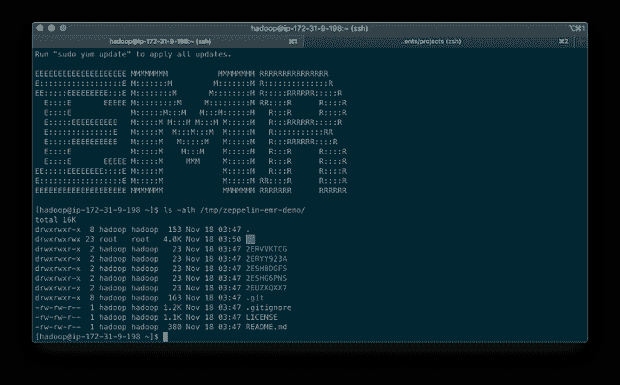

Git Clone Project Permissions on EMR Master Node

我们将把他们的所有者改为`zeppelin`用户和组。我们无法将此步骤作为引导脚本的一部分来执行，因为在脚本执行时不存在`zeppelin`用户和组。

```
cd /tmp/zeppelin-emr-demo/
sudo chown -R zeppelin:zeppelin .
```

结果应该类似于下面的输出。

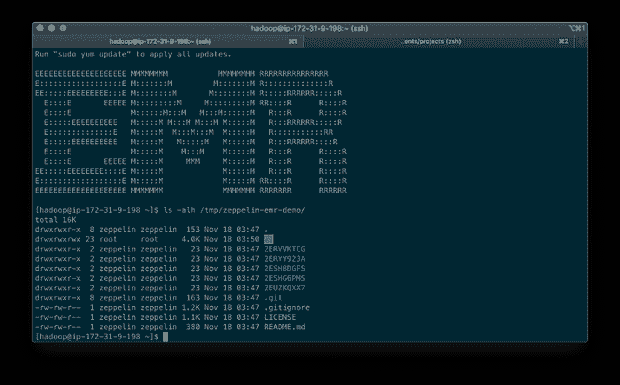

Git Clone Project Permissions on EMR Master Node

## 预安装可视化软件包

接下来，我们将预装几个 Apache Zeppelin 可视化软件包。据 [Zeppelin 网站](https://zeppelin.apache.org/docs/0.8.0/development/helium/writing_visualization_basic.html)介绍，Apache Zeppelin 可视化是一个可插拔的包，可以在运行时通过 Zeppelin 中的氦框架加载和卸载。我们可以像使用笔记本中的任何其他内置可视化一样使用它们。可视化是一个 javascript [npm 包](https://docs.npmjs.com/about-packages-and-modules)。例如，这里有一个公共 npm 注册表上的[最终饼状图](https://www.npmjs.com/package/ultimate-pie-chart)的链接。

我们可以通过用之前复制到 S3 的 [helium.json](https://github.com/garystafford/zeppelin-emr-config/blob/master/bootstrap/helium.json) 版本替换`/usr/lib/zeppelin/conf/helium.json`文件，并重启 Zeppelin 来预加载插件。如果您有很多可视化或包类型，或者使用任何 DataOps 自动化来创建 EMR 集群，这种方法比每次创建新的 EMR 集群时使用 Zeppelin UI 手动加载插件更有效且可重复。下面是`helium.json`文件，它预加载了 8 个可视化包。

运行以下命令来加载插件并调整文件的权限。

## 创建新的 JDBC 解释器

最后，我们需要创建一个新的[齐柏林 JDBC 解释器](https://zeppelin.apache.org/docs/0.8.2/interpreter/jdbc.html)来连接到我们的 RDS 数据库。默认情况下，Zeppelin 安装了几个解释器。您可以使用以下命令查看可用解释器的列表。

```
sudo sh /usr/lib/zeppelin/bin/install-interpreter.sh --list
```

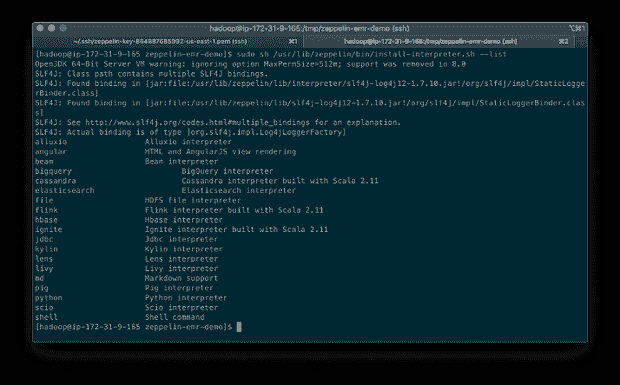

List of Installed Interpreters

新的 JDBC 解释器将允许我们使用 [Java 数据库连接](https://en.wikipedia.org/wiki/Java_Database_Connectivity) (JDBC)连接到我们的 RDS PostgreSQL 数据库。首先，确保安装了所有可用的解释器，包括当前的齐柏林 JDBC 驱动程序(`org.apache.zeppelin:zeppelin-jdbc:0.8.0`)到`/usr/lib/zeppelin/interpreter/jdbc`。

创建一个新的解释器是一个两部分的过程。在这个阶段，我们使用下面的命令在主节点上安装所需的解释器文件。然后，在 Zeppelin web 界面中，我们将配置新的 PostgreSQL JDBC 解释器。注意，我们必须为解释器提供一个唯一的名称(即‘postgres’)，我们将在解释器创建过程的第二部分中引用这个名称。

为了在主节点上完成后 EMR 创建配置，我们必须重新启动 Zeppelin 以使我们的更改生效。

```
sudo stop zeppelin && sudo start zeppelin
```

根据我的经验，重启后 Zeppelin UI 可能需要 2-3 分钟才能完全响应。

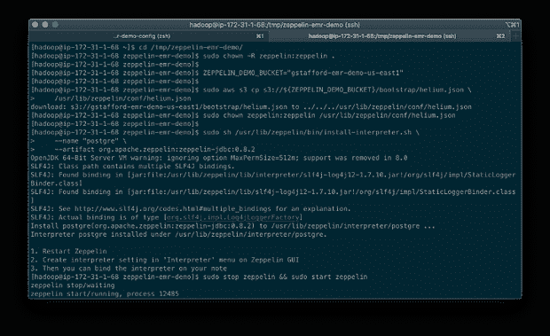

Restarting Zeppelin

# Zeppelin Web 界面访问

随着所有 EMR 应用程序配置的完成，我们将访问运行在主节点上的 Zeppelin web 界面。使用 EMR web 界面中提供的 Zeppelin 连接信息来[设置 SSH 隧道](https://docs.aws.amazon.com/emr/latest/ManagementGuide/emr-web-interfaces.html)到 Zeppelin web 界面，在主节点上运行。使用 SSH 隧道，我们还可以访问 Spark 历史服务器、Ganglia 和 Hadoop 资源管理器 web 界面。所有链接都是从 EMR web 控制台提供的。

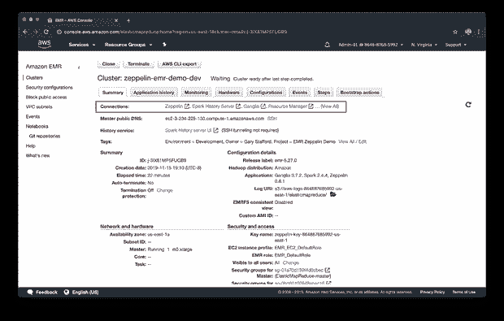

EMR — AWS Console

为了建立到 EMR 集群上安装的应用程序的 web 连接，我使用了 [FoxyProxy](https://getfoxyproxy.org/) 作为 Google Chrome 的代理管理工具。

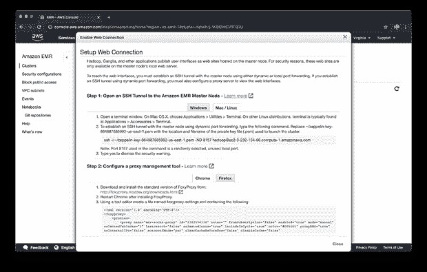

EMR — Enable Web Connection

如果到目前为止一切正常，您应该会看到 Zeppelin web 界面，其中包含了从克隆的 GitHub 存储库中获得的所有四个 Zeppelin 笔记本。您将作为`anonymous`用户登录。Zeppelin 为访问 EMR 集群上的笔记本提供了身份验证。为了简洁起见，我们将不讨论在 Zeppelin 中使用 [Shiro 认证](https://zeppelin.apache.org/docs/0.8.2/setup/security/shiro_authentication.html)来设置认证。


Apache Zeppelin Landing Page

## 笔记本路径

要确认 GitHub 笔记本存储库的本地克隆副本的路径是否正确，请检查笔记本存储库界面，该界面可在屏幕右上角的设置下拉菜单(`anonymous`用户)下访问。该值应该与我们之前执行的[EMR _ single _ node . yml](https://github.com/garystafford/zeppelin-emr-config/blob/master/cloudformation/emr_single_node.yml#L67)cloud formation 模板中的`ZEPPELIN_NOTEBOOK_DIR`配置属性值相匹配。

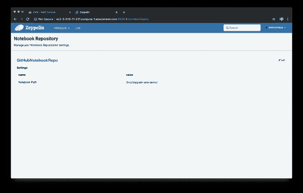

Apache Zeppelin GitHub Notebook Repository

## 氦可视化

为了确认氦可视化已正确预安装，使用[氦. json](https://github.com/garystafford/zeppelin-emr-config/blob/master/bootstrap/helium.json) 文件，打开氦界面，可在屏幕右上角的设置下拉菜单(`anonymous`用户)下访问。

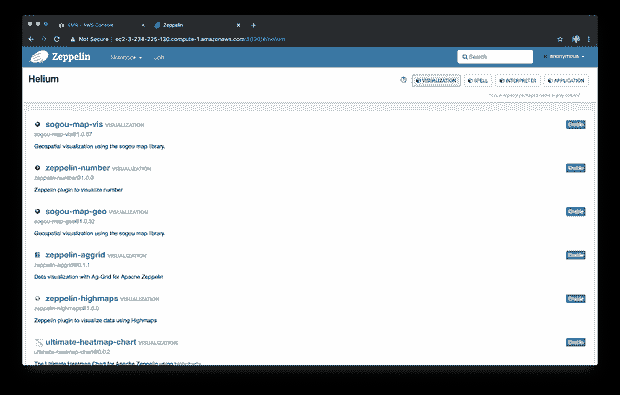

Apache Zeppelin — Available Helium Visualizations

请注意启用的可视化。而且，通过 web 界面启用附加插件也很容易。

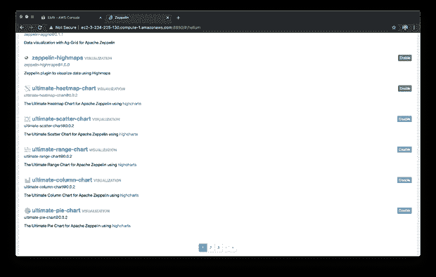

Apache Zeppelin — Enabled Helium Visualizations

## 新的 PostgreSQL JDBC 解释器

如果您还记得，在前面，我们使用下面的命令和引导脚本在主节点上安装了所需的解释器文件。我们现在将完成配置新的 PostgreSQL JDBC 解释器的过程。打开口译员界面，可通过屏幕右上角的设置下拉菜单(`anonymous`用户)进入。

新解释器的名称必须与我们用来安装解释器文件的名称“postgres”相匹配。解释器组将是“jdbc”。我们至少需要为您的特定 RDS 数据库实例配置三个属性，包括`default.url`、`default.user`和`default.password`。这些值应该与前面创建 RDS 实例时使用的值相匹配。确保在`default.url`中包含数据库名称。下面是一个例子。

我们还需要提供 PostgreSQL 驱动程序 JAR 依赖项的路径。这个路径是我们之前使用 [bootstrap.sh](https://github.com/garystafford/zeppelin-emr-config/blob/master/bootstrap/bootstrap.sh#L27) 脚本`/home/hadoop/extrajars/postgresql-42.2.8.jar`放置 JAR 的位置。保存新的解释器并确保它成功启动(显示绿色图标)。

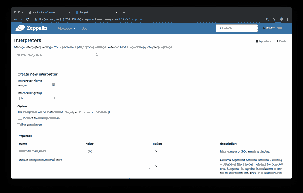

Configuring the PostgreSQL JDBC Interpreter

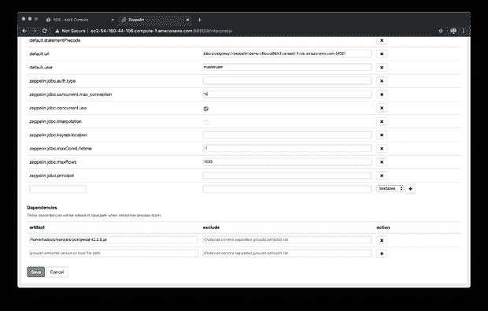

Configuring the PostgreSQL JDBC Interpreter

## 将解释器切换到 Python 3

我们需要做的最后一件事是改变 Spark 和 Python 解释器，使用 Python 3 而不是默认的 Python 2。在用于创建新解释器的同一个屏幕上，修改 Spark 和 Python 解释器。首先，对于 Python 解释器，将`zeppelin.python`属性改为`python3`。

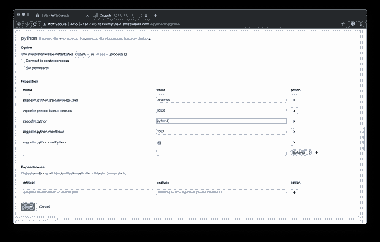

Setting Interpreters to Python 3

最后，对于 Spark 解释器，将`zeppelin.pyspark.python`属性更改为`python3`。

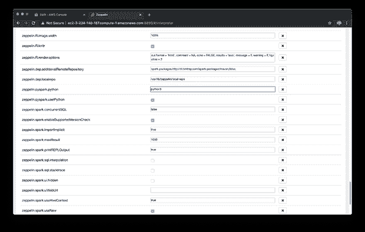

Setting Interpreters to Python 3

祝贺您，随着演示设置的完成，我们已经准备好开始使用我们的四个笔记本中的每一个来探索 Apache Zeppelin。

# 笔记本 1

[第一个笔记本](https://www.zepl.com/viewer/github/garystafford/zeppelin-emr-demo/blob/master/2ERVVKTCG/note.json)使用一个小的 21k 行 [kaggle](https://www.kaggle.com/) 数据集，来自面包店的[交易。该笔记本展示了 Zeppelin 与](https://www.kaggle.com/sulmansarwar/transactions-from-a-bakery) [Helium](https://zeppelin.apache.org/docs/0.8.2/development/helium/overview.html) 插件系统的集成能力，用于添加新的图表类型，使用亚马逊 S3 进行数据存储和检索，使用 [Apache Parquet](https://parquet.apache.org/) ，一种压缩和高效的列数据存储格式，以及 Zeppelin 与 GitHub 的存储集成，用于笔记本版本控制。

## 解释程序

当您第一次打开一个笔记本时，您可以选择绑定和解除绑定到笔记本的解释器。下面显示的列表中的最后一个解释器`postgres`，是我们在帖子前面创建的新的 PostgreSQL JDBC Zeppelin 解释器。我们将在笔记本 3 中使用这个解释器。

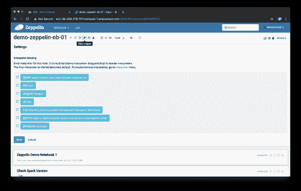

## 应用程序版本

笔记本的前两段用来确认我们正在使用的 Spark、Scala、OpenJDK、Python 的版本。回想一下，我们更新了 Spark 和 Python 解释器以使用 Python 3。

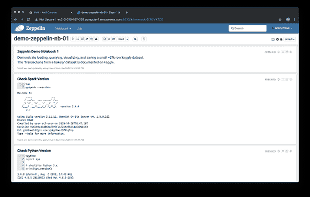

## 氦可视化

如果你记得在这篇文章的前面，我们预装了几个额外的氦可视化，包括[终极饼状图](https://www.npmjs.com/package/ultimate-pie-chart)。下面，我们看到使用 Spark SQL ( `%sql`)解释器来查询 Spark 数据帧，返回结果，并使用最终的饼图来可视化数据。除了饼图之外，我们还可以在菜单栏中看到其他预安装的氦可视化，它们位于五个默认可视化之前。

有了 Zeppelin，我们所要做的就是针对之前在笔记本中创建的 [Spark 数据帧](https://spark.apache.org/docs/2.4.4/sql-programming-guide.html)编写 [Spark SQL](http://spark.apache.org/sql/) 查询，Zeppelin 将处理可视化。您可以使用“设置”下拉选项对图表进行一些基本控制。

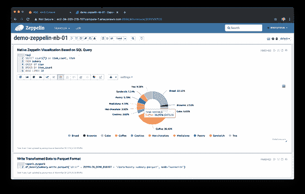

## 构建数据湖

笔记本 1 演示了如何向 S3 读写数据。我们使用 Spark (PySpark)将面包店数据集读写为 CSV 格式和 [Apache Parquet](https://parquet.apache.org/) 格式。我们还将 Spark SQL 查询的结果写入 S3 的 Parquet 中，如上图所示。

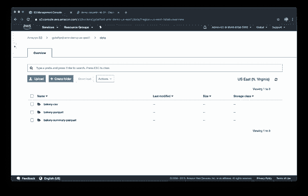

S3 Management Console

使用 Parquet，数据可以被分割成多个文件，如下面的 S3 桶目录所示。Parquet 比 CSV 更快地读入 Spark 数据帧。Spark 支持读写拼花文件。我们将把我们所有的数据写到 S3 的 Parquet 上，这使得未来数据的重复使用比从互联网上下载数据(如 GroupLens 或 kaggle)或从 S3 消费 CSV 文件更有效率。

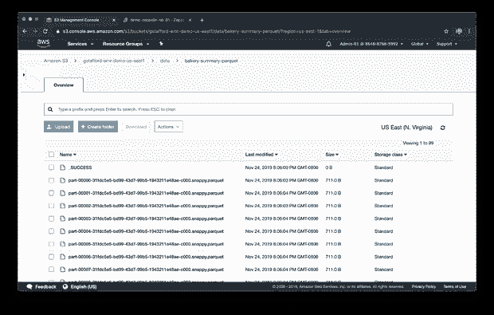

Paquet-Format Files in S3

## 预览 S3 数据

除了使用 Zeppelin 笔记本，我们还可以使用亚马逊 S3 选择 T2 功能在 S3 木桶网络界面上预览数据。这个[就地查询](https://aws.amazon.com/s3/features/#s3-select)特性有助于快速理解您想要在 Zeppelin 中与之交互的新数据文件的结构和内容。

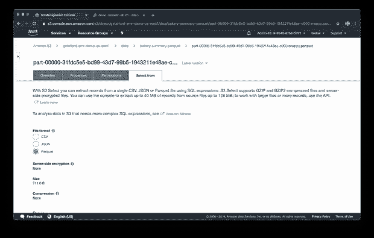

Previewing Data in S3 using the ‘Select from’ Feature

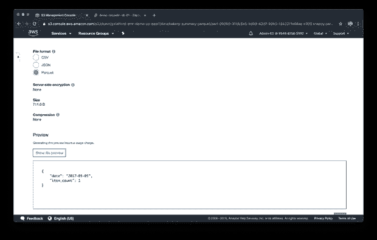

Previewing Data in S3 using the ‘Select from’ Feature

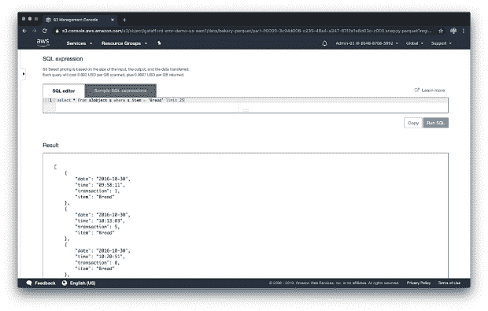

Previewing Data in S3 using the ‘Select from’ Feature

## 将更改保存到 GitHub

之前，我们将 Zeppelin 配置为从您自己的 GitHub 笔记本存储库中读取和写入笔记本。使用“版本控制”菜单项，对笔记本所做的更改可以直接提交到 GitHub。

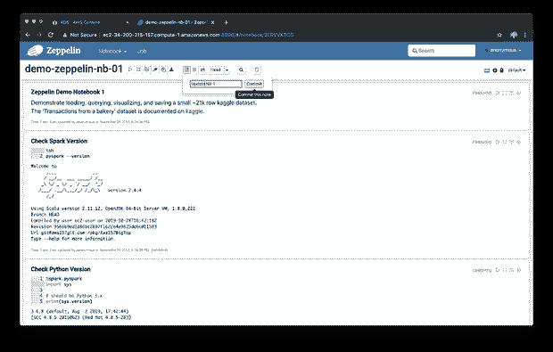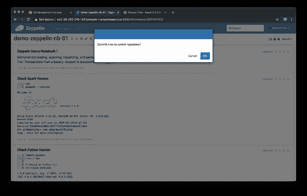

在 GitHub 中，注意提交者是`zeppelin`用户。

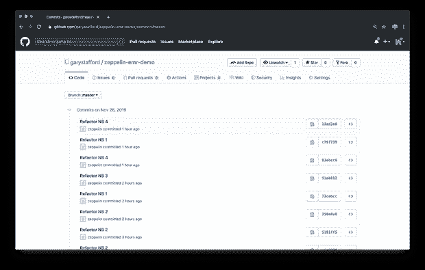

Commits in GitHub

# 笔记本 2

第二本[笔记本](https://www.zepl.com/viewer/github/garystafford/zeppelin-emr-demo/blob/master/2EUZKQXX7/note.json)演示了使用[单节点](https://docs.aws.amazon.com/emr/latest/ManagementGuide/emr-overview.html#emr-overview-clusters)和[多节点](https://docs.aws.amazon.com/emr/latest/ManagementGuide/emr-master-core-task-nodes.html) Amazon EMR 集群，使用 Zeppelin 探索和分析从大约 100k 行到 27MM 行的公共数据集。我们将使用最新的 GroupLens [MovieLens](https://grouplens.org/datasets/movielens/) 评级数据集，在单节点和多节点 EMR 集群上使用 Spark 来检查 Zeppelin 的性能特征，以便使用各种 [Amazon EC2 实例类型](https://aws.amazon.com/ec2/instance-types/)来分析大数据。

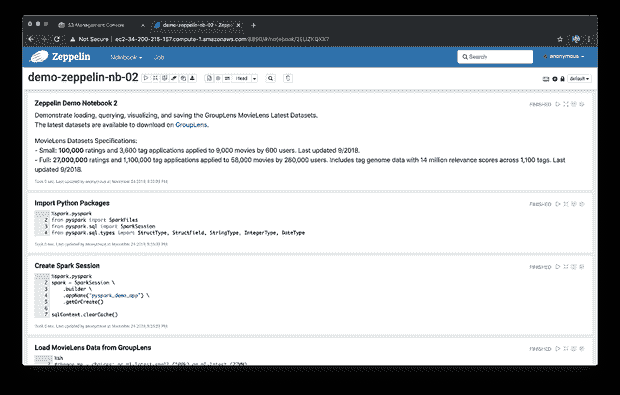

## 多节点 EMR 集群

如果您还记得，我们等待创建多节点集群是因为运行集群的大型 EC2 实例的[计算成本](https://aws.amazon.com/emr/faqs/?nc=sn&loc=7#Billing)。在继续之前，您应该了解这些资源的成本，并确保在演示完成后立即销毁这些资源，以最大限度地减少您的开支。

## 标准化实例小时数

理解 EMR 的成本需要理解标准化实例时间的概念。EMR AWS 控制台中显示的集群包含两列，“运行时间”和“标准化实例小时数”。“已用时间”列反映了使用集群的实际挂钟时间。“标准化实例小时数”列指示群集已使用的计算小时数的近似值，四舍五入到最接近的小时数。

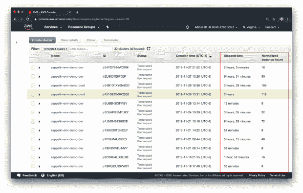

EMR — AWS Console: Normalized Instance Hours

标准化实例小时数的计算基于一个[标准化因子](https://aws.amazon.com/emr/faqs/?nc=sn&loc=7)。规范化因子的范围从小型实例的 1 到大型实例的 64。根据我们多节点集群中实例的类型和数量，我们将每一个小时的挂钟时间使用大约 56 个计算小时(也称为标准化实例小时)。请注意我们的演示中使用的多节点集群，上面以黄色突出显示。集群运行了两个小时，相当于 112 个标准化实例小时。

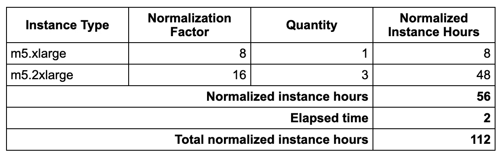

## 创建多节点集群

使用 CloudFormation 创建多节点 EMR 集群。更改以下九个变量值，然后使用 AWS CLI 运行`emr cloudformation create-stack` API 命令。

使用 Amazon EMR web 界面来确认 CloudFormation 堆栈的成功。准备就绪时，完全调配的群集应处于“等待”状态。

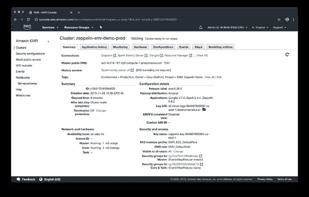

EMR — AWS Console

## 配置 EMR 集群

继续之前，请参考前面的单节点集群说明，了解准备 EMR 集群和 Zeppelin 所需的配置步骤。重复用于单节点集群的所有步骤。

## 使用 Ganglia 进行监控

之前，我们在创建 EMR 集群时安装了 Ganglia。 [Ganglia](http://ganglia.sourceforge.net/) ，据其网站介绍，是一个可扩展的分布式监控系统，用于集群和网格等高性能计算系统。Ganglia 可用于评估单节点和多节点 EMR 集群的性能。使用 Ganglia，我们可以轻松查看集群和单个实例的 CPU、内存和网络 I/O 性能。

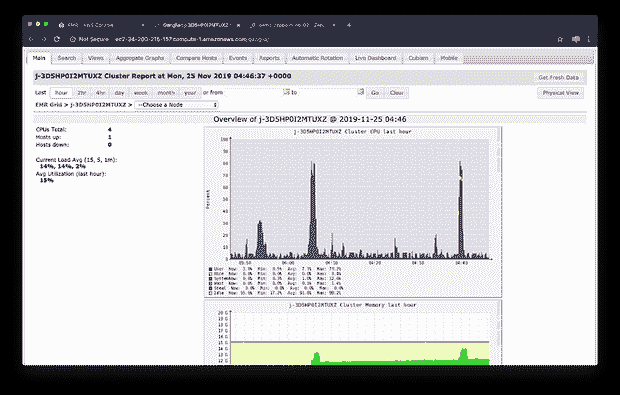

*Ganglia Example: Cluster CPU*

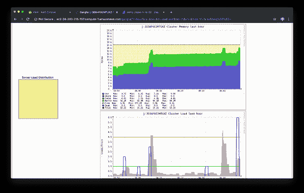

*Ganglia Example: Cluster Memory*

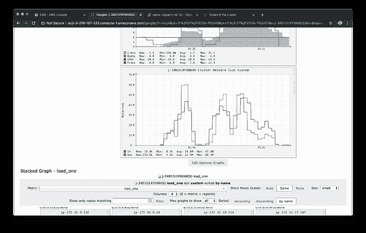

*Ganglia Example: Cluster Network I/O*

## 纱线资源经理

我们的 EMR 集群也提供纱线资源管理器网络用户界面。使用资源管理器，我们可以查看集群上的计算资源负载，以及各个 EMR 核心节点。下面，我们看到多节点集群有 24 个 vCPUs 和 72 GiB 可用内存，平均分布在三个核心集群节点上。

您可能还记得，用于三个核心节点的 m5.2xlarge EC2 实例类型，每个包含 8 个 vCPUs 和 32 GiB 内存。然而，通过[默认](https://docs.aws.amazon.com/emr/latest/ReleaseGuide/emr-hadoop-task-config.html#emr-hadoop-task-config-m5)，尽管每个节点的所有 8 个虚拟 CPU 都可用于计算，但是节点的 32 GiB 内存中只有 24 GiB 可用于计算。EMR 确保每个节点上都有一部分内存保留给其他系统进程。最大可用内存由纱线内存配置选项`yarn.scheduler.maximum-allocation-mb`控制。

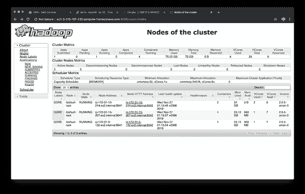

YARN Resource Manager

上面的纱线资源管理器预览显示了 Notebook 2 在 27MM 评级的大型 MovieLens 数据帧上执行 Spark SQL 查询时代码节点上的负载。请注意，24 个 vCPUs 中只有 4 个(16.6%)正在使用，但 72 GiB (97.6%)可用内存中有 70.25%正在使用。根据 [Spark](https://spark.apache.org/docs/latest/tuning.html) 的说法，由于大多数 Spark 计算的内存性质，Spark 程序可能会受到集群中任何资源的瓶颈:CPU、网络带宽或内存。通常，如果数据适合内存，瓶颈是网络带宽。在这种情况下，内存似乎是最受限制的资源。使用[内存优化的实例](https://docs.aws.amazon.com/AWSEC2/latest/UserGuide/memory-optimized-instances.html)，比如 r4 或 r5 实例类型，对于核心节点可能比 m5 实例类型更有效。

## 电影镜头数据集

通过更改笔记本中的一个变量，我们可以使用最新的、更小的 GroupLens [MovieLens](https://grouplens.org/datasets/movielens/) 数据集，包含大约 100k 行(`ml-latest-small`)或更大的数据集，包含大约 2700 万行(`ml-latest`)。对于本演示，请在单节点和多节点集群上尝试这两个数据集。比较四个变量中每个变量的 Spark SQL 段落执行时间，包括 1)小数据集的单节点，2)大数据集的单节点，3)小数据集的多节点，以及 4)大数据集的多节点。观察 SQL 查询在单节点集群和多节点集群上的执行速度。尝试切换到不同的核心节点实例类型，例如 r5.2xlarge。计算时间是如何实现的？

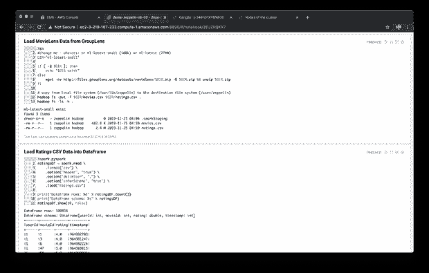

在继续笔记本 3 之前，终止多节点 EMR 群集以节省您的费用。

```
aws cloudformation delete-stack --stack-name=zeppelin-emr-prod-stack
```

# 笔记本 3

第三个笔记本展示了[亚马逊 EMR](https://aws.amazon.com/emr/) 和 Zeppelin 与[AWS Glue](https://aws.amazon.com/glue/)数据目录的集成能力，作为 [Apache Hive](https://hive.apache.org/) 兼容 [metastore](https://cwiki.apache.org/confluence/display/Hive/Design#Design-Metastore) 用于 [Spark SQL](https://spark.apache.org/sql/) 。我们将使用 AWS Glue 数据目录和一组 [AWS Glue 爬虫](https://docs.aws.amazon.com/glue/latest/dg/add-crawler.html)创建一个基于亚马逊 S3 的[数据湖](https://aws.amazon.com/big-data/datalakes-and-analytics/what-is-a-data-lake/)。

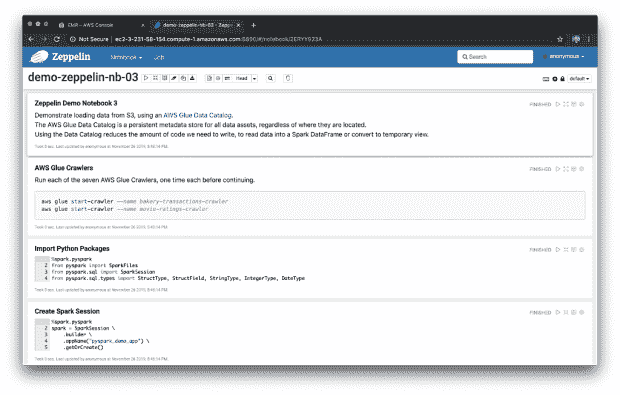

## 胶粘履带车

在继续使用 Notebook 3 之前，使用 AWS CLI 启动两个 Glue 爬虫。

```
aws glue start-crawler --name bakery-transactions-crawler
aws glue start-crawler --name movie-ratings-crawler
```

这两个爬行器应该在 Glue 数据目录数据库中创建总共七个表。

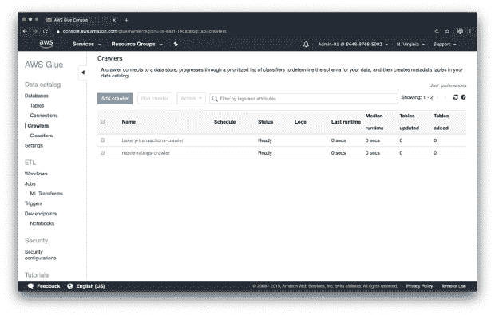

AWS Glue Console: Crawlers

如果我们检查 Glue 数据目录数据库，我们现在应该观察几个表，每个表对应于在 S3 桶中找到的一个数据集。每个数据集的位置显示在表视图的“位置”列中。

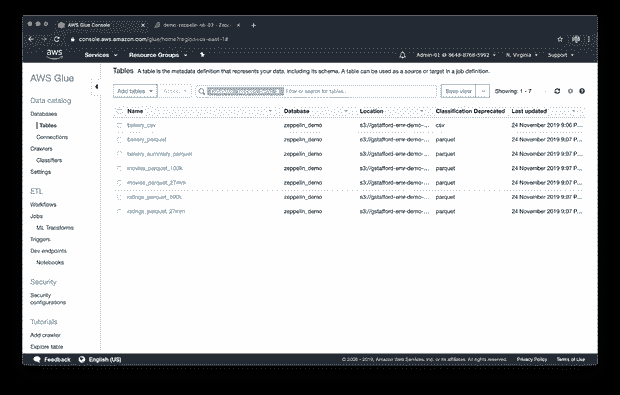

AWS Glue Console: Data Catalog Tables

从 Zeppelin 笔记本中，我们甚至可以使用 Spark SQL 来查询 AWS Glue 数据目录本身，以获得其数据库和其中的表。


根据亚马逊的说法，粘合数据目录表和数据库是元数据定义的容器，这些元数据定义定义了底层源数据的模式。使用 Zeppelin 的 SQL 解释器，我们可以查询数据目录的元数据并返回底层的源数据。下面的 SQL 查询示例演示了如何跨数据目录数据库中的两个表执行连接，这两个表代表两个不同的数据源，并返回结果。

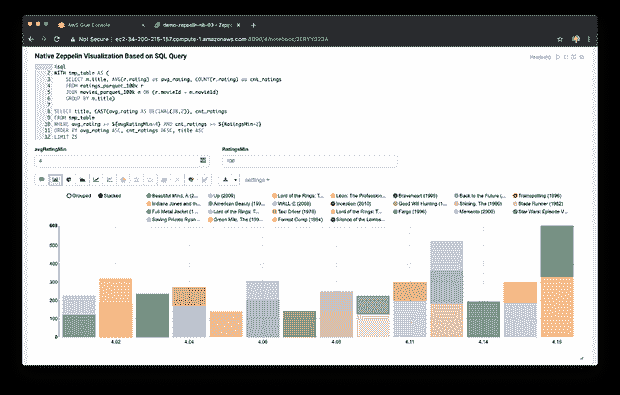

# 笔记本 4

第四个笔记本[展示了 Zeppelin 与](https://www.zepl.com/viewer/github/garystafford/zeppelin-emr-demo/blob/master/2ESH8DGFS/note.json)[外部数据源](https://zeppelin.apache.org/docs/0.8.2/interpreter/jdbc.html#overview)整合的能力。在这种情况下，我们将使用三种方法与 [Amazon RDS PostgreSQL](https://aws.amazon.com/rds/postgresql/) 关系数据库中的数据进行交互，包括用于 Python 的 [Psycopg 2](http://initd.org/psycopg/) PostgreSQL 适配器、Spark 的原生 JDBC 功能和 Zeppelin 的 [JDBC 解释器](https://zeppelin.apache.org/docs/0.8.2/interpreter/jdbc.html)。

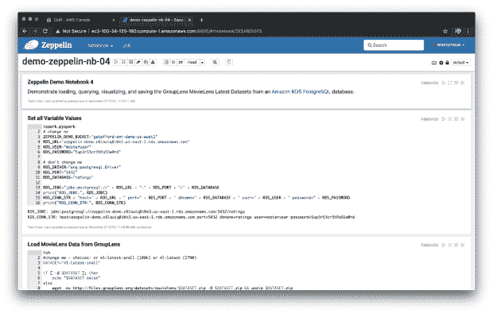

## 心理战

首先，使用 Psycopg 2 PostgreSQL adapter for Python 和 SQL 文件为 RDS PostgreSQL movie ratings 数据库创建一个新的数据库模式和四个相关的表，我们之前已经将该文件复制到了 S3。

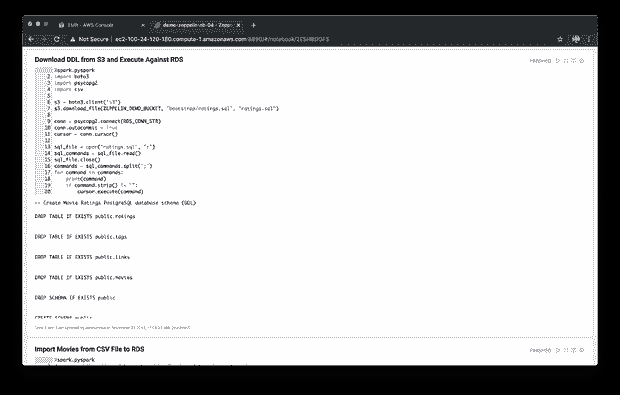

RDS 数据库的模式如下所示，近似于我们在笔记本 2 中使用的 GroupLens [MovieLens](https://grouplens.org/datasets/movielens/) 评级数据集的四个 CSV 文件的模式。

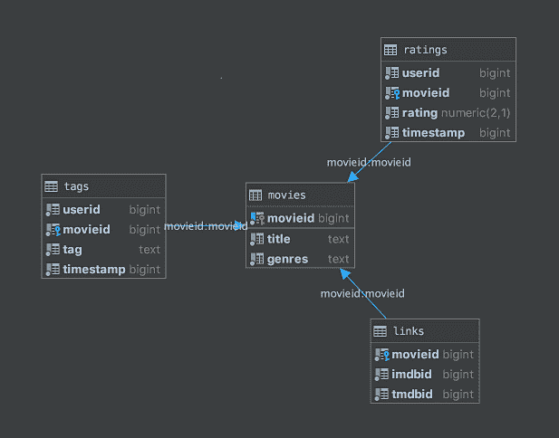

MovieLens Relational Database Schema

由于 PostgreSQL 数据库的模式与 MovieLens 数据集文件相匹配，我们可以将从 GroupLens 下载的 CVS 文件中的数据直接导入到 RDS 数据库中，再次使用[Psycopg](http://initd.org/psycopg/)PostgreSQL adapter for Python。


## 火花 JDBC

根据 [Spark 文档](https://spark.apache.org/docs/latest/sql-data-sources-jdbc.html)，Spark SQL 还包括一个数据源，可以使用 JDBC 从其他数据库读取数据。使用 Spark 的 JDBC 功能和我们之前安装的 [PostgreSQL JDBC 驱动程序](https://jdbc.postgresql.org/)，在安装期间，我们可以使用 PySpark ( `%spark.pyspark`)对 RDS 数据库执行 Spark SQL 查询。下面，我们看到一个使用 Spark 读取 RDS 数据库的`movies`表的例子。


## Zeppelin PostgreSQL 解释程序

作为查询 RDS 数据库的第三种方法，我们可以使用我们之前创建的定制 Zeppelin PostgreSQL JDBC 解释器(`%postgres`)。尽管 JDBC 解释器的默认驱动程序被设置为 PostgreSQL，并且相关的 JAR 包含在 Zeppelin 中，但是我们用最新的 [PostgreSQL JDBC 驱动程序](https://jdbc.postgresql.org/) JAR 覆盖了旧的 JAR。

使用`%postgres`解释器，我们查询 RDS 数据库的`public`模式，并返回我们之前在笔记本中创建的四个数据库表。

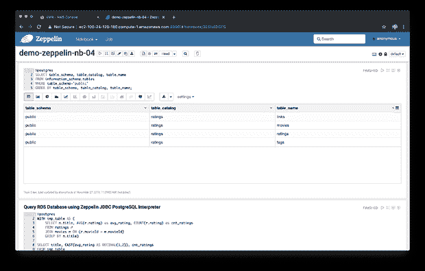

## 动态表单

使用笔记本段落中的`%postgres`解释器，我们查询 RDS 数据库并返回数据，然后使用 Zeppelin 的条形图可视化这些数据。最后，注意这个例子中 Zeppelin [动态形式](https://zeppelin.apache.org/docs/0.8.2/usage/dynamic_form/intro.html)的使用。动态表单允许 Zeppelin 动态地创建输入表单，然后可以通过编程使用表单的输入值。笔记本使用两个表单输入值来控制从我们的查询返回的数据和结果可视化。

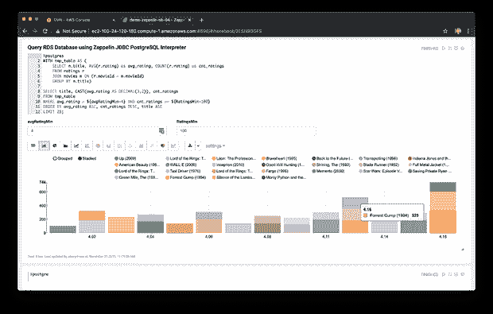

# 结论

在这篇文章中，我们了解了 Apache Zeppelin 如何有效地与 Amazon EMR 集成。我们还学习了如何使用 AWS Glue、亚马逊 RDS 和亚马逊 S3 作为数据湖来扩展 Zeppelin 的功能。除了这篇文章中提到的，还有几十个 Zeppelin 和 EMR 特性，以及几十个与 Zeppelin 和 EMR 集成的 AWS 服务，供您探索。

本文表达的所有观点都是我个人的，不一定代表我现在或过去的雇主或他们的客户的观点。