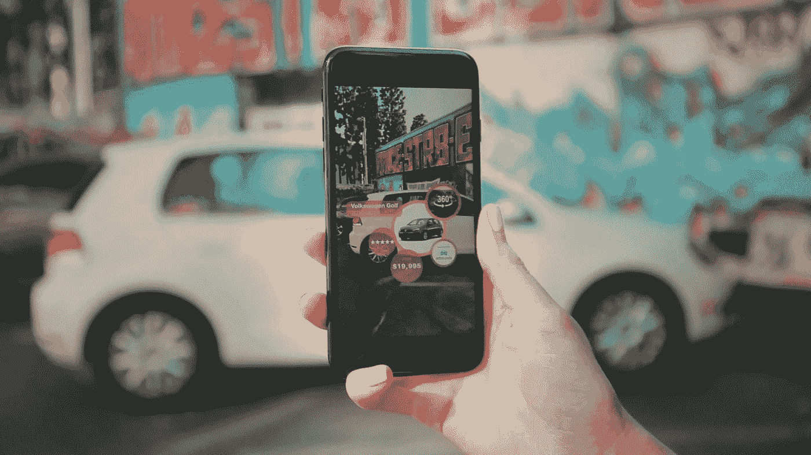
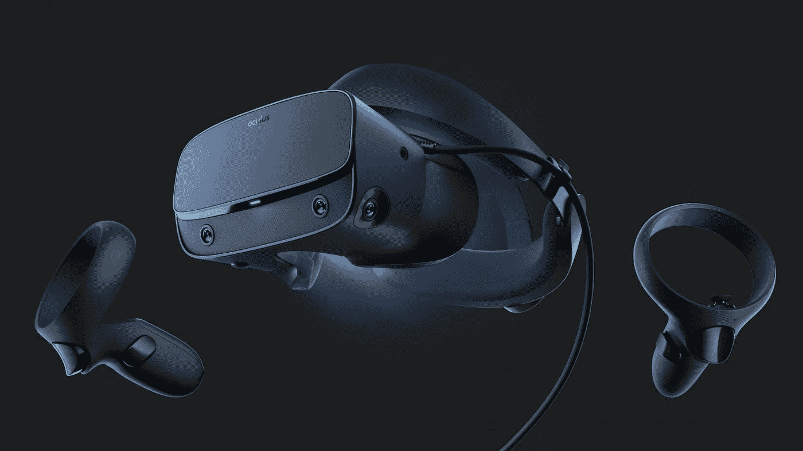

# 增强现实和虚拟现实入门

> 原文：<https://towardsdatascience.com/getting-started-with-augmented-and-virtual-reality-a51446661c3?source=collection_archive---------12----------------------->

## 用实例介绍不同类型的增强现实和虚拟现实。


(Source: [https://fsmedia.imgix.net/7b/5e/73/1d/0b6f/4146/9e58/67b0faf61bf5/ready-player-one-tech-might-already-be-here.jpeg?rect=0%2C0%2C2632%2C1314&auto=format%2Ccompress&dpr=2&w=650](https://fsmedia.imgix.net/7b/5e/73/1d/0b6f/4146/9e58/67b0faf61bf5/ready-player-one-tech-might-already-be-here.jpeg?rect=0%2C0%2C2632%2C1314&auto=format%2Ccompress&dpr=2&w=650))

# 增强现实

> 增强现实是一种技术，它将你周围的世界融入其中，并在其上添加虚拟内容，使其看起来就像在现实世界中一样。
> 
> — Zappar [1]

增强现实(AR)背后的主要思想是将虚拟物体和信息实时叠加在现实世界环境中，以使用户体验更具沉浸感[2]。

增强现实的一些常用应用示例有:

*   [培养医学生](https://www.youtube.com/watch?v=h4M6BTYRlKQ)
*   [军事训练](https://jasoren.com/augmented-reality-military/)
*   [博彩](https://www.ericsson.com/en/trends-and-insights/consumerlab/consumer-insights/reports/ready-steady-game)
*   [博物馆/艺术画廊之旅](https://www.museumnext.com/article/how-museums-are-using-augmented-reality/)



Figure 1: Augmented Reality in action [3]

增强现实的使用预计将在未来几年内增加，谷歌和苹果等公司已经开发了诸如 [ARCore](https://developers.google.com/ar/distribute/) 和 [ARKit](https://developer.apple.com/augmented-reality/) 等工具，使开发者更容易分别为 Play Store 和 App Store 创建 AR 应用。

如今，人工智能通常被集成到 AR 和 VR 应用中，以优化客户体验(例如，计算机视觉)。

有不同类型的增强现实应用，这些是[4]:

1.  **基于标记的增强现实** =利用摄像机和虚拟标记(如 QR 码)，在摄像机识别标记时激活一些 AR 组件。
2.  **无标记增强现实** =使用嵌入在设备(如智能手机)中的 GPS、加速度计和数字罗盘，根据用户位置提供增强现实内容。例如，这可以用于使绘图系统更具交互性。
3.  **基于投影的增强现实** =光被发送到现实世界的物体上，以创建用户可以与之交互的用户界面(通过检查投影区域如何被这种交互改变来检测用户与表面的交互)。
4.  **基于叠加的增强现实** =这种类型的增强现实使用对象识别来部分或完全改变对象的视图。例如，宜家构思了一个应用程序，让用户在他们的房子里放置虚拟的宜家家具，以帮助他们决定购买哪件家具。

增强现实可以用于许多不同的环境和应用中。例如，今年夏天我决定创建一张个人 AR 名片，因为这将是我在南安普顿大学学习的最后一年。

这个 AR 应用程序是使用杰罗姆·艾蒂安制作的 Javascript 库 [AR.js](https://github.com/jeromeetienne/AR.js) 创建的。

如果你对开发自己的 AR 应用感兴趣，也可以使用 [Unity Vuforia](https://www.youtube.com/watch?v=MtiUx_szKbI&list=WL&index=93&t=0s) 或 A-Frame(如本文末尾的实际例子所示)。

# 虚拟现实

有时，术语增强现实(AR)和虚拟现实(VR)会被错误地混淆。两者的主要区别在于，VR 创建了一个完全人工的环境，用户可以完全沉浸在其中，而 AR 旨在使用人工效果来增强我们的现实世界环境。

为了体验 VR，通常使用诸如头戴式显示器(HMDs)和输入设备之类的设备。

*   **头戴式显示器** =包含安装在用户眼前的显示器的设备(在某些情况下也可以使用智能手机)。
*   **输入设备** =数据手套、跟踪板、操纵杆。



Figure 2: Virtual Reality Accessories [5]

虚拟现实有三种主要类型[6]:

*   **非沉浸式模拟** =只有一些用户传感器被刺激(用户仍然意识到虚拟模拟之外的现实)。
*   **半沉浸式模拟** =用户部分但不完全沉浸在虚拟环境中(如飞行模拟)。
*   **完全沉浸式模拟** =使用头盔显示器和输入设备等配件刺激用户的所有感官。

# 示范

现在，我将带您通过一个实用的介绍，了解如何使用 A-Frame 创建一个简单的 AR 应用程序。我在这个例子中使用的所有代码都可以在我的 [GitHub](https://github.com/pierpaolo28/Artificial-Intelligence-Projects/blob/master/Virtual%20Reality%20(VR)/VR.html) 和 [CodePen](https://codepen.io/pierpaolo28/pen/pMeJKQ) 账户中找到，供你使用。

A-Frame 是一个基于 HTML 的 web 框架，用于创建 VR 应用程序。它支持各种各样的 VR 头戴设备，如 GerVR、CardBoard、Oculus Go，也可用于 AR 应用。

A-Frame 文档提供了各种各样的例子来帮助您入门，有些例子可以在[这里](https://aframe.io/examples/showcase/helloworld/)找到。

为了开始使用 A-Frame，我们可以使用 [CopePen](https://codepen.io/mozillavr/pen/BjygdO) 作为在线编辑器(或任何其他 web 开发编辑器),以便实时测试我们的代码。

首先，我们需要在我们的 HTML 脚本中加载 A 帧库。

```
<script src="[https://aframe.io/releases/0.9.0/aframe.min.js](https://aframe.io/releases/0.9.0/aframe.min.js)"> </script>
```

在这个例子中，我将创建一个交互式图片，我们可以在虚拟环境中旋转 360 度。

为此，我将下面的代码分为 5 个主要部分:

1.  加载本例所需的所有库/依赖项。
2.  加载要使用的图像并对其进行预处理以适应虚拟环境。
3.  向图像添加动画。
4.  添加欢迎用户使用应用程序的文本横幅。
5.  启用相机和鼠标光标交互以增加与虚拟环境的交互性。

因此，创建了以下动画:

如果你有兴趣自己测试这个应用程序，只要在你的智能手机上浏览时打开[这个 CodePen 链接](https://codepen.io/pierpaolo28/pen/pMeJKQ)！

# 联系人

如果你想了解我最新的文章和项目[，请通过媒体](https://medium.com/@pierpaoloippolito28?source=post_page---------------------------)关注我，并订阅我的[邮件列表](http://eepurl.com/gwO-Dr?source=post_page---------------------------)。以下是我的一些联系人详细信息:

*   [领英](https://uk.linkedin.com/in/pier-paolo-ippolito-202917146?source=post_page---------------------------)
*   [个人博客](https://pierpaolo28.github.io/blog/?source=post_page---------------------------)
*   [个人网站](https://pierpaolo28.github.io/?source=post_page---------------------------)
*   [中等轮廓](https://towardsdatascience.com/@pierpaoloippolito28?source=post_page---------------------------)
*   [GitHub](https://github.com/pierpaolo28?source=post_page---------------------------)
*   [卡格尔](https://www.kaggle.com/pierpaolo28?source=post_page---------------------------)

# 文献学

[1]增强现实，Zappar。访问时间:[https://www.zappar.com/augmented-reality/](https://www.zappar.com/augmented-reality/)

[2]增强现实如何工作，HowStuffWorks，KEVIN BONSOR & NATHAN CHANDLER。访问地点:【https://computer.howstuffworks.com/augmented-reality.htm 

[3]增强现实可以推动汽车品牌价值的三种方式，blippar。访问:[https://www . blippar . com/blog/2018/10/24/3-ways-augmented-reality-can-drive-value-for-auto-brands](https://www.blippar.com/blog/2018/10/24/3-ways-augmented-reality-can-drive-value-for-auto-brands)

[4]现实技术，理解
增强现实(AR)技术的终极指南。访问时间:[https://www.realitytechnologies.com/augmented-reality/](https://www.realitytechnologies.com/augmented-reality/)

[5] Oculus Rift 的亲身体验。游戏告密者——本·里维斯。访问:[https://www . game informer . com/gdc-2019/2019/03/20/oculus-rift-s-hands-on-impressions](https://www.gameinformer.com/gdc-2019/2019/03/20/oculus-rift-s-hands-on-impressions)

[6]现实技术，理解
虚拟现实(VR)技术的终极指南。访问地点:[https://www.realitytechnologies.com/virtual-reality/](https://www.realitytechnologies.com/virtual-reality/)