# 使用 Jupyter 笔记本、PySpark 和 Docker 开始数据分析

> 原文：<https://towardsdatascience.com/getting-started-with-data-analytics-using-jupyter-notebooks-pyspark-and-docker-57c1aaab2408?source=collection_archive---------9----------------------->

Audio Introduction

毫无疑问，[大数据分析](https://searchbusinessanalytics.techtarget.com/definition/big-data-analytics)，[数据科学](https://en.wikipedia.org/wiki/Data_science)，[人工智能](https://en.wikipedia.org/wiki/Artificial_intelligence) (AI)，以及[机器学习](https://en.wikipedia.org/wiki/Machine_learning) (ML)，人工智能的一个子类，在过去几年里都经历了巨大的受欢迎程度。在营销炒作的背后，这些技术正在对我们现代生活的许多方面产生重大影响。由于其受欢迎程度和潜在的好处，商业企业、学术机构和公共部门正在争相开发硬件和软件解决方案，以降低进入门槛，提高 ML 和数据科学家和工程师的速度。

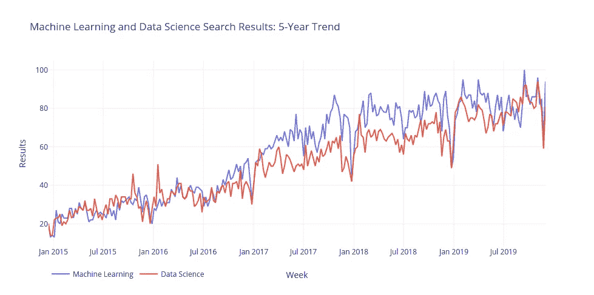

*(courtesy* [*Google Trends*](https://trends.google.com/trends/explore?date=today%205-y&geo=US&q=%2Fm%2F01hyh_,%2Fm%2F0jt3_q3) *and* [*Plotly*](https://plot.ly/~garystafford/64/)*)*

许多开源软件项目也降低了进入这些技术的门槛。应对这一挑战的开源项目的一个很好的例子是 Jupyter 项目。类似于 [Apache Zeppelin](https://zeppelin.apache.org/) 和新开源的[网飞的 Polynote](https://medium.com/netflix-techblog/open-sourcing-polynote-an-ide-inspired-polyglot-notebook-7f929d3f447) ， [Jupyter Notebooks](https://jupyter-notebook.readthedocs.io/en/stable/) 支持数据驱动、交互式和协作式数据分析。

这篇文章将展示使用 [Jupyter Docker 栈](https://jupyter-docker-stacks.readthedocs.io/en/latest/)创建一个容器化的数据分析环境。这个特殊的环境将适合学习和开发使用 Python、Scala 和 R 编程语言的 Apache Spark 应用程序。我们将重点介绍 Python 和 Spark，使用 PySpark。

# 特色技术

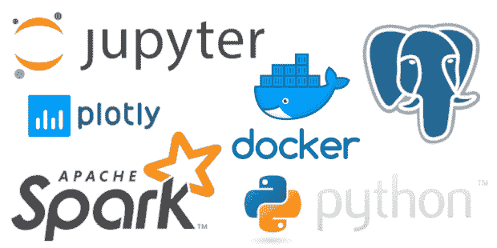

以下技术是这篇文章的重点。

## Jupyter 笔记本

根据[项目 Jupyter](http://jupyter.org/),[Jupyter Notebook](https://jupyter-notebook.readthedocs.io/en/stable/)，以前被称为 [IPython Notebook](https://ipython.org/notebook.html) ，是一个开源的网络应用程序，允许用户创建和共享包含实时代码、等式、可视化和叙述性文本的文档。用途包括数据清理和转换、数值模拟、统计建模、数据可视化、机器学习等等。Jupyter 这个词是**Ju**lia、**Py**thon 和 **R** 的松散缩写，但是今天，Jupyter 支持[许多编程语言](https://github.com/jupyter/jupyter/wiki/Jupyter-kernels)。

在过去的 3-5 年里，人们对 Jupyter 笔记本电脑的兴趣急剧增长，这在一定程度上是由主要的云提供商 AWS、Google Cloud 和 Azure 推动的。[亚马逊 Sagemaker](https://aws.amazon.com/sagemaker/) 、[亚马逊 EMR](https://aws.amazon.com/emr/) (Elastic MapReduce)、[谷歌云 Dataproc](https://cloud.google.com/dataproc/) 、[谷歌 Colab](https://colab.research.google.com/notebooks/welcome.ipynb) (Collaboratory)、以及[微软 Azure 笔记本](https://notebooks.azure.com/)都与 Jupyter 笔记本直接集成，用于大数据分析和机器学习。

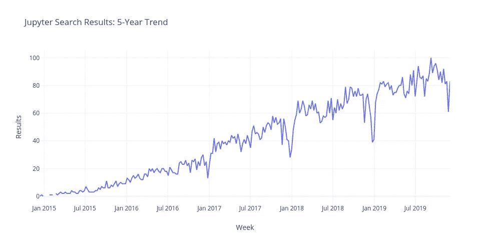

*(courtesy* [*Google Trends*](https://trends.google.com/trends/explore?date=today%205-y&geo=US&q=Jupyter) *and* [*Plotly*](https://plot.ly/~garystafford/67/)*)*

## Jupyter Docker 堆栈

为了能够快速方便地访问 Jupyter 笔记本，Project Jupyter 创建了 [Jupyter Docker 堆栈](https://jupyter-docker-stacks.readthedocs.io/en/latest/)。这些堆栈是包含 Jupyter 应用程序以及相关技术的现成 Docker 映像。目前，Jupyter Docker 堆栈专注于各种专业，包括 [r-notebook](https://jupyter-docker-stacks.readthedocs.io/en/latest/using/selecting.html#jupyter-r-notebook) 、 [scipy-notebook](https://jupyter-docker-stacks.readthedocs.io/en/latest/using/selecting.html#jupyter-scipy-notebook) 、 [tensorflow-notebook](https://jupyter-docker-stacks.readthedocs.io/en/latest/using/selecting.html#jupyter-tensorflow-notebook) 、 [datascience-notebook](https://jupyter-docker-stacks.readthedocs.io/en/latest/using/selecting.html#jupyter-datascience-notebook) 、 [pyspark-notebook](https://jupyter-docker-stacks.readthedocs.io/en/latest/using/selecting.html#jupyter-pyspark-notebook) ，以及本文的主题 [all-spark-notebook](https://jupyter-docker-stacks.readthedocs.io/en/latest/using/selecting.html#jupyter-all-spark-notebook) 。该堆栈包括各种各样的知名软件包来扩展它们的功能，如 [scikit-learn](http://scikit-learn.org/stable/) 、 [pandas](https://pandas.pydata.org/) 、 [Matplotlib](https://matplotlib.org/) 、 [Bokeh](https://bokeh.pydata.org/en/latest/) 、 [NumPy](http://www.numpy.org/) 和 [Facets](https://github.com/PAIR-code/facets) 。

## 阿帕奇火花

据 [Apache](https://spark.apache.org/) 报道，Spark 是一个用于大规模数据处理的统一分析引擎。Spark 于 2009 年作为一个研究项目在[加州大学伯克利分校 AMPLab](https://amplab.cs.berkeley.edu/) 开始，于 2010 年初开源，并于 2013 年转移到[阿帕奇软件基金会](https://www.apache.org/)。查看任何主要职业网站上的帖子都会证实，Spark 被知名的现代企业广泛使用，如网飞、Adobe、Capital One、洛克希德·马丁、捷蓝航空、Visa 和 Databricks。在这篇文章发表的时候，仅在美国，LinkedIn 就有大约 35000 个[职位列表](https://www.linkedin.com/jobs/search/?keywords=apache%20spark&location=United%20States)引用了 Apache Spark。

凭借比 Hadoop 快 100 倍的速度， [Apache Spark](https://spark.apache.org/) 使用最先进的 DAG ( [有向非循环图](https://en.wikipedia.org/wiki/Directed_acyclic_graph))调度器、查询优化器和物理执行引擎，实现了静态、批处理和流数据的高性能。Spark 的多语言编程模型允许用户用 Scala、Java、Python、R 和 SQL 快速编写应用程序。Spark 包括 Spark SQL ( [数据帧和数据集](https://spark.apache.org/docs/latest/sql-programming-guide.html))、MLlib ( [机器学习](https://spark.apache.org/docs/latest/ml-guide.html))、GraphX ( [图形处理](https://spark.apache.org/docs/latest/graphx-programming-guide.html))和 DStreams ( [Spark 流](https://spark.apache.org/docs/latest/streaming-programming-guide.html))的库。您可以使用 Spark 的独立集群模式、 [Apache Hadoop YARN](https://hortonworks.com/apache/yarn/) 、 [Mesos](http://mesos.apache.org/) 或 [Kubernetes](https://kubernetes.io/) 来运行 Spark。

## PySpark

Spark Python API， [PySpark](https://spark.apache.org/docs/latest/api/python/index.html) ，向 Python 公开了 Spark 编程模型。PySpark 构建在 Spark 的 Java API 之上，使用 [Py4J](https://www.py4j.org/) 。据 [Apache](https://cwiki.apache.org/confluence/display/SPARK/PySpark+Internals) 报道，Py4J 作为 Python 和 Java 之间的桥梁，使得运行在 Python 解释器中的 Python 程序能够动态访问 Java 虚拟机(JVM)中的 Java 对象。数据在 Python 中处理，在 JVM 中缓存和混洗。

## 码头工人

据 Docker 称，他们的技术让开发人员和 IT 人员能够自由构建、管理和保护关键业务应用，而无需担心技术或基础设施的局限。在这篇文章中，我使用的是 macOS 的当前稳定版本[Docker Desktop](https://www.docker.com/products/docker-desktop)Community version，截止到 2020 年 3 月。

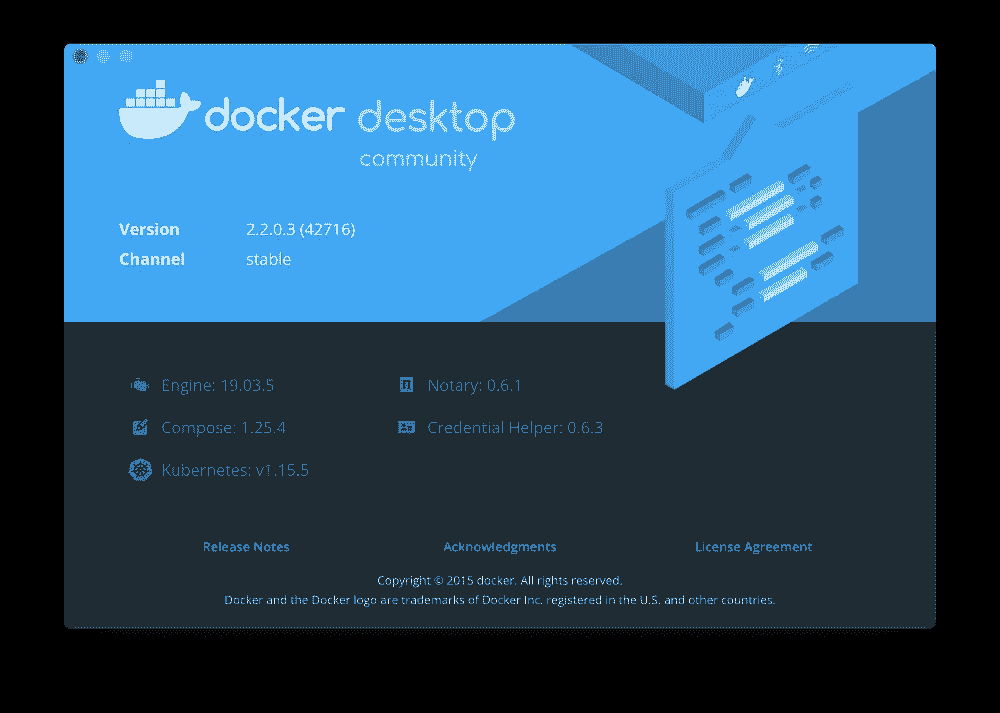

## 码头工人群

Docker 的当前版本包括 Kubernetes 和 Swarm orchestrator，用于部署和管理容器。在这个演示中，我们将选择 Swarm。根据 [Docker](https://docs.docker.com/engine/swarm/key-concepts/) 的说法，Docker 引擎中嵌入的集群管理和编排功能是使用 [swarmkit](https://github.com/docker/swarmkit/) 构建的。Swarmkit 是一个独立的项目，它实现了 Docker 的编排层，并直接在 Docker 中使用。

## 一种数据库系统

PostgreSQL 是一个强大的开源对象关系数据库系统。根据他们的网站， [PostgreSQL](https://www.postgresql.org) 提供了许多功能，旨在帮助开发人员构建应用程序，帮助管理员保护数据完整性和构建容错环境，并帮助管理无论大小的数据集。

# 示范

在本次演示中，我们将探索 Spark Jupyter Docker 堆栈的功能，以提供有效的数据分析开发环境。我们将探索一些日常用途，包括执行 Python 脚本、提交 PySpark 作业、使用 Jupyter 笔记本，以及从不同的文件格式和数据库中读取和写入数据。我们将使用最新的`jupyter/all-spark-notebook` Docker 图像。这个[镜像](https://jupyter-docker-stacks.readthedocs.io/en/latest/using/selecting.html#jupyter-all-spark-notebook)包括 Python、R 和 Scala 对 Apache Spark 的支持，使用 [Apache Toree](https://toree.apache.org/) 。

# 体系结构

如下所示，我们将部署一个 [Docker 栈](https://docs.docker.com/engine/swarm/stack-deploy/)到一个单节点 Docker 群。堆栈由一个[Jupyter All-Spark-Notebook](https://hub.docker.com/r/jupyter/all-spark-notebook/)、[PostgreSQL](https://hub.docker.com/_/postgres/)(Alpine Linux 版本 12)和 [Adminer](https://hub.docker.com/_/adminer/) 容器组成。Docker 栈将有两个本地目录[绑定到容器中。GitHub 项目中的文件将通过一个绑定目录与 Jupyter 应用程序容器共享。我们的 PostgreSQL 数据也将通过一个绑定挂载的目录持久化。这允许我们将数据持久化到临时容器之外。如果重新启动或重新创建容器，数据将保留在本地。](https://docs.docker.com/storage/bind-mounts/)

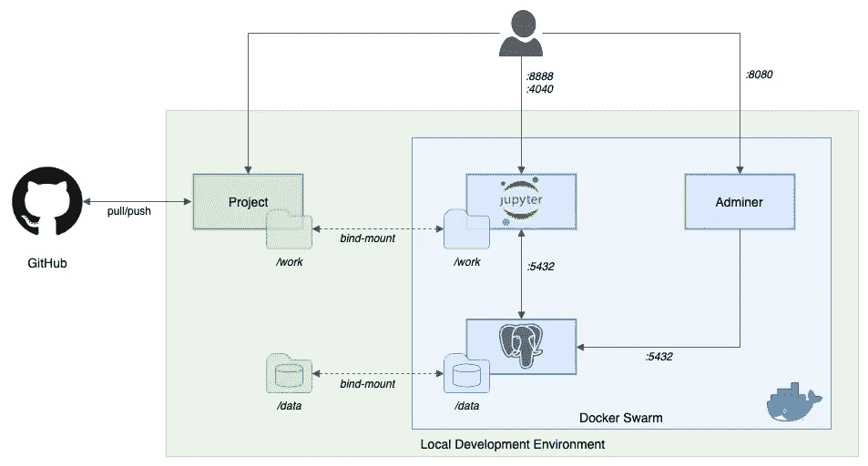

# 源代码

这篇文章的所有源代码可以在 [GitHub](https://github.com/garystafford/pyspark-setup-demo/tree/v2) 上找到。使用以下命令克隆项目。注意这篇文章使用了`v2`分支。

```
git clone \ 
  --branch v2 --single-branch --depth 1 --no-tags \
  [https://github.com/garystafford/pyspark-setup-demo.git](https://github.com/garystafford/pyspark-setup-demo.git)
```

源代码示例显示为 GitHub [Gists](https://help.github.com/articles/about-gists/) ，在某些移动和社交媒体浏览器上可能无法正确显示。

# 部署 Docker 堆栈

首先，创建`$HOME/data/postgres`目录来存储 PostgreSQL 数据文件。

```
mkdir -p ~/data/postgres
```

这个目录将被绑定到 PostgreSQL 容器中的 [stack.yml](https://github.com/garystafford/pyspark-setup-demo/blob/v2/stack.yml) 文件`$HOME/data/postgres:/var/lib/postgresql/data`的第 41 行。环境变量`HOME`假设您在 Linux 或 macOS 上工作，它相当于 Windows 上的`HOMEPATH`。

Jupyter 容器的工作目录设置在 stack.yml 文件的第 15 行，`working_dir: /home/$USER/work`。本地绑定挂载的工作目录是`$PWD/work`。这个路径被绑定到 Jupyter 容器中的工作目录，在 stack.yml 文件的第 29 行，`$PWD/work:/home/$USER/work`。`PWD`环境变量假设您在 Linux 或 macOS 上工作(在 Windows 上是`CD`)。

默认情况下，Jupyter 容器中的用户是`jovyan`。我们将使用我们自己的本地主机的用户帐户覆盖该用户，如 Docker 堆栈文件`NB_USER: $USER`的第 21 行所示。我们将使用主机的`USER`环境变量值(相当于 Windows 上的`USERNAME`)。还有另外的选项[用于配置 Jupyter 容器。Docker 堆栈文件(](https://jupyter-docker-stacks.readthedocs.io/en/latest/using/common.html?highlight=root#docker-options) [*gist*](https://gist.github.com/garystafford/da897359cb152c164999491f0b0e419f) )的第 17–22 行使用了其中的几个选项。

`jupyter/all-spark-notebook` Docker 映像很大，大约 5 GB。根据您的互联网连接，如果这是您第一次提取此图像，堆栈可能需要几分钟才能进入运行状态。虽然没有要求，但我通常会提前提取 Docker 图像。

```
docker pull jupyter/all-spark-notebook:latest
docker pull postgres:12-alpine
docker pull adminer:latest
```

假设您在本地开发机器上安装了最新版本的 docker，并以 swarm 模式运行，那么从项目的根目录运行下面的 Docker 命令就很容易了。

```
docker stack deploy -c stack.yml jupyter
```

Docker 栈由一个新的覆盖网络`jupyter_demo-net`和三个容器组成。要确认堆栈部署成功，请运行以下 docker 命令。

```
docker stack ps jupyter --no-trunc
```

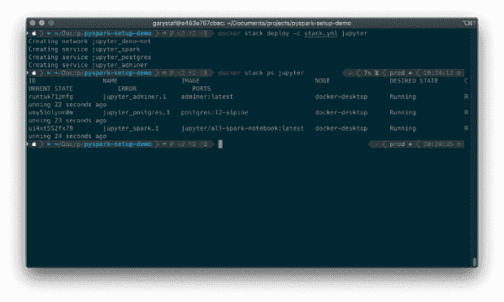

要访问 Jupyter 笔记本应用程序，您需要获得 Jupyter URL 和[访问令牌](https://jupyter-docker-stacks.readthedocs.io/en/latest/using/running.html)。Jupyter URL 和访问令牌被输出到 Jupyter 容器日志中，可以使用以下命令访问该日志。

```
docker logs $(docker ps | grep jupyter_spark | awk '{print $NF}')
```

您应该观察到类似如下的日志输出。检索完整的 URL，例如`http://127.0.0.1:8888/?token=f78cbe...`，以访问 Jupyter 基于 web 的用户界面。

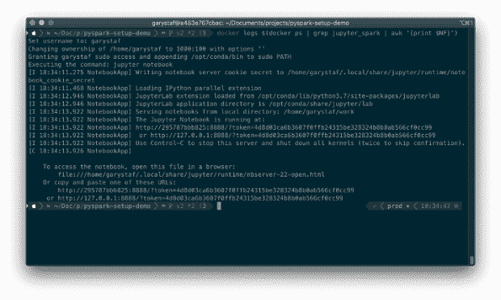

从 Jupyter dashboard 登录页面，您应该可以看到项目的`work/`目录中的所有文件。注意您可以从仪表板创建的文件类型，包括 Python 3、R 和 Scala(使用 Apache Toree 或 [spylon-kernal](https://github.com/mariusvniekerk/spylon-kernel) )笔记本和文本。您也可以打开 Jupyter 终端或从下拉菜单创建新文件夹。在这篇文章发表时(2020 年 3 月)，最新的`jupyter/all-spark-notebook` Docker 镜像运行 Spark 2.4.5、Scala 2.11.12、Python 3.7.6 和 OpenJDK 64 位服务器 VM、Java 1.8.0 更新 242。

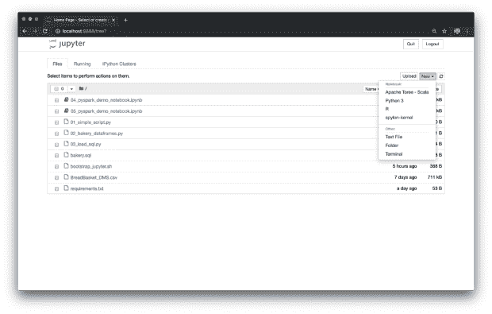

# 引导环境

项目中包括一个引导脚本， [bootstrap_jupyter.sh](https://github.com/garystafford/pyspark-setup-demo/blob/v2/work/bootstrap_jupyter.sh) 。该脚本将使用 [pip](https://pip.pypa.io/en/stable/) 、Python 包安装程序和一个 [requirement.txt](https://github.com/garystafford/pyspark-setup-demo/blob/v2/work/requirements.txt) 文件来安装所需的 Python 包。bootstrap 脚本还安装最新的 PostgreSQL 驱动程序 JAR，配置 [Apache Log4j](https://logging.apache.org/log4j/2.x/) 以减少提交 Spark 作业时的日志冗长性，并安装 [htop](https://hisham.hm/htop/) 。虽然这些任务也可以从 Jupyter 终端或 Jupyter 笔记本中完成，但使用引导脚本可以确保您每次启动 Jupyter Docker 堆栈时都有一个一致的工作环境。根据需要在引导脚本中添加或删除项目( [*要点*](https://gist.github.com/garystafford/da897359cb152c164999491f0b0e419f) )。

就这样，我们的新 Jupyter 环境已经准备好开始探索了。

# 运行 Python 脚本

在新的 Jupyter 环境中，我们可以执行的最简单的任务之一就是运行 Python 脚本。不用担心在您自己的开发机器上安装和维护正确的 Python 版本和多个 Python 包，我们可以在 Jupyter 容器中运行 Python 脚本。在这篇帖子更新的时候，最新的`jupyter/all-spark-notebook` Docker 镜像运行 Python 3.7.3 和 Conda 4.7.12。让我们从一个简单的 Python 脚本开始， [01_simple_script.py](https://github.com/garystafford/pyspark-setup-demo/blob/v2/work/01_simple_script.py) 。

在 Jupyter 终端窗口中，使用以下命令运行脚本。

```
python3 01_simple_script.py
```

您应该观察到以下输出。


# Kaggle 数据集

为了探索 Jupyter 和 PySpark 的更多特性，我们将使用 Kaggle 的公开数据集。 [Kaggle](https://www.kaggle.com) 是一个优秀的开源资源，用于大数据和 ML 项目的数据集。他们的口号是“*ka ggle 是做数据科学项目的地方*。”在这个演示中，我们将使用 Kaggle 的面包店数据集中的[事务。数据集以单个 CSV 格式文件的形式提供。项目中还包含一个副本。](https://www.kaggle.com/sulmansarwar/transactions-from-a-bakery)

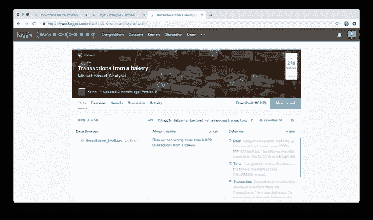

“面包店交易”数据集包含 21，294 行，4 列数据。虽然肯定不是*大数据*，但数据集足够大，足以测试 Spark Jupyter Docker 堆栈功能。该数据由 2016 年 10 月 30 日至 2017 年 04 月 09 日之间 21，294 种烘焙食品的 9，531 笔客户交易组成( [*要点*](https://gist.github.com/garystafford/28bd35286c52804f68f8a6b2bc9bac65) )。

# 提交 Spark 作业

我们并不局限于 Jupyter 笔记本来与 Spark 互动。我们也可以从 Jupyter 终端直接向 Spark 提交脚本。这是 Spark 在生产中使用的典型方式，用于对大型数据集执行分析，通常定期使用工具，如 [Apache Airflow](https://airflow.apache.org/) 。使用 Spark，您可以从一个或多个数据源加载数据。在对数据执行操作和转换之后，数据被持久化到数据存储，例如文件或数据库，或者被传送到另一个系统以供进一步处理。

该项目包括一个简单的 Python PySpark [ETL](https://en.wikipedia.org/wiki/Extract,_transform,_load) 脚本， [02_pyspark_job.py](https://github.com/garystafford/pyspark-setup-demo/blob/v2/work/02_pyspark_job.py) 。ETL 脚本将 CSV 文件中的原始 Kaggle Bakery 数据集加载到内存中的 Spark 数据帧中。然后，该脚本执行一个简单的 Spark SQL 查询，计算每种烘焙食品的销售总量，并按降序排序。最后，脚本将查询结果写入一个新的 CSV 文件`output/items-sold.csv`。

使用以下命令直接从 Jupyter 终端运行脚本。

```
python3 02_pyspark_job.py
```

Spark 作业的输出示例如下所示。

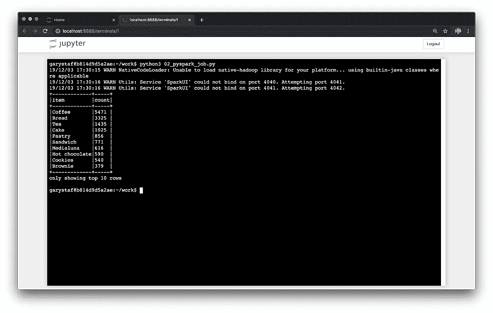

通常，您会使用`spark-submit`命令[提交](https://spark.apache.org/docs/latest/submitting-applications.html)Spark 作业。使用 Jupyter 终端运行以下命令。

```
$SPARK_HOME/bin/spark-submit 02_pyspark_job.py
```

下面，我们看到了来自`spark-submit`命令的输出。在输出中打印结果只是为了演示的目的。通常，Spark 作业以非交互方式提交，结果直接保存到数据存储或传送到另一个系统。

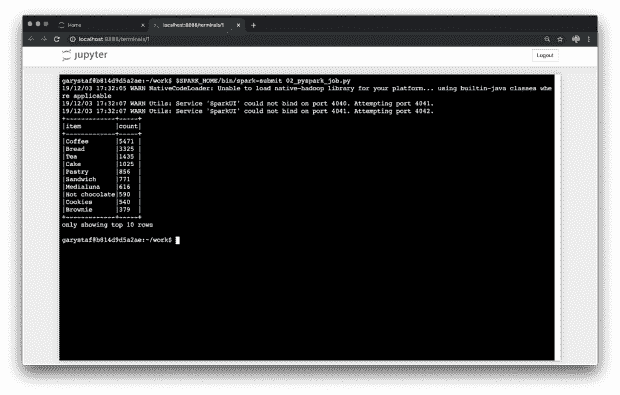

使用以下命令，我们可以查看由 spark 作业创建的结果 CVS 文件。

```
ls -alh output/items-sold.csv/
head -5 output/items-sold.csv/*.csv
```

spark 作业创建的文件示例如下所示。我们应该已经发现咖啡是最常销售的烘焙食品，销售量为 5471 件，其次是面包，销售量为 3325 件。

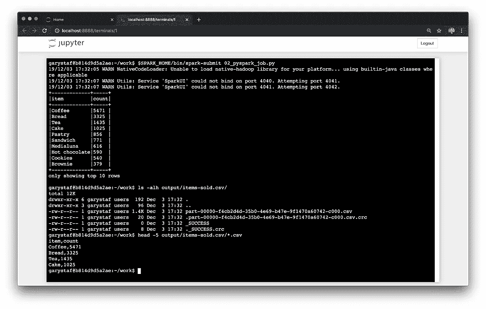

# 与数据库交互

为了展示 Jupyter 处理数据库的灵活性，PostgreSQL 是 Docker 栈的一部分。我们可以从 Jupyter 容器向 PostgreSQL 实例读写数据，该实例运行在一个单独的容器中。首先，我们将运行一个用 Python 编写的 SQL 脚本，在一个新的数据库表中创建我们的数据库模式和一些测试数据。为此，我们将使用 [psycopg2](https://pypi.org/project/psycopg2/) ，这是 Python 的 PostgreSQL 数据库适配器包，我们之前使用引导脚本将其安装到 Jupyter 容器中。Python 脚本 [03_load_sql.py](https://github.com/garystafford/pyspark-setup-demo/blob/v2/work/03_load_sql.py) 将针对 Postgresql 容器实例执行一组包含在 SQL 文件 [bakery.sql](https://github.com/garystafford/pyspark-setup-demo/blob/v2/work/bakery.sql) 中的 SQL 语句。

SQL 文件， [bakery.sql](https://github.com/garystafford/pyspark-setup-demo/blob/v2/work/bakery.sql) 。

要执行该脚本，请运行以下命令。

```
python3 03_load_sql.py
```

如果成功，应该会产生以下输出。

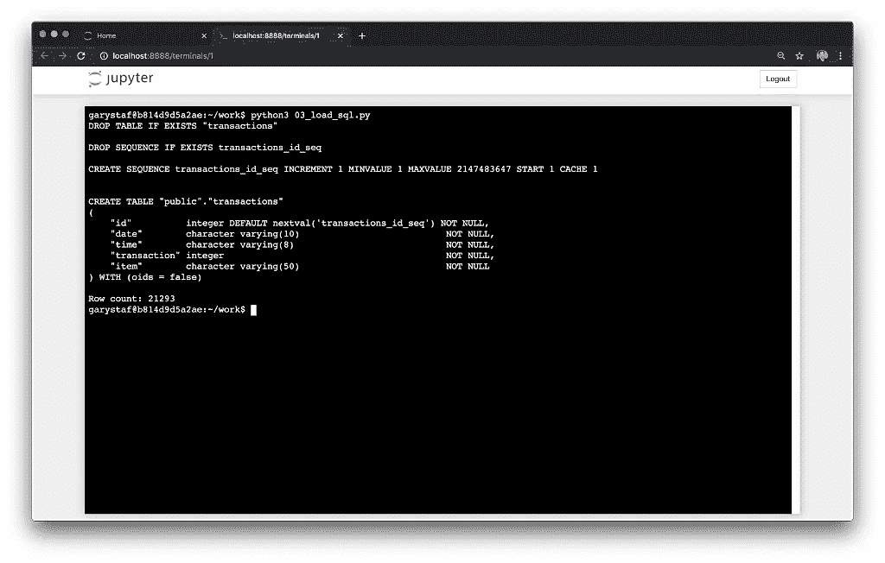

# 管理员

为了确认 SQL 脚本的成功，使用 [Adminer](https://hub.docker.com/_/adminer/) 。Adminer ( *原名 phpMinAdmin* )是一个用 PHP 编写的全功能数据库管理工具。Adminer 本身可以识别 PostgreSQL、MySQL、SQLite 和 MongoDB 等数据库引擎。当前版本为 4 . 7 . 6(2020 年 3 月)。

Adminer 应该在本地主机端口 8080 上可用。如下所示，密码凭证位于 [stack.yml](https://github.com/garystafford/pyspark-setup-demo/blob/master/stack.yml) 文件中。服务器名称`postgres`是 PostgreSQL Docker 容器的名称。这是 Jupyter 容器将用来与 PostgreSQL 容器通信的域名。

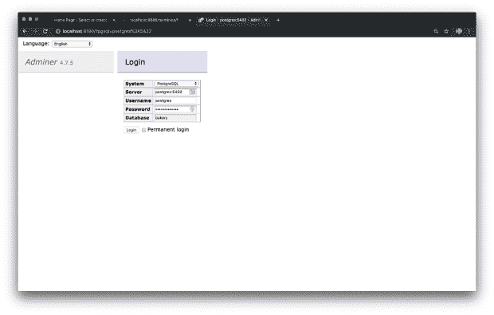

用 Adminer 连接到新的`bakery`数据库，我们应该会看到`transactions`表。

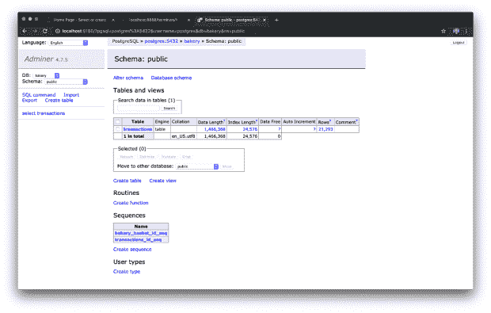

该表应该包含 21，293 行，每行有 5 列数据。


## pgAdmin

另一个与 PostgreSQL 交互的绝佳选择是 [pgAdmin](https://www.pgadmin.org/) 4。这是我最喜欢的 PostgreSQL 管理工具。虽然局限于 PostgreSQL，但在我看来，pgAdmin 的用户界面和管理能力要优于 Adminer。为了简洁起见，我选择不在本文中包含 pgAdmin。Docker 堆栈还包含一个 pgAdmin 容器，这个容器已经被注释掉了。要使用 pgAdmin，只需取消对容器的注释，然后重新运行 Docker stack deploy 命令。pgAdmin 应该在本地主机端口 81 上可用。pgAdmin 登录凭证在 Docker 堆栈文件中。

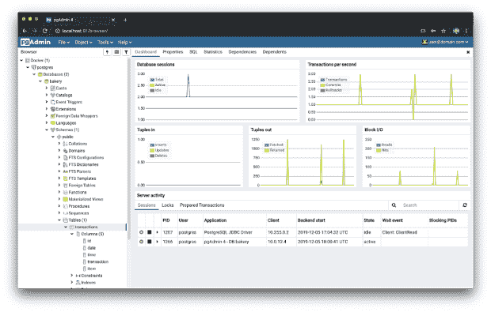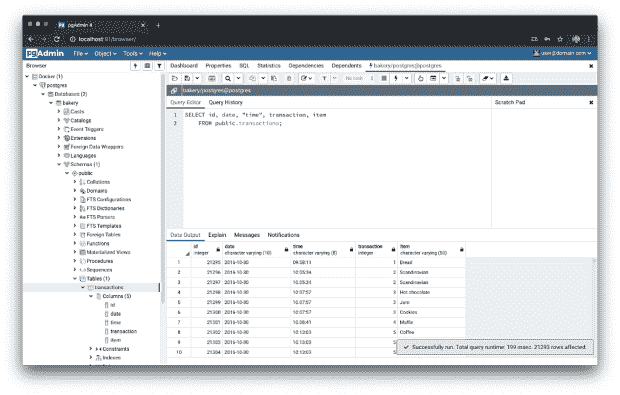

# 开发 Jupyter 笔记本电脑

Jupyter Docker 堆栈容器的真正功能是 [Jupyter 笔记本](https://jupyter-notebook.readthedocs.io/en/stable/notebook.html)。根据 Jupyter 项目，该笔记本将基于控制台的方法以全新的方式扩展到交互式计算，提供了一个基于网络的应用程序，适用于捕捉整个计算过程，包括开发、记录和执行代码，以及交流结果。笔记本文档包含交互式会话的输入和输出，以及伴随代码但不用于执行的附加文本。

为了探索 Jupyter 笔记本的功能，该项目包括两个简单的 Jupyter 笔记本。第一批笔记本， [04_notebook.ipynb](https://github.com/garystafford/pyspark-setup-demo/blob/v2/work/04_notebook.ipynb) ，演示了典型的 PySpark 函数，例如从 CSV 文件和 PostgreSQL 数据库加载数据，使用 Spark SQL 执行基本数据分析，包括使用 [PySpark 用户定义函数](https://docs.databricks.com/spark/latest/spark-sql/udf-python.html) (UDF)，使用 [BokehJS](https://bokeh.pydata.org/en/latest/docs/dev_guide/bokehjs.html) 绘制数据，最后将数据保存回数据库，以及快速高效的 [Apache Parquet](https://parquet.apache.org/) 文件格式。下面我们看到几个笔记本电池展示了这些功能。

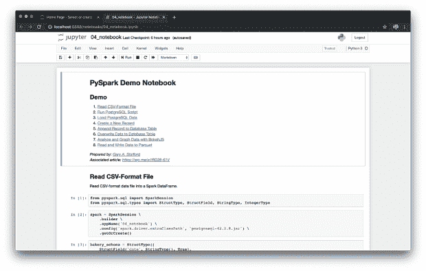

Markdown for Notebook Documentation

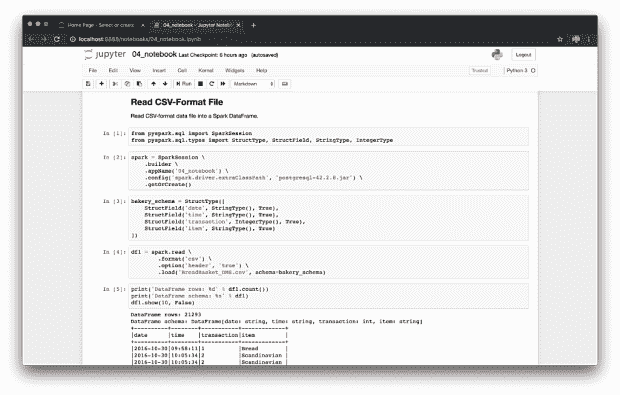

Read CSV-Format Files into Spark DataFrame

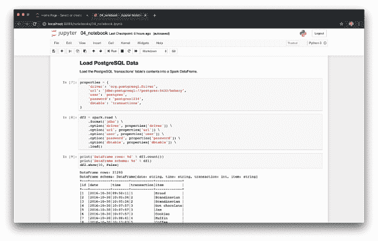

Load Data from PostgreSQL into Spark DataFrame


Perform Spark SQL Query including use of UDF


Plot Spark SQL Query Results using [BokehJS](https://docs.bokeh.org/en/latest/docs/dev_guide/bokehjs.html)

# IDE 集成

回想一下，包含该项目的 GitHub 源代码的工作目录被绑定到 Jupyter 容器中。因此，你也可以在你喜欢的 IDE 中编辑任何文件，包括笔记本，比如 [JetBrains PyCharm](https://www.jetbrains.com/pycharm/) 和[Microsoft Visual Studio Code](https://code.visualstudio.com/)。PyCharm 内置了对 Jupyter 笔记本的语言支持，如下所示。

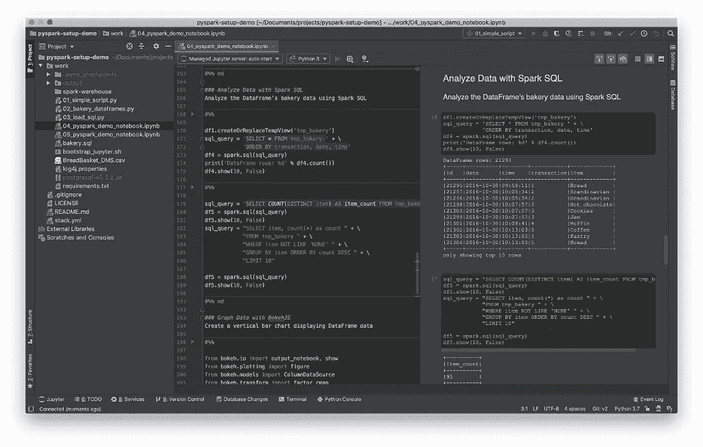

PyCharm 2019.2.5 (Professional Edition)

使用 [Python 扩展](https://marketplace.visualstudio.com/items?itemName=ms-python.python)的 Visual Studio 代码也是如此。

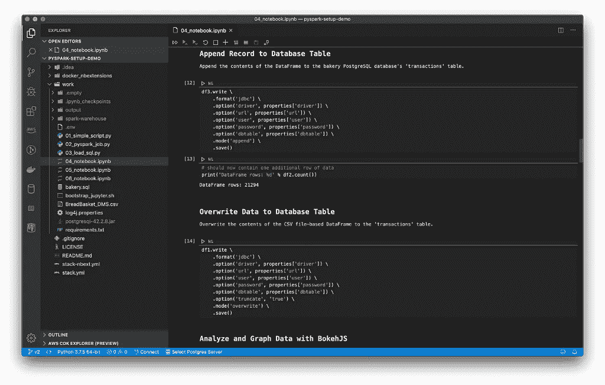

Visual Studio Code Version: 1.40.2

## 使用附加包

正如在简介中提到的，Jupyter Docker 栈是现成的，有各种各样的 Python 包来扩展它们的功能。为了演示这些包的使用，该项目包含第二个 Jupyter 笔记本文档， [05_notebook.ipynb](https://github.com/garystafford/pyspark-setup-demo/blob/v2/work/05_notebook.ipynb) 。这款笔记本使用了 [SciPy](https://www.scipy.org/) ，众所周知的用于数学、科学和工程的 Python 包、 [NumPy](http://www.numpy.org/) ，众所周知的用于科学计算的 Python 包以及 [Plotly Python 图形库](https://plot.ly/python/)。虽然 NumPy 和 SciPy 包含在 Jupyter Docker 映像中，但引导脚本使用 pip 来安装所需的 Plotly 包。类似于上一个笔记本中展示的散景，我们可以使用这些库来创建丰富的交互式数据可视化。

## Plotly

要在笔记本中使用 [Plotly](https://chart-studio.plot.ly/feed/#/) ，您首先需要注册一个免费帐户，并获得用户名和 API 密钥。为了确保我们不会意外地在笔记本中保存敏感的 Plotly 凭证，我们使用了 [python-dotenv](https://pypi.org/project/python-dotenv/) 。这个 Python 包从一个`.env`文件中读取键/值对，使它们作为环境变量对我们的笔记本可用。从 Jupyter 终端修改并运行以下两个命令来创建`.env`文件，并设置 Plotly 用户名和 API 密钥凭证。注意，`.env`文件是`.gitignore`文件的一部分，不会被提交回 git，这可能会影响凭证。

```
echo "PLOTLY_USERNAME=your-username" >> .env
echo "PLOTLY_API_KEY=your-api-key" >> .env
```

如下所示，我们使用 Plotly 构建了一个每日烘焙食品销售的条形图。该图表使用 SciPy 和 NumPy 构建了一个[线性拟合](https://plot.ly/python/linear-fits/)(回归)，并为面包店数据绘制了一条最佳拟合线，并覆盖了竖线。该图表还使用 SciPy 的 [Savitzky-Golay 过滤器](https://plot.ly/python/smoothing/)绘制了第二条线，展示了我们面包店数据的平滑情况。

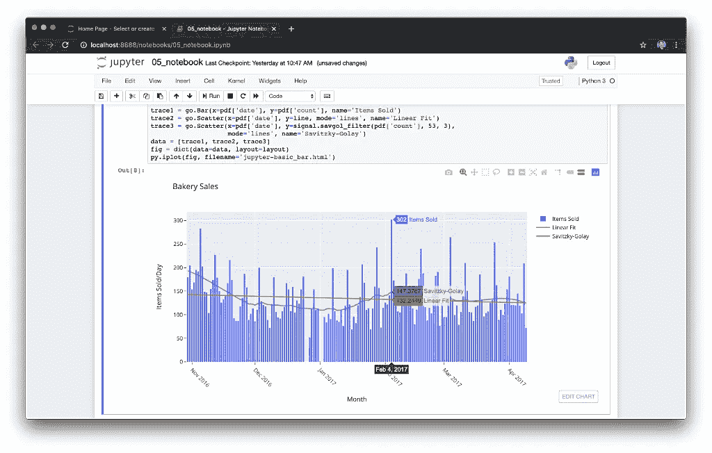

Plotly 还提供 [Chart Studio](https://plot.ly/online-chart-maker/) 在线图表制作工具。Plotly 将 Chart Studio 描述为世界上最现代化的企业数据可视化解决方案。我们可以使用免费版的[图表工作室云](https://plot.ly/products/cloud/)来增强、风格化和[分享](https://plot.ly/~garystafford/20/_2017-bakery-sales/)我们的数据可视化。

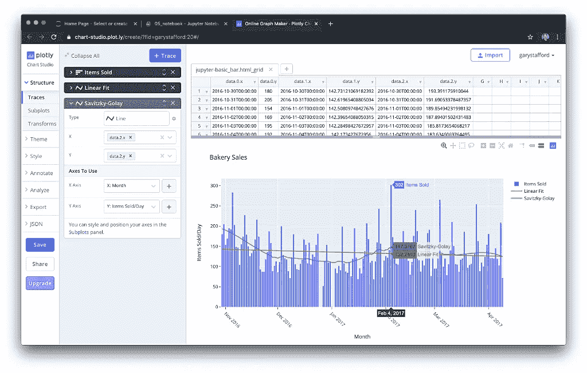

# Jupyter 笔记本浏览器

笔记本也可以用 [nbviewer](https://nbviewer.jupyter.org/) 查看，这是 Project Jupyter 下的一个开源项目。由于 Rackspace 的托管，nbviewer 实例是一项免费服务。


使用下面的 nbviewer，我们可以看到 [04_notebook.ipynb](https://github.com/garystafford/pyspark-setup-demo/blob/v2/work/04_notebook.ipynb) 笔记本中一个单元格的输出。使用 nbviewer 查看此笔记本，[此处](https://nbviewer.jupyter.org/github/garystafford/pyspark-setup-demo/blob/v2/work/04_notebook.ipynb)。

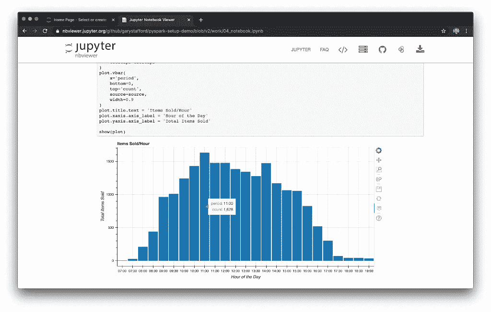

# 监控 Spark 作业

Jupyter Docker 容器公开了 Spark 的监视和仪器 web 用户界面。我们可以详细查看每个已完成的 Spark 工作。

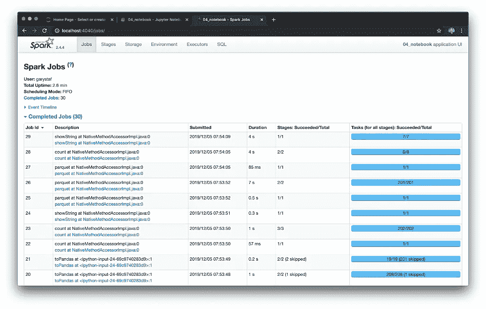

我们可以查看 Spark 作业每个阶段的细节，包括 DAG(有向无环图)的可视化，Spark 使用 DAG 调度程序将 DAG 构造为作业执行计划的一部分。

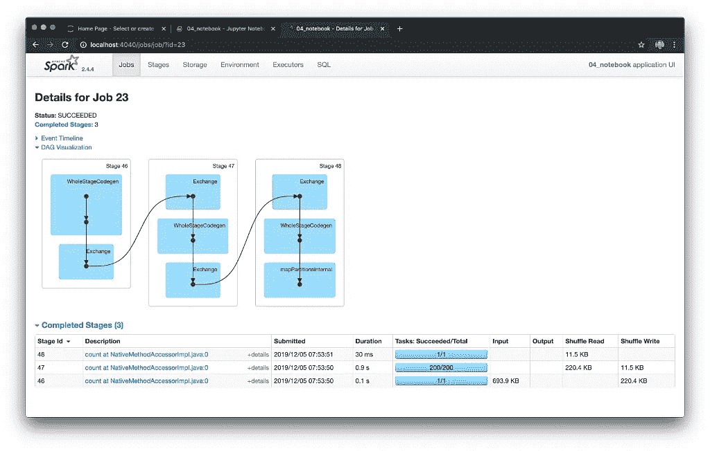

我们还可以回顾作为 Spark 工作阶段一部分的每个事件的任务组成和发生时间。


我们还可以使用 Spark 接口来检查和确认运行时环境配置，包括 Java、Scala 和 Spark 的版本，以及 Java 类路径上可用的包。

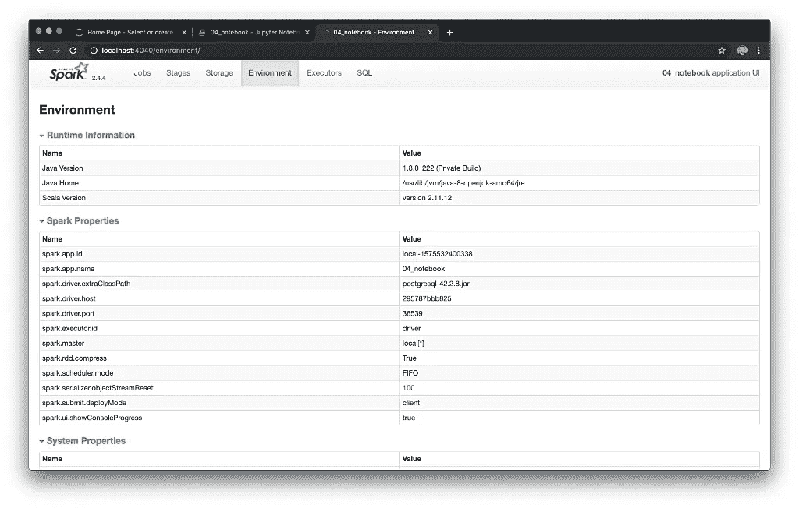

# 局部火花性能

在本地开发系统的 Jupyter Docker 容器内的[单节点](https://databricks.com/blog/2018/05/03/benchmarking-apache-spark-on-a-single-node-machine.html)上运行 Spark 并不能替代真正的 [Spark 集群](https://spark.apache.org/docs/latest/cluster-overview.html)，这是一种生产级的多节点 Spark 集群，运行在裸机或健壮的虚拟化硬件上，并通过 [Hadoop YARN](https://spark.apache.org/docs/latest/running-on-yarn.html) 、 [Apache Mesos](https://spark.apache.org/docs/latest/running-on-mesos.html) 或 [Kubernetes](https://spark.apache.org/docs/latest/running-on-kubernetes.html) 进行管理。在我看来，您应该只调整 Docker 资源限制，以支持运行小型探索性工作负载的可接受的 Spark 性能水平。在生产级、多节点 Spark 集群上处理大数据和执行需要复杂计算的任务的需求是不现实的。

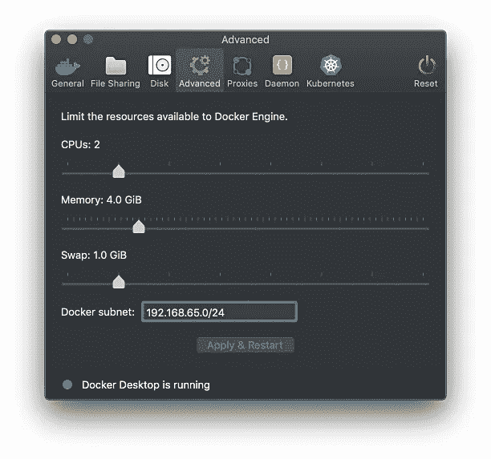

我们可以使用下面的 [docker stats](https://docs.docker.com/engine/reference/commandline/stats/) 命令来检查容器的 CPU 和内存指标。

```
docker stats --format "table {{.Name}}\t{{.CPUPerc}}\t{{.MemUsage}}\t{{.MemPerc}}"
```

下面，我们看到来自 Docker 栈的三个容器的统计数据显示很少或没有活动。

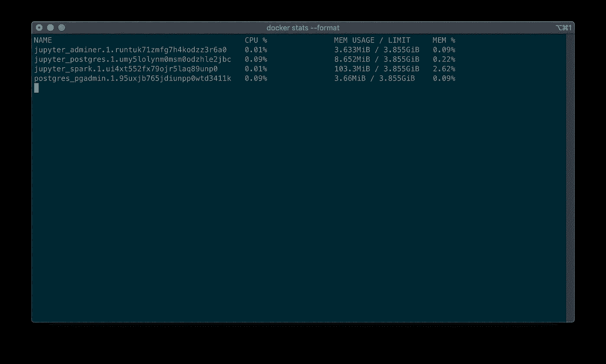

将这些统计数据与下面显示的数据进行比较，这些数据是在笔记本电脑读写数据和执行 Spark SQL 查询时记录的。CPU 和内存输出显示峰值，但都在可接受的范围内。

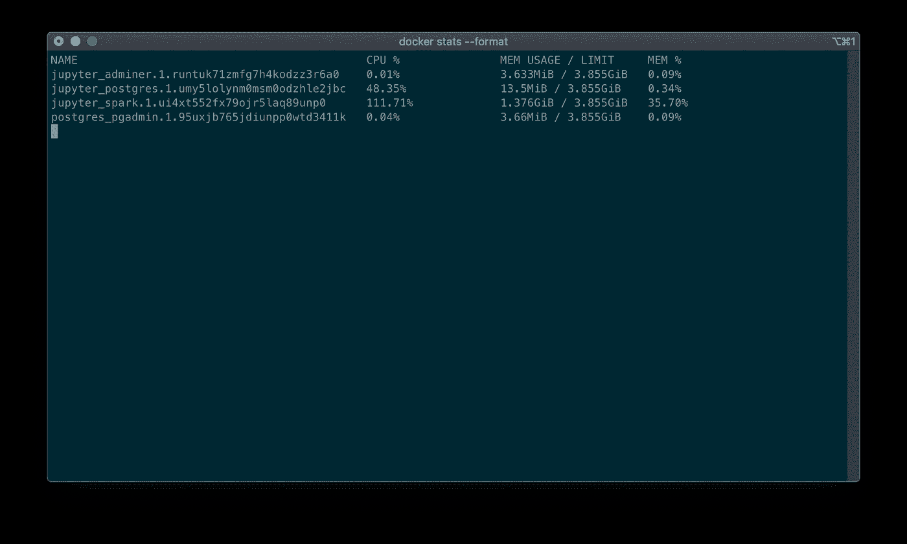

# Linux 进程监视器

检查容器性能指标的另一个选项是 [top](https://www.booleanworld.com/guide-linux-top-command/) ，它预先安装在我们的 Jupyter 容器中。例如，从 Jupyter 终端执行下面的`top`命令，按照 CPU 使用率对进程进行排序。

```
top -o %CPU
```

我们应该观察 Jupyter 容器中运行的每个进程的单独性能。

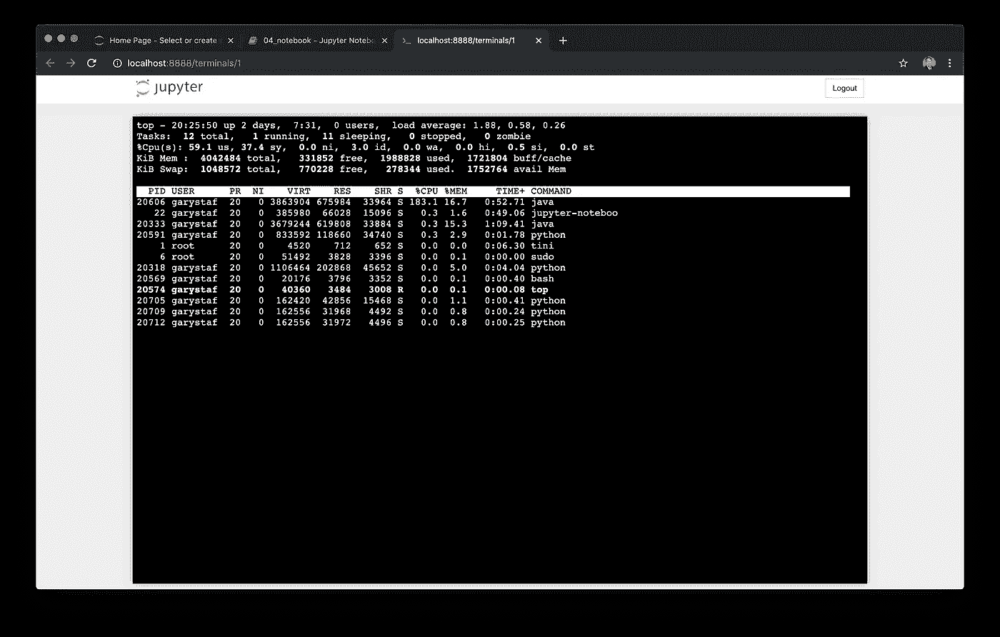

比`top`更上一层楼的是 [htop](https://hisham.hm/htop/) ，一个用于 Unix 的交互式进程查看器。它由[引导脚本](https://github.com/garystafford/pyspark-setup-demo/blob/v2/work/bootstrap_jupyter.sh#L22)安装在容器中。例如，我们可以从 Jupyter 终端执行`htop`命令，按照 CPU %使用率对进程进行排序。

```
htop --sort-key PERCENT_CPU
```

使用`htop`，观察单个 CPU 的活动。这里，`htop`窗口左上角的四个 CPU 是分配给 Docker 的 CPU。我们深入了解了 Spark 使用多个 CPU 的方式，以及其他性能指标，如内存和交换。


假设您的开发机器是健壮的，如果需要的话，很容易向 Docker 分配和释放额外的计算资源。注意不要给 Docker 分配过多的资源，这会使您的主机无法为其他应用程序提供可用的计算资源。

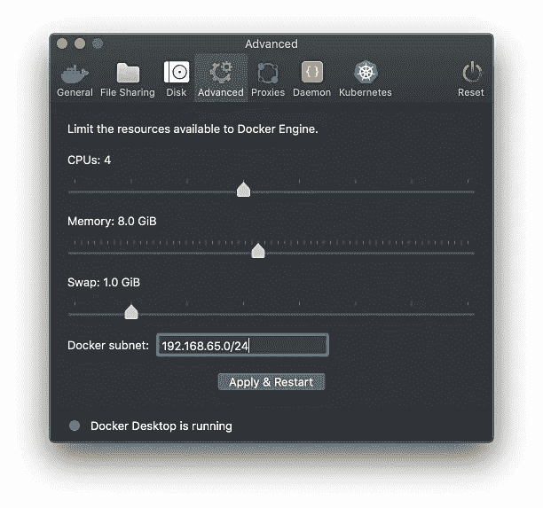

# 笔记本扩展

有许多方法可以扩展 Jupyter Docker 堆栈。一个流行的选项是 jupyter-contrib-nbextensions。根据他们网站的说法，`jupyter-contrib-nbextensions`软件包包含了一系列社区贡献的非官方扩展，为 Jupyter 笔记本增加了功能。这些扩展大部分是用 JavaScript 编写的，并且会被本地加载到您的浏览器中。可以通过使用内置的 Jupyter 命令，或者更方便地通过使用[Jupyter _ nb extensions _ configurator](https://github.com/Jupyter-contrib/jupyter_nbextensions_configurator)服务器扩展来启用已安装的笔记本扩展。

该项目包含一个备用 Docker 堆栈文件， [stack-nbext.yml](https://github.com/garystafford/pyspark-setup-demo/blob/v2/stack-nbext.yml) 。堆栈使用一个替代的 Docker 映像`garystafford/all-spark-notebook-nbext:latest`，这个[Docker 文件](https://github.com/garystafford/pyspark-setup-demo/blob/v2/docker_nbextensions/Dockerfile)构建它，使用`jupyter/all-spark-notebook:latest`映像作为基础映像。替代图像添加在`jupyter-contrib-nbextensions`和`jupyter_nbextensions_configurator`包中。由于 Jupyter 需要在部署完`nbextensions`后重启，所以不能在运行的`jupyter/all-spark-notebook`容器中重启。

使用这个备用堆栈，在下面的 Jupyter 容器中，我们可以看到相当大的可用扩展列表。我最喜欢的一些扩展包括“拼写检查”、“代码折叠”、“代码漂亮”、“执行时间”、“目录”和“切换所有行号”。

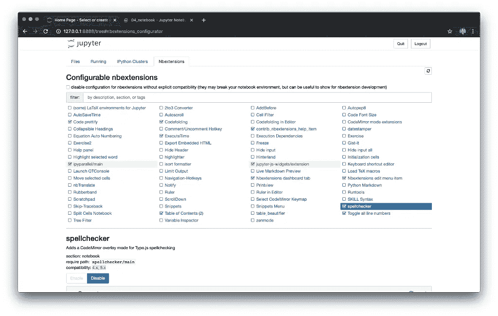

下面，我们看到 [04_notebook.ipynb](https://github.com/garystafford/pyspark-setup-demo/blob/v2/work/04_notebook.ipynb) 的菜单栏中新增了五个扩展图标。您还可以观察到已经应用到笔记本的扩展，包括目录、代码折叠、执行时间和行号。拼写检查和漂亮的代码扩展也被应用。

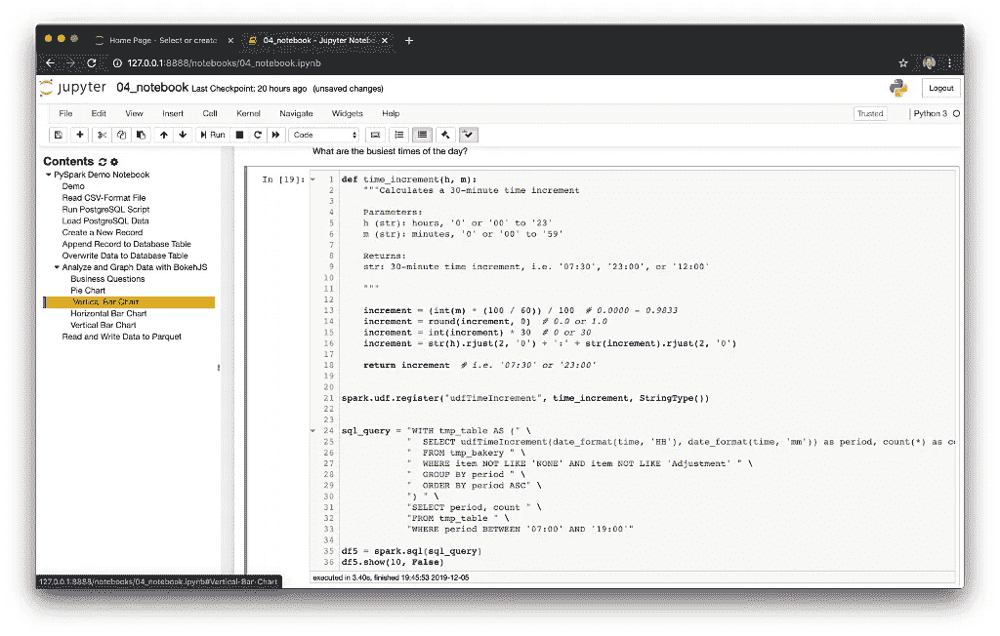

# 结论

在这篇简短的帖子中，我们看到了使用 Jupyter notebooks、Python、Spark 和 PySpark 开始学习和执行数据分析是多么容易，这都要归功于 Jupyter Docker 堆栈。我们可以使用相同的堆栈来学习和执行使用 Scala 和 r 的机器学习。扩展堆栈的功能非常简单，只需用一组不同的工具将这个 Jupyter 映像换成另一个，并向堆栈中添加额外的容器，如 MySQL、MongoDB、RabbitMQ、Apache Kafka 和 Apache Cassandra。

*本帖表达的所有观点都是我个人的，不一定代表我现在或过去的雇主及其客户的观点。*