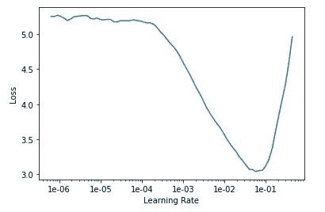
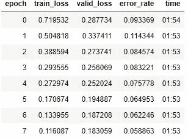
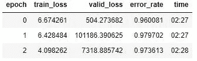
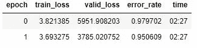

# fast.ai 入门

> 原文：<https://towardsdatascience.com/getting-started-with-fast-ai-350914ee65d2?source=collection_archive---------22----------------------->

## 我对 fast.ai 优秀的《程序员实用深度学习》第一课的体验

在过去的六个月里，[我一直在努力从一所大学的兼职数学教师转变为一名数据科学家(或者可能是一名机器学习工程师)，我旅程的下一站是通过 fast.ai 的优秀的](/from-math-m-s-to-data-science-c3ab59dbceb3)[“程序员实用深度学习”](https://course.fast.ai/)课程。我实际上在五月份尝试了这门课程，但在第二课中陷入了困境，当时我们应该生产一个模型并制作一个 web 应用程序。我还觉得我的理解没有进步，可能是因为我还不相信[自上而下学习](https://www.fast.ai/2016/10/08/teaching-philosophy/)的力量。我读了克里斯汀·麦克莱维·佩恩的一条推文，说她在做 fast.ai 之前已经在 Coursera 上做了吴恩达的深度学习专业化。一切都很顺利，在夏天完成了五门专业课程后，我很高兴能回到 fast.ai。

Photo by [Crew](https://unsplash.com/@crew?utm_source=unsplash&utm_medium=referral&utm_content=creditCopyText) on [Unsplash](https://unsplash.com/search/photos/woman-coding?utm_source=unsplash&utm_medium=referral&utm_content=creditCopyText)

我正在完全重新开始，5 月份第一次开始时我没有做笔记，但遵循 fast.ai 联合创始人[雷切尔·托马斯](https://medium.com/@racheltho/why-you-yes-you-should-blog-7d2544ac1045)和其他人的建议，我正在写“我上周需要阅读的博客”。我首先计划使用 Medium，然后认为在 GitHub 页面上使用 Jupyter 笔记本可能会教我更多有用的技能，并通过使用终端彻底迷失了方向。反正我需要学习使用终端，但是我可以边写博客边学，而不是等到学会了再写博客，发表总比不发表好。

当我开始这门课程时，我会听从 fast.ai 的联合创始人兼课程讲师[杰瑞米·霍华德](https://twitter.com/jeremyphoward)的建议，从头到尾看一遍讲座，然后一边看一边翻阅相应的笔记本。我看完第一课后的第一个任务是设置一个 GPU，我选择了使用谷歌云平台。课程为此提供了[详细的说明](https://course.fast.ai/start_gcp.html)，对我来说几乎完美无缺，只有一个例外:当我试图通过我的终端连接到我的实例时，我得到一个错误:

因此，我在谷歌上搜索错误信息+“fast.ai”，并在 fast . ai 论坛上找到一个帖子，其中有解决我问题的说明。

现在，我们来看第一课的笔记本！我试图在每件事上都按下 Shift+Enter 键和试图理解每一个细节之间找到平衡。我想我选择的平衡是阅读所有的东西并确保它有意义，但不是试图记住代码。作为一名数学教师，我知道记忆符号感觉像是在学习，但这是一种错误的进步感。相反，我假设当我在我的个人项目中实践这些代码时，它会在我的头脑中固化。

一切对我来说都有意义，直到 resnet50 部分，当我们运行学习率查找器时，我们得到了这个图表:

Figure 1: learning rate finder graph

看着上面的图表，我觉得最佳学习速率(验证损失最低的速率)应该在 1e-2 和 1e-1 之间，但接下来当我们对下面的代码进行微调时，我们将学习速率设置在 1e-6 和 1e-4 之间。

但是默认学习率为 1e-3 的验证损失和错误率相当低:分别为 0.18 和 0.06(见下图)。

Figure 2: results of fitting one cycle with the default learning rate

我并不真的期望提高这些，但为了巩固我对学习率查找器图表的理解，我将重新运行学习率查找器，将学习率设置在 1e-2 和 1e-1 之间，只是为了看看是否有什么变化。

有些事情改变了，而且不是变得更好！比较下图和上图:我的验证损失高达 7319，我的错误率是 0.97！

Figure 3: results of fitting one cycle with a learning rate range of 1e-2 to1e-1

很明显，我对学习率查找器生成的图表有一些误解。我会回去再看一遍[那一课](https://youtu.be/XfoYk_Z5AkI?t=4975)。好的，杰里米指的是选择一个在损失开始变得更糟之前结束的范围，回到学习率查找表，我看到它在 1e-1 左右开始变得更糟，这是我设定的范围的终点。看起来 1e-4 到 1e-2 的范围可能行得通？1e-3 的默认比率，之前给我们带来了很好的结果，当然是在这个范围内。

我将用 1e-4 到 1e-2 的范围再试一次:

不，仍然不好，虽然至少这次它从纪元 0 改进到纪元 1，不像以前的尝试:

Figure 4: results of fitting one cycle with a learning rate range of 1e-4 to 1e-2

我将不再摆弄学习率查找器，显然我仍然不太明白其中的细微差别，因为 Jeremy 说我们将在第 2 课中了解更多。我继续前进，其他一切都很顺利，很有意义。

当我在五月第一次完成第一课时，我试着不看第二课而做第二课的笔记，这似乎是在维基的底部建议的。维基没有明确说在试用笔记本之前不要看第二课，但为什么第一课的链接会在维基上？可能对于经验比较丰富的人来说？

总之，继续第二课:[对怀孕测试结果进行分类](/classifying-pregnancy-test-results-99adda4bca4c)！

第二课(续):[深度学习能比鸽子表现得更好吗？](/can-deep-learning-perform-better-than-pigeons-d37ef1581a2f)

第三课:[一万种行不通的方法](/10-000-ways-that-wont-work-311925525cf0)

第四课:[预测服务员的小费](/predicting-a-waiters-tips-1990342a0d02)

第五课:[但是泡菜去哪了？](/but-where-does-the-pickle-go-53619676bf5f)

第六课:[每个人都想成为一只猫](/everybody-wants-to-be-a-cat-6dd6190c5d9c)

我是加州大学东湾分校的数学讲师，也是一名有抱负的数据科学家。在 [LinkedIn](https://linkedin.com/in/laura-langdon/) 上和我联系，或者在 [Twitter](https://twitter.com/laura_e_langdon) 上打招呼。

感谢 [Vera Chernova](https://medium.com/@vera.chernova.burfield/how-to-embed-jupyter-notebook-into-medium-posts-in-three-steps-1-2-3-54262edea88a) 关于在介质上嵌入 Jupyter 代码的说明！