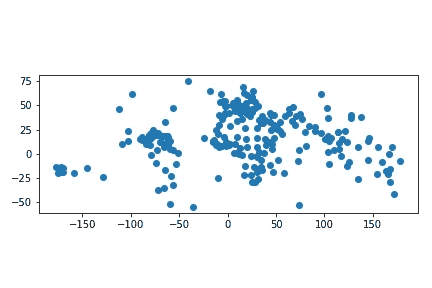
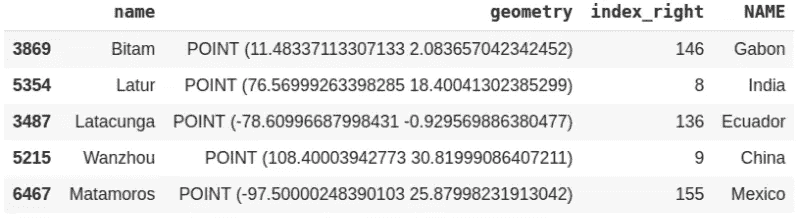
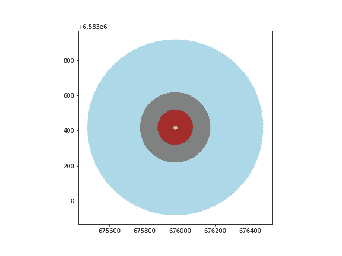
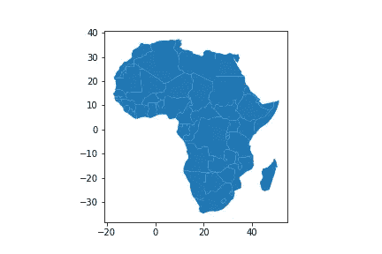
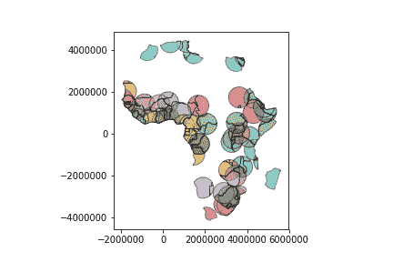

# Python 地理数据科学入门—第 2 部分

> 原文：<https://towardsdatascience.com/getting-started-with-geographic-data-science-in-python-part-2-f9e2b1d8abd7?source=collection_archive---------16----------------------->

## 教程、真实世界项目和练习

Photo by [Milada Vigerova](https://unsplash.com/@mili_vigerova?utm_source=medium&utm_medium=referral) on [Unsplash](https://unsplash.com?utm_source=medium&utm_medium=referral)

这是 Python 地理数据科学入门系列文章的第二篇。您将学习如何用 Python 阅读、操作和分析地理数据。本系列中的文章按顺序排列，第一篇文章奠定基础，第二篇文章介绍中级和高级地理数据科学主题。第三部分涵盖了一个相关的真实世界的项目，总结巩固你的学习。

第一篇文章可以在这里看到。

 [## 通过真实世界的项目和练习掌握地理数据科学

### 真实世界项目和练习

真实世界项目& Exercisestowardsdatascience.com](/master-geographic-data-science-with-real-world-projects-exercises-96ac1ad14e63) 

本教程的学习目标是:
1。了解地理数据框架和地理系列
2。执行表连接和空间连接
3。执行缓冲区和叠加分析

# 1.地理数据框架和地理系列

让我们阅读国家和引用数据集。

加载数据后，我们得到的是一个带有地理几何图形的表格。除了在 pandas 或简单的 excel 中进行典型的表格数据分析之外，地理几何允许我们执行空间操作。

## 数据框架与地理数据框架。

地理数据框架是一种包含地理系列的表格数据结构。地理数据框架最重要的属性是，它始终有一个 GeoSeries 列保存特殊状态。该地理系列被称为地理数据框架的“几何”。当将空间方法应用于地理数据框架(或调用类似区域的空间属性)时，此命令将始终作用于“几何”列。

如果有多个列，则有一个数据框或地理数据框。如果其中一列是几何列，那么它被称为 **GeoeDataFrame** 。否则，如果任何列不是几何列，则它是一个**数据帧**。同样，一列意味着您拥有 Series 或 Geoseries 数据类型。如果唯一的列是几何列，那么它被称为 **Geoseries** 。让我们看一个每种数据类型的例子。我们从数据帧开始。

我们这里只有两列，并且没有一列是几何列，因此，该数据的类型将是 dataframe，type 函数的输出是*pandas . core . frame . data frame*。如果我们的表中碰巧有任何几何列，那么它将是如下所示的地理数据框架。

类似地，Geoseries 是指我们只有一个几何列，而 series 数据类型是指这一列不是几何列，如下所示。

这将分别产生*pandas . core . series . series*和*geo pandas . geo series . geo series*。

使用 GeoDataFrame/GeoSeries，您可以执行地理处理任务。到目前为止我们看到的还不多，包括`.plot()`。另一个例子是得到多边形的圆心。让我们得到每个国家的质心，并绘制它。

这是这个图的样子，每个点代表这个国家的中心。

country centroid

> 练习 1.1:创建所有多边形几何(国家)的并集。提示使用(。一元并集)
> 
> 练习 1.2:计算每个国家的面积。提示使用(。面积)

# 2.表连接与空间连接

表连接是经典的查询操作，例如，我们有两个单独的表，共享一列。在这种情况下，您可以执行一个表连接，使用共享列连接两个表。另一方面，空间连接与地理操作相关，例如，通过位置连接每个城市及其国家。我们将在下面看到这两个例子。

我们可以根据它们共享的列名连接/合并这两个表。这是纯粹的熊猫行动，不涉及任何地理操作。

但是，在空间连接中，合并需要地理操作。我们将执行一个空间连接的示例。我们想根据它们的位置连接下面两个表。例如，哪个国家包含哪个城市，或者哪个城市在哪个国家内。我们将使用 Geopandas 函数`.sjoin()`进行空间连接，并显示 5 行样本。

从下表可以看出，每个城市都根据地理位置与其对应的国家相匹配。我们使用了 op=within，它获取国家多边形内的城市点。这里我们也可以使用 intersect。此外，我们可以使用 op=contain 并找出包含城市点的国家。

spatial joined table

# 3.缓冲分析

缓冲区分析是一项重要的地理处理任务。它被广泛应用于许多领域，以获得一个点周围的距离。在这个例子中，我们将首先在瑞典得到一个城市，然后在它周围做一个缓冲区。这里有一件棘手的事情，你需要知道你使用哪一个 CRS/投影来得到你想要的正确输出。如果您的数据没有投影到使用米的投影中，则输出不会以米为单位。这是地理数据领域的一个经典错误。我已经使用这个资源来找出瑞典有哪些以米为单位的 CRS。

 [## EPSG 投影-空间参考

### 主页|上传您自己的参考资料|列出用户提供的参考资料|列出所有参考资料

spatialreference.org](http://spatialreference.org/ref/epsg/sweref99-tm/) 

我们在这里使用 3 种不同的缓冲距离，100，200 和 500 在一个点，斯德哥尔摩市。然后我们画出结果来展示缓冲的概念。

buffer Stockholm city example

> 练习 3.1:创建所有城市的缓冲区。尝试不同的投影和不同的距离。

# 覆盖物

我们有时需要从不同的数据类型(如点、线和面)中创建新的要素。集合操作或覆盖在这里起着重要的作用。我们将使用相同的数据集，但我们可以使用 Geopandas 中内置的数据集读取机制，而不是从解压缩的文件夹中读取。这个例子来自 Geopandas 文档。

我们可以对数据进行子集划分，只选择非洲。

Africa

为了说明叠加功能，请考虑以下情况:希望使用非洲地理数据框架和首都地理数据框架来识别每个国家的“核心”部分(定义为距离首都 500 公里以内的区域)。

要仅选择首都 500 公里范围内的国家部分，我们将“如何”选项指定为“相交”，这将在这两个图层重叠的地方创建一组新的面:

Africa core overlay

改变“如何”选项允许不同类型的覆盖操作。例如，如果我们对远离首都的国家部分(外围)感兴趣，我们将计算两者之间的差异。

# 结论

本教程讲述了使用 Geopandas 在地理数据中执行的一些地理处理任务。首先，我们研究了数据框架和地理数据框架之间的差异，然后探索了空间连接。我们还进行了缓冲区分析和叠加分析。在下一个教程中，我们将在项目中应用我们在这一部分和前面部分所学的知识。

该代码可从以下 GitHub 存储库中获得:

 [## 沙卡姆/GDS

### 地理数据科学教程系列。在 GitHub 上创建一个帐户，为 shakasom/GDS 的发展做出贡献。

github.com](https://github.com/shakasom/GDS) 

您也可以直接从以下链接运行 Google Collaboraty Jupyter 笔记本:

 [## 沙卡姆/GDS

### 地理数据科学教程系列。在 GitHub 上创建一个帐户，为 shakasom/GDS 的发展做出贡献。

github.com](https://github.com/shakasom/GDS/blob/master/Part2_Geoprocessing.ipynb)