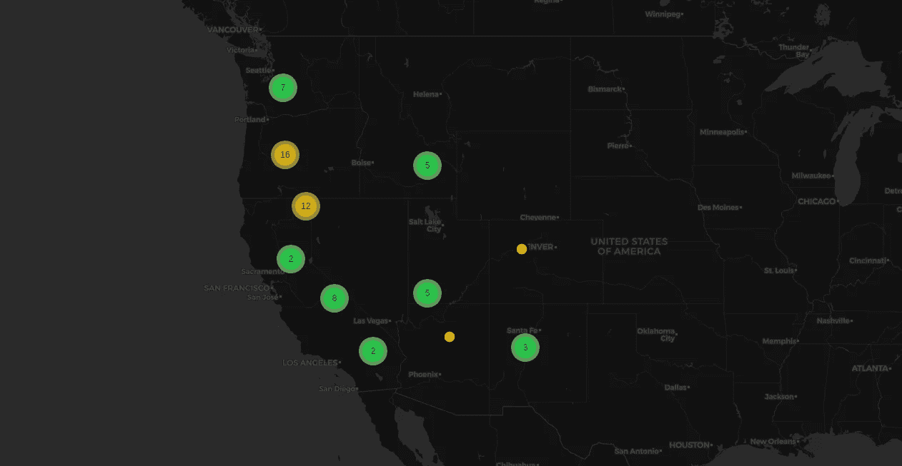
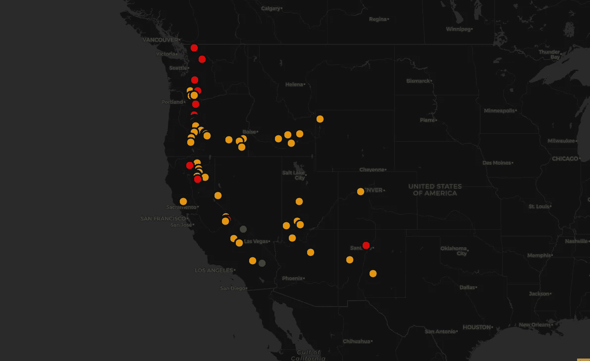
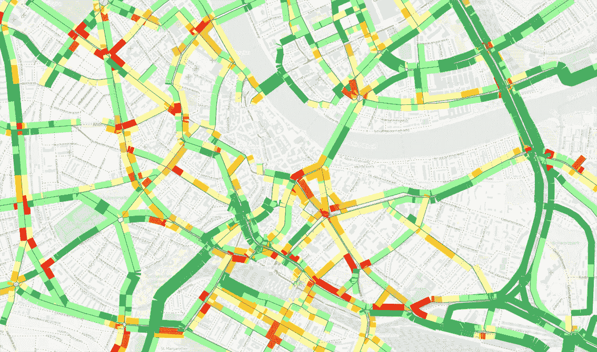
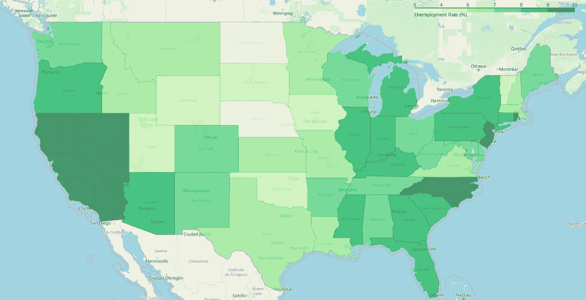
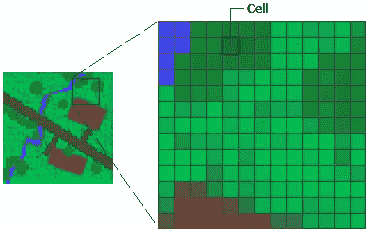

# 地理空间作品入门

> 原文：<https://towardsdatascience.com/getting-started-with-geospatial-works-1f7b47955438?source=collection_archive---------9----------------------->

## 使用本指南开始您的地理空间世界之旅



Location of the Active Volcanoes in the United States

> 地理信息系统的应用只受到使用它的人的想象力的限制
> 
> ——杰克·丹格蒙德

# 地理空间数据？那是什么？

地理空间这个术语相对较新，自 20 世纪 80 年代以来越来越流行。包含地理内容的数据被归类为地理空间数据。这包括坐标、邮政编码、城市或地址。但仅有坐标不足以理解整个数据集。必须有一些关于坐标符号，例如，坐标所代表的位置的名称。我们称之为*属性数据*。

还是不确定？看看下面的数据。

```
VOLCANX020 : NAME        : LOCATION      : LATITUDE   :  LONGITUDE
   509     : Baker       : US-Washington : 48.7767982 : -121.8109970
   511     : GlacierPeak : US-Washington : 48.1118011 : -121.1110001
   513     : Rainier     : US-Washington : 46.8698006 : -121.7509995
   515     : St.Helens   : US-Washington : 46.1997986 : -122.1809998
```

在这里，火山的数量和名称是属性数据，位置、纬度和经度是地理空间数据。例子让事情变得简单一千倍，不是吗？

# GIS 中的数据类型

正如我们已经讨论过的，GIS 数据可以主要分为两类-空间参考数据和属性数据。空间参考数据可进一步分为两种不同的类型-矢量和栅格。我们来挖掘一下什么是矢量和栅格数据类型。

## 矢量数据

向量数据由存储为(x，y)坐标对的单个点组成。这些点还可以按特定顺序连接以创建线，或者连接成闭合环以创建面。让我们了解所有三种不同的类型——点、线(或弧)和多边形。

**点数据**通常用于表示独立的数据点和不相邻的(彼此不相邻)特征。为了表示点数据，我们可以使用半径和不同的颜色来区分各个要素。例如，指出火山(本文的横幅图片)，定位特定城市的政府办公室、学校和购物中心。



Active volcanoes in the US ([Github](https://github.com/Dhrumilcse/Volcanoes-in-the-United-States))

**线数据**当然是用来表示线状特征的。这些特征都有起点和终点。我们通常使用实线而不是虚线，或者颜色的组合，甚至线条的粗细来区分不同的特征。主要的例子是道路、河流或地铁线路。



[Source](https://www.google.com/url?sa=i&source=images&cd=&cad=rja&uact=8&ved=2ahUKEwj6q_KEzKjkAhWlTt8KHQ9oB8IQjB16BAgBEAM&url=http%3A%2F%2Fcompass.ptvgroup.com%2F2015%2F01%2Fptv-group-brings-new-gis-tool-to-market%2F%3Flang%3Den&psig=AOvVaw2nG4dbHmDxoQI9ck8uN4h7&ust=1567185756075825)

**多边形数据**用于表示湖泊、城市甚至森林的边界。这些特征是二维的，可用于测量所需地理特征的面积。下图显示了美国的失业情况，完美地描述了多边形数据。



The unemployment rate in the US (city-wise)

## 矢量数据的格式

矢量数据和栅格数据具有不同的文件格式。对于任何 GIS 分析人员来说，处理一个未知的 GIS 文件都是非常困难的，因此最好了解一下您将要处理的文件格式的类型。有一些常见的和不常见的格式，让我们了解一下它们是什么，它们是如何工作的。

1.  **Esri Shapefile
    文件类型** —。shp，。dbf，。shx，。到目前为止，最常见的地理空间文件是 shapefile。它被所有商业和开源组织广泛接受。不仅仅是被接受，它已经成为行业标准。您将需要制作 shapefile 所必需的所有三个文件。您可以使用其他文件格式来创建 shapefile，但这些格式是可选的，不是强制性的。
2.  **地理 JavaScript 对象符号
    文件类型** —。geojson，。json
    **描述** —俗称 GeoJSON，是基于 web 的制图最常用的格式。它将坐标以文本形式存储在 [JSON](https://www.json.org/) 表格中，包括矢量点、线、多边形以及表格信息。GeoJSON 将信息(读取对象)存储在花括号{}中，与 GML 相比，它没有那么复杂，我们将在几分钟后了解它。
3.  **地理标记语言
    文件类型** —。gml
    **描述** — GML 类似 GeoJSON。它以文本的形式存储信息(或特征),可以在任何文本编辑器中轻松更新。此外，每个要素都有一个属性列表-点、线、曲线和多边形。然而，正如我们所讨论的，GML 是复杂的，因为它为相同数量的信息产生更多的数据。
4.  **谷歌锁眼标记语言**
    **文件类型** —。kml，。kmz
    **描述** —这种格式基于 XML，主要用于 Google Earth 的开发。它最初是由 Keyhole Inc .开发的，后来被谷歌收购。KMZ (KML 压缩)取代 KML 成为谷歌地球的默认地理空间格式，因为它是 KML 文件的压缩版本。

## 栅格数据

另一种类型是栅格数据，用于表示表面。它是基于单元的数据，由组织成列和行(或网格)的单元(或像素)矩阵组成，其中每个单元代表信息。简单来说，数码照片是栅格数据的一个例子，其中每个像素值代表一种特定的颜色。栅格数据的其他示例包括航空照片、数字高程模型，甚至是扫描地图。



[Image source](http://desktop.arcgis.com/en/arcmap/10.3/manage-data/raster-and-images/what-is-raster-data.htm)

## 栅格数据的格式

栅格数据也有特定的文件类型。因为它们是由网格组成的，所以在大多数情况下，它们是规则的空间和正方形的，但并不总是这样。以下是其中的一些。

1.  **GeoTIFF
    文件类型** —。tif，。tiff，。ovr
    **描述** —对于 GIS 和卫星遥感应用，GeoTIFF 已经成为行业标准。如上所述，它总共由三个文件组成，但可能会附带其他文件:。tfw，。xml 和。补助的
2.  ERDAS Imagine
    文件类型 —。img
    **描述** —是 Hexagon geospatial 开发的专有文件格式。这些文件通常用于栅格数据，以存储单波段和多波段的卫星数据。想象一下，文件使用一种分层格式来存储文件的基本信息。
3.  **IDRISI 光栅
    文件类型** —。rst，。rdc
    **描述**-IDRISI 将 RST 与所有栅格图层相关联，栅格图层由实数、整数和字节形式的数字矩阵像元值组成。RDC(光栅文档文件)是 RST 文件的配套文本文件。

# 数据源

我们现在知道地理空间作品中有什么类型的文件。但是我们从哪里得到它们呢？我们必须从可靠的来源获取数据，这样我们获取的数据文件就不会有不常见的格式。

1.  [**Esri 开放数据**](https://hub.arcgis.com/search\)数据类型-电子表格、KML、shapefile、GeoJSON 等。这就像一个隐藏的免费 GIS 数据宝藏，拥有来自 4000 多个组织的超过 67300 个开放数据集。在某些情况下，你可能不得不把你的下载合并成一个。但是，尽管付出了努力，这个单一的来源是你找到你想要的东西的最好机会。
2.  [**自然地球数据**](http://www.naturalearthdata.com/downloads/)数据类型—文化、物理和栅格(底图)数据。它很好地满足了制图师的需求。在大范围内，所有关键的文化和物理矢量 GIS 数据都可供您使用。最棒的是。它属于公共领域。这意味着您有权以任何方式修改数据供您使用。
3.  [**USGD 地球探索者**](http://earthexplorer.usgs.gov/)数据类型—遥感数据
    对于观测地球、寻求遥感数据的人来说，这是你唯一的归宿。它有一个用户友好的界面，让您可以访问最大的航空和卫星图像数据库之一。除此之外，它甚至有一个批量下载应用程序，以防万一你需要它。
4.  [**NASA 的社会经济数据和应用中心**](https://sedac.ciesin.columbia.edu/) 数据类型—社会经济数据
    SEDAC 是关于人类与环境的互动。它拥有广泛的数据，包括(但不限于)农业、灾害、健康、人口、可持续性、贫困和水。
5.  [**UNEP 环境数据浏览器**](http://geodata.grid.unep.ch/)
    数据类型—淡水、人口、森林、气候、排放。
    它包含 500 多个变量，但由于接口的原因，浏览 GIS 数据有点困难。如果你去那里，你可以过滤“地理空间数据集”并下载数据。
6.  [**DIVA-GIS**](https://www.diva-gis.org/Data)
    数据类型—国家、全球级别数据
    DIVA-GIS 是一款用于制图和地理数据分析的免费计算机程序。但是在数据页面上，你会发现一个很好的数据集列表，从全球气候到物种出现数据。

# 可视化工具

## 包装

在专用分析包的帮助下，我们可以轻松地可视化小型和大型数据。即使您没有处理软件包的经验，也只需要很少的学习时间。所以别担心，开始吧。

1.  [**geo plot**](https://residentmario.github.io/geoplot/index.html)
    geo plot 是一个高级 python 地理空间可视化库。它是对`cartopy`和`matplotlib`(另外两个伟大的可视化库)的扩展，使得映射变得容易。
2.  [**叶子**](https://python-visualization.github.io/folium/)
    叶子建立在 python 的数据角力优势和`leaflet.js`库的可视化/映射优势之上。它有大量来自 OpenStreetMap、Mapbox 和 Stamen 的内置 tilesets。此外，它支持图像和视频，以及 GeoJSON 和 TopoJSON 叠加。
3.  [**geo pandas**](http://geopandas.org/index.html)
    geo pandas 从根本上说是一个开源项目，使使用 python 处理地理空间数据变得更加容易。然而；它扩展了对地图的支持，使用 Geopandas 创建基本地图就像在公园里散步一样。点击了解更多[。](http://geopandas.org/mapping.html)
4.  [**PySAL**](https://pysal.readthedocs.io/en/latest/)
    PySAL 是一个开源的跨平台库，专为地理空间数据科学设计，重点是矢量数据。它支持高级应用程序的开发，如空间聚类和异常值检测、探索性时空数据分析等。
5.  [**rworldmap**](https://www.rpackages.io/package/rworldmap)**和**[**rworldxtra**](https://www.rpackages.io/package/rworldxtra)
    使用 r 绘制地理空间数据同样容易。rworldmap 支持绘制国家级和网格化用户数据集，而 rworldxtra 提供源自自然地球数据的高分辨率矢量国家边界。****

## ****开源软件****

****有了这些免费的 GIS 软件，你就可以像使用专有的 GIS 软件一样完成工作。****

1.  ****[**PostGIS**](https://postgis.net/)PostGIS 是 PostgreSQL 对象关系数据库的开源空间数据库扩展器。它支持地理对象，允许在 SQL 中运行位置查询。大多数软件产品使用 PostGIS 作为数据库后端，包括下面列出的 QGIS 和 GrassGIS。****
2.  ****[**QGIS**](https://qgis.org/en/site/)
    QGIS 满载着触手可及的隐藏宝石。您可以自动化地图制作、处理大规模地理空间数据以及生成制图图像。我们还需要什么？最新版本(QGIS 3)带有一套全新的制图、3D 和分析工具。****
3.  ****[**GrassGIS**](https://grass.osgeo.org/)
    地理资源分析支持系统是一个应用广泛的 GIS 软件套件。它提供地理空间数据管理和分析、图像处理、地图制作、空间建模和可视化等功能。****
4.  ****优步大学的可视化团队正在创建行业级开源框架来加速大数据。主要有四种套装可用——甲板、亮度、反应贴图和反应视觉。开普勒是用 deck.gl 构建的，利用 WebGL 更快更高效地渲染大数据。****

# ****尾注****

****如果没有合适的资源，学习新的东西有时会是一项乏味的任务。这就是为什么我们决定把这些碎片放在一起，并创建一个最终的文章，让你开始地理空间工作。我们很想知道该指南是否对您有所帮助——尤其是在地理空间工作入门方面。****

****关于 [Locale](http://locale.ai/) :我们从一个个人问题开始 Locale。作为处理地理空间数据的数据科学家，现有的分析产品在我们的日常工作流程中毫无用处。因此，我们必须为我们的日常工作流程构建自己的工具。****

****然后，我们意识到全球的数据科学家面临着类似的问题。因此，企业正在努力利用他们的位置数据来提高运营效率。我们打算一劳永逸地解决这种痛苦。因此，我们完全从零开始构建一个工具来处理大规模的实时地理空间数据。在这里了解更多。****

****如果你想更多地了解我们的工作，请通过 aditi@locale.ai 向我们发送电子邮件，提出你的所有问题。如果你对同样的问题产生共鸣，并希望做出贡献，我们[也在为不同的角色招聘](https://locale.freshteam.com/jobs)。****

****感谢 [Aditi](https://medium.com/u/2fb67c67439c?source=post_page-----1f7b47955438--------------------------------) 帮我完成这篇文章。****