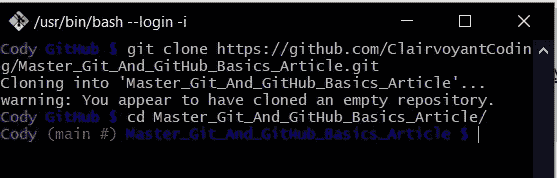
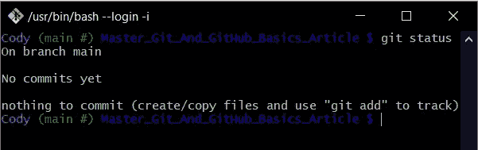
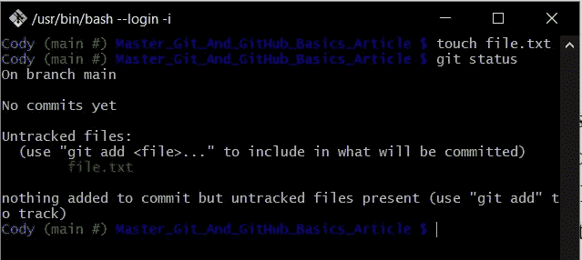
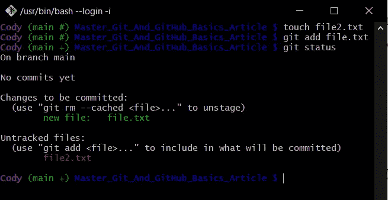
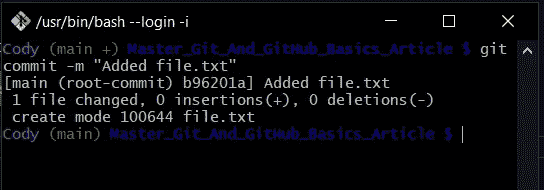
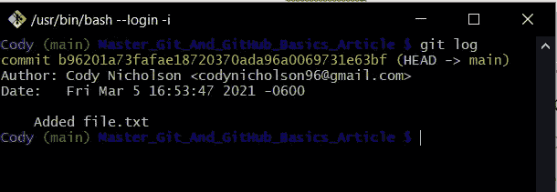
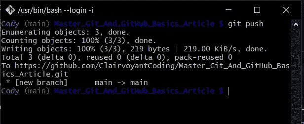

# 掌握 Git 和 GitHub 的基础知识

> 原文：<https://towardsdatascience.com/getting-started-with-git-github-6235f5ae3a0b?source=collection_archive---------18----------------------->


Photo by [Max Duzij](https://unsplash.com/@max_duz?utm_source=unsplash&utm_medium=referral&utm_content=creditCopyText) on [Unsplash](https://unsplash.com/?utm_source=unsplash&utm_medium=referral&utm_content=creditCopyText)

## 软件工程

## 开始使用 Git & GitHub 所需要知道的一切

**Prod 已关闭**！这次又是什么？我们编写的测试用例涵盖了我们能想象到的所有用例——在我们昨天更新服务后，它们都通过了。*如果我们能够回到过去，调查我们代码最近的所有变化，看看哪里出错了*！这就是 Git 要解决的**类型的问题。**

在本文中，我将向您展示如何使用 **Git** 来跟踪项目中文件的历史，以便您能够在项目中出现 bug 时进行诊断。

# Git 和 GitHub 有什么区别？

**GitHub** 是一个允许用户托管文件的网络应用程序，有点像 DropBox 或 Google Drive——但它是为托管 **Git 库**而设计的。 **Git** 是一个命令行工具，主要由程序员用来管理软件项目的版本管理(*历史*)。每个项目都存在于一个保留所有变更历史的 **Git 仓库**中。

# 1.安装 Git

通过下面的链接，你可以点击页面顶部你正在使用的操作系统来安装 Git。在你安装了 **Git** 之后，如果你在 Windows 上，进入你的*命令提示符*，或者如果你在 MacOS 或 Linux 上，进入你的*终端*。键入“git”并按回车键。如果你看到任何关于 **Git** 的信息，说明你安装正确！如果您得到“找不到命令”——尝试卸载并重新安装 git，或者重新配置您的环境变量。

[](https://git-scm.com/downloads) [## 下载

### Git 带有内置的 GUI 工具(git-gui，gitk ),但是有几个第三方工具供用户寻找一个…

git-scm.com](https://git-scm.com/downloads) 

# 2.创建 GitHub 帐户

下面的链接会带你去 GitHub。在那里，您可以使用您的电子邮件地址设置一个帐户。

[](https://github.com/) [## 一起打造更好的软件

### GitHub 汇集了世界上最大的开发人员社区来发现、共享和构建更好的软件。来自…

github.com](https://github.com/) 

# 3.创建您的第一个存储库

在 GitHub 的任何页面上，当您登录时，您会在右上角工具栏中的个人资料图片旁边看到一个白色加号。单击加号将显示一个下拉菜单，您应该在其中选择:“**新存储库**”。在那里，您应该将存储库命名为“**Master _ Git _ And _ GitHub _ Basics _ Article**”——考虑到它们不允许在名称中使用空格。您不需要添加描述，并且可以启用默认的“**公共**”访问。对于本课，您不应该选中“**用自述文件**初始化”复选框，最后，您不需要添加一个. **gitignore 文件**或一个**许可证** —因此您可以单击底部的“**创建存储库**按钮。

接下来的页面会有很多微小的吓人的文字。在此页面上，您需要担心的唯一信息是顶部标有“**快速设置**”的蓝色阴影框。在蓝色的“**快速设置**”框内，确保选择了“ **HTTPS** ”，而不是“**宋承宪**”。在菜单的最左侧有一个剪贴板图标按钮，您可以选择它将您需要的 URL 地址复制到您的计算机上。

在您的终端或 git bash 中，使用“ **cd directory_name** ”命令转到您想要放置存储库的目录。然后运行下面的命令( ***用你从 GitHub*** 复制的 URL 替换我的 URL):

```
**git clone** [**https://github.com/ClairvoyantCoding/Master_Git_And_GitHub_Basics_Article.git**](https://github.com/ClairvoyantCoding/Master_Git_And_GitHub_Basics_Article.git)
```



Cloning the repository and then changing directory into the repository (Image by author)

运行该命令应该会在运行该命令的目录中创建一个空文件夹。你可以认为**克隆**一个库就像下载it *—* 但是更多。它还会下载对这些文件所做的所有更改的历史记录。让我们在命令提示符或终端中运行命令"**CD Master _ Git _ And _ GitHub _ Basics _ Article**"进入我们刚刚克隆的新存储库。现在我们已经在存储库中了，我们可以使用以下命令来获取存储库的状态:

```
**git status**
```

git status 命令将向我们展示自上次提交以来对我们的库所做的所有更改。对我们来说，它会说:



Checking the status of our repository using “git status” (Image by author)

> 注意:如果您的 Git Bash/Terminal/Command 提示符没有显示相同的配色方案和绿色的“(main #)”消息，不要担心。我将 Git Bash 配置文件配置为给我这些额外的颜色和消息。

所有这些告诉我们的是，我们还没有任何历史，因为我们没有任何**提交**。您可能想知道“branch main 上的**是什么意思——但是我们将在下一篇文章中解决这个问题。现在我们将添加一些历史。**

# 4.创建我们的第一个提交

在 **Git 仓库**中，我们在**提交**中记录历史。正如我们在 **git status** 输出中看到的，我们目前没有提交。为了创建一个提交，我们需要在我们的存储库中做一些更改。在文件资源管理器或 finder 窗口中创建一个新文件，并将其拖到存储库目录中。我的文件将只是没有内容的“ **file.txt** ”。现在，如果我返回到我的命令提示符或终端并运行" **git status** "，我将看到我的新文件:



Using the “touch” command to create a file and running “git status” to see the changes to the repository (Image by author)

现在你可以看到 **git status** 在向我们展示我们的变化时是多么有用。您会注意到 **file.txt** 文件列在未跟踪文件中。记住 **Git** 想要跟踪存储库中发生的所有变更——但是我们必须告诉它要跟踪哪些文件。为了使这一点更明显，让我们添加第二个名为 **file2.txt** 的文件，这样我们可以看到当我们跟踪一个文件而不跟踪另一个文件时会发生什么。在将第二个文件添加到存储库中并验证它在您运行" **git status** 时显示为未跟踪之后，我们将学习下一个 **Git** 命令:

```
**git add file.txt**
```

我们使用“**git add<FILE _ NAME>**”选择要跟踪的文件。请注意，我们只选择了第一个文件。现在，当我们运行 git status 时，我们得到了输出:



Creating file2.txt, adding file.txt so it’s ready to commit, and checking the status of the repository (Image by author)

请注意， **file.txt** 列在新标题下:“**待提交的变更**”，而 **file2.txt** 仍列在“**未跟踪**”下。请记住，我们并没有通过添加文件来跟踪任何东西——我们只是在**提交**时选择了要跟踪的文件。既然我们已经选择了要添加到提交中的更改，我们可以使用以下内容创建项目中的第一个提交:

```
**git commit -m "adding file.txt"**
```

该命令将创建我们的**提交**，并显示消息:“**正在添加 file.txt** ”。每一个**提交**都必须有一个消息来描述发生了什么变化，这样在未来就可以很容易地浏览我们的历史。让我们看看我们的**提交**命令的输出:



Commiting the file.txt we added in the previous step (Image by author)

这告诉我们，我们添加了一个新的提交，即“**根提交**”，因为这是第一个提交。未来提交将不会是“**根提交**”。我们的提交有消息“**添加了 file.txt** ”，它只包含一个文件更改，我们在那里创建了“ **file.txt** ”。最后，我们将学习另一个命令，该命令将按降序列出我们存储库中的所有提交:

```
**git log**
```

该命令输出:



Using git log to see all of our previous commits (Image by author)

只列出了一个提交，因为我们只有一个，它还告诉我们每个提交的作者、日期和消息。

# 5.推动你的改变

一旦您提交了您的更改——没有人能够在您的 GitHub 个人资料上看到它们，除非您使用以下命令推送您的代码:

```
**git push**
```



Pushing your changes from your local machine to your GitHub repository (Image by author)

现在，您的更改已经上传到您的 GitHub，供所有人查看。去看看！


See the file.txt file we pushed from our local repository to our GitHub online repository (Image by author)

注意， **file2.txt** 不在这里，因为我们没有选择提交它。我们可以点击屏幕中间工具栏最左边的“ **1 commit** ”来查看我们所有的提交，就像 **git log** 向我们展示的那样。

# 6.现在怎么办？

现在你知道如何使用 **git** 命令了:**克隆**，**状态**，**添加**，**提交**，**日志**，以及**推送**。现在，您可以用新的变更不断更新您的存储库。 **git 添加**您更改的文件以选择它们为**提交的**。然后**提交**一条描述你做了什么的消息，然后**将**推送到 GitHub 让其他人看到。请继续关注下一个教程，在那里我们将学习所有关于使用 **git 分支**在我们的软件项目中与其他开发者合作的内容。

> [在这里找到本文使用的 GitHub 库](https://github.com/ClairvoyantCoding/Master_Git_And_GitHub_Basics_Article)
> 
> 要学习更高级的 Git & GitHub 概念，你可以在这里阅读我的第二篇 Git & GitHub 文章

感谢阅读！我很乐意听到你的反馈或回答任何关于我的文章的问题，所以请在下面评论。