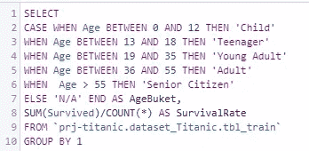

# Google BigQuery 机器学习入门——泰坦尼克号数据集

> 原文：<https://towardsdatascience.com/getting-started-with-google-bigquerys-machine-learning-titanic-dataset-ab7294efb863?source=collection_archive---------9----------------------->


W 虽然还在测试阶段，**[**biqquery ML**](https://cloud.google.com/bigquery/docs/bigqueryml-intro)已经从去年年中开始发售；然而，直到最近，我才开始使用这个基于谷歌云的机器学习产品。作为一名非数据科学家，我的第一印象——有什么不喜欢的？毕竟，对于任何一个分析师来说，从基于 web 的 SQL 编辑器中舒适地运行 ML 模型的能力是梦想成真。这个平台不仅消除了学习编程语言的需要，无论是[](https://www.r-project.org)**[**Python**](https://www.python.org)**还是[**SAS**](https://www.sas.com/en_us/home.html)；它还通过利用现有的 BigQuery 数据源简化了数据工程过程，而不必将外部数据引入到您的模型中。实际上，该产品消除了进入这一令人垂涎的数据科学专业的许多障碍，并通过允许任何具有足够的 **SQL** 知识的分析师运行*线性*和*逻辑*回归模型，而不必投资昂贵的硬件，例如通常需要支持可扩展 ML 项目的多核[**GPU**](https://en.wikipedia.org/wiki/Graphics_processing_unit)。下图很好地展示了平台的功能:******

********

******BigQuery ML demo from Google AI Blog******

****许多有抱负的数据科学学生转向值得信赖的 [**泰坦尼克号:机器从灾难中学习**](https://www.kaggle.com/c/titanic/data) 来自最受欢迎的 [**Kaggle**](https://www.kaggle.com) 竞赛的数据集来练习使用二进制*分类*模型。事实上，对于一个初学者来说，二元分类模型是一个相当容易掌握的概念:你的任务是简单地预测某个事件是否会发生；或者某个条件将评估为真还是假。对于这个问题，任何人都能够理解这样一个概念，即预测一名特定的泰坦尼克号乘客是否能在有史以来最具纪念意义的沉船事故中幸存下来:这里只有两种可能性。要跟进，你只需登录现有的 Kaggle 帐户或创建一个新的帐户，并下载所有三个文件提供。使用 Kaggle 网站(谷歌早在 2017 年就收购了)和 BigQuery 平台(谷歌的另一款产品)的讽刺意味并没有在我身上消失。让我们使用示例数据集和一个工作中的 BigQuery 实例来深入研究这个问题。****

****我们可以应用不同的分析框架来确定需要哪些步骤来完成手头的任务。对我有效的方法通常包括以下内容，让我们在机器学习过程中采用它:****

1.  *****了解你的数据*****
2.  *****争论你的数据*****
3.  *****执行分析*****

****不言而喻，理解我们在这里试图完成的是什么是理所当然的。与你可能面临的任何业务问题类似，我们必须准确理解这项工作的目标是什么:选择相关因素来帮助我们准确预测某个乘客是否能在泰坦尼克号失事中幸存。****

******第一步——探索泰坦尼克号数据集******

*****A .定义数据*****

****首先，让我们看看 Kaggle 为我们提供的数据。我们可以将三个 CSV 文件:*训练*和*测试*数据集，以及*性别 _ 提交*作为可供我们分析的三个数据库表。我们将使用训练集来建立我们的机器学习模型，同时我们将在测试集上运行模型来预测结果(沉船的存活率。)提交表可以作为一个模板，我们可以通过将结果提交给 Kaggle 进行评分来测试我们预测的准确性。根据数据字典，在我们的训练表中有相当多的字段，我们可以在预测存活率的解决方案中考虑这些字段:****

*****passengerid*—分配给每位乘客的唯一 ID；****

*****幸存*——幸存标志，其中 **1** 的值表示乘客幸存， **0** 表示遇难乘客——这代表我们试图预测的目标值；****

*****Pclass* —旅客的车票等级，也可以解释为社会经济地位的代理: **1** 代表头等车票/上层市民， **2** 代表二等车票/中层，而 **3** 代表三等车票持有者/下层市民；****

*****姓名* —乘客姓名；****

*****性别* —乘客的性别，请记住，为了建立模型，我们需要将这种*字符串*类型的记录转换为*数字*数据类型；****

*****年龄* —乘客的年龄(年)；****

*****SibSp* —一起旅行的兄弟姐妹/配偶人数；****

*****Parch* —一起旅行的父母/子女人数；****

*****车票* —旅客的车票号码；****

*****票价* —乘客票价，该乘客为其车票支付了多少钱；****

*****客舱*—分配给乘客的客舱号；****

*****已装船*—装船港( **C** =瑟堡， **Q** =皇后镇， **S** =南安普顿)****

*****B .确定丢失了什么*****

****我们可以从查看数据集中缺失的**值开始。当处理像我们这样的小数据集时，快速抽查通常就足够了。事实上，只要浏览记录，我们就可以确定只有三个字段缺少值:*年龄*、*船舱*和*上船*。为了量化丢失值的影响，让我们对这些数据运行第一个 SQL 查询:******

********

****似乎五分之一的记录缺少*年龄*值，而四分之三的*舱室*记录找不到，891 个记录中只有两个缺少*登船*标志:****

********

****请注意，我在查询中使用了*标准 SQL* ，并将我们的训练数据导入到保存在 BigQuery 实例中的 **dataset_Titanic** 数据集内的 **prj-titanic** 项目的 **tbl_train** 表中。****

> ****实际上，不是所有可用的变量(或我们应该选择在模型中使用它们的特征)都应该在任何给定的预测模型中使用；在泰坦尼克号数据集的情况下，我们可以从有史以来票房第二高的电影[](https://en.wikipedia.org/wiki/List_of_highest-grossing_films)**中回忆起* [*妇女和儿童优先*](https://en.wikipedia.org/wiki/Women_and_children_first) *政策对妇女和儿童有利，他们在使用救生艇方面享有优先权。头等舱乘客似乎是下一个受青睐的群体。让我们研究我们的数据，看看事实上性别、年龄和阶级是否可以很好地预测乘客的存活率。******

******C .哪些数据是相关的？******

*****下面的快速查询验证了上述关于*性别*维度的假设。根据提供的数据，女性几乎是 4(！)比男性更有可能在这次事故中幸存下来:*****

********************

*****Survival rate by gender*****

*****请注意，上面的图表来自无缝的 [BigQuery](https://bigquery.cloud.google.com) 和 [DataStudio](https://datastudio.google.com) 集成；来自谷歌的真正端到端*探索性数据分析*解决方案。*****

*****当查询存活率的 *Pclass* 变量时，我们还可以确认乘客类别实际上应该是我们模型的*特征/预测值*之一:*****

**********

*****Survival rate by passenger class*****

*****当涉及到可视化数据时，使用*分类*数据比使用*连续*数据类型的值要容易得多。在我们绘制*年龄*变量的结果之前，让我们对不同年龄段的乘客进行分类。你可能会想到更好的解决方案，但我个人会使用五个年龄组:*****

******儿童-*13 岁以下*****

******少年-*13 至 18 岁之间*****

******青壮年* -年龄在 19 至 35 岁之间*****

******成年-* 36 至 55 岁年龄段*****

******老年公民——*55 岁以上。*****

*****当我们运行新的查询时，很明显，儿童的存活率确实比其他年龄组高得多。青少年占据了第二的位置:*****

********************

*****Survival rate by Age category*****

*****自然，很难想象诸如*姓名*、*乘客 ID* 、*车票*等类似的字段可能与生存有任何关系，然而其他不太直观的字段实际上可能是有帮助的。如果我们按*开始的*类别来看存活率，会发生什么？忽略两个显示 100%存活率的缺失记录，瑟堡在存活率方面从其他两个港口中脱颖而出，皇后镇比南安普顿更受欢迎:*****

**********

*****Survival rate by port of embarkation*****

*******步骤 2—数据清理*******

******A .处理缺失值******

*****完成 EDA 过程后，是时候让我们参与一些基本的数据争论任务了。假设我们热衷于使用上面讨论的所有四个字段:*年龄*、*性别、**p 类*和*已着手*，我们需要考虑 **177** 缺失*年龄*值和 **2** *已着手*值。*****

*****让我们根据我们所知道的关于乘客的一切来推断出装货港。最简单的解决方案是根据乘客的登机点来查看乘客的分布情况，南安普敦代表了所有乘客的 **72%** :*****

**********

*****Number of passengers by port of embarkation*****

*****此外，我们可以考虑使用 *PClass* 信息来查看大多数头等票持有者是否从特定的港口出发。在以下查询的帮助下，我们可以确定 **59%** 的乘客也是从南安普顿出发的:*****

**********

*****完成该任务的另一种方法是查看*舱室*信息是否可用于填充这些缺失值。经过一些基本的[搜索](https://lmgtfy.com)我们可以得知*舱*字段的第一个字母指的是甲板，这自然与乘客等级值高度相关。在我们的例子中， **B** 恰好代表长廊(不要与上层长廊混淆)甲板。看看这个甲板上已知的*装载港口的乘客分布，这是一个公平的掷硬币决定，大约一半的人( **51.11%** 准确地说)从南安普顿开始他们的旅程，剩下的一半来自瑟堡。******

*****总结以上所有发现，让我们大胆地(经过计算)假设缺失的*上船*值应该被赋值为 **S** 【南安普顿】的值。]处理 **177** 缺失的年龄值并不简单，部分原因是这个样本的大小，部分原因是数据集中缺少可靠的预测因子。我们也许可以通过查看乘客的名字来解读他们的头衔，并做出可靠的假设，即所有已婚乘客(*夫人等)肯定不是孩子。除了查看数据中的平均值或众数，放大他们的实际年龄会变得更加困难。让我们简化我们的生活，在这里采取简单的方法:让我们忽略所有缺少*年龄*值的记录，希望有足够大的剩余数据集用于我们的预测模型。******

*******B .为模型准备数据*******

******说到*模型*，它们不能很好地处理文本/字符串数据类型，我们需要将所有这些字段转换成数值。例如，对于*性别*字段，我们或许可以将值 **1** 分配给所有男性，将值 **0** 分配给所有女性。******

******转到头等舱领域，我们可以从之前的观察中回忆起，头等舱的乘客比二等舱的乘客更有可能存活。然而，如果我们仅使用 1 和 2 的名义值用于各自的票等级，这种关系将被错误地解释为二等票乘客比一等票持有者更有可能死亡 ***两倍于*** 。我们可以通过创建三个字段(每个乘客等级一个)并相应地标记记录来扩展这种关系。头等票持有者将在 *PClass1_Flg* 字段中具有值*真*(读:1)，并且对于 *PClass2_Flg* 和 *PClass3_Flg* 列具有值*假*(读:0):******

************

******我们将对*年龄*类别字段应用类似的原则，并根据乘客年龄组创建五个新字段来标记记录。******

********第三步——运行我们的机器学习泰坦尼克号模型********

*******A .创建我们的模型*******

******我们终于完成了所有的准备工作，准备进入项目的最后阶段。为了演示创建我们的模型是多么容易，让我们遵循下面的 BigQuery ML 语法，并运行我们的第一个基于单一特征的逻辑回归模型——性别:******

```
******CREATE OR REPLACE MODEL `ModelName`
      OPTIONS (model_type = 'logistic_reg') AS 
SELECT field(s) FROM TableName******
```

************

******Who knew that it only takes a couple of lines of SQL code to create a Machine Learning model?******

*******B .评估模型结果*******

******评估我们的模型只需要一行代码，结果看起来相当有希望******

```
******SELECT * FROM ml.evaluate(model `ModelName`)******
```

************

******运行我们的模型******

******关键时刻到了，让我们对照*测试*数据运行我们的模型，让我们创建一个包含模型结果的表格:******

************

******SQL Code for the table containing model predictions******

******处理单个功能/专栏并不困难，但是我们从 EDA 中回忆起，性别似乎是生存的最佳预测因素。是时候将这个表格保存为 CSV 格式，并制作我们的 [Kaggle submission](https://www.kaggle.com/c/titanic/submissions) 。这个相当轻松的练习产生了 **76.55%** 的准确率，使我们在所有 Kaggle 参赛者中名列前茅 **74%** 。不需要太多的分析能力就可以看出，这个分数实际上是与其他 1，481 名竞赛参与者共享的，因此，实际上，我们处于前 **60%** ！从这里开始肯定有成长的空间，但对于第一次尝试来说不会太寒酸。******

************

******Kaggle ranking for the first submission******

*******D .实验和优化*******

******测试和迭代绝对是这里的精神。我们可以通过*使*符合我们的需求来进一步试验这个模型，可以改变学习率、设置正则化、限制迭代次数等等。所有这些参数都可以在模型语句的[选项](https://cloud.google.com/bigquery/docs/reference/standard-sql/bigqueryml-syntax-create)部分找到。******

******此外，我们可以尝试通过改变所使用的特征来提高我们的模型的准确性；让我们使用这种方法。我非常难过地意识到，通过添加额外的特征(年龄类别、乘客级别和装载港口)，模型的准确性实际上下降了:******

************

******Another less successful Kaggle submission******

******我们应该可以做得更好，对吗？如果我们考虑到这样一个事实，即家庭成员呆在一起互相帮助可能会有更好的生存机会。幸运的是，我们可以加上一起旅行的父母/孩子的数量( *parch* )和兄弟姐妹/配偶的数量( *sibsp* )来计算家庭的总人数。这有助于了解根据我们之前的 EDA，这两个字段中没有缺失值。还请注意，独自旅行的乘客在任一字段中都会有 **0** 值。让我们建立一个新的、更全面的、更准确的模型:******

******这种策略是正确的，我们略微提高了我们提交的准确性到 **77%** ，并向上移动了 1476 位，绕过了所有使用性别作为唯一预测指标的人。我们现在只与 583 家竞争对手分享我们的位置，实际上使我们进入了前 54% ！******

************

******我不确定我们可以达到什么样的实际准确度水平，(排行榜上所有 95%以上的分数看起来都很可疑)，但要记住的一点是，模型的类型可能在这里发挥作用，也许随机森林可以产生比分类更好的结果？尽管如此，要提高我们的分数，还有很多工作要做。******

******如果你正在寻找接下来的步骤，谷歌确实为两者提供了 BigQuery ML *入门*指南:[数据分析师](https://cloud.google.com/bigquery/docs/bigqueryml-analyst-start)和[数据科学家](https://cloud.google.com/bigquery/docs/bigqueryml-scientist-start)赛道。祝你的机器学习之旅好运！请分享你的想法和使用的方法，如果你在你的结果中更成功的话！******

*********2019 年 3 月 31 日编辑***——感谢 [Felipe Hoffa](https://medium.com/@hoffa) 提供的非常翔实的评论，我了解到我上面使用的一些代码实际上是多余的；事实上，BigQuery 让事情变得更加简单。******

******替换此代码:******

```
****CREATE OR REPLACE MODEL `xxx.xx`
OPTIONS (model_type='logistic_reg') AS
SELECT Survived AS label,
CASE WHEN Sex = 'male' THEN 1 ELSE 0 END AS Gender****
```

******有了这句话:******

```
****CREATE OR REPLACE MODEL `xxx.xx`
OPTIONS (model_type='logistic_reg') AS
SELECT Survived AS label,
Sex****
```

******如果你想学习更多的 BigQuery 和 BigQuery ML 技巧和诀窍，请阅读 Felipe 的精彩文章[和他到目前为止分享的所有其他文章。](/when-will-stack-overflow-reply-how-to-predict-with-bigquery-553c24b546a3)******

********附注**抱歉，菲利普，旧习难改:我把你的例子中的*前导*逗号换成了我的*尾随*逗号。******