# Google Colab 入门

> 原文：<https://towardsdatascience.com/getting-started-with-google-colab-f2fff97f594c?source=collection_archive---------0----------------------->

## 为沮丧和困惑的人准备的简单教程


Photo by [FuYong Hua](https://unsplash.com/@hhh13?utm_source=medium&utm_medium=referral) on [Unsplash](https://unsplash.com?utm_source=medium&utm_medium=referral)

你知道它就在那里。你知道在某个地方有免费的 GPU，就像一个胖胖的，多汁的，成熟的黑莓挂在稍微够不着的树枝上。

美丽的闪电般的速度只为你等待。

想知道到底如何让它工作？你来对地方了！


Photo by [Breno Machado](https://unsplash.com/@brenomachado?utm_source=medium&utm_medium=referral) on [Unsplash](https://unsplash.com?utm_source=medium&utm_medium=referral)

对于任何还不知道的人来说，谷歌已经做了有史以来最酷的事情，它提供了基于支持免费 GPU 的 Jupyter 笔记本的免费云服务。这不仅是一个提高你的编码技能的伟大工具，而且它还允许任何人使用流行的库来开发深度学习应用程序，如 **PyTorch** 、 **TensorFlow** 、 **Keras、**和 **OpenCV。**

> Colab 提供 GPU，而且完全免费。说真的！

当然，这是有限度的。(当然，具体细节可以在他们的常见问题页面[上找到。)支持 **Python 2.7** 和 **3.6** ，但还不支持 **R** 或 **Scala** 。你的会话和大小是有限制的，但是如果你有创造力并且不介意偶尔重新上传你的文件，你肯定可以绕过它…](https://research.google.com/colaboratory/faq.html)

Colab 是从提高 Python 编码技能到使用深度学习库的理想选择，比如 **PyTorch** 、 **Keras** 、 **TensorFlow** 和 **OpenCV** 。你可以在 Colab 中创建笔记本，上传笔记本，存储笔记本，共享笔记本，安装你的 Google Drive 并使用你存储在那里的任何东西，导入你最喜欢的目录，上传你的个人 Jupyter 笔记本，直接从 GitHub 上传笔记本，上传 Kaggle 文件，下载你的笔记本，以及做你想做的任何事情。

太牛逼了。

第一次在 Google Colab 中工作完全是惊人的简单，但是也有一些小的挑战！如果你对 Jupyter 笔记本有所了解的话，你可以使用 Google Colab，但是有一些小的区别可以让你在自由的 GPU 上自由飞翔和坐在电脑前用头撞墙…


Photo by [Gabriel Matula](https://unsplash.com/@gmat07?utm_source=medium&utm_medium=referral) on [Unsplash](https://unsplash.com?utm_source=medium&utm_medium=referral)

这篇文章是写给那些困惑、沮丧、只想让这件事成功的人的！

## 设置您的驱动器

**为你的笔记本创建一个文件夹**

(从技术上讲，如果你想开始在 Colab 中工作，这一步并不是完全必要的。然而，由于 Colab 是在您的驱动器之外工作的，所以指定您想要工作的文件夹并不是一个坏主意。你可以去你的 [Google Drive](https://drive.google.com/) 点击“新建”,然后创建一个新文件夹。我之所以提到这一点，是因为我的谷歌硬盘上令人尴尬地散落着看起来像一百万个零散的 Colab 笔记本，现在我不得不处理这些。)

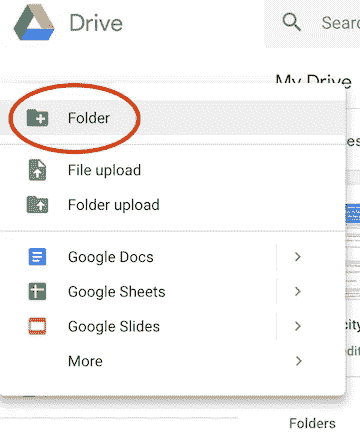

如果你愿意，当你已经在你的 Google Drive 中的时候，你可以创建一个新的 Colab 笔记本。只需点击“新建”，将菜单下拉至“更多”，然后选择“合作实验室”

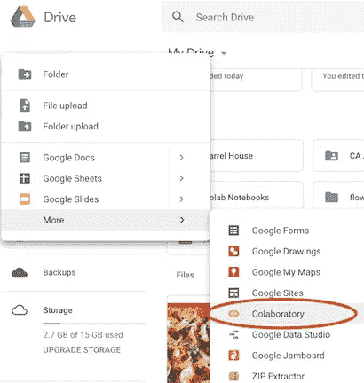

否则，你可以直接去[谷歌实验室](https://colab.research.google.com/)。

## 游戏开始。

您可以通过单击笔记本的名称并更改它，或者通过将“文件”菜单下拉到“重命名”来重命名您的笔记本

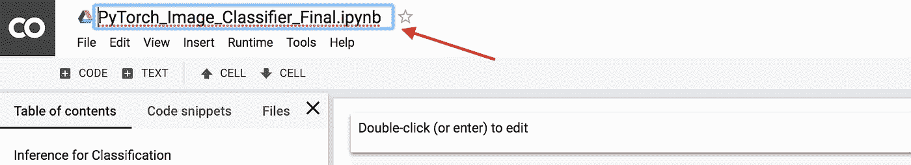

## 设置您的免费 GPU

想用 GPU？就像进入“运行时”下拉菜单，选择“更改运行时类型”，在硬件加速器下拉菜单中选择 GPU 一样简单！

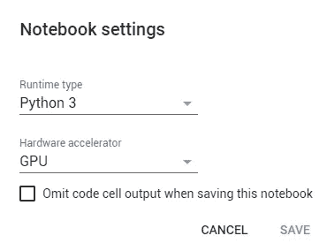

## 获取编码！

如果您愿意，现在就可以轻松地开始运行代码！你可以走了！

## 让它变得更好

想要安装您的 Google Drive 吗？使用:

```
from google.colab import drive
drive.mount('/content/gdrive')
```

然后你会看到一个链接，点击它，允许访问，复制弹出的代码，粘贴到框中，点击回车，你就可以开始了！如果你没有在左边的边框中看到你的驱动器，只需点击“刷新”,它就会显示出来。

(运行单元，单击链接，复制页面上的代码，将其粘贴到框中，按 enter 键，当您成功安装驱动器时，您会看到这一点):

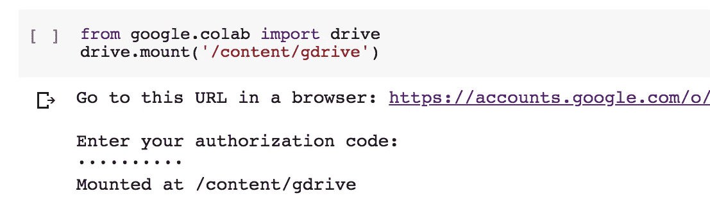

现在，您可以在屏幕的左侧看到您的驱动器！(您可能需要点击“刷新”)此外，您可以通过以下方式随时找到您的驱动器

```
!ls "/content/gdrive/My Drive/"
```

如果您想下载一个共享的 zip 文件链接，您可以使用:

```
!wget 
!unzip
```

例如:

```
!wget -cq [https://s3.amazonaws.com/content.udacity-data.com/courses/nd188/flower_data.zip](https://s3.amazonaws.com/content.udacity-data.com/courses/nd188/flower_data.zip)
!unzip -qq flower_data.zip
```

这将在几秒钟内为您提供 Udacity 的花卉数据集！

如果你上传的是小文件，你可以用一些简单的代码直接上传。然而，如果你愿意，如果你不想运行一些简单的代码来获取一个本地文件，你也可以只去屏幕的左侧，并点击“上传文件”。

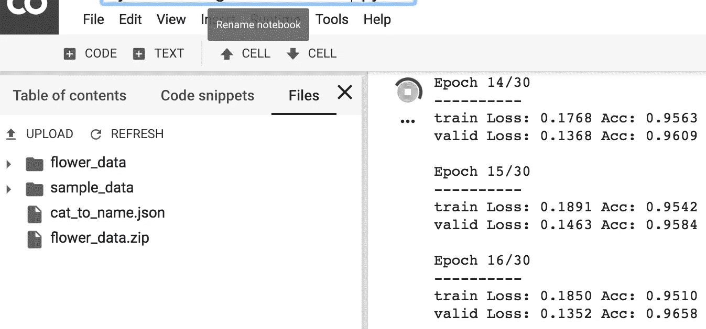

谷歌 Colab 在几乎每个层面上都非常容易使用，尤其是如果你对 Jupyter 笔记本非常熟悉的话。然而，抓取一些大文件并让几个特定的目录工作确实让我犯了一两分钟的错误。

我在另一篇文章中介绍了[开始使用 Google Colab](/setting-up-kaggle-in-google-colab-ebb281b61463) 中的 Kaggle，所以如果你对此感兴趣，请查看一下！

## 导入库

进口是相当标准的，除了少数例外。

在大多数情况下，你可以像在其他笔记本上一样运行`import`来导入你的库。

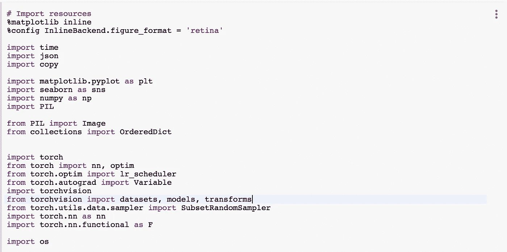

PyTorch 不一样！在运行任何其他 Torch 导入之前，您需要运行

*****更新！(01/29)*** Colab 现在支持原生 PyTorch！！！你不需要运行下面的代码，但是我把它留在这里，以防有人有任何问题！**

```
# [http://pytorch.org/](http://pytorch.org/)
from os.path import exists
from wheel.pep425tags import get_abbr_impl, get_impl_ver, get_abi_tag
platform = '{}{}-{}'.format(get_abbr_impl(), get_impl_ver(), get_abi_tag())
cuda_output = !ldconfig -p|grep cudart.so|sed -e 's/.*\.\([0-9]*\)\.\([0-9]*\)$/cu\1\2/'
accelerator = cuda_output[0] if exists('/dev/nvidia0') else 'cpu'!pip install -q [http://download.pytorch.org/whl/{accelerator}/torch-0.4.1-{platform}-linux_x86_64.whl](http://download.pytorch.org/whl/{accelerator}/torch-0.4.1-{platform}-linux_x86_64.whl) torchvision
import torch
```

然后你可以继续进口。如果你试图简单地运行`import torch`，你会得到一个错误信息。我真的建议点击弹出的非常有用的链接。如果你这样做，你会得到代码的权利，你可以只点击“安装火炬”将其导入到您的笔记本电脑。代码会在你屏幕的左侧弹出，然后点击“插入”

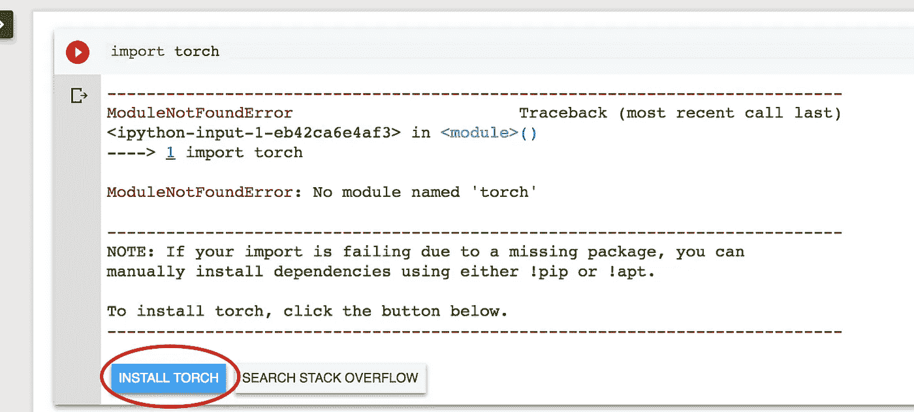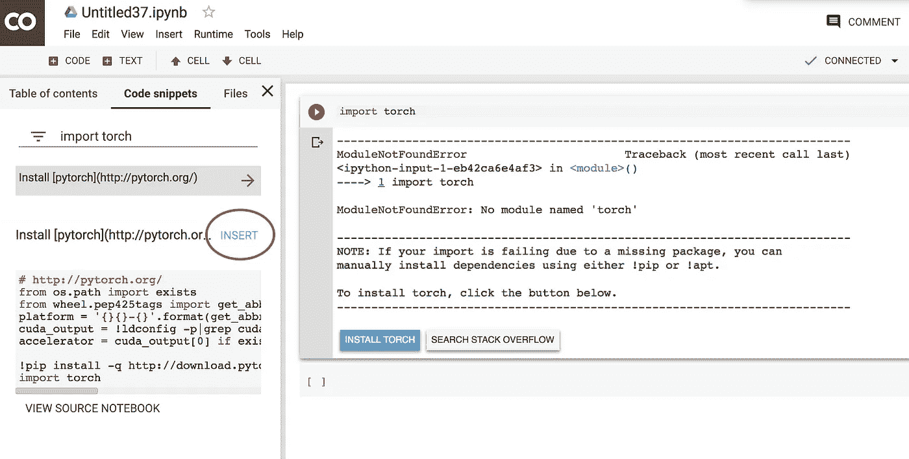

不能用 import 语句简单地导入您想要的其他东西？尝试 pip 安装！请注意，Google Colab 希望在大多数命令前有一个感叹号。

```
!pip install -q keras
import keras
```

或者:

```
!pip3 install torch torchvision
```

并且:

```
!apt-get install
```

也有用！

我确实发现枕头可能有点问题，但是你可以通过跑步来解决

```
import PIL
print(PIL.PILLOW_VERSION)
```

如果你得到低于 5.3 的任何东西，进入“运行时”下拉菜单，重启运行时，并再次运行单元。你应该可以走了！

通过将“文件”拖放到“新 Python 3 笔记本”，可以很容易地创建一个新笔记本。如果你想打开某个特定的东西，把“文件”菜单下拉到“打开笔记本…”

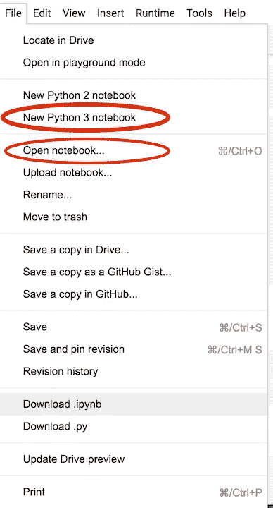

然后你会看到一个类似这样的屏幕:

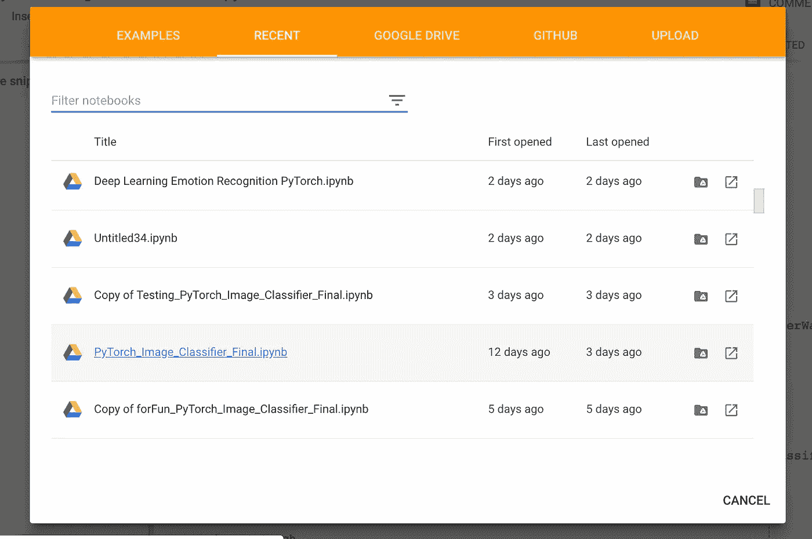

如你所见，你可以打开一个最近的文件，来自你的 Google Drive 的文件，GitHub 文件，你也可以在那里上传一个笔记本。

GitHub 选项很棒！您可以轻松地按组织或用户进行搜索来查找文件。如果您没有看到您要找的内容，请尝试检查存储库下拉菜单！

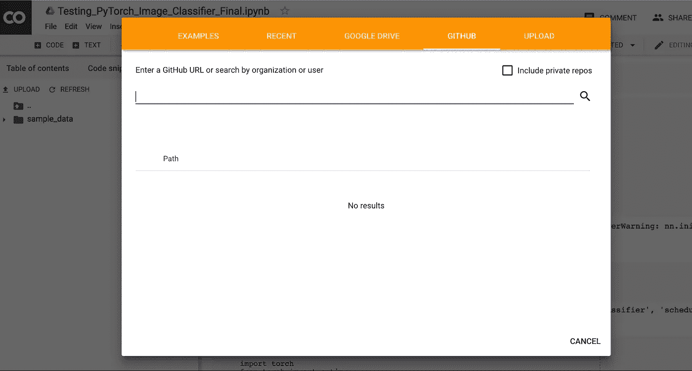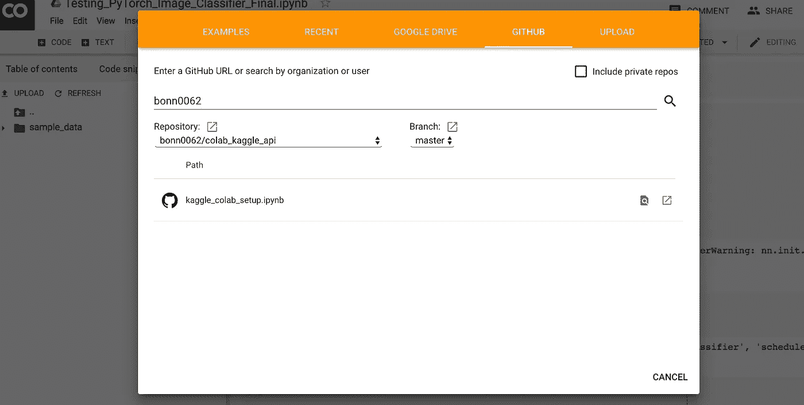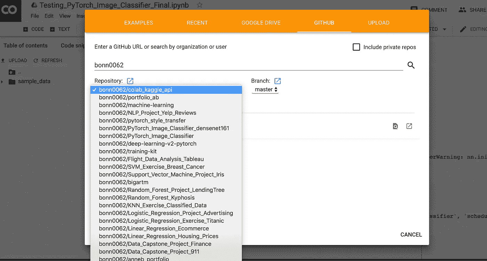

## 永远储蓄

保存您的工作很简单！你可以做好 ol 的“command-s”或者下拉“File”菜单来保存。您可以通过拖放“文件”->“在驱动器中保存副本”来创建笔记本的副本你也可以通过“文件”->“下载”来下载你的工作簿。ipyb”或“下载. py”

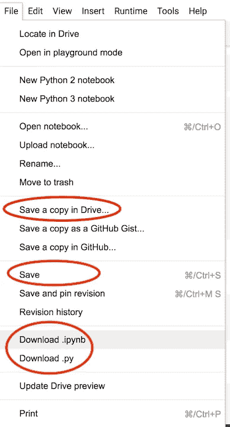

这至少应该足以让您在 Colab 上运行，并利用那个可爱的免费 GPU！请让我知道，如果你遇到任何其他的新手问题，我也许可以帮助你。如果可以的话，我很乐意帮助你！

如果你想接触或找到更多酷的文章，请来和我一起在[内容简约](https://contentsimplicity.com/articles/)！

[](https://contentsimplicity.com/articles/)

如果你是数据科学、机器学习和人工智能的新手，你可能想看看 NumPy 的终极初学者指南！

[](/the-ultimate-beginners-guide-to-numpy-f5a2f99aef54) [## NumPy 初学者终极指南

### 开始使用 NumPy 需要知道的一切

towardsdatascience.com](/the-ultimate-beginners-guide-to-numpy-f5a2f99aef54) 

或者你可能对其中的一个感兴趣！

*   [如何毫不费力地用 GitHub 页面免费创建一个网站(即使你不知道自己在做什么)](/how-to-create-a-free-github-pages-website-53743d7524e1)
*   [数据清理和预处理完全入门指南](/the-complete-beginners-guide-to-data-cleaning-and-preprocessing-2070b7d4c6d)
*   [WTF 是图像分类？](/wtf-is-image-classification-8e78a8235acb)
*   [深度学习简介:为新手和新手征服神经网络](/intro-to-deep-learning-c025efd92535)
*   [如何构建准确率大于 97%的图像分类器](https://medium.freecodecamp.org/how-to-build-the-best-image-classifier-3c72010b3d55)

或者也许你想知道如何让你自己的帖子被注意到！

[](https://medium.com/swlh/how-to-write-and-publish-articles-that-get-noticed-60e9701daed4) [## 如何撰写和发表引人注目的文章

### 创建内容的简单技巧，易于查找，阅读起来令人兴奋

medium.com](https://medium.com/swlh/how-to-write-and-publish-articles-that-get-noticed-60e9701daed4) 

Photo by [Sarah Cervantes](https://unsplash.com/@scaitlin82?utm_source=medium&utm_medium=referral) on [Unsplash](https://unsplash.com?utm_source=medium&utm_medium=referral)

感谢阅读！❤️