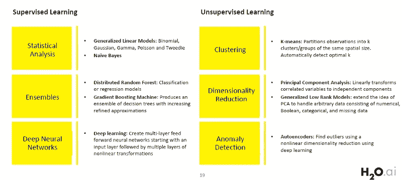
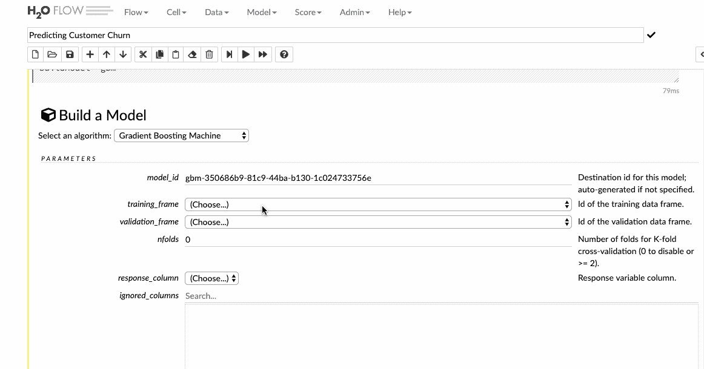

# 使用 Flow 开始使用 H2O

> 原文：<https://towardsdatascience.com/getting-started-with-h2o-using-flow-b560b5d969b8?source=collection_archive---------13----------------------->

## 看看 H2O 的开源 UI，它将代码执行、文本、情节和富媒体结合在一个文档中。

> 数据收集很容易。做决定很难。

今天，我们可以访问海量的数据，这些数据每天都在增加。这主要是由于数据收集能力的激增和存储这些收集的数据的计算能力的增加。然而，收集数据是一回事，理解数据完全是另一回事。从数据中获得洞察力应该是快速和容易的，并且获得的结果应该是容易解释和说明的。H2O 提供了一个单一的平台，通过更快更好的预测建模，使评分和建模成为可能。

[**【H2O】**](https://github.com/h2oai/h2o-3)是一个分布式可扩展机器学习的内存平台*。*顺便说一句，H2O 既是产品的名字，也是产品背后的公司( [H2O.ai](https://www.h2o.ai/) )的名字*。它是完全开源的，使用大家熟悉的接口，比如 R、Python、Scala、Java、JSON，甚至还有一个 web 接口。H2O 的最新版本被称为 H2O-3，它可以与 Spark 和 Hadoop 等多种大数据技术无缝合作。还有，H2O 支持很多常用的机器学习算法，比如 [GBM](https://en.wikipedia.org/wiki/Gradient_boosting) 、[随机森林](https://en.wikipedia.org/wiki/Random_forest)、[深度神经网络](https://en.wikipedia.org/wiki/Deep_neural_networks)、 [Word2Vec](https://en.wikipedia.org/wiki/Word2vec) 、[堆叠集成](https://en.wikipedia.org/wiki/Ensemble_learning)等等。*

High-Level architecture of H2O

> 请随意查看我的文章，标题为 [**与 H2O 一起民主化机器学习**](/democratising-machine-learning-with-h2o-7f2f79e10e3f) ，这篇文章概述了 H2O 及其安装和使用。

# H2O 流

[**H2O 流**](https://github.com/h2oai/h2o-flow) 是 H2O 的独立接口。我们可以使用浏览器指向本地主机，然后直接与 H2O 引擎通信，而不必处理 Python 或 R 或任何其他语言。它是一个很棒的工具，可以通过一个简单的 web 界面，使用 H2O 所有可用的优秀算法快速建立数据模型，无需任何编程。人们可以很容易地运行神经网络，GBM，GLM，K-means，朴素贝叶斯等。只需点击几下。

> Flow 是 H2O 的一个基于网络的界面，是新用户入门和学习 H2O 提供的所有可用功能和算法的好方法。

Flow 可以被认为是用于探索性数据分析和机器学习的[GUI](https://en.wikipedia.org/wiki/Graphical_user_interface)+[+REPL](https://en.wikipedia.org/wiki/Read%E2%80%93eval%E2%80%93print_loop)+讲故事环境的混合体，具有异步、可重写的记录/回放功能。这里有一份关于 H2O 流量的优秀的 [**用户指南**](https://github.com/h2oai/h2o-3/blob/8858aac90dce771f9025b16948b675f92b542715/h2o-docs/src/product/flow/README.md) 供阅读更多相关内容。

## 设置

H2O 在 Java 上运行，这是它工作的先决条件。H2O 使用 Java 7 或更高版本，你可以在 [Java 下载页面](https://www.oracle.com/technetwork/java/javase/downloads/index.html)获得。

从这个[链接](http://h2o-release.s3.amazonaws.com/h2o/rel-yates/5/index.html)下载 H2O，并遵循下面定义的步骤。

Installing H2O

安装运行后，将浏览器指向[*http://localhost:54321*](http://localhost:54321/)*进入流程界面。*

## *连接*

*如果你用过 Jupyter Notebook，Flow 的界面会显得很熟悉。就像在 Jupyter 笔记本里一样，Flow 也有两种单元格模式:**编辑和命令。**访问此[链接](https://github.com/h2oai/h2o-3/blob/8858aac90dce771f9025b16948b675f92b542715/h2o-docs/src/product/flow/README.md#understanding-cell-modes)了解更多关于单元模式的信息。*

**

*Flow Interface*

## *工作*

*Flow 将命令作为一系列可执行单元发送给 H2O。可以对单元格进行修改、重新排列或保存到库中。在 Flow 中，我们可以在文本单元格和可执行单元格之间切换，我们可以键入或让 H2O 生成一个可编程运行并在用户之间共享的 [CoffeeScrip](https://coffeescript.org/#overview) t。要执行单元格，点击`CTRL+ENTER` 或使用工具栏中的`Run` 图标。*

*现在让我们在 Flow UI 中使用 H2O 来处理一个机器学习问题，并仔细看看它的各种功能。*

# *使用 H2O 预测客户流失*

*预测客户流失是客户关系管理(CRM)领域的一个众所周知的问题，也是现代营销策略的一个关键要素。留住客户对组织来说非常重要，我们将看到 H2O 如何通过快速创建预测模型，然后利用这些见解来提高客户忠诚度，从而在数据科学管道中发挥重要作用。*

*使用的数据集属于 [2009 KDD 杯](https://www.kdd.org/kdd-cup/view/kdd-cup-2009)挑战赛。这也可以在流程界面的`Examples > Browse installed packs > examples > KDDCup 2009_Churn.flow` 下访问。或者，使用以下链接分别访问培训和验证数据:*

*   *[训练数据](https://h2o-public-test-data.s3.amazonaws.com/bigdata/laptop/kdd2009/small-churn/kdd_train.csv)*
*   *[验证数据](https://h2o-public-test-data.s3.amazonaws.com/bigdata/laptop/kdd2009/small-churn/kdd_valid.csv)*

*这是我们将用来执行训练和预测的流程管道。*

**

*Machine Learning Pipeline*

## *1.导入/上传数据*

*在自动完成搜索输入字段中输入文件路径，然后按 Enter 键。从搜索结果中选择文件，并点击`Add All` 链接进行确认。我们也可以上传一个本地文件，或者直接提到数据集的 url。*

**

*让我们看看如何将训练数据导入到流接口中。*

**

## *解析数据*

*下一步是解析导入的数据。我们可以选择解析器的类型，但大多数情况下，H2O 会自动为我们找出答案。在解析设置页面中，我们可以选择列名和列类型。对于 **churn** 列，让我们将数据类型从 numeric 改为 **enum** ，它代表分类变量。Churn 列是响应列，因此在模型构建过程中，该列将自动扩展为虚拟变量。*

**

*接下来，当您点击`parse`按钮时，数据被解析并转换成`.hex`格式。*

**

*也可以通过点击相应的列来可视化每个标签数据。让我们想象一下**流失**列及其各种分布。*

**

## *建筑模型*

*在我们继续模型构建过程之前，需要做两件重要的事情:*

*   ***输入缺失数据***

*点击`Data`选项卡下的**估算**选项，选择数据集所选列的估算标准。*

**

*   ***将数据拆分为训练集和测试集。***

*通过指定分割比率来实现分割数据，并相应地创建训练和测试帧。点击**数据**下拉菜单，选择**分割框。***

**

*   ***建立一个 GBM 模型***

*一旦您完成了对数据的探索，您就可以开始构建将投入生产的预测模型。点击`Model`选项卡，Flow 弹出所有可用算法的列表。H2O 支持各种各样的算法，从 GLM 到 GBM 到 AutoML 到深度学习。以下是完整的列表:*

**

*为了这篇文章，我们将构建一个[通用助推机](http://docs.h2o.ai/h2o/latest-stable/h2o-docs/data-science/gbm.html) (GBM)，这是一种前向学习的集成方法。选择数据集和响应列，并将所有其他选项保留为默认值，然后构建模型。*

**

# *查看模型*

*我们还可以查看模型结果，这有助于我们快速判断模型的表现。我们得到了评分历史、ROC 曲线、变量重要性和许多其他相关信息，这些信息对判断我们模型的性能非常有帮助。*

**

## *验证数据的预测*

*在我们构建并调整了模型的参数以获得一些合适的指标之后，我们就可以对我们的验证数据集进行预测了。将验证数据集导入流程界面，并点击**分数>预测**选项卡，进行必要的预测。*

**

# *生产模型*

*数据科学家的最终目标不仅是构建一个健壮的模型，而且是一个可以轻松投入生产的模型。H2O 允许您将您构建的模型转换成一个普通的旧 Java 对象或优化的模型对象。H2O 生成的 MOJO 和 POJO 模型旨在易于嵌入到任何 Java 环境中。因此，如果有一个用于监控客户流失的内部应用程序，我们可以轻松快速地导出一个**普通旧 Java 对象(POJO)** ，并进一步将其传递给开发人员，以将其集成到他们现有的应用程序中。这样，我们的预测模型可以成为我们业务流程的一部分。*

**

# *结论*

***流程**的独特之处在于，用户可以通过点击整个工作流程。然而，这种点击机制还会生成一个 CoffeeScript，可以对其进行编辑和修改，并可以保存为笔记本进行共享。因此，一直以来，我们不会盲目地点击并运行，但我们知道每一个被执行的单元格背后的代码。*

## *关于 H2O 的进一步阅读:*

*   *[H2O 流程文件](http://docs.h2o.ai/h2o/latest-stable/h2o-docs/flow.html)*
*   *[戴伦·库克与 H2O 的实用机器学习](https://www.amazon.in/Practical-Machine-Learning-Darren-Cook/dp/149196460X)*
*   *[Coursera 上 H2O 的实用机器学习](https://www.coursera.org/learn/machine-learning-h2o/home/welcome)*