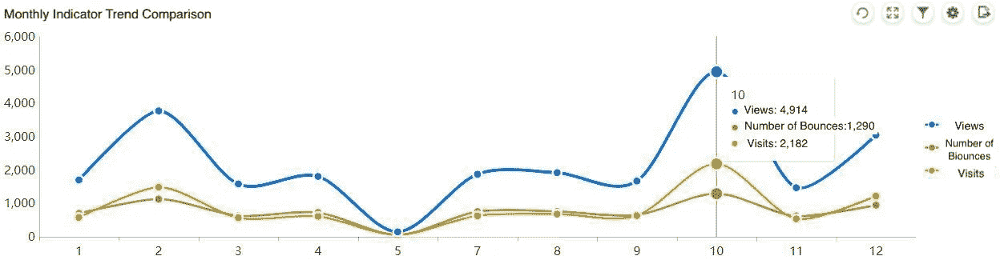

# 互联网数据分析入门:流量分析

> 原文：<https://towardsdatascience.com/getting-started-with-internet-data-analysis-traffic-analysis-594144ba2b52?source=collection_archive---------29----------------------->

[数据分析](/top-6-data-analytics-tools-in-2019-4df815ebf82c)的本质其实就是做数据对比分析。没有数据对比，往往很难用单一指标统计来发挥数据的价值。在本帖中，我将以互联网行业为背景进行数据业务分析，希望分享一些我在流量分析方面的经验。

比如我们计算公司 2018 年 1 月 29 日的同比流量。可以直接对比 2017 年 1 月 29 日的流量吗？仔细看这两个日期，会发现 2018 年 1 月 29 日是星期一，2017 年 1 月 29 日是星期天。对于很多行业的公司来说，非工作日和工作日的数据往往差别很大。这个时候，直接从日期层面去比较它们是没有意义的。选取 2017 年 1 月 30 日周一的流量数据进行对比可能更有价值。

简而言之，在互联网流量数据分析方面，有四种通用的数据分析方法。

*   比较和分析流量模式，调整不同时间段的企业服务和促销活动。
*   对比分析结构和比例，指导目标群体的营销。
*   对比分析异常情况，发现问题及时调整策略。
*   比较和跟踪活动流程的变化，总结活动的经验，以便进行后续有针对性的调整。

接下来，我们使用 [FineReport](http://www.finereport.com/en/product?utm_source=medium&utm_medium=media&utm_campaign=blog&utm_term=07) 创建流量数据分析模板。然后，我们试着对数据做一些比较分析。

# 1.用户视图的每周分布

对于互联网公司来说，流量数据往往与工作周有关。对此，我们可以宏观计算一下周一到周日的平台总流量数据。首先，我们仔细观察工作日和非工作日的数据。我们发现周末的流量高于工作日的流量，这是互联网行业的普遍现象。

Made with FineReport

明确了用户流量的周分布后，我们就有了大致的推广方向。周末的用户群更大，所以相对于工作日，我们可以在周末投入更多的推广活动来引导新用户，维持老用户的活跃度。

然后我们思考下一步:我们如何安排工作日和周末的活动推广时间？

我们可以分析工作日和周末的用户流量趋势，我们在特定时间段进行推广，这样就可以用更低的成本获得更多的用户流入。

我们先来统计一下每个工作日的流量时间分布。我们用 [FineReport](http://www.finereport.com/en/product?utm_source=medium&utm_medium=media&utm_campaign=blog&utm_term=07) 做出如下流量分布图。可以看出，工作日的流量主要集中在每天的 9:00、13:00、20:00。所以在得到用户流量规律后，我们就可以在用户活动高峰期多做产品推广，达到成本最低，吸引流量最多。

Made with FineReport

与工作日不同，周末的交通高峰在 10 点以后开始。针对周末用户流量分布的特点，互联网公司应该延迟推广时间。

Made with FineReport

# 2.推广渠道流量分配

互联网行业的推广渠道主要分为三种:线上渠道、线下渠道、新媒体。比较和分析每个渠道对企业的价值，制定有针对性的营销策略。

Made with FineReport

如上图所示，由于推广渠道是多层次的，我们用 [FineReport](http://www.finereport.com/en/product?utm_source=medium&utm_medium=media&utm_campaign=blog&utm_term=07) 的多层饼状图来统计数据。从下图的数据可以看出，一级渠道的主要战力来自于新媒体营销。如今，像脸书和推特这样的社交媒体拥有广泛的受众和庞大的用户群。公司需要在这些渠道中投入大量的推广费用。

其次，线上渠道的效果也不容忽视。也是做好搜索引擎优化(SEO)的重要一环。相比线上渠道和新媒体营销，线下渠道需要更多的资金、时间、人力成本，受众相对较少，所以这类活动往往是针对核心粉丝而办的。

Made with FineReport

# 3.月度指标趋势对比

在分析月度指标的数据之前，我们先简单介绍一下互联网营销的一些常用指标:

*   页面视图
*   访问
*   唯一访客

我们用以上三个基本指标来衡量流量数据量。此外，平均访问深度(总浏览量/访问量)、平均在站时间(总在站时间/总浏览量)、跳出率(跳出率/访问量)都可以用来衡量流量指标的优劣。

Made with FineReport

分析上图中的流量指标可以发现，10 月份是 2017 年的流量高峰，应该和公司在节假日做的促销活动有关。浏览量、点击量和访问量分别为 4941、1290 和 2182。通过计算我们得到的跳出率为 59.12%，明显低于其他时间段的跳出率。所以可以借鉴 10 月份的促销活动。

Made with FineReport

最后，我们分析用户的访问深度(跳出率=跳出率/访问量)。我们使用 [FineReport](http://www.finereport.com/en/product?utm_source=medium&utm_medium=media&utm_campaign=blog&utm_term=07) 分析企业不同时间段的 VIP 用户、老用户、新用户的统计数据。

总体来看，VIP 用户的访问深度略高于老用户和新用户，但并不太明显，说明 VIP 群体的活跃度还有待提高。同时，老用户的访问深度和新用户几乎一样。公司显然需要在用户活跃度的运营上投入更多。建议结合忠诚度较高的老用户和 VIP 用户，构建平台生态圈。并且可以对老用户和 VIP 用户实行一些优惠政策，比如有针对性的商品折扣，基于用户画像的优惠商品推送等。

好了，以上都是我的一些流量分析经验。我将继续分享互联网运营中的转化、消费和留存技巧。欢迎大家交流互联网数据分析方法。

# 您可能也会对…感兴趣

[开始数据分析师的职业生涯需要学习哪些数据分析工具？](/what-data-analysis-tools-should-i-learn-to-start-a-career-as-a-data-analyst-af650b54c9e9)

[初学者财务报表分析指南](/guide-to-financial-statement-analysis-for-beginners-835d551b8e29)

[4 数据地图在商业分析中的应用](/4-uses-of-data-maps-in-business-analysis-9f9589c3f69a)

*原载于 2019 年 7 月 16 日*[*http://www.finereport.com*](http://www.finereport.com/en/data-analysis/getting-started-with-internet-data-analysis-traffic-analysis.html)*。*