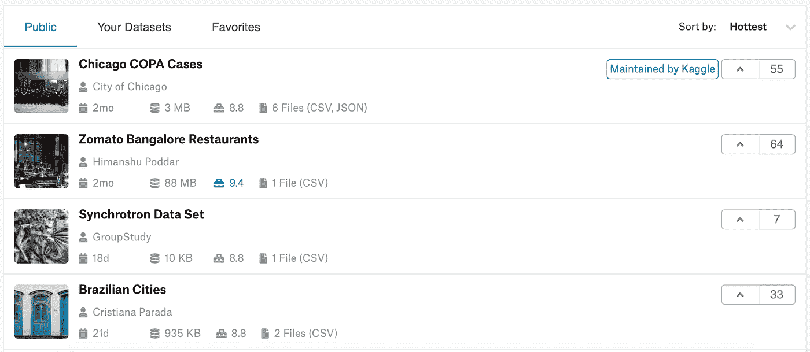
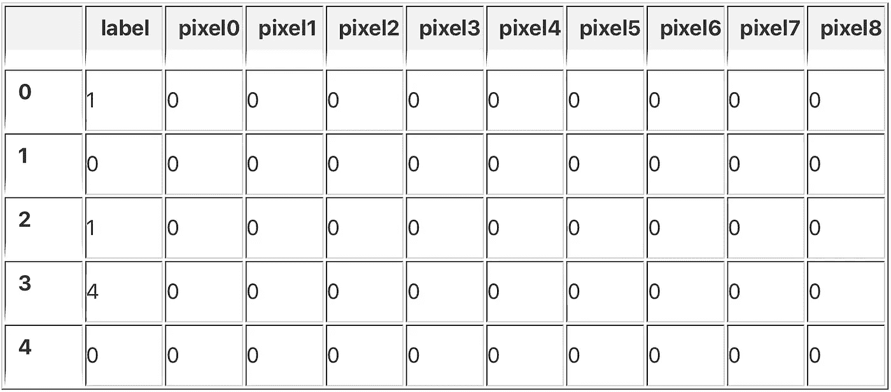

# Kaggle 入门

> 原文：<https://towardsdatascience.com/getting-started-with-kaggle-f9138b35ae18?source=collection_archive---------15----------------------->


# 介绍

[Kaggle](https://www.kaggle.com/) 是一个了不起的社区，让有抱负的数据科学家和机器学习实践者聚集在一起，在竞争环境中解决数据科学相关的问题。许多统计学家和数据科学家在一个友好的社区中竞争，目标是为预测和分析数据集生成最佳模型。任何拥有数据集和需要解决问题的公司都可以从 Kagglers 中受益。Kaggle 不仅为数据科学项目提供了专业的设置，还为新人开发了一个学习和实践数据科学和机器学习技能的环境。

这个博客将作为对 Kaggle 平台的介绍，并简要介绍加入比赛、参与讨论、创建内核和排名的过程。

# Kaggle 级数系统

Kaggle 有一个排名系统，可以帮助数据科学家跟踪他们的进展和表现。奖牌是为完成的某些活动而颁发的。当一个卡格勒获得足够多的勋章在升级系统中上升一级时，他们就会升级！

Kaggle 排名可以来自三个不同的“专业类别”:**竞赛**、**内核**和**讨论**。

三类各有五个等级:**新手**、**贡献者**、**高手**、**高手**、**特级大师**。Kaggle 的大部分用户被认为是“新手”，这实质上意味着他们没有与社区互动，没有运行任何脚本或提交任何比赛。新手级别以上的每个用户都提交过数据，并使用数据集进行预测和分析。


给聪明人一句话，向 Kaggle 上的每个人学习，尤其是那些排名较高的人！Kaggle 取得巨大成功的原因之一是其学习友好的环境和学习新技能的便利性。观看关于数据科学技术的视频教程是一个很好的开始，但是没有什么比通读一位经验丰富的数据科学家的内核和解释，然后在自己的模型中使用您学到的技能更有价值的了。

# 讨论板

讨论板是一个提问、回答问题和与社区互动的好地方。总有一些人贴出我们可以借鉴的伟大问题的答案。还有一个“入门”论坛，供想要学习 Kaggle 平台背后的基础知识的新 ka ggler 们使用。Kaggle 在讨论板中提供了六个独特的论坛，每个论坛都有不同的目的。


# 数据集

你需要任何种类的数据用于 T2 科学项目。Kaggle 在其“数据集”选项卡中提供了大量可用的数据集。截至这篇博客发表时，已经有超过 17，730 个公开的数据集。可以通过多个过滤器对数据集进行排序，以准确找到您要查找的内容。一旦你找到你想要的数据集，你只需点击它，然后点击“下载”将数据下载到你的机器上。



# 开始你的第一场比赛！

在 Kaggle 的“竞赛”标签下，有许多你可以参加的竞赛。这就像“数据集”选项卡，在这里您可以单击竞争对手并为您的模型下载数据。有一些比赛是专为初学者设计的，目的是让他们进入并学习 Kaggle 和数据科学的基础知识。其中一个初学者友好竞赛是著名的 MNSIT 数据集，我们将在其中创建一个模型，该模型将对手写数字进行分类，并根据测试数据进行预测。这篇博文将使用 MNIST 数据集，也将向竞赛提交预测。我们需要做的第一件事是查看我们的数据，并开始考虑建立我们的模型。首先，我们可以启动一个新的**内核**。

# 核心

根据 Kaggle 的文档，内核是云计算环境，支持可重复和协作的分析。内核允许 Kaggler 在浏览器中创建和运行代码，而不需要在他们的机器上下载 Python 和包。Kaggle 提供的一种内核是笔记本。如果你熟悉 Jupyter 笔记本，那么你熟悉 Kaggle 的笔记本，因为它们是一回事！

我们需要创建我们的内核，为此，我们可以点击“创建内核”并选择“笔记本”选项，在 Jupyter 笔记本中进行分析。笔记本打开后，你会注意到一些预先写好的代码，称为“启动代码”。Starter 代码将导入一些公共库，并将打印数据文件夹中的目录。对于这个博客，我们将删除起始代码，自己编写我们的导入。在第一个笔记本单元格中，我们将为我们的项目编写所有必要的导入，并将打印出我们下载的“digit_data”文件夹中的所有内容。

```
import matplotlib.pyplot **as** plt
import seaborn **as** sns
import numpy **as** np
import pandas **as** pd
import os**print**(os**.**listdir('digit_data'))
```

输出:

```
['test.csv', 'train.csv', 'sample_submission.csv']
```

下一步包括将我们的数据加载到笔记本中。请注意，我们的数据文件夹为我们提供了一个训练和测试文件。我们可以使用 pandas，一个数据分析 Python 库，将 CSV 文件读入我们的训练和测试数据帧。

```
train **=** pd**.**read_csv('digit_data/train.csv')
test **=** pd**.**read_csv('digit_data/test.csv')
```

一旦我们加载了我们的数据，我们将想要了解数据是什么。为了对我们的数据集中的内容有一个简要的概述，我们可以使用 panda 的`.head()`方法来打印出我们的数据集的头，或者顶部。我们可以将显示的行数设置为 5。

```
train**.**head(5)
```



5 rows × 785 columns

我们必须对训练数据做的第一件事是将它分成输入，或 X(特征)和输出(y)。通过查看我们的数据，我们可以看到输出(y)是“标签”列。这意味着我们的 X 数据将是除“标签”列之外的每一列，而 y 数据将只是“标签”列。要分开它们，我们可以使用 pandas 的`.drop()`方法，并给出我们想要删除的列的名称。为了让熊猫知道我们想要删除一个列，我们将“axis”设置为 1。

在分割我们的训练数据后，我们可以打印出目前为止所有东西的形状。在打印形状之后，我们还可以打印测试和训练数据中的样本。训练数据的形状将会是(42000，784)。这意味着有 42000 行，784 列。每行代表数据中的一个数字。每列代表图像的一个像素值。我们在 MNIST 数据集中的图像应该具有 28x28 (28 x 28 = 784)的形状。每个图像被展平成一行。

```
x_train **=** train**.**drop('label', axis**=**1)
y_train **=** train['label']**.**astype('int32')**print**('x_train shape: ', x_train**.**shape)
**print**('y_train shape: ', y_train**.**shape)
**print**('test shape: ', test**.**shape)
**print**('\nsamples in test: ', test**.**shape[0])
**print**('samples in train: ', x_train**.**shape[0])
```

输出:

```
x_train shape:  (42000, 784)
y_train shape:  (42000,)
test shape:  (28000, 784)samples in test:  28000
samples in train:  42000
```

让我们找出每个数字有多少个样本。据我们所知，我们的数据可能是不平衡的，一些数字可能比其他数字显示得更多。这可能会妨碍我们的训练！为了检查我们训练的每个数字有多少个样本，我们可以再次使用 pandas 并在 y 训练集上使用`value_counts()`方法。

```
**print**('Number of Examples Per Digit:\n', y_train**.**value_counts())
```

输出:

```
Number of Examples Per Digit:
1    4684
7    4401
3    4351
9    4188
2    4177
6    4137
0    4132
4    4072
8    4063
5    3795
Name: label, dtype: int64
```

另一个令人惊叹的高级 Python 库是 Seaborn，它在数据科学中被大量用于可视化。Seaborn 是一个数据可视化库，它在很大程度上基于 matplotlib，但众所周知它可以制作更有吸引力的图形。由于我们喜欢吸引力，我们将与 Seaborn 合作，可视化我们在训练集中有多少每个数字的样本。在可视化了数据中的平衡并使用 pandas 查看了样本的准确数量后，我们可以自信地说我们的数据非常平衡，没有数字被过度表示。

```
sns**.**countplot(y_train)
```


MNIST 数据集中的每个手写数字都包含 RGB 值在 0–255 之间的像素。为了标准化这个范围的值，我们可以将每个像素值除以 255。这将使每个像素值更接近(在 0-1 范围内)，并使我们的神经网络更容易学习。例如，RGB 值 56 将变成. 219，RGB 值 230 将变成. 901。

然后，我们可以对 x_train 和测试集中的值进行整形。我们希望对它们进行整形，首先是样本数，然后如前所述，每个数字的尺寸为(28x28x1)或 28 行、28 列和 1 个颜色通道，因为图像没有颜色。

```
x_train **/=** 255.0
test **/=** 255.0x_train **=** x_train**.**values**.**reshape(x_train**.**shape[0], 28, 28, 1)
test **=** test**.**values**.**reshape(test**.**shape[0], 28, 28, 1)
```

现在我们可以打印训练和测试数据的最终形状。

```
**print**('x_train shape: ', x_train**.**shape)
**print**('y_train shape: ', y_train**.**shape)
**print**('test shape: ', test**.**shape)
```

输出:

```
x_train shape:  (42000, 28, 28, 1)
y_train shape:  (42000,)
test shape:  (28000, 28, 28, 1)
```

要查看 MNIST 数据集包含的内容，我们可以使用 matplotlib 中的 pyplot 并显示八幅图像。图像将来自训练集(x_train ),在每个图像之上，我们可以将子情节标题设置为相应的输出(y_train)。

```
plt**.**figure(figsize**=**(12,10))**for** img **in** range(10):
    plt**.**subplot(5, 5, img**+**1)
    plt**.**imshow(x_train[img]**.**reshape((28, 28)), cmap**=**'binary_r')
    plt**.**axis('off')
    plt**.**title('Label: ' **+** y_train[img]**.**astype('str'))plt**.**show()
```


现在我们可以开始创建我们的模型了。为了对每个数字进行分类，我们将使用卷积神经网络。幸运的是，Keras 是一个高级 Python 神经网络库，提供了一个简单快捷的资源来建立深度学习模型。我们将不得不导入 Keras，顺序模型和在 CNN 中使用的必要层。

```
import keras
from keras.models import Sequential
from keras.layers import Dense, Dropout, Flatten, Conv2D, MaxPooling2D
from keras.utils import to_categoricalfrom sklearn.model_selection import train_test_split
```

我们可以使用 Keras' `to_categorical()`函数将我们的类向量转换成一个二进制类矩阵。我们在 y_train 的班级被标注为 1，2，3，4 等。`to_categorical()`将创建一个列数与类别数相同的矩阵，其中 1 表示“是”，0 表示“否”。Keras 的文档给出了一个直观的例子。你可以在这里查看 Keras 的文件[或者看下面的例子:](https://keras.io/utils/#to_categorical)

```
# Consider an array of 5 labels out of a set of 3 classes {0, 1, 2}:
> labels
array([0, 2, 1, 2, 0])
# `to_categorical` converts this into a matrix with as many
# columns as there are classes. The number of rows
# stays the same.
> to_categorical(labels)
array([[ 1.,  0.,  0.],
       [ 0.,  0.,  1.],
       [ 0.,  1.,  0.],
       [ 0.,  0.,  1.],
       [ 1.,  0.,  0.]], dtype=float32)
```

一旦完成，我们的数据就可以进行训练了！我们可以将数据分成训练集和测试集，然后开始训练我们的模型。

```
y_train **=** to_categorical(y_train, 10)
x_train, x_test, y_train, y_test **=** train_test_split(x_train, y_train, test_size **=** 0.1, random_state**=**1)
```

现在，我们可以创建我们的 CNN 模型，这多亏了 Keras，非常容易。我们将需要使用二维卷积层、最大池层和密集层，它们是完全连接的层。我们也将使用 dropout 和 flatten。展平我们的数据从卷积层和池层获得结果矩阵，并将其“展平”成一个长的输入数据向量(列)。我们的输出层将使用带有 10 个输出节点的 softmax 激活函数(数据中的类的数量)。

```
model **=** Sequential()
model**.**add(Conv2D(32, kernel_size**=**(3, 3), activation**=**'relu', input_shape**=**(28,28,1)))
model**.**add(Conv2D(64, (3, 3), activation**=**'relu'))model**.**add(MaxPooling2D(pool_size**=**(2, 2)))model**.**add(Dropout(0.25))model**.**add(Conv2D(64, (3, 3), activation**=**'relu'))
model**.**add(Conv2D(128, (3, 3), activation**=**'relu'))model**.**add(Dropout(0.25))model**.**add(Flatten())
model**.**add(Dense(128, activation**=**'relu'))
model**.**add(Dropout(0.5))
model**.**add(Dense(10, activation**=**'softmax'))
```

在我们训练模型之前，我们必须首先定义损失函数、优化器以及评估模型的指标。

```
model**.**compile(loss**=**'categorical_crossentropy', optimizer**=**'Adadelta', metrics**=**['accuracy'])
```

现在我们终于可以训练我们的模型了！我们将给`.fit()`函数我们的训练数据，并让它运行 12 个时期或迭代。

```
model**.**fit(x_train, y_train, batch_size**=**128, epochs**=**12, verbose**=**1,
          validation_data**=**(x_test, y_test))
```

输出:

```
Train on 37800 samples, validate on 4200 samples
Epoch 1/12
37800/37800 [==============================] - 144s 4ms/step - loss: 0.3357 - acc: 0.8946 - val_loss: 0.1302 - val_acc: 0.9610
Epoch 2/12
37800/37800 [==============================] - 154s 4ms/step - loss: 0.0894 - acc: 0.9738 - val_loss: 0.0518 - val_acc: 0.9848
Epoch 3/12
37800/37800 [==============================] - 145s 4ms/step - loss: 0.0623 - acc: 0.9818 - val_loss: 0.0398 - val_acc: 0.9879
Epoch 4/12
37800/37800 [==============================] - 142s 4ms/step - loss: 0.0481 - acc: 0.9858 - val_loss: 0.0426 - val_acc: 0.9860
Epoch 5/12
37800/37800 [==============================] - 145s 4ms/step - loss: 0.0398 - acc: 0.9872 - val_loss: 0.0358 - val_acc: 0.9898
Epoch 6/12
37800/37800 [==============================] - 134s 4ms/step - loss: 0.0350 - acc: 0.9891 - val_loss: 0.0305 - val_acc: 0.9907
Epoch 7/12
37800/37800 [==============================] - 144s 4ms/step - loss: 0.0302 - acc: 0.9911 - val_loss: 0.0275 - val_acc: 0.9917
Epoch 8/12
37800/37800 [==============================] - 133s 4ms/step - loss: 0.0269 - acc: 0.9918 - val_loss: 0.0292 - val_acc: 0.9910
Epoch 9/12
37800/37800 [==============================] - 140s 4ms/step - loss: 0.0225 - acc: 0.9929 - val_loss: 0.0400 - val_acc: 0.9886
Epoch 10/12
37800/37800 [==============================] - 132s 3ms/step - loss: 0.0215 - acc: 0.9933 - val_loss: 0.0330 - val_acc: 0.9914
Epoch 11/12
37800/37800 [==============================] - 133s 4ms/step - loss: 0.0191 - acc: 0.9938 - val_loss: 0.0304 - val_acc: 0.9910
Epoch 12/12
37800/37800 [==============================] - 155s 4ms/step - loss: 0.0183 - acc: 0.9943 - val_loss: 0.0314 - val_acc: 0.9921<keras.callbacks.History at 0x1a30906ac8>
```

看起来我们的模特干得不错！我们可以对模型进行评估，并获得训练集和测试集的损失和准确性。一旦我们收到损失和准确性，我们可以打印出来，并四舍五入为简单。

```
loss, accuracy **=** model**.**evaluate(x_test, y_test, verbose**=**0)
train_stat **=** model**.**evaluate(x_train, y_train, verbose**=**0)**print**('Train Loss:     ', round(train_stat[0], 5))
**print**('Train Accuracy: ', round(train_stat[1]*****100, 4), '%')
**print**('Test Loss:      ', round(loss, 5))
**print**('Test Accuracy:  ', round(accuracy*****100, 4), '%')
```

输出:

```
Train Loss:      0.00551
Train Accuracy:  99.8413 %
Test Loss:       0.03136
Test Accuracy:   99.2143 %
```

由于我们的模型经过了训练，并且已经证明相当准确，我们可以开始进行预测。我们将使用 Keras' `.predict()`方法来预测 x_test 数据中每个数字的输出。

```
predictions **=** model**.**predict(x_test)
```

因为我们正在 Kaggle 中为一个比赛创建一个内核，我们将需要创建一个新的包含我们预测的 CSV 文件。这个文件将是我们提交给比赛，一旦它被创建，我们就完成了比赛！

```
results **=** np**.**argmax(predictions, axis **=** 1)results **=** pd**.**Series(results, name**=**"Label")submission **=** pd**.**concat([pd**.**Series(range(1,28001),name **=** "ImageId"),results],axis **=** 1)submission**.**to_csv("submission.csv", index**=**False)
```

Kaggler 提供了一个很好的平台来学习和应用你所获得的知识和技能到真实的比赛和数据集中。有大量的数据集可供选择，每场比赛都有一个非常友好的社区来帮助你。我会推荐报名 Kaggle，试试看！