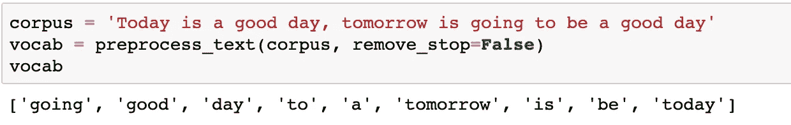
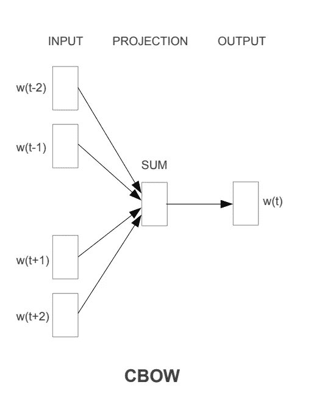
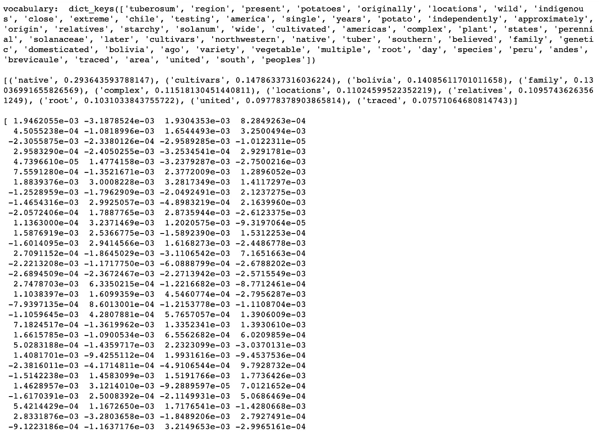
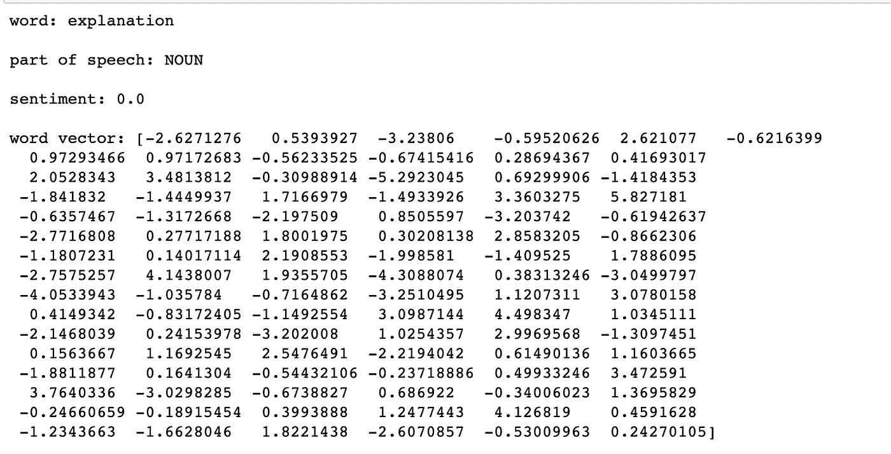
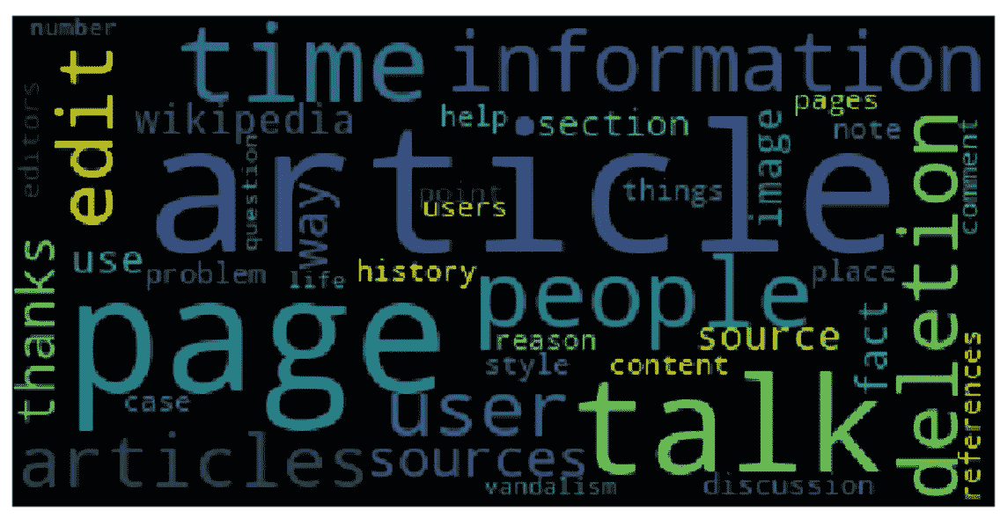
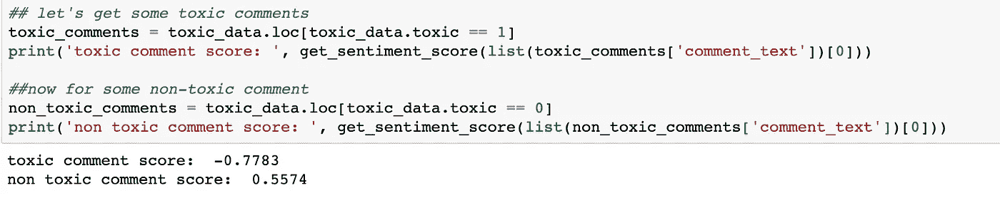

# 自然语言处理(NLP)入门—预处理、单词嵌入、文本分类等等！

> 原文：<https://towardsdatascience.com/getting-started-with-natural-language-processing-nlp-2c482420cc05?source=collection_archive---------8----------------------->

## 使用简单的 Python 库


[source](https://deeplearninganalytics.org/natural-language-processing-machine-learning-why-deep-learning-is-perfect-for-nlp/)

如今自然语言处理领域发生了太多的事情(GRUs、LSTMs、XLNet、BERT 等等！).弄清楚从哪里开始可能会令人困惑。本文讨论了自然语言处理的基础知识，包括数据清理、规范化、编码、情感分析和一个简单的文本分类器，它使用了基本而强大的 Python 库。这往往是潜入复杂的深度学习模型之前的第一步。

# 数据清理和规范化

根据问题的性质，这一步可能需要，也可能不需要。如果我们的模型试图最大程度地学习语言，那么最好使用其原始格式的数据，事实上，现代深度学习技术建议不要删除停用词、表情符号或小写字母，因为它们提供了额外的上下文。然而，如果你试图基于某些单词的出现进行趋势分析或分类(就像在一个[单词袋](https://en.wikipedia.org/wiki/Bag-of-words_model)模型中)，这有助于执行这个步骤。这里我想强调几个常见的预处理步骤:

1.  **去除标点**:在尝试训练一个机器学习模型时，通过去除标点有助于减少过拟合(比如！、*等。).但是，注意不要去掉一些重要的东西，比如问号(？)有助于认识问题。
2.  **移除表情符号:**有时人们会将表情符号附加在不带空格的单词上(例如:you❤)，这样就很难理解这些单词。移除表情符号有助于解决这种情况。同样，在删除这些表情符号时要小心，因为表情符号实际上可能对情感分析和主题分类等任务非常有用。
3.  **删除停用词:**对于数据探索和趋势分析这样的任务，看到“the”、“and”、“of”等常用词可能不是很有用。这个`sklearn`包实际上有一个[常用英语停用词的集合](https://github.com/scikit-learn/scikit-learn/blob/master/sklearn/feature_extraction/_stop_words.py)，我们可以用它来移除这些停用词。
4.  **使所有文本小写:**这是规范化文本最简单的方法。(毕竟，`BeTTer`和`better`确实有相同的语义含义)
5.  **词干化:**另一种规范化的方法是用词根形式替换派生的词(例如:‘posting’，‘posted’，‘posts’都用‘post’替换)。为了阻止单词，我们使用由`nltk.`提供的`[PorterStemmer](https://tartarus.org/martin/PorterStemmer/)` util
6.  **提取/移除标签和提及:**标签和提及对于识别数据趋势非常有用。这有助于将它们从你的文本中提取出来，并分别进行分析。

这里有一个简单的函数来执行上述任务:

# 词汇向量——它们是什么？

机器学习算法只能处理固定长度的数字输入，也就是说，它们不能接受字符串输入来处理文本数据！这就是单词向量的用武之地，我们用固定长度的向量来表示每个单词。然后使用单个单词向量对句子进行编码。

## **一键编码:**

这是最简单的单词编码方式。它假设一个单词包表示法，其中每个单词被视为一个独立的实体，单词关系被忽略(例如，`job`和`occupation`被视为完全独立的单词，尽管它们实际上具有相同的含义)。该方法包括从整个语料库中创建不同单词的词汇表，该词汇表的长度是每个单词向量的长度。每个向量在单词向量中都有一个指定的索引，该索引被标记为`1`，而其他的被标记为`0`以表示特定的单词。

**例如:**



这里的词汇表由 9 个不同的单词组成，这些单词可以被编码成长度为 9 的向量。单词向量表示有`going`:【1，0，0，0，0，0，0，0】`good`:【0，1，0，0，0，0，0，0，0】等等..

使用这种表示，文本`Tomorrow will be a good day`可以编码成:[0，1，1，0，1，1，0，1，0]。注意单词`will`是如何被忽略的，因为它根本不存在于词汇表中。拥有一个好的和广泛的词汇是使这个模型工作良好的必要条件。还要注意单词关系(出现的顺序，语义关系)在这个表示中是如何被完全忽略的。

## Word2Vec 单词嵌入:

这种单词编码方法(通常称为**单词嵌入**)考虑了上下文。例如，我们可以预期单词`king`和`royal`比`parrot` 和`honey`具有更小的空间距离。Word2vec 使用浅层两层神经网络来执行特定任务(基于所使用的方法)，并为每个单词学习隐藏层的权重。这些学习的隐藏层权重被用作我们的最终单词向量。可以阅读[原文](https://arxiv.org/pdf/1301.3781.pdf)深入了解这些词向量是如何获得的。但是在高层次上，这是使用 Word2Vec 获得基于上下文的单词向量的两种常用方法:

**CBOW(连续字袋):**



source : [https://arxiv.org/pdf/1301.3781.pdf](https://arxiv.org/pdf/1301.3781.pdf)

CBOW 模型架构试图基于源上下文单词(周围单词)来预测当前目标单词(中心单词)。

**Skip — Gram 模型:**


source: [https://arxiv.org/pdf/1301.3781.pdf](https://arxiv.org/pdf/1301.3781.pdf)

Skip-gram 模型体系结构试图实现与 CBOW 模型相反的功能。它试图在给定目标单词(中心单词)的情况下预测源上下文单词(周围的单词)。

在这两种情况下，窗口大小(每边考虑的周围单词的数量)都是一个超参数。

## 手套:

Glove 与 Word2vec 非常相似，但与 Word2vec 不同，Glove 利用了单词的全局共现，而不仅仅是局部上下文，这使得它在某些方面更加强大。还是那句话，通读[原文](https://nlp.stanford.edu/pubs/glove.pdf)可以更好的理解。

# 单词嵌入——我如何使用它们？

既然我们对什么是单词嵌入以及为什么它们有用有了一个大致的概念，那么让我们来谈谈如何利用它们。

## **使用预先训练的单词向量:**

有许多公开可用的不同向量长度的预训练词向量，如 [Glove](https://nlp.stanford.edu/projects/glove/) 、 [fasttext](https://fasttext.cc/docs/en/english-vectors.html) 等。这些已经在大规模语料库(维基百科，twitter 和常见的爬行数据集)上进行训练，可以下载并用于在我们的语料库中编码单词。

**示例:使用词向量相似度找到与给定文档最相似的文档**

问题陈述:

给定一组属于不同主题的文档(训练集)，当给定一个新文档时，我们能从原始集中找到与之最相似的文档吗？

方法:

1.  将预先训练好的单词向量文件加载到字典中，以单词为键，以其向量表示为值。
2.  通过对特定文档中存在的单词的单词向量进行平均，找到训练集中每个文档的质心向量(忽略不属于词汇表的单词)
3.  找到新文档的质心，从训练集中挑选其质心最接近新文档质心的文档(使用合适的相似性度量，如欧几里德距离、余弦相似性等。)

代码:

以下是一些辅助函数加载手套字典，找到质心，并找到质心之间的距离:

## 从头开始生成单词向量的训练:

如果您想为您的特定语料库找到单词向量，您可以使用`gensim`包进行训练。

**举例:**

代码:

输出:



在上面的例子中，我刚刚使用了来自维基百科页面的两行文字。训练非常快速和简单，所有你需要输入的是单词列表、你需要的单词向量的大小、窗口大小(要考虑的周围单词的数量)以及要被认为是词汇表的一部分的单词的最小出现次数。检查词汇、获取向量以及查看语料库中最常见的单词都很容易。当然，从头开始训练可能不会总是产生与预训练一样好的结果，但它对于涉及看起来与预训练中使用的数据集非常不同的数据的问题是有益的。

# 数据探索

带有文本数据的 EDA 不像表格或数字数据那样简单。然而，有一些库可以使这些任务变得更容易。在本文的其余部分，我使用了来自 Kaggle 的以下数据集:

[](https://www.kaggle.com/c/jigsaw-toxic-comment-classification-challenge/data) [## 有毒评论分类挑战

### 识别和分类有毒的在线评论

www.kaggle.com](https://www.kaggle.com/c/jigsaw-toxic-comment-classification-challenge/data) 

## 使用空间探索:

Spacy 是一个非常强大的 NLP 库，有多种用途。它可以用于命名实体识别，识别一个词所属的词性，甚至给出词的向量和情感。

代码:

输出:



来自`spacy`的`nlp`函数将每个单词转换成一个具有各种属性的令牌，就像上面例子中提到的那样。

## Wordcloud:

单词云是一种简单而有趣的方式，可以直观地显示各种单词在我们的语料库中出现的频率。让我们以评论数据中出现频率最高的名词为例:

代码:

输出:



article, talk, and page are the most frequently occurring nouns

# 情感分析

在自然语言处理中，一个非常常见的任务是识别一个特定的评论或一段文本是积极的还是消极的。`vaderSentiment`包提供了一种快速简单的方法来实现这一点:

代码:

```
from vaderSentiment.vaderSentiment import SentimentIntensityAnalyzer
sentiment_analyzer = SentimentIntensityAnalyzer()def get_sentiment_score(text):
    return sentiment_analyzer.polarity_scores(text)['compound']
```

输出:



The sentiment score for a toxic comment seems to be close to -1 whereas a non-toxic one has a score greater than 0 as expected

# 文本分类

对于分类，我用过的最简单的库之一是`fasttext`。它由脸书于 2016 年发布，使用了这种线性技术，既可以将单词向量组合成代表文本的向量，也可以计算分类标准。它只需要很少的时间训练，并给出了最常见的文本分类问题体面的结果。它可以用来提出一个基线模型。你可以阅读[原文](https://arxiv.org/pdf/1607.01759.pdf)来更好的理解`fasttext`分类器背后的机制。

这是我如何使用`[fasttext](https://fasttext.cc/docs/en/supervised-tutorial.html)`来分类有毒和无毒评论:

[](https://jovian.ml/aakanksha-ns/toxic-comments) [## 有毒评论分类器

使用 jovian.ml 共享](https://jovian.ml/aakanksha-ns/toxic-comments) 

我们已经触及了大部分基础知识，但是当然，NLP 还有很多内容。然而，这篇文章是一个很好的起点，希望对初学者有所帮助，因为这些是我刚开始时学到的第一件事！