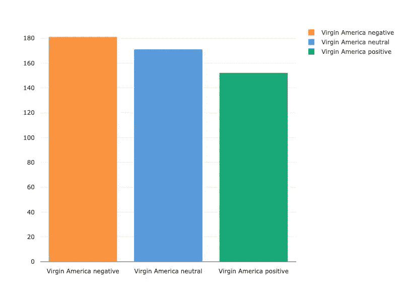

# 自然语言处理入门:美国航空公司情感分析

> 原文：<https://towardsdatascience.com/getting-started-with-natural-language-processing-us-airline-sentiment-analysis-24f9d8f7500d?source=collection_archive---------19----------------------->


# 部分

1.  自然语言处理简介
2.  数据集探索
3.  自然语言处理
4.  培养
5.  超参数优化
6.  未来学习的资源

# 自然语言处理简介

自然语言处理(NLP)是机器学习的一个子领域，涉及处理和分析自然语言数据，通常以文本或音频的形式。NLP 中的一些常见挑战包括语音识别、文本生成和情感分析，而一些部署 NLP 模型的高调产品包括苹果的 Siri、亚马逊的 Alexa 和许多可能会在线互动的聊天机器人。

为了开始学习 NLP 并介绍该领域的一些核心概念，我们将使用流行的 [Twitter 美国航空公司情绪数据集](https://www.kaggle.com/crowdflower/twitter-airline-sentiment)建立一个模型，试图预测与美国航空公司相关的推文的情绪(积极、中立或消极)。

代码片段将包含在这篇文章中，但是对于完全可复制的笔记本和脚本，请在其 Comet project [页面](https://www.comet.ml/demo/nlp-airline/files)上查看与该项目相关的所有笔记本和脚本。

# 数据集探索

让我们从导入一些库开始。确保安装[慧星](http://comet.ml/)用于实验管理、可视化、代码跟踪和超参数优化。

```
# Comet
from comet_ml import Experiment
```

几个标准包:pandas，numpy，matplotlib 等。

```
# Standard packages
import os
import pickle
import numpy as np
import pandas as pd
import matplotlib.pyplot as plt
```

[Nltk](https://www.nltk.org/) 用于自然语言处理功能:

```
# nltk
import nltk
from nltk.tokenize import sent_tokenize, word_tokenize
from nltk.corpus import stopwords
from nltk.stem.snowball import SnowballStemmer
```

[机器学习模型的 Sklearn](https://scikit-learn.org/stable/) 和 [keras](https://keras.io/) :

```
# sklearn for preprocessing and machine learning modelsfrom sklearn.model_selection import train_test_split
from sklearn.ensemble import GradientBoostingClassifier
from sklearn.metrics import accuracy_score
from sklearn.utils import shuffle
from sklearn.preprocessing import OneHotEncoder
from sklearn.feature_extraction.text import TfidfVectorizer# Keras for neural networks
from keras.models import Sequential
from keras.layers import Dense, Dropout, BatchNormalization, Flatten
from keras.layers.embeddings import Embedding
from keras.preprocessing import sequence
from keras.utils import to_categorical
from keras.callbacks import EarlyStopping
```

现在我们将加载数据:

```
raw_df = pd.read_csv('twitter-airline-sentiment/Tweets.csv')
```

让我们检查数据帧的形状:

```
raw_df.shape()
>>> (14640, 15)
```

所以我们有 14640 个样本(推文)，每个样本有 15 个特征。让我们来看看这个数据集包含哪些要素。

```
raw_df.columns
```

`'tweet_id'`、`'airline_sentiment'`、`'airline_sentiment_confidence'`、`'negativereason'`、`'negativereason_confidence'`、`'airline'`、`'airline_sentiment_gold'`、`'name'`、`'negativereason_gold'`、`'retweet_count'`、`'text'`、`'tweet_coord'`、`'tweet_created'`、`'tweet_location'`、`'user_timezone'`

让我们也来看看每个航空公司的航空公司情绪(代码可以在[彗星](https://www.comet.ml/demo/nlp-airline/99bcfee71c74405c84d2da1766ee4374?experiment-tab=code)上找到):

```
# Create a Comet experiment to start tracking our workexperiment = Experiment(
    api_key='<HIDDEN>', 
    project_name='nlp-airline', 
    workspace='demo')experiment.add_tag('plotting')airlines= ['US Airways', 
           'United', 
           'American', 
           'Southwest', 
           'Delta', 
           'Virgin America']**for** i **in** airlines: indices = airlines.index(i)
     new_df=raw_df[raw_df['airline']==i]
     count=new_df['airline_sentiment'].value_counts()
     experiment.log_metric('{} negative'.format(i), count[0])
     experiment.log_metric('{} neutral'.format(i), count[1])
     experiment.log_metric('{} positive'.format(i), count[2])
experiment.end()
```



每家航空公司的负面推文都比中性或正面推文多，维珍美国航空公司在所有美国航空公司中获得了最平衡的正面、中性和负面传播。虽然在这篇文章中我们将重点放在特定于 NLP 的分析上，但是也有更深入的特性工程和探索性数据分析的极好来源。Kaggle 内核[这里的](https://www.kaggle.com/parthsharma5795/comprehensive-twitter-airline-sentiment-analysis)和[这里的](https://www.kaggle.com/mrisdal/exploring-audience-text-length)在分析与情绪相关的受众和推文长度等特征时特别有指导意义。

让我们创建一个只有`tweet_id`、`text`和`airline_sentiment`特性的新数据帧。

```
df = raw_df[['tweet_id', 'text', 'airline_sentiment']]
```

现在让我们来看看一些推文本身。数据是什么样的？

```
df['text'][1]> "[@VirginAmerica](http://twitter.com/VirginAmerica) plus you've added commercials to the experience... tacky."df['text'][750]> "[@united](http://twitter.com/united) you are offering us 8 rooms for 32 people #FAIL"df['text'][5800]> "[@SouthwestAir](http://twitter.com/SouthwestAir) Your #Android Wi-Fi experience is terrible! $8 is a ripoff! I can't get to [@NASCAR](http://twitter.com/NASCAR) or MRN for [@DISupdates](http://twitter.com/DISupdates) #BudweiserDuels"
```

接下来，我们将执行一些标准的 NLP 预处理技术，为训练准备好数据集。

# 自然语言处理

为了构建自然语言处理模型，必须进行一些基本的文本预处理步骤，以便将文本从人类语言转换成机器可读的格式，以便进一步处理。这里我们将介绍一些标准实践:*标记化、停用词移除和词干化*。你可以参考这篇文章来学习额外的文本预处理技术。

# 标记化

给定一个字符序列和一个已定义的文档单元，标记化就是将它分割成称为*标记*的离散片段的任务。在分割文本的过程中，标记化通常还包括丢弃某些字符，比如标点符号。


将记号简单地认为是单词是简单的(并且经常是有用的),但是为了更好地理解 NLP 记号化的特定术语，斯坦福大学 NLP 小组的概述非常有用。

NLTK 库有一个内置的[标记器](https://www.nltk.org/api/nltk.tokenize.html)，我们将使用它来标记美国航空公司的推文。

```
from nltk.tokenize import word_tokenizedef tokenize(sentence):
    tokenized_sentence = word_tokenize(sentence)
    return tokenized_sentence
```

# 停用词删除

有时，可能对确定文档的语义质量没有什么价值的常用词被完全排除在词汇表之外。这些被称为*停止字*。确定停用词列表的一般策略是根据*收集频率*(每个术语在文档中出现的总次数)对术语进行排序，然后过滤出最频繁的术语作为停用词列表——根据语义内容进行手动过滤。


NLTK 有一个标准的停用词表，我们将在这里采用。

```
from nltk.corpus import stopwords
class PreProcessor:
    def __init__(self, df, column_name):
        self.stopwords = set(stopwords.words('english')) def remove_stopwords(self, sentence):
        filtered_sentence = []
        for w in sentence:
            if ((w not in self.stopwords) and 
                (len(w) > 1) and 
                (w[:2] != '//') and 
                (w != 'https')):
                filtered_sentence.append(w)
        return filtered_sentenceStemming
```

出于语法目的，文档使用不同形式的单词(看，看，看，看，看),这些单词在许多情况下具有非常相似的语义特征。词干化是一个粗略的过程，通过这个过程，一个单词的变体或相关形式被简化(词干化)为一个常见的基本形式。因为词干化是从单词中移除前缀或后缀字母，所以输出可能是也可能不是属于语言语料库的单词。*词汇化*是一个更精确的过程，通过这个过程，单词被适当地简化为它们所来自的基本单词。

示例:

***词干*** :汽车，汽车，汽车的，汽车的’*变成*汽车

***单义化*** : am，are is *成为* be

***词干化单句*** :“男孩的汽车是不同颜色的”*变成了*“男孩的汽车是不同颜色的”

最常见的英文文本词干算法是【波特算法】(TO DO)。 [Snowball](http://snowball.tartarus.org/texts/introduction.html) ，一种用于词干算法的语言，由 Porter 在 2001 年开发，是其 SnowballStemmer 的 NLTK 实现的基础，我们将在这里使用它。

```
from nltk.stem.snowball import SnowballStemmer
class PreProcessor:

    def __init__(self, df, column_name):
        self.stemmer = SnowballStemmer('english') def stem(self, sentence):
        return [self.stemmer.stem(word) for word in sentence]
```

这些预处理步骤的代码可以在 [Comet](https://www.comet.ml/demo/nlp-airline/ed77f2a005a740b09fc50f02c326f080?experiment-tab=code) 上找到。

接下来，我们将创建一个预处理器对象，包含每个步骤的方法，并在我们的数据框的`text`列上运行它，以对 tweets 进行分词、词干提取和删除停用词。

```
preprocessor = PreProcessor(df, 'text')
df['cleaned text'] = preprocessor.full_preprocess()
```

现在，我们将把数据分成训练集、验证集和测试集。

```
df = shuffle(df, random_state=seed)*# Keep 1000 samples of the data as test set*test_set = df[:1000]*# Get training and validation data*X_train, X_val, y_train, y_val = train_test_split(df['cleaned_text'][1000:], df['airline_sentiment'][1000:], test_size=0.2, random_state=seed)*# Get sentiment labels for test set*y_test = test_set['airline_sentiment']
```

既然我们已经将数据分成了训练集、验证集和测试集，我们将对它们进行 TF-IDF 矢量化处理

# TF-IDF 矢量化

TFIDF，或*词频——逆文档频率*，是一种数字统计，反映了一个词对集合或语料库中的文档有多重要。它通常用于产生与单词相关联的权重，这些权重在信息检索或文本挖掘的搜索中是有用的。单词的 tf-idf 值与单词在文档中出现的次数成比例地增加，并被包含该单词的语料库中的文档数量所抵消。这种偏移有助于调整某些词通常出现得更频繁的事实(想想看，如果没有偏移，像' a '，' the '，' to '这样的停用词可能会有非常高的 tf-idf 值)。


Source: [https://becominghuman.ai/word-vectorizing-and-statistical-meaning-of-tf-idf-d45f3142be63](https://becominghuman.ai/word-vectorizing-and-statistical-meaning-of-tf-idf-d45f3142be63)

我们将使用 scikit-learn 实现的 [TfidfVectorizer](https://scikit-learn.org/stable/modules/generated/sklearn.feature_extraction.text.TfidfVectorizer.html) ，它将一组原始文档(我们的 twitter 数据集)转换成一个 TF-IDF 特性矩阵。

```
vectorizer = TfidVectorizer()
X_train = vectorizer.fit_transform(X_train)
X_val = vectorizer.transform(X_val)
X_test = vectorizer.transform(test_set['cleaned_text'])
```

# 培养

我们准备开始训练我们的模型。我们要做的第一件事是创建一个彗星实验对象:

`experiment = Experiment(api_key='your-personal-key', project_name='nlp-airline', workspace='demo')`

接下来，我们将使用 keras 构建一个[光梯度增强分类器(LGBM)](https://lightgbm.readthedocs.io/en/latest/) 、一个 [XGBoost 分类器](https://xgboost.readthedocs.io/en/latest/)和一个相对简单的[神经网络，并比较这些模型的性能。通常，如果不进行测试，很难判断哪种架构的性能最好。Comet 的项目级视图有助于轻松比较不同实验的执行情况，并让您轻松地从模型选择转移到模型调整。](https://keras.io/models/sequential/)

# LGBM

```
# sklearn's Gradient Boosting Classifier (GBM)gbm = GradientBoostingClassifier(n_estimators=200, max_depth=6, random_state=seed)gbm.fit(X_train, y_train)# Check resultstrain_pred = gbm.predict(X_train)val_pred = gbm.predict(X_val)val_accuracy = round(accuracy_score(y_val,val_pred), 4)train_accuracy = round(accuracy_score(y_train, train_pred), 4)# log to cometexperiment.log_metric('val_acc', val_accuracy)experiment.log_metric('Accuracy', train_accuracy)XGBOOST
```

# **XGBoost**

```
xgb_params = {'objective' : 'multi:softmax',
    'eval_metric' : 'mlogloss', 'eta' : 0.1, 'max_depth' : 6, 'num_class' : 3, 'lambda' : 0.8, 'estimators' : 200, 'seed' : seed}target_train = y_train.astype('category').cat.codestarget_val = y_val.astype('category').cat.codes# Transform data into a matrix so that we can use XGBoostd_train = xgb.DMatrix(X_train, label = target_train)d_val = xgb.DMatrix(X_val, label = target_val)# Fit XGBoostwatchlist = [(d_train, 'train'), (d_val, 'validation')]bst = xgb.train(xgb_params, d_train, 400, watchlist, early_stopping_rounds = 50, verbose_eval = 0)# Check results for XGBoosttrain_pred = bst.predict(d_train)val_pred = bst.predict(d_val)experiment.log_metric('val_acc', round(accuracy_score(target_val, val_pred)*100, 4))experiment.log_metric('Accuracy', round(accuracy_score(target_train, train_pred)*100, 4))
```

# 神经网络

```
*# Generator so we can easily feed batches of data to the neural network***def** **batch_generator**(X, y, batch_size, shuffle):
    number_of_batches = X.shape[0]/batch_size
    counter = 0
    sample_index = np.arange(X.shape[0])

    **if** shuffle:
        np.random.shuffle(sample_index)
    **while** True:
        batch_index = sample_index[batch_size*counter:batch_size*(counter+1)]
        X_batch = X[batch_index,:].toarray()
        y_batch = y[batch_index]
        counter += 1 **yield** X_batch, y_batch
        **if** (counter == number_of_batches):
            **if** shuffle:
                np.random.shuffle(sample_index)
            counter = 0*# Initialize sklearn's one-hot encoder class*onehot_encoder = OneHotEncoder(sparse=False)
integer_encoded_train = np.array(y_train).reshape(len(y_train), 1)
onehot_encoded_train = onehot_encoder.fit_transform(integer_encoded_train)
integer_encoded_val = np.array(y_val).reshape(len(y_val), 1)
onehot_encoded_val = onehot_encoder.fit_transform(integer_encoded_val)
experiment.add_tag('NN')*# Neural network architecture*initializer = keras.initializers.he_normal(seed=seed)
activation = keras.activations.elu
optimizer = keras.optimizers.Adam(lr=0.0002, beta_1=0.9, beta_2=0.999, epsilon=1e-8)
es = EarlyStopping(monitor='val_acc', mode='max', verbose=1, patience=4)*# Build model architecture*model = Sequential()
model.add(Dense(20, activation=activation, kernel_initializer=initializer, input_dim=X_train.shape[1]))
model.add(Dropout(0.5))
model.add(Dense(3, activation='softmax', kernel_initializer=initializer))
model.compile(optimizer=optimizer, loss='binary_crossentropy', metrics=['accuracy'])*# Hyperparameters*epochs = 15
batch_size = 32*# Fit the model using the batch_generator*hist = model.fit_generator(generator=batch_generator(X_train, onehot_encoded_train, batch_size=batch_size, shuffle=True), epochs=epochs, validation_data=(X_val, onehot_encoded_val), steps_per_epoch=X_train.shape[0]/batch_size, callbacks=[es])
```

使用 Comet 的 project view 比较我们的模型，我们可以看到我们的神经网络模型比 XGBoost 和 LGBM 实验表现出了相当大的优势。


[Comet Experiment List View](https://www.comet.ml/demo/nlp-airline/view/j1ZRx1zuXUmju7PBvRKlZEzlV)

现在让我们选择神经网络架构，并对其进行微调。*注意*，因为我们已经存储了我们所有的实验——包括我们现在不打算使用的 XGBoost 和 LGBM 运行——如果我们决定在未来重新访问这些架构，我们所要做的就是在 Comet 项目页面中查看这些实验，我们将能够立即重现它们。

**超参数优化**

既然我们已经从 XGBoost、LGBM 和神经网络的简单 keras 实现的初始搜索中选择了我们的架构，我们将需要进行超参数优化来微调我们的模型。对于复杂的建模任务来说，超参数优化可能是一个极其困难、计算量大且缓慢的过程。Comet 已经建立了一个[优化服务](https://www.comet.ml/docs/python-sdk/introduction-optimizer/)，可以为你进行这种搜索。只需传入您想要扫描超参数空间的算法、要搜索的超参数和范围，以及最小化或最大化的度量，Comet 可以为您处理建模过程的这一部分。

```
from comet_ml import Optimizer
config = {
    "algorithm": "bayes",
    "parameters": {
        "batch_size": {"type": "integer", "min": 16, "max": 128},
        "dropout": {"type": "float", "min": 0.1, "max": 0.5},
        "lr": {"type": "float", "min": 0.0001, "max": 0.001},
    },
    "spec": {
        "metric": "loss",
        "objective": "minimize",
    },
}
opt = Optimizer(config, api_key="<HIDDEN>", project_name="nlp-airline", workspace="demo")
for experiment in opt.get_experiments():
    experiment.add_tag('LR-Optimizer') # Neural network architecture initializer = keras.initializers.he_normal(seed=seed)   
    activation = keras.activations.elu
    optimizer = keras.optimizers.Adam(
         lr=experiment.get_parameter("lr"), 
         beta_1=0.99, 
         beta_2=0.999, 
         epsilon=1e-8) es = EarlyStopping(monitor='val_acc', 
                       mode='max', 
                       verbose=1, 
                       patience=4)
    batch_size = experiment.get_parameter("batch_size") # Build model architecture model = Sequential(# Build model like above)
    score = model.evaluate(X_test, onehot_encoded_val, verbose=0)
    logging.info("Score %s", score)
```

运行我们的优化后，很容易选择能够产生最高精度、最低损耗或您想要优化的任何性能的超参数配置。这里我们保持优化问题相当简单:我们只搜索 epoch、batch_size 和 dropout。下面显示的平行坐标图是 Comet 的另一个固有特性，它提供了我们的优化器遍历的底层超参数空间的有用可视化:


[Comet Visualizations Dashboard](https://www.comet.ml/demo/nlp-airline/view/j1ZRx1zuXUmju7PBvRKlZEzlV)

让我们运行另一次优化扫描，这次包括要测试的一系列学习率。


[Comet Visualizations Dashboard](https://www.comet.ml/demo/nlp-airline/view/j1ZRx1zuXUmju7PBvRKlZEzlV)

我们再次看到产生更高`val_acc`值的潜在超参数空间的区域。

比方说，现在我们想比较两款更好的型号的性能，以保持微调。只需从您的列表中选择两个实验并单击`Diff`按钮，Comet 将允许您直观地检查每个代码和超参数的变化，以及两个实验的并排可视化。


[Comet Experiment Diff View](https://www.comet.ml/demo/nlp-airline/258a9e3df84346e3bb503aff758cb134/ee2949dac5d74dc789103f03b986ff80/compare)

从这里，您可以继续您的模型建设。微调我们从架构比较和参数优化扫描中抽出的一个模型，或者回到起点，将新架构与我们的基线模型进行比较。你所有的工作都保存在你的彗星项目空间。

# 未来学习的资源

有关 NLP 的其他学习资源，请查看 fastai 的新的 [NLP 课程](https://www.fast.ai/2019/07/08/fastai-nlp/)或由 Hugging Face 发布的这篇[博客文章](https://medium.com/huggingface/the-best-and-most-current-of-modern-natural-language-processing-5055f409a1d1)，其中涵盖了 NLP 中一些最好的最新论文和趋势。

多亏了道格拉斯·布兰克。