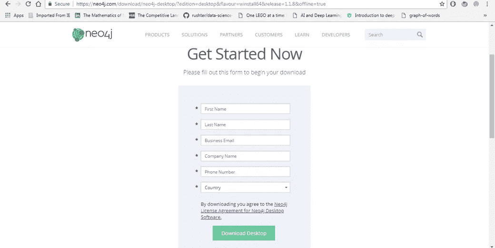
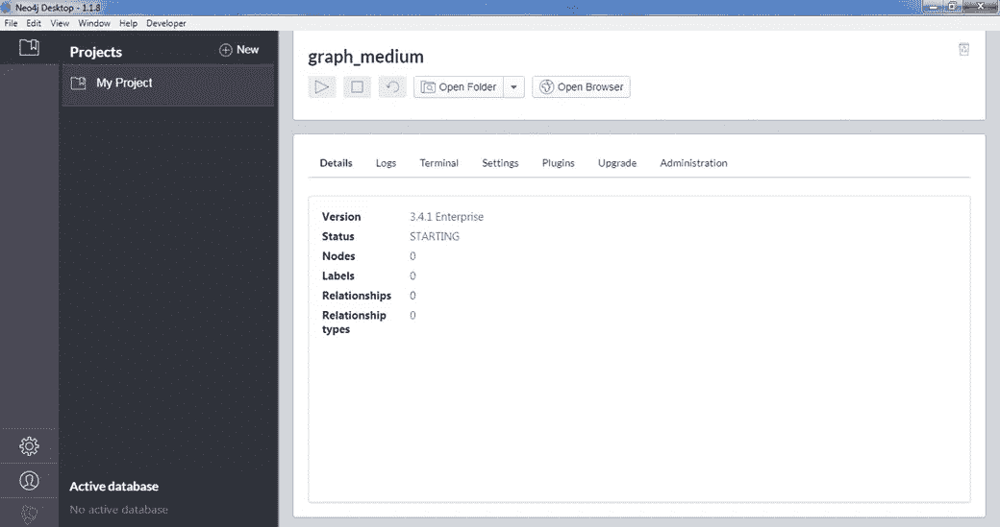
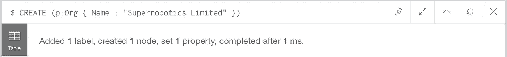
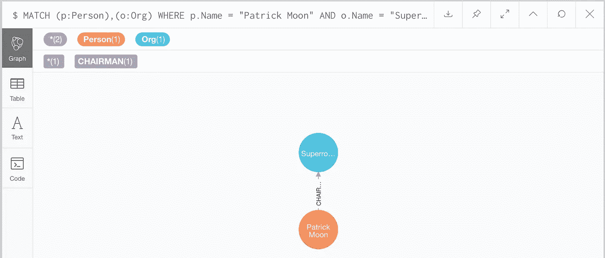
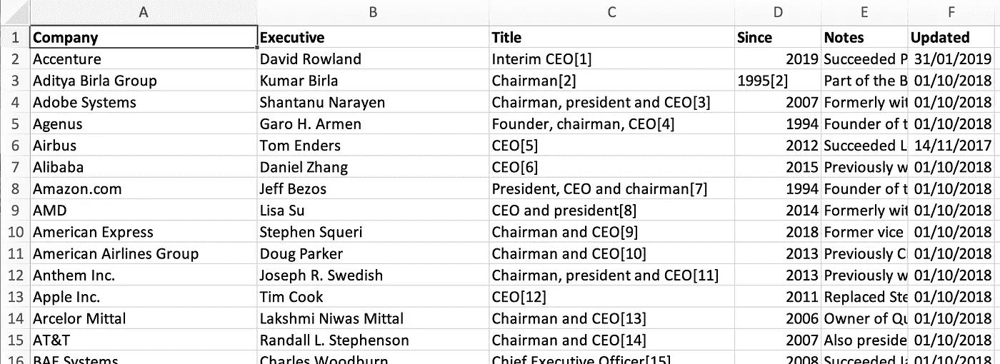
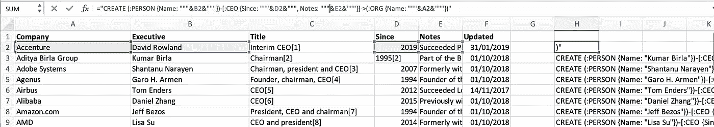
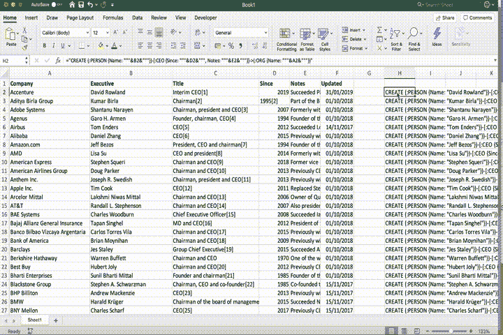

# 10 分钟内开始使用 neo4j

> 原文：<https://towardsdatascience.com/getting-started-with-neo4j-in-10-minutes-94788d99cc2b?source=collection_archive---------7----------------------->

## 在本文中，我们将使用 neo4j 创建第一个图形数据库。
安装 neo4j 后，我们将探索创建数据库的两种方法:

*   手动键入密码查询
*   使用 Excel 公式生成密码查询。如果您从 Excel 文件开始，这将非常有用

在深入研究代码之前，我们先来了解一下什么是 neo4j，以及为什么了解这项技术很重要。

## neo4j 是什么？

Screenshot of neo4j browser (source: [neo4j website](https://neo4j.com/graph-visualization-neo4j/))

简单来说，neo4j 就是图形数据库的 mySQL。它提供了一个图形数据库管理系统、一种查询数据库的语言、一个密码和一个带有 neo4j 浏览器的可视化界面。

Neo4j 是一个开源项目，由一家私人公司维护。它有一个免费版本，我们将在这里使用。*注意，我不工作，也不接受他们的任何东西。*

对我来说，neo4j 的主要优势在于:

*   免费版本非常适合原型制作。我从来不需要高级版本
*   neo4j 浏览器给了你很多自定义可视化的自由。它可以被非数据科学家使用
*   与 SQL 非常相似的语言 CYPHER 允许简单和复杂的查询，以获得您想要的结果。掌握所有的概念需要一些时间，但经过一些练习后，它会变得强大
*   LOAD CSV 函数，它简化了从 CSV 文件创建图形的任务

另一件很棒的事情是脚本语言中有多种可用的 API，比如 Python。但是这将在另一篇文章中介绍。

# 一.设置 neo4j

1.  下载并安装 neo4j 桌面

You have to fill the form to download neo4j

2.安装完成后，点击“我的项目”下的“新建图形”，然后“创建一个本地图形”。记下图形的名称和密码。

3.运行数据库，点击“播放”标志。

Now open the neo4j browser with the new graph you created. A bar at the top will appear and you’ll type queries there

# 二。创建您的 neo4j 图形数据库

假设你的数据是关于人和组织的。人是一种“节点”,而组织是另一种。它们可以通过特定的关系连接在一起。就像有人在一家公司工作过，有人是这家公司的董事长，或者一家公司是另一家公司的母公司。

## 1.在 neo4j 浏览器中编写密码查询

CYPHER 是一种灵活的语言，你可以同时创建节点、关系甚至两者。

让我们从简单直观的方式开始:创建节点，然后创建关系。

使用以下语法创建一个节点:
**CREATE ( x: LABEL {属性名称:属性值})**

*其中* **x** :是节点的变量名，你可以随便叫它。当您重用它时，例如使用 RETURN x 在查询末尾绘制节点时，这很有用。
**LABEL** :是节点的标签。在我们的例子中，我们有两个标签:组织和个人

例如

> 创建(p:Org { Name:" super robotics Limited " })

点击回车键，您将得到一个确认(或一个错误)，表明节点已经创建。在我的例子中，它起作用了，正如“添加了 1 个标签，创建了 1 个节点…”

顺便说一下，通过运行上面的查询，我们隐式地创建了一个名为 Org 的标签。

让我们创建一个担任该组织主席的人，并将他与该组织相关联。

> 创建(p: Person { Name: "Patrick Moon" })

然后

> MATCH (p:Person)，(o:Org)
> 其中 p.Name = "Patrick Moon "和 o . Name = " super robotics Limited "
> CREATE(p)-【r:主席】- > (o)
> RETURN p，r，o

Adding the RETURN at the end of the query will plot the newly created relationship. Note that neo4j has a color coding that differentiates labels automatically.

现在我们有点明白 CYPHER 是如何工作的了:要么你创建一些新的东西，然后从 create 开始，要么你试图在图中找到现有的东西，然后从 MATCH 开始。节点在括号()中，关系在方括号[]中，属性在花括号{}中。

____
**注意** : 2 个查询如果把图搞砸了对从头开始重新开始很有用:删除所有节点和关系: *match (n)-[r]-() delete n，r* 删除所有节点:*match(n)Delete n
_ _ _ _ _ _ _*

好了，现在让我们假设我们有一个 Excel，其中有 100 多人链接到组织，我们不想写 100 次相同的查询。让我们用 Excel 中的老方法来做吧。

## 2.使用 Excel 公式从 Excel 粘贴密码查询

在这个例子中，我从维基百科的文章中复制并粘贴了著名公司首席执行官名单的数据。

我们希望为每一行创建一个查询，同时创建:

*   公司的一个节点
*   CEO 的一个节点
*   两者之间的关系

让我们开始吧:

> = " CREATE(:PERSON { Name:" " & B2 & " " " })-[:CEO { Since:" " & D2 & " " "，备注:" " " & E2 & " " " }]-->(:ORG { Name:" " & A2 & " " })"

注意，我删除了节点(p 和 o)和关系(r)中的第一个变量。这是因为我们将同时向 neo4j 发送 184 个创建查询，所以我们需要确保它理解每个节点(p 或 o)和关系(r)都不同于上面一行创建的节点。

一旦您复制并粘贴了所有行的公式，您将得到如下结果:

现在让我们将创建的公式复制并粘贴到 neo4j 中。显示图表中的所有节点

> 匹配返回

# 结论

在本文中，我们已经完成了安装 neo4j 和创建您的第一个图表的初始步骤，大概花了 10-15 分钟吧？相当简单。

# 下一步

在图表中搜索有趣的模式…