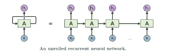
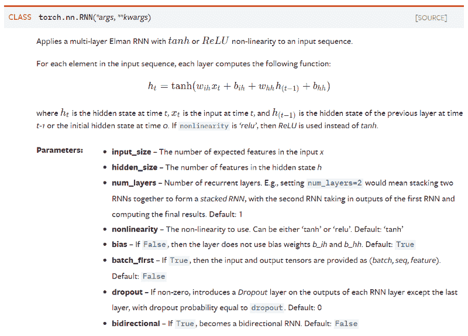
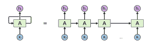
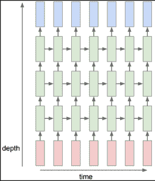

# 使用 PyTorch 框架开始使用 NLP

> 原文：<https://towardsdatascience.com/getting-started-with-nlp-using-the-pytorch-framework-72e7b17b8717?source=collection_archive---------17----------------------->

PyTorch 是最流行的深度学习框架之一，它基于 Python，由脸书支持。

在本文中，我们将研究 PyTorch 提供的帮助自然语言处理(NLP)的类。

PyTorch 中有 6 个类可用于使用递归层的 NLP 相关任务:

*   torch.nn.RNN
*   火炬. nn.LSTM
*   火炬网
*   火炬
*   火炬. nn.LSTMCell
*   火炬. nn .格鲁塞尔

理解这些类、它们的参数、它们的输入和输出是开始在 Pytorch 中为自然语言处理(NLP)构建自己的神经网络的关键。

如果你已经开始了你的 NLP 之旅，很可能你已经遇到了类似的图表(如果没有，我们建议你看看克里斯·奥拉的这篇精彩的、经常被引用的文章——[了解 LSTM 网络](http://colah.github.io/posts/2015-08-Understanding-LSTMs/)):

来源—【http://colah.github.io/posts/2015-08-Understanding-LSTMs/ 

教师使用这种展开图向学生提供这种神经网络的递归结构的简单易懂的解释。从这些漂亮的、展开的图表和直观的解释到 Pytorch API 可能被证明是具有挑战性的。

来源—[https://pytorch.org/docs/stable/nn.html#recurrent-layers](https://pytorch.org/docs/stable/nn.html#recurrent-layers)

因此，在本文中，我们旨在通过以清晰和描述性的方式解释 PyTorch 中相关类的参数、输入和输出来弥补这一差距。

Pytorch 基本上有两个等级的类来构建循环网络:

*   **多层类— nn。新泽西州 RNN。GRU·安迪。LSTM**这些类的对象能够表示深度双向递归神经网络(*或者，如类名所示，它们的一个或多个进化架构——门控递归单元(GRU)或长短期记忆(LSTM)网络*)。
*   **细胞水平类— nn。新罕布什尔州 RNNCell。格鲁塞尔和 nn。LSTMCell**这些类的对象只能代表一个单元格*(同样，一个简单的 RNN 或 LSTM 或 GRU 单元格)*，它可以处理一个时间步长的输入数据。*(记住，这些细胞没有 cuDNN 优化，因此没有任何融合操作，等等。)*

同一级别的所有类共享相同的 API。因此，理解上述两个层次中任何一个类的参数、输入和输出就足够了。

**为了使解释简单，我们将使用最简单的类——torch . nn . rnn 和 torch.nn.RNNCell**

# 火炬. nn.RNN:

我们将使用下图来解释 API —

来源——【http://colah.github.io/posts/2015-08-Understanding-LSTMs/ 

## 参数:

*   **input_size** —输入 x 中期望特征的数量

这表示向量 x[i]的维数(即上图中从 x[0]到 x[t]的任何向量)。请注意，这很容易与序列长度混淆，序列长度是我们在如上展开 RNN 后得到的细胞总数。

*   **hidden_size** —处于隐藏状态的特征数量 h

这表示向量 h[i]的维数(即上图中从 h[0]到 h[t]的任何向量)。总的来说，在确定网络的权重矩阵的形状时，隐藏大小和输入大小是必要的和充分的。

*   **层数** —循环层数。例如，设置 num _ layers =将意味着将两个 RNN 堆叠在一起以形成堆叠的 RNN，其中第二 RNN 接收第一 RNN 的输出并计算最终结果。默认值:1

此参数用于构建深度 rnn，如下所示:

这里，红色单元代表输入，绿色块代表 RNN 单元，蓝色块代表输出

所以对于上图，我们将 num_layers 参数设置为 3。

*   **非线性** —要使用的非线性。可以是“tanh”或“relu”。默认值:“tanh”

这是不言自明的。

*   **偏差**-如果为假，则该层不使用偏差权重 b_ih 和 b_hh。默认值:真

在深度学习社区，一些人发现去除/使用偏见不会影响模型的性能。因此这个布尔参数。

*   **batch_first** —如果为真，则输入和输出张量提供为(batch，seq，feature)。默认值:False
*   **dropout** —如果非零，在除最后一层之外的每个 RNN 层的输出上引入一个丢弃层，丢弃概率等于 dropout。默认值:0

该参数用于控制 RNN 体系结构中的退出正则化方法。

*   **双向** —如果为真，则成为双向 RNN。默认值:False

创建双向 RNN 非常简单，只需将该参数设置为 True！

因此，要在 PyTorch 中制作 RNN，我们需要向该类传递两个强制参数——input _ size 和 hidden_size。

一旦我们创建了一个对象，我们就可以用相关的输入“调用”该对象，它就会返回输出。

## 输入:

我们需要向对象传递 2 个输入——input 和 h_0:

*   **输入** —这是一个形状张量*(序列长度，批次，输入大小)。*为了处理可变长度的输入，我们将较短的输入序列打包。详见[torch . nn . utils . rnn . pack _ padded _ sequence()](https://pytorch.org/docs/stable/nn.html#torch.nn.utils.rnn.pack_padded_sequence)或[torch . nn . utils . rnn . pack _ sequence()](https://pytorch.org/docs/stable/nn.html#torch.nn.utils.rnn.pack_sequence)。
*   **h_0** —这是一个形状张量(num_layers * num_directions，batch，hidden_size)。对于双向 RNNs，num_directions 为 2，否则为 1。这个张量包含批处理中每个元素的初始隐藏状态。

**输出**:

以类似的方式，对象向 us 返回 2 个输出——output 和 h_n:

*   **输出** —这是一个形状为*(序列长度，批次，数量方向*隐藏尺寸)的张量。*它包含来自 RNN 最后一层的输出特征(h_k ),对于每个 k
*   **h_n** —这是一个大小为(num_layers * num_directions，batch，hidden_size)的张量。它包含 k = seq_len 的隐藏状态。

如前所述，torch.nn.GRU 和 torch.nn.LSTM 具有相同的 API，也就是说，它们接受相同的参数集，接受相同格式的输入并以相同格式返回。

# torch.nn.RNNCell:

因为这仅代表 RNN 的单个单元格，所以它仅接受 4 个参数，所有这些参数的含义与它们在 torch.nn.RNN 中的含义相同。

## 参数:

*   **input_size** —输入 x 中预期特征的数量
*   **hidden_size** —处于隐藏状态的特征数量 h
*   **偏差** —如果为假，则该层不使用偏差权重 b_ih 和 b_hh。默认值:真
*   **非线性** —要使用的非线性。可以是“tanh”或“relu”。默认值:“tanh”

再说一次，因为这只是 RNN 的一个细胞，输入和输出维度要简单得多——

## 输入(输入，隐藏):

*   **输入** —这是一个包含输入特征的形状张量(batch，input_size)。
*   **hidden**——这是一个形状张量(batch，hidden_size ),包含批处理中每个元素的初始隐藏状态。

## 输出:

*   **h’**—这是一个形状张量(batch，hidden_size)，它为我们提供了下一个时间步的隐藏状态。

这是关于自然语言处理(NLP)py torch 框架的入门知识。如果你正在寻找关于什么是可能的和你能构建什么的想法，请查看使用 RNNs 和 CNN 的自然语言处理的[深度学习。](https://blog.exxactcorp.com/deep-learning-for-natural-language-processing/?utm_source=web%20referral&utm_medium=backlink&utm_campaign=medium.com&utm_term=nlp%20using%20pytorch)

*原载于 2019 年 3 月 19 日*[*【blog.exxactcorp.com*](https://blog.exxactcorp.com/getting-started-with-natural-language-processing-using-pytorch/?utm_source=web%20referral&utm_medium=backlink&utm_campaign=medium.com&utm_term=nlp%20using%20pytorch)*。*