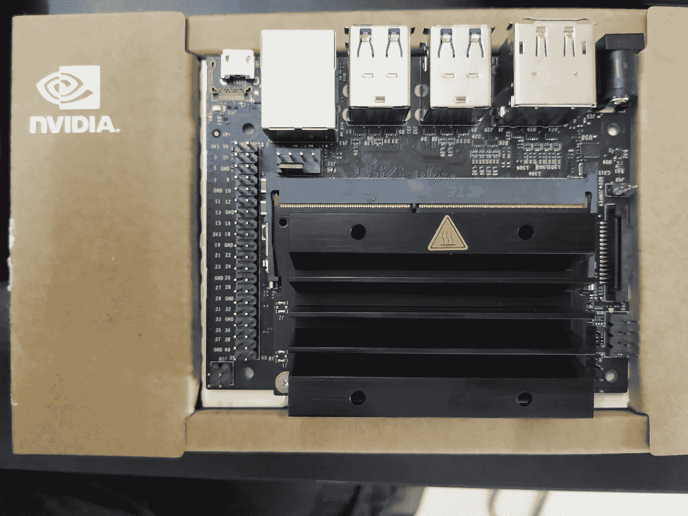
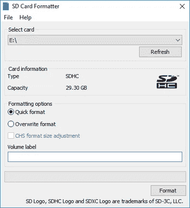
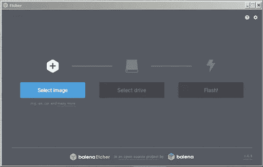
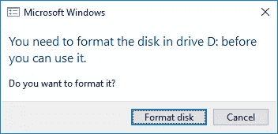
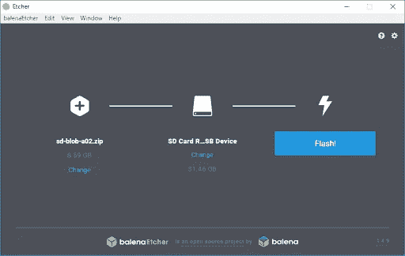
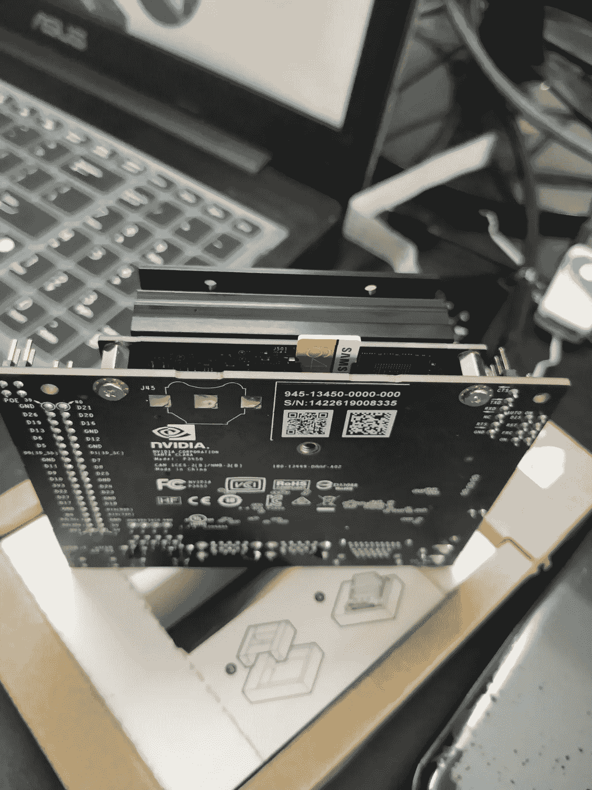
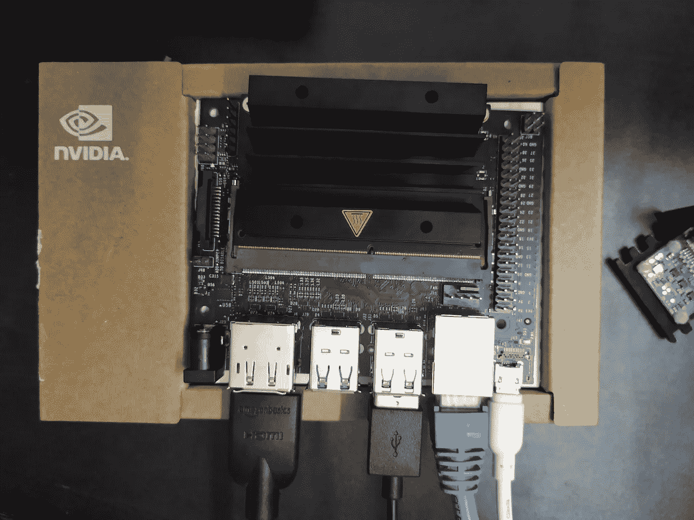
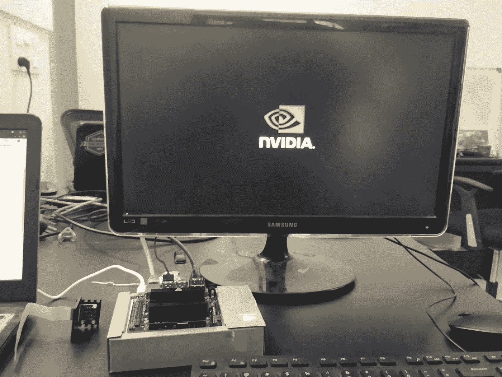
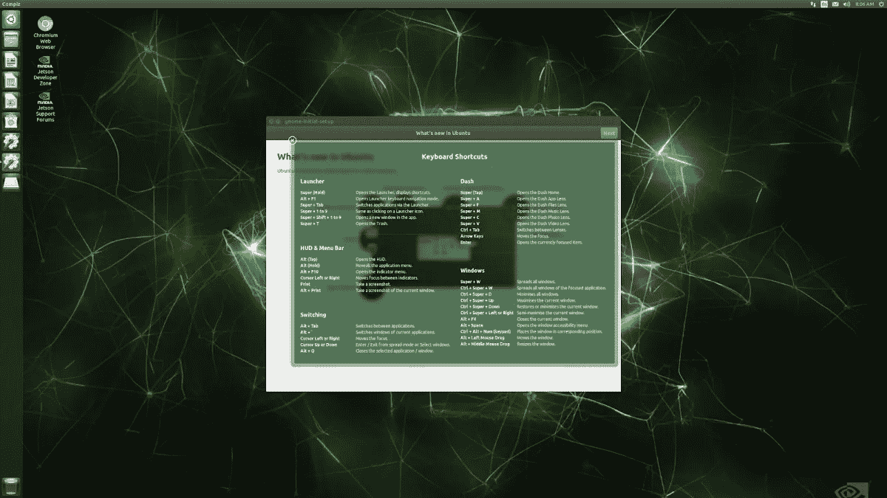

# Nvidia Jetson Nano 入门和安装 Tensorflow GPU

> 原文：<https://towardsdatascience.com/getting-started-with-nvidia-jetson-nano-and-installing-tensorflow-gpu-ad4a3da8ed26?source=collection_archive---------11----------------------->

作为 [Nsemble.ai](https://nsemble.ai) 的部署工程师，我致力于研究和交付基于云和 IOT 的机器学习和深度学习解决方案。在 IOT 设备上部署对象检测模型是一项繁琐的任务。甚至高端深度学习模型在 Raspberry pi 等基本设备上的处理速度也很慢。我研究了一段时间，得到了这个惊人的设备适合生产准备所谓的英伟达杰特森纳米。它的图形体验令人惊叹，也很划算(99 美元)。这种物联网设备非常适合部署繁重的深度学习模型。

这是一个简单的博客，用于开始使用 Nvidia Jetson Nano IOT 设备(设备概述和操作系统安装)，然后安装 tensorflow 的 GPU 版本。

# 介绍

[NVIDIA Jetson Nano 开发者套件](https://developer.nvidia.com/embedded/buy/jetson-nano-devkit)是一款面向开发者、学习者和开发者的小型人工智能电脑。在遵循这个简短的指南之后，你将准备好开始构建实用的人工智能应用程序、酷酷的人工智能机器人等等。



Nvidia Jeston Nano newly opened

# 准备安装

## 入门项目

## microSD 卡

Jetson Nano 开发套件使用 microSD 卡作为启动设备和主存储。对于你的项目来说，拥有一张足够大且足够快的卡是很重要的；推荐的最低容量是 16GB 的 UHS-1 卡。

请参阅以下说明，用操作系统和软件刷新您的 microSD 卡。

## 微型 USB 电源

您需要使用优质电源为开发套件供电，该电源可以在开发套件的微型 USB 端口提供 5V⎓2A。并非每个额定为“5V⎓2A”的电源都会这样做。

# 可选项目

## 无线网络适配器

Jetson Nano 开发套件包括一个千兆以太网端口，但也支持许多常见的 USB 无线网络适配器，例如 Edimax EW-7811Un。

# 将图像写入 microSD 卡

要准备您的 microSD 卡，您需要一台能够通过内置 SD 卡插槽或适配器连接互联网并读写 SD 卡的计算机。

1.  下载 [Jetson Nano Developer Kit SD 卡映像](https://developer.nvidia.com/jetson-nano-sd-card-image-r322)，并记下它保存在电脑上的位置。
2.  根据您使用的计算机类型，按照以下说明将图像写入您的 microSD 卡。

使用 SD 协会的 SD 存储卡格式化程序格式化您的 microSD 卡。



SD Formatter

1.  下载、安装并启动用于 Windows 的 [SD 存储卡格式器。](https://www.sdcard.org/downloads/formatter_4/eula_windows/)
2.  选择卡驱动器
3.  选择“快速格式化”
4.  将“卷标”留空
5.  单击“格式化”开始格式化，并在警告对话框中单击“是”

使用 Etcher 将 Jetson Nano Developer Kit SD 卡映像写入您的 microSD 卡

1.  下载、安装并启动[蚀刻机](https://www.balena.io/etcher)。



Etcher overview

Etcher 用于使 sd 卡可使用 nvidia 开发商为 jetson nano 提供的 ready to go ubuntu desktop 提供的操作系统启动

1.  单击“选择图像”并选择之前下载的压缩图像文件。
2.  如果尚未插入 microSD 卡，请将其插入。

如果 windows 用这样的对话框提示您，请单击“取消”:



4.单击“选择驱动器”并选择正确的设备。



5.点击“闪！”如果您的 microSD 卡通过 USB3 连接，Etcher 大约需要 10 分钟来写入和验证图像。

6.Etcher 完成后，Windows 可能会让您知道它不知道如何读取 SD 卡。只需点击取消，取出 microSD 卡。


Click cancel

# 设置和首次引导

# 设置步骤

1.  展开纸架，放入显影盒中。
2.  将显影组件放在纸架顶部。
3.  将 microSD 卡(已写入系统映像)插入 Jetson Nano 模块底部的插槽中



4.打开电脑显示器的电源并连接。

5.连接 USB 键盘和鼠标。



6.连接您的微型 USB 电源(5V⎓2A).Jetson Nano 开发套件将自动通电并启动。nvidia 一启动，显示器上的第一个输出就会是这样的。



# 第一次开机

一旦开发套件通电，Micro-USB 连接器旁边的绿色 LED 就会亮起。当您第一次启动时，Jetson Nano 开发工具包将带您完成一些初始设置，包括:

*   审查并接受英伟达捷成软件 EULA 公司
*   选择系统语言、键盘布局和时区
*   创建用户名、密码和计算机名
*   登录

# 登录后

您将看到这个屏幕。恭喜你！



Ubuntu Desktop as soon as system boots up on Nvidia Jetson Nano

# **故障排除**

# 力量

如果您无法启动您的 Jetson Nano 开发工具包，问题可能出在您的 USB 电源上。请使用像[这个](https://www.adafruit.com/product/1995)一样的优质电源。

同样重要的是，要有优质的电源线将电源连接到开发套件:

*   最好使用永久连接电源线的电源。
*   较短的电缆会降低电压。

# 显示

不支持 HDMI 转 DVI 适配器。请使用支持 HDMI 或 DP 输入的显示器。

# **在 Nvidia Jetson Nano 上安装 tensor flow GPU**

我之所以包括这一步，是因为在这个设备上安装 GPU 版本非常容易。

打开终端并输入以下命令:

安装依赖项:

```
sudo apt-get install python3-pip libhdf5-serial-dev hdf5-tools
```

安装 tensorflow-gpu 库

```
sudo pip3 install --pre --extra-index-url [https://developer.download.nvidia.com/compute/redist/jp/v42](https://developer.download.nvidia.com/compute/redist/jp/v42) tensorflow-gpu
```

如果出现 HTTP 404 Not found 错误，请尝试以下命令

pip3 安装—pre—extra-index-URL[https://developer.download.nvidia.com/compute/redist/jp/v42](https://developer.download.nvidia.com/compute/redist/jp/v42)tensor flow-GPU