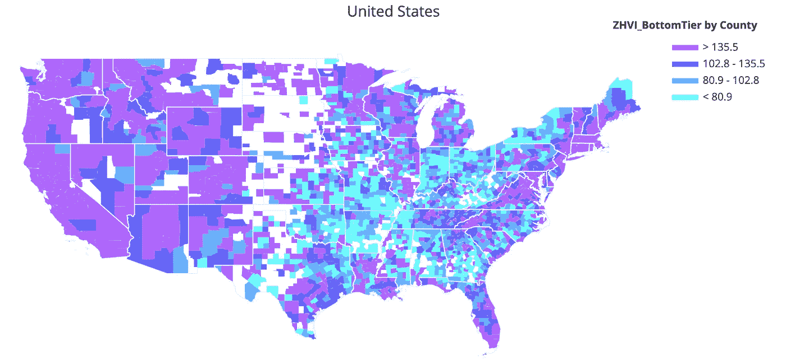
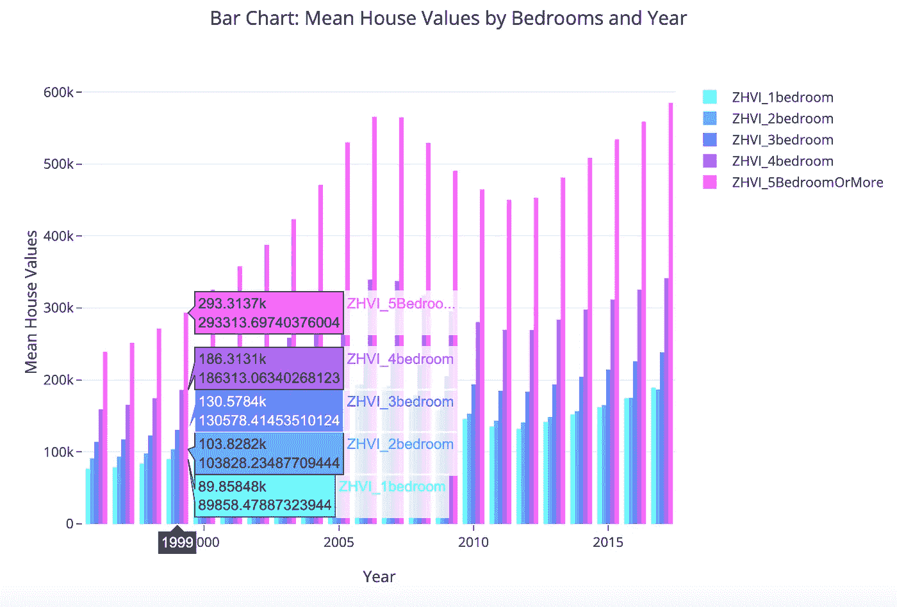
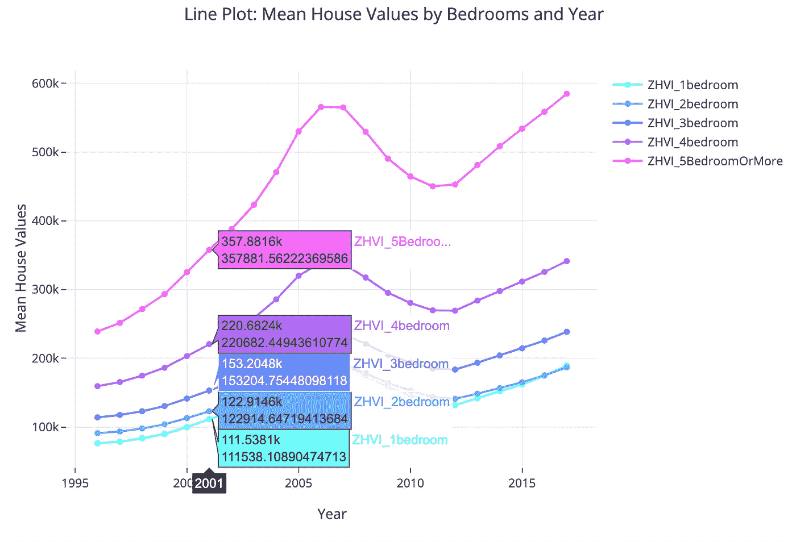
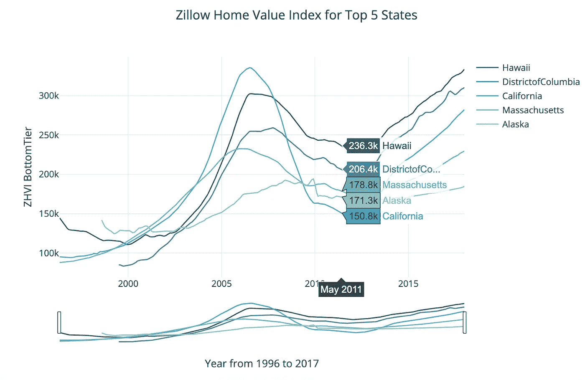
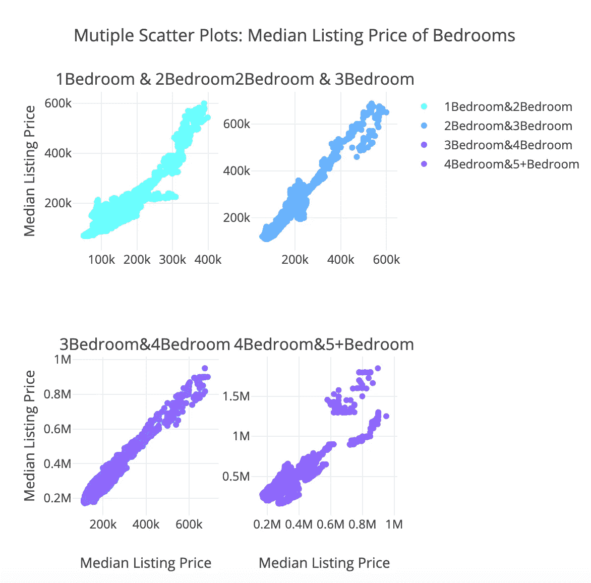
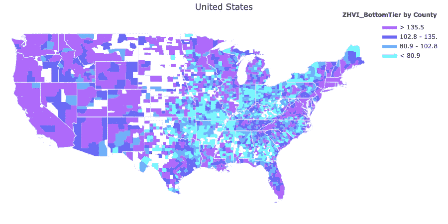

# Plot.ly 入门

> 原文：<https://towardsdatascience.com/getting-started-with-plot-ly-3c73706a837c?source=collection_archive---------4----------------------->


Source: Bailey Zindel on Unsplash

## Python 中强大可视化的引导式演练

*作者:爱丽丝·李和伊桑·戴伊*

Matplotlib 还行，Seaborn 很棒，但是 Plot.ly？这是一个全新的水平。Plot.ly 通过提供完全交互性的选项和许多编辑工具，提供了比一般图形更多的功能。与其他产品不同的是，它可以选择在离线和在线模式下显示图形，它还配备了一个强大的 API，当设置完成后，它将无缝地在 web 浏览器中显示图形，并能够保存本地副本。你将遇到的唯一的挫折之一是处理许多选项来找出你想要用于你的情节的工具。



## 概观

我们将从在 Python 中设置 plot.ly 的基础开始。在那之后，我们将从一些基本的可视化开始，从典型的盒须图到 choropleth 图，以及沿途的代码分解。我们在本指南中使用 Zillow Economics 数据集进行了所有可视化，该数据集包含 1996 年至 2017 年按位置汇总的各种住房指标的时间序列数据。如果你对这篇文章的完整代码感兴趣，可以查看下面的 GitHub 链接；否则，用于创建可视化效果的所有代码都将包含在每个可视化效果中。

我们的希望是，到最后，您将对 plotly API 如何工作有一个基本的直觉，并且对您可以应用于自己的项目的通用框架有一个感觉。你可以在这里找到一个指向 plotly cheatsheet [的链接，如果你对用于可视化的任何参数有兴趣，你可以使用`help()`函数访问文档。关于所有类型的图和参数的更多细节，这里的](https://images.plot.ly/plotly-documentation/images/python_cheat_sheet.pdf)[是关于 Plotly 的 Python 开源图形库的更多信息的链接。](https://plot.ly/python/)

# 安装

Plotly 是一个运行在 JSON 上的平台，JSON 是一种以字典格式将参数传递给 plotly API 的格式。我们可以使用`plot.ly`包在 python 中访问这个 API。要安装软件包，打开终端并输入`$ pip install plotly`或`$ sudo pip install plotly`。

Plotly 的图表是使用在线网络服务托管的，因此您首先需要在线设置一个免费帐户来存储您的图表。要检索您的个人 API 密钥，请点击此处的链接:[https://plot.ly/settings/api#/](https://plot.ly/settings/api#/)。一旦你这样做了，你就可以用`set_credential_files()`函数开始设置 plotly，如下所示。

```
import plotlyplotly.tools.set_credentials_file(username=’YourAccountName’, api_key=’YourAPIKey’)``
```

## 在线和离线绘图

在 plotly 上显示可视化效果时，绘图和数据都会保存到您的 plotly 帐户中。无需在云中购买更多空间，您最多可以在云中存储 25 个图，但这些图像可以轻松地存储在本地，并在为更多空间腾出空间时删除。

有两种主要的方法来显示 plotly 图。如果您正在使用 Jupyter Notebook 或其他交互式 python 环境(扩展名为`.ipynb`的文件)，`py.iplot()`函数会在单元格下方的输出中显示绘图。另一方面，`py.plot()`返回一个可以保存的 url，并且也使用默认的 web 浏览器打开。

Plotly 离线模式也使您能够在本地保存图形。要离线绘图，您可以使用`plotly.offline.plot()`或`plotly.offline.iplot()`。同样，`iplot()`功能用于 Jupyter 笔记本，并将在笔记本内显示图形。`plot()`创建一个保存在本地的 HTML 页面，以便在网络浏览器中打开。

# 基本结构

正如我们之前提到的，所有 plot.ly 可视化都是使用 Json 结构创建的，Json 结构是要使用 API 修改的参数列表，因此本质上您将看到参数和通用结构来制作每个绘图，如果您学习了其中一个，您可以制作其余的。

```
import plotly.plotly as py
import plotly.graph_objs as go
```

`import plotly.plotly as py`:具有与 plotly 服务器通信的功能

`import plotly.graph_objs as go`:具有生成图形对象的功能。这是一个有用的模块，用于调用帮助来查看作为对象参数的所有属性。对象也有不同的有用方法，如 update 方法，可用于更新 plot 对象以向其添加更多信息。

## 广义结构

`graph_objs`类包含几个结构，这些结构在 plot.ly 中创建的可视化中是一致的，与类型无关。

我们从`trace`开始，它可以被认为是一个单独的层，包含数据和数据应该如何绘制的规范(即线条、标记、图表类型)。下面是 trace 结构的一个示例:

```
trace1 = {
  "x": ["2017-09-30", "2017-10-31", "2017-11-30", ...], 
  "y": [327900.0, 329100.0, 331300.0, ...], 
  "line": {
    "color": "#385965", 
    "width": 1.5
  }, 
  "mode": "lines", 
  "name": "Hawaii", 
  "type": "scatter", 
}
```

如您所见，`trace`是要绘制的数据的参数字典，以及关于颜色和线型的信息。

我们可以通过将它们附加到一个列表来编译几个跟踪，我们称之为`data`。列表中轨迹的顺序决定了它们在最终绘图上的放置顺序。通常，数据应该是这样的:

```
 data = [trace1, trace2, trace3, trace4]
```

`layout = go.Layout()`:该对象用于数据的布局，包括数据的外观和可变特性，如标题、轴标题、字体和间距。就像`trace`一样，是字典的字典。

```
layout = {
  "showlegend": True, 
  "title": {"text": "Zillow Home Value Index for Top 5 States"}, 
  "xaxis": {
    "rangeslider": {"visible": True}, 
    "title": {"text": "Year from 1996 to 2017"}, 
    "zeroline": False
  }, 
  "yaxis": {
    "title": {"text": "ZHVI BottomTier"}, 
    "zeroline": False
  }
}
```

我们最终可以使用`go.Figure()`函数来编译数据和布局，它最终会被传递给我们选择的绘图函数。

```
fig = go.Figure(data = data, layout = layout)
```

# **条形图**



`go.Bar()`创建一个条形图类型的图。在`go.Layout()`函数中，我们可以指定重要的信息，比如`barmode = “group”`，它将每年不同的条形图组合在一起，x 和 y 轴的标签，以及完整图表的标题。

# **线条图**



`go.Scatter()`实例化散点图类型的痕迹，与条形图或其他形式相反。

我们可以使用 mode 参数更改标记的模式。即使我们使用的是散点图，我们也可以生成散点图，在散点图上创建线条和标记(点)。

```
mode = “lines+markers”
```

# 时间序列线图



在这里，我们添加了一个范围滑块，使用`rangeslider`参数调整可以包含在主图中的数据域。

我们还传递了一个颜色字典，其中包含每个州的唯一颜色。为此，我们使用了 seaborn `color_palette()`函数，指定了颜色范围，以及分布中需要的离散值的数量。因为 plot.ly 不接受 RGB 元组，我们可以使用`as_hex()`函数将输出转换为十六进制代码。

# **多重散点图**



为了创建这个布局，我们使用`make_subplots()`函数创建子情节，并使用`append_trace()`函数将轨迹添加到网格上的特定位置，而不是将轨迹附加到单个字典。

# 等值区域图



有了 choropleth，我们可以使用 figure factory 类走捷径，它包含一组函数来轻松绘制更复杂的图形，如地理地图。

```
import plotly.figure_factory as ff
```

从`ff.create_choropleth()`函数中，我们传递一组`FIPS`值，或特定于每个县、市或州的地理标识码，其中`values`(ZHVI _ 底层)对应于要分配给该地区的数据。

# **最后的想法**

正如上面不同类型图表的例子所描述的，Plot.ly 是一个强大的工具，可以为广泛的受众开发视觉愉悦和易于理解的情节。它有许多好处，包括可以广泛地访问离线和在线模式，并且包含可以在笔记本和网络浏览器中显示生成的图形的功能。由于在交互性方面的额外优势，Plotly 是 Matplotlib 和 Seaborn 的一个很好的替代品，并且可以增强演示的效果。

如果您有任何问题，请告诉我们！